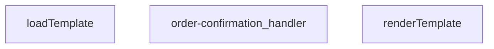

## Genel Bakış
Bu modül, bir Supabase Edge Function olarak sipariş onayı e-postası gönderiminden sorumludur. Gelen HTTP isteklerini alır, sipariş bilgileriyle dinamik HTML e-posta şablonlarını doldurur ve sonuç olarak bir HTTP yanıtı döner.

## Fonksiyon Grupları
### Şablon İşleme
Bu grup, HTML e-posta şablonlarını yöneten yardımcı fonksiyonları kapsar. Şablonu dosya sisteminden yükler ve içindeki dinamik veri alanlarını doldurarak kullanılabilir hale getirir.
- loadTemplate, renderTemplate

### Ana İş Akışı Yönetimi
Bu grup, modülün tek ve merkezi işleyicisidir. Gelen HTTP isteğini doğrulamaktan, şablonu hazırlayıp verilerle doldurmaya ve e-posta servisini çağırarak son HTTP yanıtını üretmeye kadar tüm iş akışını tek başına koordine eder.
- order-confirmation_handler

---

## AXIOMS – Mimari Varsayımlar

Bu modül, sipariş onayı e-postası gönderimi için bir Supabase Edge Function'dur. Şablon yükleme, veri ile doldurma ve HTTP istek işleme akışını yönetir.

---

[Aksiyom 1]: Eğer `loadTemplate()` çağrıldığında şablon dosyası diskte mevcut değilse veya okunamıyorsa, şablon yükleme başarısız olur ve `renderTemplate` işlevi geçerli bir şablon girdisi alamaz.

[Aksiyom 2]: Eğer `renderTemplate` fonksiyonuna geçirilen `_data` nesnesindeki anahtarlar, `tpl` string'indeki yer tutucularla eşleşmiyorsa, şablon tamamlanmamış veya hatalı HTML içeriği üretilir.

[Aksiyom 3]: Eğer `order-confirmation_handler` fonksiyonuna geçerli bir HTTP isteği (`req`) ulaşmazsa veya istek gövdesinde sipariş verisi bulunmuyorsa, e-posta gönderim iş akışı başlatılamaz.

[Aksiyom 4]: Eğer şablon motoru (renderTemplate) başarısız olursa veya harici e-posta servisi yanıt vermezse, `order-confirmation_handler` uygun bir HTTP hata yanıtı döndürmelidir.

[Aksiyom 5]: Eğer `loadTemplate` fonksiyonu asenkron olarak çalışıyorsa ve henüz tamamlanmadan `renderTemplate` çağrılırsa, şablon içeriği boş veya tanımsız olur.

---

## FONKSİYON DETAYLARI

### renderTemplate
**Ne yapar**: Verilen bir HTML/şablon dizesindeki koşullu blokları ve değişken yer tutucularını, sağlanan veri nesnesindeki değerlerle değiştirerek işlenmiş bir dize döndürür. Basit bir şablon motoru görevi görür.

**Nasıl yapar**: İlk olarak `{{#if key}}...{{/if}}` sözdizimini eşleştirir; ilgili `_data[key]` değeri truthy ise içeriği korur, aksi halde boş string ile değiştirir. Ardından kalan `{{key}}` yer tutucularını `_data[key]` değeriyle değiştirir; değer `null` veya `undefined` ise boş string döner, değilse `String()` ile dizeye dönüştürülür.

**Parametreler**:
- `tpl`: string — İşlenecek şablon dizesi. İçerisinde `{{#if}}...{{/if}}` koşullu blokları ve `{{değişken}}` yer tutucuları bulundurur.
- `_data`: Record<string, unknown> — Şablondaki yer tutuculara karşılık gelen değerleri içeren nesne. Anahtarlar şablondaki değişken isimleriyle eşleşmelidir.

**Dönüş**: string — İşlenmiş, tüm yer tutucuların değerlerle değiştirildiği veya koşullu blokların ayıklandığı sonuç dizesi.

### loadTemplate
**Ne yapar**: Dosya sisteminden veya uzaktan bir kaynaktan şablon dosyasını asenkron olarak okur ve içeriğini string olarak döndürür.  
**Nasıl yapar**: Promise tabanlı bir I/O operasyonu başlatır; dosya bulunamazsa `null` döner.  
**Parametreler**: *Yok*  
**Dönüş**: Promise<string | null> — Başarılı okuma durumunda şablon içeriği string, bulunamama durumunda `null`.

### order-confirmation_handler
**Ne yapar**: HTTP isteklerini alır, sipariş onayı şablonunu yükler, verileri şablona uygular ve yanıt olarak HTML içeriği döner.  
**Nasıl yapar**: Gelen `req` nesnesinden gerekli sipariş bilgilerini çıkarır, `loadTemplate` ile şablonu getirir, `renderTemplate` ile şablonu doldurur ve bir `Response` nesnesi oluşturur; hata durumunda uygun hata yanıtı üretir.  
**Parametreler**:
- req: any — HTTP istek nesnesi, içinde sipariş verileri ve diğer istek bilgileri bulunur.  
**Dönüş**: Response — HTTP yanıtı, genellikle `text/html` içerik tipinde ve doldurulmuş şablon metnini barındırır.

---

## AST POINTERS

### [N1_NASIL] AST Pointer: supabase/functions/order-confirmation/index.ts::renderTemplate
- **params**: `tpl: string`, `_data: Record<string, unknown>`
- **ic_degiskenler**:
  - `tpl` — fonksiyona alınan şablon string'ini tutar, önce `{{#if}}` blokları ile sonra `{{}}` değişkenleri ile place-holder'lar değiştirilerek modified hali return edilir
  - `_data` — şablonda kullanılacak key-value çiftlerini içeren dict, `{{key}}` ve `{{#if key}}` yapılarında referans olarak kullanılır
  - `_m` (1. replace callback) — regex eşleşen tam eşleşme metni (kullanılmıyor, discard)
  - `key` (1. replace callback) — `{{#if (\w+)}}` deseninden yakalanan değişken adı, `_data[key]` ile değeri okunur
  - `inner` (1. replace callback) — `{{#if}}` bloğunun içindeki şablon parçası, truthy ise olduğu gibi döner, aksi halde boş string döner
  - `v` (1. replace callback) — `_data[key]` ile elde edilen değer, truthy kontrolü yapılır
  - `truthy` (1. replace callback) — `v` değerinin truthy/falsy durumu, inner parçanın korunup korunmayacağını belirler
  - `_m` (2. replace callback) — regex eşleşen tam eşleşme metni (kullanılmıyor, discard)
  - `key` (2. replace callback) — `{{(\w+)}}` deseninden yakalanan değişken adı, `_data[key]` ile değeri okunur
  - `v` (2. replace callback) — `_data[key]` ile elde edilen değer, null/undefined kontrolü yapılır
- **Dönüş**: `string` — place-holder'ları değiştirilmiş şablon metni

---

### [N2_NASIL] AST Pointer: supabase/functions/order-confirmation/index.ts::loadTemplate
- **params**: (yok)
- **ic_degiskenler**:
  - `url` — `new URL('./templates/email/order_confirmation.html', import.meta.url)` ile oluşturulan dosya yolu, `Deno.readTextFile` ile HTML şablonunu okumak için kullanılır
- **Dönüş**: `Promise<string | null>` — HTML şablon içeriği başarıyla okunursa string, hata olursa `null`

---

### [N3_NASIL] AST Pointer: supabase/functions/order-confirmation/index.ts::order-confirmation_handler
- **params**: `req` (Request nesnesi)
- **ic_degiskenler**:
  - `requestOrigin` — `req.headers.get('origin') || ''` ile gelen isteğin origin başlığı, CORS izin kontrolünde kullanılır
  - `allowedOrigins` — `Deno.env.get('ALLOWED_ORIGINS')` env'inden virgülle ayrılmış izinli origin listesi, her eleman trim edilip boş olanlar filtrelenir
  - `originAllowed` — boolean, `allowedOrigins` boşsa true, değilse `requestOrigin` listede varsa true, CORS kararını belirler
  - `corsHeaders` — `{ 'Access-Control-Allow-Headers': ..., 'Access-Control-Allow-Methods': ... }` sabit CORS başlık objesi, her Response'a eklenir
  - `_text` — `await req._text()` ile okunan ham istek gövdesi string'i, JSON parse edilecek
  - `parsed` — `_text` JSON.parse edilerek elde edilen `Record<string, unknown>`, istek gövdesindeki alanları tutar (ör. `order_id`)
  - `tenantId` — `resolveTenantId(req, parsed)` ile çözümlenen kiraci ID'si, Supabase sorgularında `tenant_id` filtresi olarak kullanılır
  - `branding` — `await getTenantBranding(tenantId)` ile alınan kiraci branding detayları (emailFrom, brandName, brandPrimaryColor, brandLogoUrl)
  - `order_id` — IIFE içinde `parsed['order_id']` değerinden çıkarılan sipariş ID'si, string ve boş olmayan trim edilmiş değer, Supabase sorgusunda filtre olarak kullanılır; null olabilir
  - `supabaseUrl` — `Deno.env.get('SUPABASE_URL') || ''` ile alınan Supabase proje URL'i, tüm REST API çağrılarında base URL olarak kullanılır
  - `serviceKey` — `Deno.env.get('SUPABASE_SERVICE_ROLE_KEY') || ''` ile alınan service role anahtarı, Supabase isteklerinde `Authorization` ve `apikey` başlıklarında kullanılır
  - `authHeader` — `req.headers.get('Authorization')` ile alınan Authorization başlığı, yetkilendirme kontrolü için kullanılır
  - `isAuthorized` — boolean, kullanıcının yetkili olup olmadığını tutar, service key eşleşmesi veya admin/superadmin rol kontrolü ile true yapılabilir
  - `anonKey` — `Deno.env.get('SUPABASE_ANON_KEY') || ''` ile alınan anonim anahtar, geçici Supabase auth client oluşturmak için kullanılır
  - `authClient` — `createClient(supabaseUrl, anonKey, ...)` ile oluşturulan geçici Supabase client, `auth.getUser()` çağrısı ile token sahibinin user bilgisini almak için kullanılır
  - `user` — `authClient.auth.getUser()` sonucundan destructured edilen kullanıcı nesnesi, `user.id` ile `user_profiles` tablosunda rol kontrolü yapılır
  - `roleCheck` — `fetch(...)` ile yapılan user_profiles rol sorgusunun Response'u, `roleCheck.ok` kontrol edilir
  - `arr` — `roleCheck.json()` sonucu array, `arr[0]?.role` ile kullanıcının rolü alınır
  - `role` — `arr[0]?.role` değerinden gelen kullanıcı rolü string'i, `'admin'` veya `'superadmin'` ise `isAuthorized = true` yapılır
  - `err` — auth fallback try-catch bloğundaki hata nesnesi, `console.error` ile loglanır
  - `resendApiKey` — `Deno.env.get('RESEND_API_KEY') || ''` ile alınan Resend e-posta servisi API anahtarı, e-posta gönderimi için kullanılır
  - `emailFrom` — `branding.emailFrom` değerinden alınan gönderici e-posta adresi, Resend API çağrısında `from` olarak kullanılır; hata durumunda fallback'e uğrayabilir
  - `testMode` — `Deno.env.get('EMAIL_TEST_MODE')` env'inden boolean, `'true'` ise test modu aktif, `toList` yerine `testTo` adresine gönderilir
  - `testTo` — `Deno.env.get('EMAIL_TEST_TO') || 'delivered@resend.dev'` ile alınan test alıcı adresi, test modunda `toList`'e eklenir
  - `bccList` — `Deno.env.get('SHIP_EMAIL_BCC')` env'inden virgülle ayrılmış BCC e-posta listesi, trim edilmiş ve boş elemanlar filtrelenmiş, e-posta gönderiminde BCC olarak eklenir
  - `brandName` — `branding.brandName` değerinden alınan marka adı, e-posta konu satırında ve HTML içeriğinde kullanılır
  - `brandPrimary` — `branding.brandPrimaryColor` değerinden alınan marka ana rengi, HTML içinde `color` olarak kullanılır
  - `brandLogoUrl` — `branding.brandLogoUrl` değerinden alınan marka logo URL'i, template'e data olarak传递 edilir
  - `customer_email` — `venthub_orders` tablosundan çekilen veya Auth Admin API'den alınan müşteri e-posta adresi, `toList`'e eklenir
  - `customer_name` — `venthub_orders` tablosundan çekilen veya Auth Admin API'den alınan müşteri adı, HTML içeriğinde `Merhaba <strong>` olarak kullanılır
  - `order_number` — `venthub_orders` tablosundan çekilen sipariş numarası string'i, `prettyOrderNo` oluşturulmak için kullanılır
  - `o` — `venthub_orders` tablosuna yapılan fetch isteğinin Response'u, `o.ok` kontrol edilir, sipariş verileri alınır
  - `arr` (o response) — `o.json()` sonucu array, `arr[0]` (satır) olarak işlenir
  - `row` — `arr[0]` değerinden elde edilen tek satır nesnesi, `row.order_number`, `row.customer_email`, `row.customer_name`, `row.user_id` alanları okunur
  - `uid` — `row.user_id` değerinden alınan kullanıcı ID'si, müşteri bilgileri eksikse Auth Admin API ile kullanıcı bilgisi çekmek için kullanılır
  - `u` — Auth Admin API (`/auth/v1/admin/users/{uid}`) çağrısının Response'u, `u.ok` kontrol edilir
  - `uj` — `u.json()` sonucu `UserResponse` tipinde nesne, `uj.email` ve `uj.user_metadata.full_name` / `uj.user_metadata.name` alanlarından müşteri bilgileri tamamlanır
  - `metaName` — `uj.user_metadata` altındaki `full_name` veya `name` değerinden elde edilen müşteri adı, `customer_name` eksikse tamamlama olarak kullanılır
  - `toList` — `string[]` tipinde alıcı e-posta listesi, test modunda `testTo`, değilse `customer_email` eklenir; boşsa ve BCC varsa BCC'nin ilk elemanı eklenir
  - `bcc` — `[...bccList]` kopyasından oluşan BCC listesi, `toList` boşsa ilk elemanı `toList`'e taşınır, kalanı slice edilir
  - `prettyOrderNo` — `order_number` varsa `#` + numaranın ikinci parçası formatında, yoksa `#` + `order_id`'nin son 8 karakteri büyük harf ile formatlanmış sipariş numarası gösterimi, e-posta konu satırında ve HTML içeriğinde kullanılır
  - `subject` — `${brandName} | Siparişiniz alındı - ${prettyOrderNo}` formatında e-posta konu satırı, hem `send()` fonksiyonunda hem loglama hem de yanıt JSON'unda kullanılır
  - `tpl` — `loadTemplate()` ile yüklenen HTML şablon metni, `renderTemplate` fonksiyonuna data ile birlikte passed edilir
  - `html` — render edilmiş veya fallback olarak manuel oluşturulmuş HTML e-posta gövdesi, Resend API çağrısında `body` alanına yazılır
  - `resp` — Resend API (`https://api.resend.com/emails`) çağrısının Response'u, `resp.ok` kontrol edilir; domain hata durumunda `emailFrom` değiştirilip tekrar denenir
  - `txt` — `resp._text()` ile alınan hata yanıt metni, domain verify hatası kontrolü ve hata mesajı için kullanılır
  - `result` — `resp.json()` sonucu Resend API yanıt nesnesi, `result.id` veya `result._data.id` ile provider message ID loglanır, başarılı yanıt JSON'unda döndürülür
- **Dönüş**: `Response` — success durumunda `{ success: true, subject, result }` JSON body ile 200, hata durumunda ilgili hata kodu ve mesajı ile 4xx/5xx Response döner

---

### [N4_NASIL] AST Pointer: supabase/functions/order-confirmation/index.ts::send (iç fonksiyon)
- **params**: (yok) — closure olarak dış fonksiyonun değişkenlerine erişir
- **ic_degiskenler**:
  - Closure erişimi: `resendApiKey` — Resend API anahtarı, Authorization başlığında kullanılır
  - Closure erişimi: `emailFrom` — gönderici e-posta adresi, JSON body `from` alanına yazılır
  - Closure erişimi: `toList` — alıcı e-posta listesi, JSON body `to` alanına yazılır
  - Closure erişimi: `bcc` — BCC e-posta listesi, boş değilse JSON body `bcc` alanına yazılır
  - Closure erişimi: `subject` — e-posta konu satırı, JSON body `subject` alanına ve `_text` alanına yazılır
  - Closure erişimi: `html` — HTML e-posta gövdesi, JSON body `html` alanına yazılır
- **Dönüş**: `Promise<Response>` — Resend API (`https://api.resend.com/emails`) POST çağrısının ham Response nesnesi

---

## MERMAID CALL GRAPH

## NODE ID STANDARD

  file: supabase\functions\order-confirmation\index.ts
  function: supabase\functions\order-confirmation\index.ts::renderTemplate
  function: supabase\functions\order-confirmation\index.ts::loadTemplate
  function: supabase\functions\order-confirmation\index.ts::order-confirmation_handler

---

## DISA AKTARILANLAR (EXPORTS)
  export: loadTemplate
  export: order-confirmation_handler
  export: renderTemplate