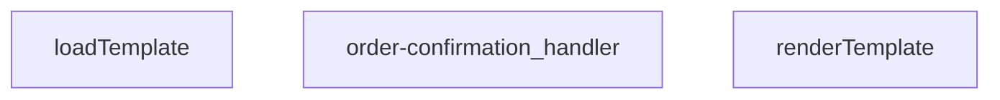

## Genel Bakış
Bu modül, sipariş onayı sürecinde tetiklenen bir Edge Function’dur. Gelen istekten sipariş ve müşteri bilgilerini alır, e‑posta şablonunu yükleyip verilerle doldurur ve son olarak oluşturulan HTML’i Resend API aracılığıyla alıcıya gönderir. Fonksiyonlar arasında şablon yükleme → şablon işleme → yanıt oluşturma akışı bulunur.  

## Fonksiyon Grupları
### Şablon Yönetimi
Şablon dosyasını diskteki konumundan asenkron olarak okur ve dinamik verilerle birleştirerek son HTML içeriğini üretir.  
- loadTemplate, renderTemplate  

### İstek İşleme ve Yanıt Oluşturma
Gelen HTTP isteğini doğrular, gerekli verileri veri tabanından çeker, şablonu işler ve e‑posta gönderim fonksiyonunu (dış API) çağırarak sonuç yanıtını döner.  
- order-confirmation_handler

---

## AXIOMS – Mimari Varsayımlar
Bu modül için özel aksiyom tanımlanmamıştır.

---

## FONKSIYON DETAYLARI

### renderTemplate
**Ne yapar**: Verilen şablon (template) metnini, sağlanan veri nesnesiyle birleştirerek sonuç stringini üretir.  
**Nasıl yapar**: Şablon içinde tanımlı değişken yer tutucularını `_data` nesnesindeki karşılık gelen değerlerle değiştirir; eksik değerler varsa boş string olarak bırakabilir.  
**Parametreler**:
- tpl: string — Şablon metni, içinde değişken yer tutucularını barındırır.  
- _data: Record<string, unknown> — Şablondaki yer tutuculara karşılık gelen değerleri içeren anahtar‑değer haritası.  
**Dönüş**: string — İşlenmiş ve veriyle doldurulmuş şablon metni.

### loadTemplate
**Ne yapar**: Dosya sisteminden veya uzaktan bir kaynaktan şablon dosyasını asenkron olarak okur ve içeriğini string olarak döndürür.  
**Nasıl yapar**: Promise tabanlı bir I/O operasyonu başlatır; dosya bulunamazsa `null` döner.  
**Parametreler**: *Yok*  
**Dönüş**: Promise<string | null> — Başarılı okuma durumunda şablon içeriği string, bulunamama durumunda `null`.

### order-confirmation_handler
**Ne yapar**: HTTP isteklerini alır, sipariş onayı şablonunu yükler, verileri şablona uygular ve yanıt olarak HTML içeriği döner.  
**Nasıl yapar**: Gelen `req` nesnesinden gerekli sipariş bilgilerini çıkarır, `loadTemplate` ile şablonu getirir, `renderTemplate` ile şablonu doldurur ve bir `Response` nesnesi oluşturur; hata durumunda uygun hata yanıtı üretir.  
**Parametreler**:
- req: any — HTTP istek nesnesi, içinde sipariş verileri ve diğer istek bilgileri bulunur.  
**Dönüş**: Response — HTTP yanıtı, genellikle `text/html` içerik tipinde ve doldurulmuş şablon metnini barındırır.

---

## AST POINTERS

### [N1_NASIL] AST Pointer: C:\Users\alize\venthub-hvac\supabase\functions\order-confirmation\index.ts::renderTemplate
- **params**: (tpl: string, _data: Record<string, unknown>)
- **ic_degiskenler**:
  - `tpl` — şablon metni; fonksiyon içinde güncellenerek döndürülür.
  - `_data` — şablondaki değişkenlerin değerlerini tutan nesne.
  - `v` — `_data[key]` ifadesinden elde edilen geçici değer; if‑else bloklarında kullanılır.
  - `truthy` — `v` değerinin boolean karşılığı; `{{#if …}}` bloğunun gösterilip gösterilmeyeceğini belirler.
  - `key` — regex tarafından yakalanan değişken adı (string).
  - `inner` — `{{#if key}} … {{/if}}` bloğunun içeriği (string).
- **Dönüş**: string (işlenmiş şablon)

### [N2_NASIL] AST Pointer: C:\Users\alize\venthub-hvac\supabase\functions\order-confirmation\index.ts::loadTemplate
- **params**: (none)
- **ic_degiskenler**:
  - `url` — `import.meta.url` temel alınarak şablon dosyasının tam yolu (URL).
- **Dönüş**: Promise<string | null> (başarılıysa şablon içeriği, hata durumunda null)

### [N3_NASIL] AST Pointer: C:\Users\alize\venthub-hvac\supabase\functions\order-confirmation\index.ts::(anonymous handler)
- **params**: (req)
- **ic_degiskenler**:
  - `requestOrigin` — `req.headers.get('origin')` ile alınan isteğin Origin başlığı (string).
  - `allowedOrigins` — ortam değişkeni `ALLOWED_ORIGINS`ten virgülle ayrılmış liste (string[]).
  - `originAllowed` — istek origininin izinli olup olmadığını gösteren flag (boolean).
  - `corsHeaders` — CORS yanıt başlıklarını içeren nesne.
  - `_text` — `await req._text()` ile elde edilen istek gövdesi (string).
  - `parsed` — JSON parse edilmiş istek gövdesi (Record<string, unknown>).
  - `order_id` — `parsed['order_id']` den alınan ve temizlenen sipariş kimliği (string | null).
  - `supabaseUrl` — ortam değişkeni `SUPABASE_URL` (string).
  - `serviceKey` — ortam değişkeni `SUPABASE_SERVICE_ROLE_KEY` (string).
  - `authHeader` — `Authorization` başlığı (string | null).
  - `isAuthorized` — isteğin yetkilendirilip edilmediğini gösteren flag (boolean).
  - `anonKey` — ortam değişkeni `SUPABASE_ANON_KEY` (string).
  - `authClient` — Supabase istemcisi (createClient sonucu).
  - `user` — `authClient.auth.getUser()` sonucundaki kullanıcı objesi (any).
  - `roleCheck` — kullanıcı rolünü sorgulayan fetch isteği (Response).
  - `arr` — `roleCheck.json()` çıktısı (any[]).
  - `role` — `arr[0]?.role` (string | undefined).
  - `resendApiKey` — ortam değişkeni `RESEND_API_KEY` (string).
  - `emailFrom` — ortam değişkeni `EMAIL_FROM` (string).
  - `testMode` — `EMAIL_TEST_MODE` env değeri true ise (boolean).
  - `testTo` — ortam değişkeni `EMAIL_TEST_TO` (string).
  - `bccList` — `SHIP_EMAIL_BCC` env değerinden elde edilen BCC adres listesi (string[]).
  - `brandName` — ortam değişkeni `BRAND_NAME` (string).
  - `brandPrimary` — ortam değişkeni `BRAND_PRIMARY_COLOR` (string).
  - `brandLogoUrl` — ortam değişkeni `BRAND_LOGO_URL` (string).
  - `customer_email` — siparişten/ kullanıcıdan alınan müşteri e‑posta adresi (string | null).
  - `customer_name` — siparişten/ kullanıcıdan alınan müşteri adı (string | null).
  - `order_number` — sipariş numarası (string | null).
  - `uid` — sipariş kaydındaki `user_id` (string | null).
  - `u` — kullanıcı detaylarını getiren fetch isteği (Response).
  - `uj` — `u.json()` çıktısı, kullanıcı bilgileri (object | null).
  - `metaName` — kullanıcı metadata’sından alınan isim (string | null).
  - `toList` — gönderilecek e‑posta alıcıları listesi (string[]).
  - `bcc` — BCC adresleri (string[]), `toList` boşsa birincisi alıcıya taşınır.
  - `prettyOrderNo` — okunabilir sipariş numarası (string).
  - `subject` — e‑posta başlığı (string).
  - `html` — şablondan üretilen e‑posta içeriği (string).
  - `tpl` — `loadTemplate()` sonucu şablon metni (string | null).
  - `send` — iç içe tanımlı async fonksiyon; e‑posta gönderimini gerçekleştirir (function).
  - `resp` — `send()` çağrısının fetch yanıtı (Response).
  - `txt` — hata durumunda yanıt gövdesi (string).
  - `result` — `resp.json()` çıktısı (object).
  - `row` — `arr[0]` olarak elde edilen sipariş kaydı (any | null).
  - `order_number` (row[0] gibi ayrı gösterilmez; `row.order_number` kullanılır)
  - `customer_email` (row[0] gibi ayrı gösterilmez)
  - `customer_name` (row[0] gibi ayrı gösterilmez)
  - `uid` (row[0] gibi ayrı gösterilmez)
- **Dönüş**: Response (HTTP yanıtı; başarılıda JSON `{success:true, subject, result}`; hata durumlarında ilgili hata kodu ve mesaj)

### [N4_NASIL] AST Pointer: C:\Users\alize\venthub-hvac\supabase\functions\order-confirmation\index.ts::send
- **params**: (none) – `send` fonksiyonu üstteki anonim handler içinde tanımlıdır ve dışarıdan erişilmez.
- **ic_degiskenler**:
  - `resendApiKey` — dış çevreden yakalanan ortam değişkeni (string).
  - `emailFrom` — dış çevreden yakalanan ortam değişkeni (string).
  - `toList` — dış çevreden gelen alıcı listesi (string[]).
  - `bcc` — dış çevreden gelen BCC listesi (string[]).
  - `subject` — dış çevreden gelen e‑posta başlığı (string).
  - `html` — dış çevreden gelen e‑posta içeriği (string).
- **Dönüş**: Promise<Response> (Resend API’ye yapılan POST isteğinin yanıtı)

---

## MERMAID CALL GRAPH

## NODE ID STANDARD

  file: supabase\functions\order-confirmation\index.ts
  function: supabase\functions\order-confirmation\index.ts::renderTemplate
  function: supabase\functions\order-confirmation\index.ts::loadTemplate
  function: supabase\functions\order-confirmation\index.ts::order-confirmation_handler

---

## DISA AKTARILANLAR (EXPORTS)
  export: loadTemplate
  export: order-confirmation_handler
  export: renderTemplate