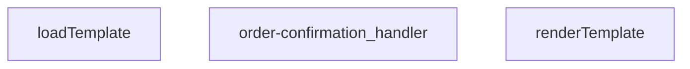

## Genel Bakış
Bu modül, bir sipariş onayı e-postası göndermekle sorumlu bir Supabase Edge Function'ıdır. Gelen HTTP isteğini işleyerek sipariş ve müşteri bilgilerini alır, ilgili HTML e-posta şablonunu diskten yükler, verilerle doldurur ve Resend API kullanarak e-postayı gönderir.

## Fonksiyon Grupları
### Şablon İşleme
Bu grup, e-posta şablonunun yüklenmesini ve dinamik verilerle doldurulmasını sağlar. Şablon dosyası asenkron olarak okunur ve bir veri haritası kullanılarak kişiselleştirilmiş HTML içeriğine dönüştürülür.
- loadTemplate, renderTemplate

### İstek Yönetimi ve E-posta Gönderimi
Ana iş akışını kontrol eden bu grup, gelen isteği doğrular, gerekli verileri elde eder, şablon işleme adımlarını tetikler, e-postayı gönderir ve sonuç durumunu içeren HTTP yanıtını oluşturur.
- order-confirmation_handler

---

---

## FONKSİYON DETAYLARI

### renderTemplate
**Ne yapar**: Verilen bir HTML/şablon dizesindeki koşullu blokları ve değişken yer tutucularını, sağlanan veri nesnesindeki değerlerle değiştirerek işlenmiş bir dize döndürür. Basit bir şablon motoru görevi görür.

**Nasıl yapar**: İlk olarak `{{#if key}}...{{/if}}` sözdizimini eşleştirir; ilgili `_data[key]` değeri truthy ise içeriği korur, aksi halde boş string ile değiştirir. Ardından kalan `{{key}}` yer tutucularını `_data[key]` değeriyle değiştirir; değer `null` veya `undefined` ise boş string döner, değilse `String()` ile dizeye dönüştürülür.

**Parametreler**:
- `tpl`: string — İşlenecek şablon dizesi. İçerisinde `{{#if}}...{{/if}}` koşullu blokları ve `{{değişken}}` yer tutucuları bulundurur.
- `_data`: Record<string, unknown> — Şablondaki yer tutuculara karşılık gelen değerleri içeren nesne. Anahtarlar şablondaki değişken isimleriyle eşleşmelidir.

**Dönüş**: string — İşlenmiş, tüm yer tutucuların değerlerle değiştirildiği veya koşullu blokların ayıklandığı sonuç dizesi.

### loadTemplate
**Ne yapar**: Dosya sisteminden veya uzaktan bir kaynaktan şablon dosyasını asenkron olarak okur ve içeriğini string olarak döndürür.  
**Nasıl yapar**: Promise tabanlı bir I/O operasyonu başlatır; dosya bulunamazsa `null` döner.  
**Parametreler**: *Yok*  
**Dönüş**: Promise<string | null> — Başarılı okuma durumunda şablon içeriği string, bulunamama durumunda `null`.

### order-confirmation_handler
**Ne yapar**: HTTP isteklerini alır, sipariş onayı şablonunu yükler, verileri şablona uygular ve yanıt olarak HTML içeriği döner.  
**Nasıl yapar**: Gelen `req` nesnesinden gerekli sipariş bilgilerini çıkarır, `loadTemplate` ile şablonu getirir, `renderTemplate` ile şablonu doldurur ve bir `Response` nesnesi oluşturur; hata durumunda uygun hata yanıtı üretir.  
**Parametreler**:
- req: any — HTTP istek nesnesi, içinde sipariş verileri ve diğer istek bilgileri bulunur.  
**Dönüş**: Response — HTTP yanıtı, genellikle `text/html` içerik tipinde ve doldurulmuş şablon metnini barındırır.

---

## AST POINTERS

### [N1_NASIL] AST Pointer: supabase/functions/order-confirmation/index.ts::renderTemplate
- **params**: (`tpl`: string, `_data`: Record<string, unknown>)
- **ic_degiskenler**:
  - `_m` — regex eşleşme sonucu (ilk callback'te: {{#if}} kalıbının tüm eşleşmesi, ikinci callback'te: {{key}} kalıbının tüm eşleşmesi)
  - `key` — regex tarafından yakalanan değişken adı (şablon içindeki `{{key}}` veya `{{#if key}}` ifadesinden gelir)
  - `inner` — `{{#if key}}...{{/if}}` bloğunun içeriği (yalnızca birinci replace callback'inde)
  - `v` — `_data[key]` ile şablon verisi sözlüğünden ilgili değerin okunması
  - `truthy` — `v` değerinin truthy olup olmadığını belirleyen boolean (string ise !=='' kontrolü, diğer tipler için doğrudan)
- **Dönüş**: string (değiştirilmiş/yer tutucuları doldurulmuş şablon)

### [N2_NASIL] AST Pointer: supabase/functions/order-confirmation/index.ts::loadTemplate
- **params**: (yok)
- **ic_degiskenler**:
  - `url` — `new URL('./templates/email/order_confirmation.html', import.meta.url)` ile hesaplanan dosya yolu referansı;模板 HTML dosyasının konumunu belirtir
- **Dönüş**: `Promise<string | null>` — şablon içeriği başarıyla okunursa string, hata olursa null

### [N3_NASIL] AST Pointer: supabase/functions/order-confirmation/index.ts::order-confirmation_handler
- **params**: (`req`: Request)
- **ic_degiskenler**:
  - `requestOrigin` — HTTP isteğinin `Origin` header değerinin string karşılığı; CORS doğrulamasında kullanılır
  - `allowedOrigins` — `ALLOWED_ORIGINS` env değişkeninin virgülle ayrılmış, trim edilmiş, boş olmayan string dizisi; izin veren köklerin listesi
  - `originAllowed` — boolean; istek kökünün izin listesinde olup olmadığını veya listenin boş olup olmadığını belirler
  - `corsHeaders` — `Record<string, string>`; tüm HTTP yanıtlarına eklenecek CORS başlıkları sözlüğü (`Access-Control-Allow-Origin`, `Vary`, `Access-Control-Allow-Headers`, `Access-Control-Allow-Methods`, `Access-Control-Max-Age` alanlarını içerir)
  - `_text` — `await req._text()` ile okunan ham istek gövdesi (string); JSON.parse'a girdi olarak verilir
  - `parsed` — `_text`'in `JSON.parse` ile çözümlemesi; `Record<string, unknown>` tipinde sözlük, istek parametrelerini tutar
  - `order_id` — IIFE `((): string | null => {...})()` ile `parsed['order_id']`'den çıkarılan ve trim edilmiş sipariş ID'si; null olabilir
  - `supabaseUrl` — `SUPABASE_URL` env değişkeninden okunan Supabase proje URL'i; tüm API çağrıları için temel URL
  - `serviceKey` — `SUPABASE_SERVICE_ROLE_KEY` env değişkeninden okunan servis anahtarı; yetkili API istekleri için Bearer token olarak kullanılır
  - `authHeader` — `req.headers.get('Authorization')` ile gelen Authorization header değeri; kimlik doğrulama için kullanılır
  - `isAuthorized` — boolean; istek yapanın yetkili olup olmadığını tutar; başlangıçta false
  - `anonKey` — `SUPABASE_ANON_KEY` env değişkeninden okunan anonim anahtar; fallback auth istemcisi oluşturulurken kullanılır
  - `authClient` — `createClient(supabaseUrl, anonKey, {...})` ile oluşturulan Supabase istemcisi; anonim anahtarla ama gelen Authorization header'ı ile kimlik doğrulama yapılır
  - `user` — `await authClient.auth.getUser()` sonucundan gelen kullanıcının bilgileri (`{ id, ... }`); null olabilir, yetkilendirme kontrolü için kullanılır
  - `roleCheck` — `fetch(...)` ile `user_profiles` tablosundan rol sorgulama sonucu (Response); admin/superadmin rolü kontrol edilir
  - `arr` — `roleCheck.json()` çözümlemesinden gelen dizi (hata durumunda boş dizi); kullanıcı profil satırlarını tutar
  - `role` — `arr[0]?.role` ile erişilen kullanıcının rol string'i; `'admin'` veya `'superadmin'` ise yetkilendirme yapılır
  - `resendApiKey` — `RESEND_API_KEY` env değişkeninden okunan Resend API anahtarı; e-posta gönderimi için Bearer token
  - `emailFrom` — `EMAIL_FROM` env değişkeninden okunan gönderici e-posta adresi/bilgisi; `'VentHub Test <onboarding@resend.dev>'` varsayılır
  - `testMode` — `EMAIL_TEST_MODE` env değişkeninin boolean karşılığı; küçük harfe çevirip `'true'` ise test modu aktif
  - `testTo` — `EMAIL_TEST_TO` env değişkeninden okunan test alıcı e-postası; test modunda e-posta buraya gider
  - `bccList` — `SHIP_EMAIL_BCC` env değişkeninin virgülle ayrılmış, trim edilmiş, boş olmayan string dizisi; BCC alıcı listesi
  - `brandName` — `BRAND_NAME` env değişkeninden okunan marka adı; şablon ve konu satırında kullanılır
  - `brandPrimary` — `BRAND_PRIMARY_COLOR` env değişkeninden okunan marka ana rengi (hex); şablon içindeki renk referansları için
  - `brandLogoUrl` — `BRAND_LOGO_URL` env değişkeninden okunan marka logo URL'i; şablon değişkenlerine aktarılır
  - `customer_email` — sipariş kaydından veya auth kullanıcısından elde edilen müşteri e-posta adresi; başlangıçta null, DB sorgusuyla doldurulur
  - `customer_name` — sipariş kaydından veya auth kullanıcısından elde edilen müşteri tam adı; başlangıçta null, DB sorgusuyla doldurulur
  - `order_number` — sipariş kaydından elde edilen sipariş numarası string'i; null olabilir
  - `o` — `fetch(...)` ile `venthub_orders` tablosundan sipariş bilgisi sorgulama sonucu (Response)
  - `arr` — `o.json()` çözümlemesinden gelen sipariş satırları dizisi; boş dizi olabilir (hata durumunda)
  - `row` — `arr[0]` satır nesnesi; `user_id`, `customer_email`, `customer_name`, `order_number` alanlarını içerir; null olabilir
  - `uid` — `row.user_id` değerinin string karşılığı; müşteri bilgileri eksikse auth API'den bilgi çekmek için kullanılır
  - `u` — `fetch(...)` ile Supabase auth admin API'den kullanıcı bilgisi sorgulama sonucu (Response)
  - `uj` — `u.json()` çözümlemesinden gelen kullanıcı nesnesi (`UserResponse`); `email`, `user_metadata.full_name`, `user_metadata.name` alanlarını içerebilir
  - `metaName` — `uj.user_metadata.full_name` veya `uj.user_metadata.name` değerinden elde edilen isim; `customer_name` eksikse tamamlamak için kullanılır
  - `toList` — `string[]` tipinde e-posta alıcıları dizisi; test modunda `testTo`, normalde `customer_email` eklenir; boşsa BCC'den ilk eleman alınır
  - `bcc` — `bccList`'in kopyası (`[...bccList]`); alıcı listesi boşsa ilk elemanı `toList`'a taşınır, kalanı BCC olarak kalır
  - `prettyOrderNo` — `order_number` varsa `#` prefix + tire sonrasındaki kısım, yoksa son 8 karakter büyük harf + `#` prefix olarak formatlanmış sipariş numarası; konu satırı ve şablon için kullanılır
  - `subject` — e-posta konu satırı; `"${brandName} | Siparişiniz alındı - ${prettyOrderNo}"` formatında oluşturulur
  - `tpl` — `await loadTemplate()` ile yüklenen ham HTML şablonu; null olabilir
  - `html` — `renderTemplate(tpl, {...})` çağrısıyla doldurulmuş nihai HTML içerik; şablon yüklenemezse inline fallback HTML ile oluşturulur
  - `send` — inner async fonksiyon; Resend API'ye POST isteği atarak e-posta gönderir, closure üzerinden `resendApiKey`, `emailFrom`, `toList`, `bcc`, `subject`, `html` değişkenlerini kullanır
  - `resp` — `send()` çağrısından dönen Response nesnesi; `resp.ok` ile başarı kontrolü yapılır
  - `txt` — `resp._text()` ile okunan hata yanıtı metni; `'domain'` ve `'verify'` içeriği kontrol edilerek auto-retry (fallback sender) mantığı çalıştırılır
  - `result` — `resp.json()` çözümlemesinden gelen Resend API yanıt nesnesi; `result.id` veya `result._data.id` ile message ID alınır
- **Dönüş**: `Response` — JSON gövdeli HTTP yanıtı; başarı: `{ success, subject, result }` (200), hata: çeşitli error nesneleri (400/401/403/405/500)

### [N4_NASIL] AST Pointer: supabase/functions/order-confirmation/index.ts::send (inner function, handler içinde)
- **params**: (yok)
- **ic_degiskenler**:
  — (inner fonksiyon olup closure üzerinden dış kapsamdaki `resendApiKey`, `emailFrom`, `toList`, `bcc`, `subject`, `html` değişkenlerine erişir; kendi içinde ek değişken tanımlamaz)
- **Dönüş**: `Promise<Response>` — Resend API yanıt response nesnesi

---

## MERMAID CALL GRAPH

## NODE ID STANDARD

  file: supabase\functions\order-confirmation\index.ts
  function: supabase\functions\order-confirmation\index.ts::renderTemplate
  function: supabase\functions\order-confirmation\index.ts::loadTemplate
  function: supabase\functions\order-confirmation\index.ts::order-confirmation_handler

---

## DISA AKTARILANLAR (EXPORTS)
  export: loadTemplate
  export: order-confirmation_handler
  export: renderTemplate