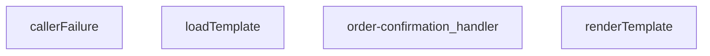

## Genel Bakış
Bu modül, sipariş onayı e-postası gönderimi için tasarlanmış bir Supabase Edge Function'dur. Gelen HTTP isteklerini alarak sipariş bilgilerini işler, e-posta şablonunu yükleyip dinamik verilerle doldurur ve uygun HTTP yanıtını döndürür.

## Fonksiyon Grupları
### Şablon Yönetimi
E-posta gönderimi için kullanılacak HTML şablonlarının yüklenmesi ve dinamik veri alanlarıyla doldurulması işlemlerini yürütür.
- loadTemplate, renderTemplate

### İstek İşleme ve Hata Yönetimi
HTTP isteklerini karşılayan ana handler fonksiyonu ile hata durumlarında tutarlı yanıt üretimi sağlayan yardımcı işlevleri kapsar.
- order-confirmation_handler, callerFailure

---

## AXIOMS – Mimari Varsayımlar

Bu modül, sipariş onayı e-postası gönderimi için HTML şablon işleme ve HTTP istek yönetimi sağlayan bir Supabase Edge Function'dır.

**[Aksiyom 1]:** Eğer `loadTemplate()` çağrıldığında geçerli bir şablon dosyası diskte mevcut değilse, `Promise<string | null>` olarak `null` döner ve e-posta gönderimi gerçekleştirilemez.

**[Aksiyom 2]:** Eğer `renderTemplate()` fonksiyonuna boş veya geçersiz bir `tpl` string'i传递 edilirse, string dönüşümü hatalı veya boş bir çıktı üretilir (fonksiyonun `Record<string, unknown>` veri parametresiyle birlikte çalışması beklenir).

**[Aksiyom 3]:** Eğer `callerFailure()` hatasız bir durum için çağrılırsa (yani işlem başarıyla tamamlandıysa), `null` döner; aksi halde `{ status: number; error: string }` yapısında bir hata nesnesi döner.

**[Aksiyom 4]:** Eğer `order-confirmation_handler` fonksiyonuna geçersiz veya eksik bir HTTP istek nesnesi (`req`)传递 edilse, yanıt üretilmesinde hata oluşur ve `callerFailure` aracılığıyla hata yanıtı döndürülür.

**[Aksiyom 5]:** Eğer `renderTemplate()` fonksiyonuna传递 edilen `_data` parametresi şablon içindeki dinamik alanları karşılamıyorsa (eksik anahtarlar içeriyorsa), şablondaki bazı alanlar doldurulmamış olarak kalır; bu durum fonksiyon imzasından hata fırlatmayacak şekilde sessizce gerçekleşir.

---

## FONKSİYON DETAYLARI

### callerFailure
**Ne yapar**: Çağrıci (caller) kaynaklı hataları HTTP durum kodlarına ve anlamlı hata mesajlarına dönüştürerek API yanıt formatına uygun hale getirir. TenantMismatchError, CallerConfigError ve CallerLookupError gibi özel hata türlerini birebir HTTP karşılıklarına eşler.

**Nasıl yapar**: Fonksiyon, parametre olarak aldığı `error` nesnesinin hangi özel hata sınıfına ait olduğunu `instanceof` operatörü ile sırasıyla kontrol eder. TenantMismatchError ise 403 (Forbidden), CallerConfigError ise 500 (Internal Server Error), CallerLookupError ise 503 (Service Unavailable) durum kodu ile birlikte tanımlı bir hata dizesi döndürür. Hiçbir eşleşme sağlanamazsa null değeri döner, böylece çağrıci dışındaki hatalar üst katman tarafından ayrıca işlenir.

**Parametreler**:
- `error`: unknown — Kontrol edilecek hata nesnesi; herhangi bir türde olabilir, `instanceof` kontrolleri ile türü belirlenir

**Dönüş**: `{ status: number; error: string } | null` — Eşleşme sağlanırsa HTTP durum kodu ve hata mesajı içeren nesne, aksi halde null döner. `status` alanı HTTP yanıt kodunu (403, 500 veya 503), `error` alanı ise API tarafında tanımlı hata tanımını (tenant_mismatch, CONFIG_MISSING veya profile_lookup_failed) temsil eder.

### renderTemplate
**Ne yapar**: Verilen bir şablon string'indeki dinamik marker'ları (Handlebars benzeri {{değişken}} ve {{#if koşul}} bloklarını) belirli veri nesnesindeki değerlerle değiştirerek, dolu bir HTML veya metin çıktısı üretir. Bu fonksiyon, e-posta şablonlarının içeriklerini kişiselleştirmek için basit bir şablon motoru görevi görür.

**Nasıl yapar**: Fonksiyon, iki aşamalı bir regex tabanlı işleme uygular. İlk olarak `{{#if anahtar}}...{{/if}}` koşullu bloklarını tarar; eğer ilgili anahtar veri nesnesinde tanımlı ve "truthy" bir değere sahipse, bloğun içeriğini korur, aksi takdirde bloğu tamamen kaldırır. İkinci adımda, kalan `{{anahtar}}` ifadelerini tarar ve bunları veri nesnesindeki karşılıklarıyla (null veya undefined ise boş string, aksi takdirde string'e dönüştürülmüş haliyle) değiştirir.

**Parametreler**:
- `tpl`: `string` — İşlenecek şablon metni. İçerisinde `{{anahtar}}` ve `{{#if anahtar}}...{{/if}}` marker'ları bulunur.
- `_data`: `Record<string, unknown>` — Şablon marker'larının yerine konacak değerlerin bulunduğu anahtar-değer çiftlerinden oluşan nesne. Değerlerin herhangi bir tipte olmasına izin verilir.

**Dönüş**: `string` — Tüm marker'ların verilen verilerle değiştirildiği veya kaldırılmış olduğu işlenmiş şablon metni.

### loadTemplate
**Ne yapar**: Dosya sisteminden veya uzaktan bir kaynaktan şablon dosyasını asenkron olarak okur ve içeriğini string olarak döndürür.  
**Nasıl yapar**: Promise tabanlı bir I/O operasyonu başlatır; dosya bulunamazsa `null` döner.  
**Parametreler**: *Yok*  
**Dönüş**: Promise<string | null> — Başarılı okuma durumunda şablon içeriği string, bulunamama durumunda `null`.

### order-confirmation_handler
**Ne yapar**: HTTP isteklerini alır, sipariş onayı şablonunu yükler, verileri şablona uygular ve yanıt olarak HTML içeriği döner.  
**Nasıl yapar**: Gelen `req` nesnesinden gerekli sipariş bilgilerini çıkarır, `loadTemplate` ile şablonu getirir, `renderTemplate` ile şablonu doldurur ve bir `Response` nesnesi oluşturur; hata durumunda uygun hata yanıtı üretir.  
**Parametreler**:
- req: any — HTTP istek nesnesi, içinde sipariş verileri ve diğer istek bilgileri bulunur.  
**Dönüş**: Response — HTTP yanıtı, genellikle `text/html` içerik tipinde ve doldurulmuş şablon metnini barındırır.

---

## İTHALATLAR (IMPORTS)
- import: ../_shared/cors.ts::getCorsHeaders
- import: ../_shared/sentry.ts::sentryCaptureException
- import: ../_shared/tenant_config.ts::getTenantBranding
- import: https://deno.land/std@0.168.0/http/server.ts::serve

---

## AST POINTERS

### [N1_NASIL] AST Pointer: order-confirmation/index.ts::callerFailure
- **params**: `error: unknown`
- **ic_degiskenler**: (yok — parametre doğrudan kontrol edilir)
- **Dönüş**: `{ status: number; error: string } | null` — Hata türüne göre statik hata nesnesi veya null döner

---

## MERMAID CALL GRAPH

## NODE ID STANDARD

  file: supabase\functions\order-confirmation\index.ts
  function: supabase\functions\order-confirmation\index.ts::callerFailure
  function: supabase\functions\order-confirmation\index.ts::renderTemplate
  function: supabase\functions\order-confirmation\index.ts::loadTemplate
  function: supabase\functions\order-confirmation\index.ts::order-confirmation_handler

---

## DISA AKTARILANLAR (EXPORTS)
  export: callerFailure
  export: loadTemplate
  export: order-confirmation_handler
  export: renderTemplate