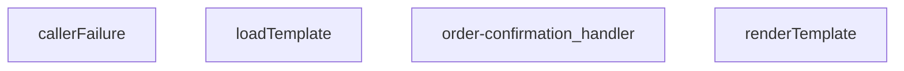

## Genel Bakış

Bu modül, Supabase Edge Function olarak çalışan bir sipariş onay işleyicisidir. Gelen HTTP isteklerini alır, bir şablon yükleyip veriyle render ederek yanıt üretir. Hata durumlarını yakalayıp uygun HTTP durum kodu ve hata mesajıyla sonuçlandıran bir yapıya sahiptir.

## Fonksiyon Grupları

### Ana İşleyici

Gelen HTTP isteğini karşılayan, şablon yükleme ve işleme adımlarını sırayla çalıştırarak sonucu Response olarak döndüren ana giriş noktasıdır.

- order-confirmation_handler

### Şablon İşleme

Şablon dosyasını yükleyen ve yüklenen şablonu verilen veriyle birlikte işleyerek çıktı üreten fonksiyonları içerir. `loadTemplate` şablonu asenkron olarak okur, `renderTemplate` ise şablon ve veri alarak sonuç string üretir.

- loadTemplate, renderTemplate

### Hata Yönetimi

Hata durumlarını değerlendirip uygun HTTP durum kodu ve hata mesajı içeren bir nesne döndüren yardımcı fonksiyondur. Hata çözümlenemezse null değer döndürür.

- callerFailure

---

## AXIOMS – Mimari Varsayımlar

[Aksiyom 1]: Eğer `loadTemplate` null döndürürse, sipariş onay e-postası gönderilemez çünkü template dosyası yüklenememiştir.

[Aksiyom 2]: Eğer `callerFailure` null döndürürse, istemciye hata bilgisi döndürülemez çünkü hata response'u oluşturulamamıştır.

[Aksiyom 3]: `renderTemplate` fonksiyonu her zaman string döndürür; null dönmez. Eğer template ve veri sağlanmışsa, render işlemi başarısız olmaz.

[Aksiyom 4]: `order-confirmation_handler` fonksiyonu her zaman bir Response nesnesi döndürmelidir; null veya undefined dönemez.

[Aksiyom 5]: Eğer `loadTemplate` başarılı olursa (null olmayan string dönerse), bu template `renderTemplate` fonksiyonuna birinci parametre olarak verilebilir.

[Aksiyom 6]: Eğer `callerFailure` null olmayan bir değer döndürürse, bu değer `{ status: number; error: string }` formatındadır ve doğrudan Response oluşturmak için kullanılabilir.

---

## FONKSİYON DETAYLARI

### callerFailure
**Ne yapar**: Kapı katmanında oluşan hataları HTTP durum kodlarına eşleyen bir hata haritalama fonksiyonudur. Üç farklı hata türünü tanımlı HTTP yanıtlarına dönüştürür; bilinmeyen hata türlerinde `null` döner. Docstring'e göre bu eşleme, beş bildirim ucunda birebir aynı şekilde kullanılmaktadır.

**Nasıl yapar**: Gelen `error` parametresinin `instanceof` kontrolüyle türü belirlenir. `TenantMismatchError` durumunda 403 (claim ile profil çelişiyor; kullanıcı o tenant'a ait değil), `CallerConfigError` durumunda 500 (ortam değişkeni eksik — bizim hatamız, çağıranın değil), `CallerLookupError` durumunda 503 durum kodu döner. Hiçbiri eşleşmezse `null` döndürülür.

**Parametreler**:
- error: unknown — eşlenecek hata nesnesi; türü bilinmeyen bir değer olarak kabul edilir

**Dönüş**: `{ status: number; error: string } | null` — Eşleşen hata varsa HTTP durum kodu ve hata anahtarını içeren nesne; eşleşme yoksa `null`

### renderTemplate
**Ne yapar**: Geliştirildi ancak detay üretilemedi.

### loadTemplate
**Ne yapar**: Geliştirildi ancak detay üretilemedi.

### order-confirmation_handler
**Ne yapar**: Geliştirildi ancak detay üretilemedi.

---

## İTHALATLAR (IMPORTS)
- import: ../_shared/cors.ts::getCorsHeaders
- import: ../_shared/sentry.ts::sentryCaptureException
- import: ../_shared/tenant_config.ts::getTenantBranding
- import: https://deno.land/std@0.168.0/http/server.ts::serve

---

## AST POINTERS

### [N1_NASIL] AST Pointer: callerFailure
- **params**: `error: unknown`
- **ic_degiskenler**: yok
- **Dönüş**: `{ status: number; error: string } | null` — `TenantMismatchError` ise 403/tenant_mismatch, `CallerConfigError` ise 500/CONFIG_MISSING, `CallerLookupError` ise 503/profile_lookup_failed, diğer durumda `null`

### [N2_NASIL] AST Pointer: renderTemplate
- **params**: `tpl: string`, `_data: Record<string, unknown>`
- **ic_degiskenler**:
  - `_m` — regex eşleşmesinin tam metni (kullanılmaz, atlanır)
  - `key` — `{{#if key}}` veya `{{key}}` bloğundaki değişken adı
  - `inner` — `{{#if}}` bloğunun içeriği (koşul sağlanırsa korunur)
  - `v` — `_data[key]` ile elde edilen değer
  - `truthy` — `v`'nin truthy olup olmadığını gösteren boolean; string ise kendisi, değilse `!!v` ile dönüştürülür
- **Dönüş**: `string` — `{{#if key}}...{{/if}}` blokları truthy ise inner, değilse boş string; `{{key}}` yerleri `v`'nin string karşılığı veya boş string ile değiştirilmiş tpl

### [N3_NASIL] AST Pointer: loadTemplate
- **params**: yok
- **ic_degiskenler**:
  - `url` — `import.meta.url`'e göre `./templates/email/order_confirmation.html` yolunun tam URL'si
- **Dönüş**: `Promise<string | null>` — dosya okunursa HTML string, hata olursa `null`

### [N4_NASIL] AST Pointer: order-confirmation_handler
- **params**: `req` (serve dekoratörü ile)
- **ic_degiskenler**:
  - `requestOrigin` — `req.headers.get('origin')` ile alınan istek kökeni, yoksa boş string
  - `allowedOrigins` — `Deno.env.get('ALLOWED_ORIGINS')` virgülle ayrılmış, trimlenmiş, boş olmayan dizi
  - `originAllowed` — `allowedOrigins` boşsa true, değilse `requestOrigin`'in listede olup olmadığı
  - `corsHeaders` — `getCorsHeaders(req)` ile üretilen CORS başlıkları
  - `_text` — `req.text()` ile okunan ham istek gövdesi
  - `parsed` — `_text`'in JSON.parse sonucu, boşsa `{}`, parse hatasında `{}`
  - `order_id` — IIFE ile `parsed['order_id']`'den çıkarılan trimlenmiş string veya `null`
  - `supabaseUrl` — `Deno.env.get('SUPABASE_URL')` veya boş string
  - `serviceKey` — `Deno.env.get('SUPABASE_SERVICE_ROLE_KEY')` veya boş string
  - `ctx` — `resolveCaller(req, parsed)` ile dönen `CallerContext`
  - `failure` — `callerFailure(err)` sonucu; null değilse hata yanıtı döndürülür
  - `tenantId` — `ctx.tenantId` ile doğrulanmış tenant kimliği
  - `branding` — `getTenantBranding(tenantId)` ile alınan tenant marka bilgileri
  - `resendApiKey` — `Deno.env.get('RESEND_API_KEY')` veya boş string
  - `emailFrom` — `branding.emailFrom` başlangıç değeri; domain doğrulama hatasında `onboarding@resend.dev`'e düşer
  - `testMode` — `Deno.env.get('EMAIL_TEST_MODE')`'in `'true'` olup olmadığını gösteren boolean
  - `testTo` — `Deno.env.get('EMAIL_TEST_TO')` veya `'delivered@resend.dev'`
  - `bccList` — `Deno.env.get('SHIP_EMAIL_BCC')` virgülle ayrılmış, trimlenmiş, boş olmayan dizi
  - `brandName` — `branding.brandName`
  - `brandPrimary` — `branding.brandPrimaryColor`
  - `brandLogoUrl` — `branding.brandLogoUrl`
  - `customer_email` — siparişten veya auth.users'dan alınan müşteri e-postası, `null` olabilir
  - `customer_name` — siparişten veya auth.users.user_metadata'dan alınan müşteri adı, `null` olabilir
  - `order_number` — sipariş numarası, `null` olabilir
  - `o` — `venthub_orders` tablosuna fetch sonucu Response
  - `arr` — `o.json()` sonucu dizi, parse hatasında `[]`
  - `arr[0]` — sipariş satırı objesi veya `null`
  - `row` — `arr[0]` ile aynı; `order_number`, `customer_email`, `customer_name`, `user_id` alanlarına erişilir
  - `uid` — `row.user_id` veya `null`; müşteri bilgisi eksikse auth.users sorgusu tetikler
  - `u` — `auth/v1/admin/users/{uid}` fetch sonucu Response
  - `uj` — `u.json()` sonucu `UserResponse | null`; `email`, `user_metadata.full_name`, `user_metadata.name` alanlarına erişilir
  - `metaName` — `uj.user_metadata.full_name` veya `uj.user_metadata.name` veya `null`
  - `toList` — alıcı e-posta dizisi; test modunda `testTo`, değilse `customer_email`; ikisi de yoksa `bccList[0]`'dan taşınır
  - `bcc` — `bccList`'in kopyası; `toList` boşsa ilk elemanı taşındıktan sonra kısaltılır
  - `prettyOrderNo` — `order_number` varsa `#` + tire sonrasındaki kısım, yoksa `order_id`'nin son 8 karakteri büyük harf
  - `subject` — `"${brandName} | Siparişiniz alındı - ${prettyOrderNo}"`
  - `html` — `loadTemplate()` + `renderTemplate()` ile üretilen HTML; template yoksa inline fallback HTML
  - `tpl` — `loadTemplate()` sonucu template string veya `null`
  - `resp` — `send()` sonucu Resend API Response; ilk deneme başarısızsa domain doğrulama hatası kontrolü ile yeniden denenir
  - `txt` — başarısız `resp.text()` sonucu; domain doğrulama tetikleyicisi olarak kullanılır
  - `result` — başarılı `resp.json()` sonucu; `id` veya `data.id` alanına erişilir
  - `_e` — yakalanan hata; `sentryCaptureException`'a gönderilir
  - `msg` — `_e.message` veya `String(_e)`
- **Dönüş**: `Response` — 200/success, 400/missing_fields, 401/unauthorized, 403/forbidden, 403/forbidden_origin, 405/method_not_allowed, 500/CONFIG_MISSING, 500/send_failed, 500/unexpected

### [N5_NASIL] AST Pointer: send (iç fonksiyon)
- **params**: yok
- **ic_degiskenler**: yok (dış scope değişkenlerini kullanır: `resendApiKey`, `emailFrom`, `toList`, `bcc`, `subject`, `html`)
- **Dönüş**: `Promise<Response>` — `https://api.resend.com/emails` POST sonucu Response

---

## MERMAID CALL GRAPH

## NODE ID STANDARD

  file: index.ts
  function: index.ts::callerFailure
  function: index.ts::renderTemplate
  function: index.ts::loadTemplate
  function: index.ts::order-confirmation_handler

---

## DISA AKTARILANLAR (EXPORTS)
  export: callerFailure
  export: loadTemplate
  export: order-confirmation_handler
  export: renderTemplate