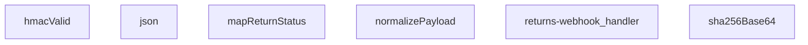

## Genel Bakış

Bu modül, kargo firmalarından gelen iade webhook isteklerini işleyen bir Supabase Edge Function'dır. HMAC-SHA256 imza doğrulaması ile güvenli kabul edilen istekler, farklı formatlardaki payload'lar standart forma dönüştürülerek uygulama içi iade durum alanlarına eşlenir. Modül tek bir HTTP giriş noktası üzerinden tüm iş akışını orkestra eder.

## Fonksiyon Grupları

### Kriptografik Doğrulama
Gelen webhook isteklerinin HMAC-SHA256 imzasını doğrulayarak kaynağın güvenilirliğini teyit eder. SHA-256 hash üretimi ve imza karşılaştırma işlemlerini kapsar.
- sha256Base64, hmacValid

### Veri Normalizasyonu ve Haritalama
Kargo firmalarından gelen farklı formatlardaki verileri ortak bir yapıya dönüştürür ve firma bazlı durum kodlarını uygulama içi standart değerler ile eşler.
- normalizePayload, mapReturnStatus

### Yanıt Oluşturma
HTTP yanıtlarını JSON formatında ve uygun HTTP durum kodlarıyla paketler.
- json

### Ana Webhook İşleyici
HTTP isteğini alarak tüm iş akışını yönetir; imza doğrulaması, payload normalizasyonu ve durum eşleme adımlarını sırasıyla çalıştırarak nihai yanıtı üretir.
- returns-webhook_handler

---

---

## FONKSİYON DETAYLARI

### json
**Ne yapar**: Verilen gövdeyi ve yanıt başlatma seçeneklerini kullanarak, JSON formatında içerikli bir HTTP yanıtı oluşturur.
**Nasıl yapar**: Gelen `body` parametresini, iki boşluk girintili bir JSON dizesine dönüştürür. Varsayılan olarak `200` durum kodu ve `application/json; charset=utf-8` içerik türü ile bir `Response` nesnesi döndürür. Eklenen `init` parametresi ile durum kodu ve başlıklar özelleştirilebilir.
**Parametreler**:
- body: unknown — Yanıt gövdesi olarak kullanılacak veri. Herhangi bir tipte olabilir, JSON.stringify ile dizgeye dönüştürülür.
- init: ResponseInit — İsteğe bağlı. Durum kodu (`status`) ve başlıkları (`headers`) belirtmek için kullanılan standart ResponseInit nesnesi.
**Dönüş**: Response — Oluşturulan JSON içerikli HTTP yanıtı.

### hmacValid
**Ne yapar**: Verilen gizli anahtar, ham veri ve imza başlığını kullanarak bir HMAC-SHA256 imzasının geçerliliğini doğrular.
**Nasıl yapar**: Gizli anahtarı bir HMAC-SHA256 anahtarı olarak içe aktarır, ham veri ile bir imza hesaplar ve Base64 ile kodlanmış sonucu, gelen imza başlığındaki `sha256=` ön ekinden arındırılmış değer ile karşılaştırır. Doğrulama başarısız olursa `false` döner.
**Parametreler**:
- secret: string — HMAC imza hesaplamasında kullanılacak gizli anahtar.
- raw: string — İmza hesaplamasına giren ham veri (genellikle request body).
- signatureHeader: string — İsteğe gelen ve `sha256=...` formatında beklenen HMAC imzasını içeren başlık değeri.
**Dönüş**: Promise<boolean> — İmza geçerli ise `true`, değilse veya bir hata oluşursa `false` döner.

### mapReturnStatus
**Ne yapar**: Bir dize giriş değerini tanımlı bir durum nesnesine dönüştürür, nakliyede, teslim alınmış veya iptal edilmiş gibi durumları haritalandırır.
**Nasıl yapar**: Giriş dizesini küçük harfe dönüştürür ve tanımlı anahtar kelimeler listesine göre eşleştirir. 'in_transit' grubu için `in_transit` durumunu, 'received' grubu için `received` durumunu (ve `setReceived` flag'ini `true` yaparak) ve 'cancelled' grubu için `cancelled` durumunu döndürür. Tanınmayan bir değer girilirse, o değerin kendisi durum olarak kullanılır.
**Parametreler**:
- input: string | undefined — Haritalanacak ham durum dizesi.
**Dönüş**: { status?: string; setReceived?: boolean } — Eşlenen durum nesnesi. Giriş boşsa veya tanımsızsa boş bir nesne döner.

### normalizePayload
**Ne yapar**: Farklı isimlendirmelerle gelen girdi nesnesini standart, tek bir şemaya dönüştürür.
**Nasıl yapar**: Girdi nesnesinden `_return_id`, `order_id`, `carrier`, `tracking_number`, `status` ve `delivered_at` alanlarını çeşitli alternatif anahtar isimleri (`returnId`, `orderId`, `provider`, vb.) kullanarak arar ve bulduğu ilk geçerli değeri alır. Her alanı string'e dönüştürerek döndürür.
**Parametreler**:
- obj: unknown — Normalize edilecek girdi nesnesi. Obje değilse boş bir nesne muamelesi görür.
**Dönüş**: { _return_id: string; order_id: string; carrier: string; tracking_number: string; status: string; delivered_at: string } — Standart alan adlarına sahip normalize edilmiş nesne.

### sha256Base64
**Ne yapar**: Verilen girdi dizesinin Base64 ile kodlanmış SHA-256 karması değerini hesaplar.
**Nasıl yapar**: Girdi dizesini UTF-8 byte dizisine dönüştürür, crypto.subtle.digest fonksiyonu ile SHA-256 hash'ini hesaplar ve sonucu Base64 formatına kodlayarak döndürür.
**Parametreler**:
- input: string — Hash'lenecek girdi dizesi.
**Dönüş**: Promise<string> — Base64 kodlanmış SHA-256 hash dizesi.

### returns-webhook_handler
**Ne yapar**: Bir iade web kancası (webhook) isteğini işler, HMAC imzasını doğrular, payload'ı normalize eder, durumunu haritalar ve ilgili yanıt veya hata mesajını döndürür.
**Nasıl yapar**: Bu, modülün ana web kancası işleyicisidir. İstek gövdesini HMAC-SHA256 ile doğrulamak için `hmacValid` fonksiyonunu kullanır. Doğrulama başarılı olursa, gövdeyi `normalizePayload` ile standartlaştırıp `mapReturnStatus` ile durumunu haritalar. İşleme mantığı bu fonksiyon gövdesinde tanımlıdır (detaylı docstring verilmemiştir).
**Parametreler**:
- req: Request — İşlenecek gelen HTTP istek nesnesi.
**Dönüş**: Response — İşleme sonucuna göre oluşturulmuş HTTP yanıtı (örn: 200 OK, 401 Unauthorized vb.).

---

## SABİTLER
- **SKEW_MS** (binary_expression) — `5 * 60 * 1000`

---

## AST POINTERS

### [N1_NASIL] AST Pointer: supabase/functions/returns-webhook/index.ts::json
- **params**: `body: unknown, init: ResponseInit = {}`
- **ic_degiskenler**:
  - (yok — parametreler doğrudan kullanılır)
- **Dönüş**: `Response` — JSON serialize edilmiş body ile oluşturulmuş Response nesnesi

---

### [N2_NASIL] AST Pointer: supabase/functions/returns-webhook/index.ts::hmacValid
- **params**: `secret: string, raw: string, signatureHeader: string`
- **ic_degiskenler**:
  - `key` — crypto.subtle.importKey ile üretilen HMAC-SHA256 anahtarı; raw secret'tan import edilir
  - `sigBytes` — crypto.subtle.sign ile raw string üzerinde HMAC-SHA256 imzası hesaplanarak elde edilen byte dizisi
  - `computed` — sigBytes'ın Base64'e çevrilmiş hali; hesaplanan imza stringi
  - `given` — signatureHeader içinden `sha256=` prefix'i kaldırılmış ve trim edilmiş ham imza stringi
- **Dönüş**: `Promise<boolean>` — hesaplanan imza ile verilen imza eşleşiyorsa `true`, aksi halde veya hata durumunda `false`

---

### [N3_NASIL] AST Pointer: supabase/functions/returns-webhook/index.ts::mapReturnStatus
- **params**: `input?: string`
- **ic_degiskenler**:
  - `s` — input'un küçük harfe çevrilmiş hali; durum eşleştirmesi için kullanılır
- **Dönüş**: `{ status?: string; setReceived?: boolean }` — input'a göre normalize edilmiş durum nesnesi; boş input gelirse `{}` döner

---

### [N4_NASIL] AST Pointer: supabase/functions/returns-webhook/index.ts::normalizePayload
- **params**: `obj: unknown`
- **ic_degiskenler**:
  - `rec` — obj'nin Record<string,unknown> olarak cast edilmiş hali; obje değilse boş obje kullanılır
  - `pick` — rest parametreli inner fonksiyon; verilen anahtar listesinde ilk null-olmayan değeri döndürür
- **Dönüş**: `{ _return_id, order_id, carrier, tracking_number, status, delivered_at }` — normalize edilmiş webhook payload nesnesi, her alan pick() ile çoklu anahtar alternatiflerinden çözümlenir

---

### [N5_NASIL] AST Pointer: supabase/functions/returns-webhook/index.ts::sha256Base64
- **params**: `input: string`
- **ic_degiskenler**:
  - `bytes` — input stringinin TextEncoder ile byte dizisine çevrilmiş hali
  - `hash` — crypto.subtle.digest ile SHA-256 hash'inin raw byte dizisi
- **Dönüş**: `Promise<string>` — SHA-256 hash'inin Base64编码字符串i

---

### [N6_NASIL] AST Pointer: supabase/functions/returns-webhook/index.ts::returns-webhook_handler
- **params**: `req: Request`
- **ic_degiskenler**:
  - `raw` — req.text() ile okunan ham request body stringi; HMAC imza hesaplaması ve dedup body_hash için kullanılır
  - `body` — raw string'in JSON.parse ile parse edilmiş hali; parse hatası olursa boş obje `{}` kalır
  - `tenantId` — resolveTenantId(req, body) çağrısı ile elde edilen kiracı ID'si; tüm DB sorgularında filtre olarak kullanılır
  - `secret` — Deno.env.get('RETURNS_WEBHOOK_SECRET') ile okunan HMAC secret key'i; imza doğrulama için kullanılır
  - `token` — Deno.env.get('RETURNS_WEBHOOK_TOKEN') ile okunan token değeri; alternatif token tabanlı auth için kullanılır
  - `sign` — req.headers.get('x-signature') ile okunan HMAC imza header'ı
  - `tok` — req.headers.get('x-webhook-token') ile okunan token header'ı
  - `ok` — boolean; auth durumunu belirtir, HMAC veya token doğrulamasıyla `true` olur
  - `tsHeader` — req.headers.get('x-timestamp') veya req.headers.get('x-event-time') ile okunan timestamp header'ı; replay guard kontrolü için kullanılır
  - `t` — tsHeader'dan parse edilmiş epoch milisaniye timestamp'i; epoch veya ISO formatı desteklenir
  - `SUPABASE_URL` — Deno.env.get('SUPABASE_URL') ile okunan Supabase proje URL'i; client oluşturma ve REST API çağrıları için kullanılır
  - `SERVICE_KEY` — Deno.env.get('SUPABASE_SERVICE_ROLE_KEY') ile okunan service role anahtarı; Supabase client ve API çağrıları için kullanılır
  - `supabase` — createClient(SUPABASE_URL, SERVICE_KEY) ile oluşturulmuş Supabase client nesnesi
  - `p` — normalizePayload(body) çağrısı ile normalize edilmiş webhook payload nesnesi; tipi `_return_id, order_id, carrier, tracking_number, status, delivered_at` alanlarını içerir
  - `eventId` — req.headers.get('x-id') veya req.headers.get('x-event-id') ile okunan ve trim edilmiş event ID'si; dedup kontrolü için kullanılır
  - `exist` — returns_webhook_events tablosundan sorgulanan mevcut event kaydı; duplicate kontrolü yapılır
  - `returnId` — p._return_id'ten çözümlenmiş veya p.order_id ile venthub_returns tablosundan bulunmuş return ID'si; tüm DB işlemlerinde anahtar olarak kullanılır
  - `cur` — venthub_returns tablosundan mevcut return kaydının `{ id, status }` değerleri; durum ilerleme kontrolü için kullanılır
  - `curErr` — venthub_returns sorgusundaki olası hata nesnesi; return bulunamazsa 404 döner
  - `mapped` — mapReturnStatus(p.status) çağrısı ile elde edilen normalize edilmiş durum nesnesi
  - `patch` — Record<string, unknown> tipinde DB güncelleme nesnesi; mapped.status varsa `status` anahtarını içerir
  - `rank` — durum sıralama sözlüğü; `requested:0, approved:1, rejected:1, in_transit:2, received:3, refunded:4, cancelled:4`
  - `curRank` — mevcut durumun rank sözlüğündeki sırası; bulunamazsa 0
  - `nextRank` — patch.status'ün rank sözlüğündeki sırası; bulunamazsa curRank kullanılır
  - `updated` — boolean; venthub_returns tablosunda güncelleme yapılıp yapılmadığını belirtir
  - `updErr` — venthub_returns update sorgusundaki olası hata nesnesi
  - `bodyHash` — sha256Base64(raw) çağrısı ile elde edilen body hash'i; audit kaydı için kullanılır
  - `nextStatus` — patch['status'] veya cur.status'ten elde edilen bir sonraki durum stringi; email gönderimi kontrolünde kullanılır
  - `rOrderId` — p.order_id veya DB'den sorgulanarak elde edilen order ID'si; email payload'ı için kullanılır
  - `reason` — venthub_returns tablosundan sorgulanan iade nedeni
  - `description` — venthub_returns tablosundan sorgulanan iade açıklaması
  - `r` — venthub_returns REST API üzerinden yapılan fetch isteği sonucu; return detaylarını içerir
  - `arr` — r.json().catch() ile elde edilen response body'si dizi olarak
  - `row` — arr[0] olarak elde edilen tek satırlık return detay kaydı
  - `orderNumber` — venthub_orders tablosundan sorgulanan sipariş numarası; email payload'ı için kullanılır
  - `userId` — venthub_orders tablosundan sorgulanan kullanıcı ID'si; email alıcısını bulmak için kullanılır
  - `o` — venthub_orders REST API üzerinden yapılan fetch isteği sonucu; order detaylarını içerir
  - `customerEmail` — Auth Admin API ile sorgulanan müşteri e-posta adresi; bildirim email'i gönderimi için kullanılır
  - `customerName` — Auth Admin API ile sorgulanan müşteri tam adı; bildirim email'i gönderimi için kullanılır
  - `u` — Auth Admin API (auth/v1/admin/users/{userId}) üzerinden yapılan fetch isteği sonucu
  - `ju` — u.json() ile parse edilmiş kullanıcı nesnesi; email ve user_metadata alanlarını içerir
  - `meta` — ju.user_metadata'nın UserMetadata olarak cast edilmiş hali; full_name veya name alanını içerir
  - `_e` — try-catch bloğu içinde yakalanmış genel hata nesnesi; log ve error response için kullanılır
- **Dönüş**: `Response` — webhook işleme sonucuna göre JSON response (başarı, hata, duplicate veya unchanged)

---

## MERMAID CALL GRAPH

## NODE ID STANDARD

  file: supabase\functions\returns-webhook\index.ts
  function: supabase\functions\returns-webhook\index.ts::json
  function: supabase\functions\returns-webhook\index.ts::hmacValid
  function: supabase\functions\returns-webhook\index.ts::mapReturnStatus
  function: supabase\functions\returns-webhook\index.ts::normalizePayload
  function: supabase\functions\returns-webhook\index.ts::sha256Base64
  function: supabase\functions\returns-webhook\index.ts::returns-webhook_handler

---

## DISA AKTARILANLAR (EXPORTS)
  export: hmacValid
  export: json
  export: mapReturnStatus
  export: normalizePayload
  export: returns-webhook_handler
  export: sha256Base64