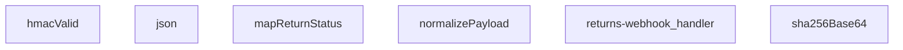

## Genel Bakış

Bu modül, kargo firmalarından gelen iade webhook isteklerini güvenli bir şekilde işleyen bir Supabase Edge Function'dır. HMAC-SHA256 imza doğrulaması ile kaynağın güvenilirliğini teyit ettikten sonra, farklı formatlardaki payload verilerini standart bir forma dönüştürerek uygulama içi iade durum alanlarına eşler. Tek bir HTTP giriş noktası üzerinden tüm iş akışını orkestra eder.

## Fonksiyon Grupları

### Kriptografik Doğrulama
Webhook isteklerinin HMAC-SHA256 imzasını doğrulayarak kaynağın güvenilirliğini teyit eder.
- sha256Base64, hmacValid

### Veri Normalizasyonu ve Haritalama
Kargo firmalarından gelen farklı formatlı payload verilerini ortak bir yapıya dönüştürür ve firma bazlı durum kodlarını uygulama içi standart değerlerle eşler.
- normalizePayload, mapReturnStatus

### Yanıt Oluşturma
HTTP yanıtlarını JSON formatında ve uygun HTTP durum kodlarıyla paketler.
- json

### Ana Webhook İşleyici
HTTP isteğini alarak tüm iş akışını yönetir; imza doğrulaması, payload normalizasyonu ve durum eşleme adımlarını sırasıyla çalıştırarak nihai yanıtı üretir.
- returns-webhook_handler

---

## AXIOMS – Mimari Varsayımlar
Bu modül, kargo firmalarından gelen HTTP webhook isteklerini HMAC-SHA256 ile doğrulayıp standart bir iade verisine dönüştürmek için tasarlanmıştır. Doğru çalışması için aşağıdaki mimari varsayımlar geçerlidir.

[Aksiyom 1]: Eğer HMAC-SHA256 doğrulaması için `secret` (gizli anahtar) yoksa, hiçbir istek güvenlik doğrulamasından geçemez ve tüm istekler reddedilir.
[Aksiyom 2]: Eğer `SKEW_MS` sabiti (imza doğrulamasında izin verilen zaman sapması) tanımlı değilse veya bilinmiyorsa, isteklerin zaman bazlı doğrulaması tutarsız çalışır ve geçerli istekler haksız reddedilebilir.
[Aksiyom 3]: Eğer `mapReturnStatus` fonksiyonuna geçilen `input` parametresi (gelen webhook verisindeki durum alanı) bilinmiyor veya tanımsızsa, iade durumu `undefined` olarak eşlenir ve `setReceived` flag'i ayarlanmaz.
[Aksiyom 4]: Eğer `normalizePayload` fonksiyonu, gelen webhook payload'unu (`obj`) işleyemez veya girdi `unknown` türünde beklenen formatta değilse, veri normalizasyonu başarısız olur ve hata üretilir.
[Aksiyom 5]: Eğer `returns-webhook_handler` tarafından işlenen HTTP isteği (`req`) geçerli bir `Request` nesnesi değilse veya beklenen HTTP metodu/contenido-türü dışındaysa, modül yanıt üretemez.
[Aksiyom 6]: Eğer `sha256Base64` fonksiyonu, HMAC-SHA256 imza hesaplaması için gerekli kriptografik ortamı bulamazsa, imza doğrulaması (`hmacValid`) çalışamaz.
[Aksiyom 7]: Eğer `json` yardımcı fonksiyonu, HTTP yanıtı için geçerli bir `ResponseInit` nesnesi veya gövde içeriği üretilemezse, handler istemciye geçerli bir `Response` döndüremez.
[Aksiyom 8]: Eğer gelen webhook isteğinin `SignatureHeader` (imza başlığı) içeriği `hmacValid` fonksiyonunun beklediği formatı (örn: `sha256=...`) karşılamıyorsa, imza doğrulaması başarısız olur ve istek reddedilir.

---

## FONKSİYON DETAYLARI

### json
**Ne yapar**: Verilen gövdeyi ve yanıt başlatma seçeneklerini kullanarak, JSON formatında içerikli bir HTTP yanıtı oluşturur.
**Nasıl yapar**: Gelen `body` parametresini, iki boşluk girintili bir JSON dizesine dönüştürür. Varsayılan olarak `200` durum kodu ve `application/json; charset=utf-8` içerik türü ile bir `Response` nesnesi döndürür. Eklenen `init` parametresi ile durum kodu ve başlıklar özelleştirilebilir.
**Parametreler**:
- body: unknown — Yanıt gövdesi olarak kullanılacak veri. Herhangi bir tipte olabilir, JSON.stringify ile dizgeye dönüştürülür.
- init: ResponseInit — İsteğe bağlı. Durum kodu (`status`) ve başlıkları (`headers`) belirtmek için kullanılan standart ResponseInit nesnesi.
**Dönüş**: Response — Oluşturulan JSON içerikli HTTP yanıtı.

### hmacValid
**Ne yapar**: Verilen gizli anahtar, ham veri ve imza başlığını kullanarak bir HMAC-SHA256 imzasının geçerliliğini doğrular.
**Nasıl yapar**: Gizli anahtarı bir HMAC-SHA256 anahtarı olarak içe aktarır, ham veri ile bir imza hesaplar ve Base64 ile kodlanmış sonucu, gelen imza başlığındaki `sha256=` ön ekinden arındırılmış değer ile karşılaştırır. Doğrulama başarısız olursa `false` döner.
**Parametreler**:
- secret: string — HMAC imza hesaplamasında kullanılacak gizli anahtar.
- raw: string — İmza hesaplamasına giren ham veri (genellikle request body).
- signatureHeader: string — İsteğe gelen ve `sha256=...` formatında beklenen HMAC imzasını içeren başlık değeri.
**Dönüş**: Promise<boolean> — İmza geçerli ise `true`, değilse veya bir hata oluşursa `false` döner.

### mapReturnStatus
**Ne yapar**: Bir dize giriş değerini tanımlı bir durum nesnesine dönüştürür, nakliyede, teslim alınmış veya iptal edilmiş gibi durumları haritalandırır.
**Nasıl yapar**: Giriş dizesini küçük harfe dönüştürür ve tanımlı anahtar kelimeler listesine göre eşleştirir. 'in_transit' grubu için `in_transit` durumunu, 'received' grubu için `received` durumunu (ve `setReceived` flag'ini `true` yaparak) ve 'cancelled' grubu için `cancelled` durumunu döndürür. Tanınmayan bir değer girilirse, o değerin kendisi durum olarak kullanılır.
**Parametreler**:
- input: string | undefined — Haritalanacak ham durum dizesi.
**Dönüş**: { status?: string; setReceived?: boolean } — Eşlenen durum nesnesi. Giriş boşsa veya tanımsızsa boş bir nesne döner.

### normalizePayload

**Ne yapar**: Gelen ham webhook payload'unu standart bir iç formata dönüştürür. Farklı kaynaklardan gelen ve alan isimleri birbirinden farklı olabilen (örneğin snake_case veya camelCase varyasyonları) veriyi, sistemin beklediği tek tip ve tutarlı bir nesne yapısına normalizasyon yapar.

**Nasıl yapar**: Fonksiyon önce girdinin nesne olup olmadığını kontrol eder; eğer nesne ise `Record<string, unknown>` olarak ele alır, aksi takdirde boş bir nesne kullanır. Ardından dahili bir `pick` yardımcı fonksiyonu tanımlar: bu yardımcı, sıralı olarak verilen anahtar dizisinde ilk bulunan ve `null`/`undefined` olmayan değeri döndürür. Böylece farklı webhook sağlayıcılarının aynı bilgiyi farklı anahtarlarla (örneğin `return_id` vs `returnId` vs `rid`) göndermesi senaryosu sorunsuz şekilde ele alınır. Her bir zorunlu alan (`return_id`, `order_id`, `carrier`, `tracking_number`, `status`, `delivered_at`) için bu `pick` mekanizması çağrılır ve bulunan değer `.toString()` ile string'e çevrilir; hiçbir anahtar eşleşmezse boş string (`''`) varsayılan değer olarak kullanılır.

**Parametreler**:
- `obj`: `unknown` — Webhook'tan gelen ham payload verisi. Herhangi bir tipte olabilir; fonksiyon güvenli şekilde nesne olmayan durumları boş nesne olarak işler.

**Dönüş**: `{ return_id: string; order_id: string; carrier: string; tracking_number: string; status: string; delivered_at: string; }` — Standartlaştırılmış altı alandan oluşan bir nesne. Her alan her zaman bir string değer taşır; ham veride ilgili alan bulunamazsa boş string (`''`) döner.

### sha256Base64
**Ne yapar**: Verilen girdi dizesinin Base64 ile kodlanmış SHA-256 karması değerini hesaplar.
**Nasıl yapar**: Girdi dizesini UTF-8 byte dizisine dönüştürür, crypto.subtle.digest fonksiyonu ile SHA-256 hash'ini hesaplar ve sonucu Base64 formatına kodlayarak döndürür.
**Parametreler**:
- input: string — Hash'lenecek girdi dizesi.
**Dönüş**: Promise<string> — Base64 kodlanmış SHA-256 hash dizesi.

### returns-webhook_handler
**Ne yapar**: Bir iade web kancası (webhook) isteğini işler, HMAC imzasını doğrular, payload'ı normalize eder, durumunu haritalar ve ilgili yanıt veya hata mesajını döndürür.
**Nasıl yapar**: Bu, modülün ana web kancası işleyicisidir. İstek gövdesini HMAC-SHA256 ile doğrulamak için `hmacValid` fonksiyonunu kullanır. Doğrulama başarılı olursa, gövdeyi `normalizePayload` ile standartlaştırıp `mapReturnStatus` ile durumunu haritalar. İşleme mantığı bu fonksiyon gövdesinde tanımlıdır (detaylı docstring verilmemiştir).
**Parametreler**:
- req: Request — İşlenecek gelen HTTP istek nesnesi.
**Dönüş**: Response — İşleme sonucuna göre oluşturulmuş HTTP yanıtı (örn: 200 OK, 401 Unauthorized vb.).

---

## İTHALATLAR (IMPORTS)
- import: ../_shared/tenant_config.ts::resolveTenantId
- import: https://esm.sh/@supabase/supabase-js@2.45.4::createClient

---

## SABİTLER
- **SKEW_MS** (binary_expression) — `5 * 60 * 1000`

---

## AST POINTERS

### [N1_NASIL] AST Pointer: returns-webhook/index.ts::json
- **params**: (body: unknown, init: ResponseInit)
- **ic_degiskenler**:
  - Fonksiyon gövdesinde değişken tanımlanmamıştır, parametreler doğrudan kullanılır
- **Dönüş**: `Response` — JSON.stringify ile formatlanmış body, status ve content-type header'ı ile Response nesnesi

### [N2_NASIL] AST Pointer: returns-webhook/index.ts::hmacValid
- **params**: (secret: string, raw: string, signatureHeader: string)
- **ic_degiskenler**:
  - `key` — crypto.subtle.importKey ile HMAC-SHA256 için oluşturulmuş CryptoKey nesnesi
  - `sigBytes` — crypto.subtle.sign ile HMAC-SHA256 imzasının byte dizisi
  - `computed` — sigBytes'ın base64 string'e çevrilmiş hali
  - `given` — signatureHeader'dan "sha256=" prefix'i kaldırılmış ve trim edilmiş imza
- **Dönüş**: `Promise<boolean>` — imzalar eşleşiyorsa true, değilse veya hata olursa false

### [N3_NASIL] AST Pointer: returns-webhook/index.ts::mapReturnStatus
- **params**: (input?: string)
- **ic_degiskenler**:
  - `s` — input'un小写字evrilmiş hali; input yoksa boş string
- **Dönüş**: `{ status?: string; setReceived?: boolean }` — status alanını map eder, 'received'/'delivered'/'returned'/'completed' geldiğinde setReceived true olur

### [N4_NASIL] AST Pointer: returns-webhook/index.ts::normalizePayload
- **params**: (obj: unknown)
- **ic_degiskenler**:
  - `rec` — obj'nin Record<string,unknown>'a cast edilmiş hali; object değilse boş object
  - `pick` — inner fonksiyon, rec üzerinde key'leri sırayla arar ve ilk non-null değeri döner
- **Dönüş**: `Record<string, string>` — return_id, order_id, carrier, tracking_number, status, delivered_at alanlarını normalize edilmiş formatta döner

### [N5_NASIL] AST Pointer: returns-webhook/index.ts::sha256Base64
- **params**: (input: string)
- **ic_degiskenler**:
  - `bytes` — input'un TextEncoder ile byte dizisine çevrilmiş hali
  - `hash` — crypto.subtle.digest('SHA-256', bytes) ile hesaplanmış hash'in ArrayBuffer sonucu
- **Dönüş**: `Promise<string>` — hash'in base64 string'e çevrilmiş hali

### [N6_NASIL] AST Pointer: returns-webhook/index.ts::returns-webhook_handler
- **params**: (req: Request)
- **ic_degiskenler**:
  - `raw` — req.text() ile okunmuş ham request body string'i
  - `body` — raw'ın JSON.parse edilmiş hali; parse hatası olursa boş object kalır
  - `tenantId` — resolveTenantId(req, body) ile belirlenen kiracı ID'si
  - `secret` — Deno.env.get('RETURNS_WEBHOOK_SECRET') ile alınan HMAC secret anahtarı
  - `token` — Deno.env.get('RETURNS_WEBHOOK_TOKEN') ile alınan webhook token değeri
  - `sign` — req.headers.get('x-signature') ile alınan HMAC imza header'ı
  - `tok` — req.headers.get('x-webhook-token') ile alınan webhook token header'ı
  - `ok` — HMAC veya token doğrulaması başarılıysa true olan boolean flag
  - `tsHeader` — req.headers.get('x-timestamp') veya req.headers.get('x-event-time') ile alınan zaman damgası
  - `t` — tsHeader'dan parse edilmiş epoch ms cinsinden zaman damgası; parse edilemezse 0
  - `SUPABASE_URL` — Deno.env.get('SUPABASE_URL') ile alınan Supabase URL'i
  - `SERVICE_KEY` — Deno.env.get('SUPABASE_SERVICE_ROLE_KEY') ile alınan service role anahtarı
  - `supabase` — createClient(SUPABASE_URL, SERVICE_KEY) ile oluşturulmuş Supabase istemcisi
  - `p` — normalizePayload(body) sonucu normalize edilmiş payload; return_id, order_id, carrier, tracking_number, status, delivered_at alanları
  - `eventId` — req.headers.get('x-id') veya req.headers.get('x-event-id') ile alınan trim edilmiş olay ID'si
  - `returnId` — payload'dan gelen veya order_id ile venthub_returns tablosundan çözümlenen return ID'si
  - `cur` — venthub_returns tablosundan çekilen mevcut return kaydı (id ve status)
  - `curErr` — mevcut return kaydını çekerken oluşan hata nesnesi
  - `mapped` — mapReturnStatus(p.status) sonucu map edilmiş status nesnesi
  - `patch` — venthub_returns tablosuna uygulanacak güncelleme nesnesi (alan-adı:değer)
  - `rank` — status sıralama sözlüğü; requested=0, approved=1, rejected=1, in_transit=2, received=3, refunded=4, cancelled=4
  - `curRank` — mevcut status'un rank sözlüğündeki sırası; bilinmeyen status ise 0
  - `nextRank` — patch status'unun rank sözlüğündeki sırası; belirtilmemişse curRank'a eşit
  - `updated` — update işleminin gerçekleştirilip gerçekleştirilmediğini belirten boolean flag
  - `bodyHash` — raw body'nin sha256Base64() ile hesaplanmış hash'i
  - `nextStatus` — patch status'u veya mevcut status; 'received' olup olmadığı kontrol edilerek email gönderilip gönderilmeyeceği belirlenir
  - `rOrderId` — return kaydından veya payload'dan gelen order_id; fallback olarak kullanılır
  - `reason` — return kaydından çekilen iade sebebi
  - `description` — return kaydından çekilen iade açıklaması
  - `orderNumber` — venthub_orders tablosundan çekilen sipariş numarası
  - `userId` — venthub_orders tablosundan çekilen kullanıcı ID'si
  - `customerEmail` — Supabase Auth Admin API ile çekilen müşteri email adresi
  - `customerName` — Supabase Auth Admin API ile çekilen müşteri tam adı
- **Dönüş**: `Response` — Success durumunda { ok: true, return_id, status }, hata durumunda { error: ... } ile uygun HTTP status kodu. Email bildirimi副作用 olarak tetiklenir.

---

## MERMAID CALL GRAPH

## NODE ID STANDARD

  file: supabase\functions\returns-webhook\index.ts
  function: supabase\functions\returns-webhook\index.ts::json
  function: supabase\functions\returns-webhook\index.ts::hmacValid
  function: supabase\functions\returns-webhook\index.ts::mapReturnStatus
  function: supabase\functions\returns-webhook\index.ts::normalizePayload
  function: supabase\functions\returns-webhook\index.ts::sha256Base64
  function: supabase\functions\returns-webhook\index.ts::returns-webhook_handler

---

## DISA AKTARILANLAR (EXPORTS)
  export: hmacValid
  export: json
  export: mapReturnStatus
  export: normalizePayload
  export: returns-webhook_handler
  export: sha256Base64