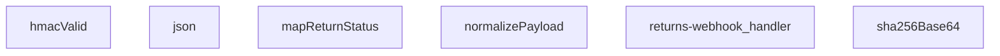

## Genel Bakış
Bu modül, Supabase Edge Function平台上 çalışan bir iade (return) webhook işleyicisidir. Kargo firmalarından gelen iade durum bildirimlerini HMAC-SHA256 imza doğrulamasıyla güvenli bir şekilde alır, farklı kaynaklardan gelen verileri standart bir forma dönüştürür ve uygulama içi durum alanlarına eşler.

## Fonksiyon Grupları
### Yardımcı Yanıt ve Kriptografi
Temel yardımcı işlevleri içerir; JSON formatında HTTP yanıtları oluşturmak ve SHA-256 hash'lerini Base64 formatında üretmek için kullanılır.
- json, sha256Base64

### İmza Doğrulama
Gelen webhook isteklerinin HMAC-SHA256 imzasını doğrulayarak kaynağın güvenilirliğini teyit eder.
- hmacValid

### Veri Normalizasyonu ve Durum Haritalama
Kargo firmalarından gelen farklı formatlardaki payload'ları ortak bir yapıya dönüştürür ve firma bazlı durum kodlarını uygulama içi standart durum değerlerine eşler.
- normalizePayload, mapReturnStatus

### Ana Webhook İşleyici
HTTP isteğini alarak tüm iş akışını orkestra eder; imza doğrulaması, payload normalizasyonu ve durum eşleme adımlarını sırasıyla çalıştırarak JSON yanıtı döndürür.
- returns-webhook_handler

---

## AXIOMS – Mimari Varsayımlar

Bu modül, dış sistemlerden (kargo firmalarından) gelen webhook isteklerini güvenli bir şekilde doğrulayıp işleyen bir Supabase Edge Function modülüdür. Aşağıda, modülün doğru çalışması için gerekli olan temel mimari varsayımlar listelenmektedir.

[Aksiyom 1]: Eğer ortam değişkeni `RETURN_WEBHOOK_SECRET` tanımlı değilse veya boşsa, `hmacValid` fonksiyonu her zaman `false` döner ve tüm istekler reddedilir.

[Aksiyom 2]: Eğer `req.body` (ham istek gövdesi) `text()` fonksiyonu ile okunamazsa (örneğin body önceden tüketilmişse), `returns-webhook_handler` fonksiyonu geçerli bir JSON yanıtı üretemez ve istek işlenemez.

[Aksiyom 3]: Eğer `hmacValid` fonksiyonuna verilen `signatureHeader` parametresi, `sha256=` önekini içermiyorsa, HMAC-SHA256 imza karşılaştırması başarısız olur.

[Aksiyom 4]: Eğer `normalizePayload` fonksiyonuna verilen `obj` parametresi `null` veya `undefined` ise, fonksiyon varsayılan boş bir nesne `{}` döner; ancak `obj` bir nesne (`{}`) türünde değilse (örn: `string`, `number`, `array`), fonksiyon beklenmeyen bir davranış sergileyebilir.

[Aksiyom 5]: Eğer `mapReturnStatus` fonksiyonuna herhangi bir `input` parametresi verilmezse veya fonksiyonun haritasında eşleşmeyen bir değer gelirse, fonksiyon `"unknown"` döner.

[Aksiyom 6]: Eğer `sha256Base64` fonksiyonuna boş bir string (`""`) girilirse, geçerli bir Base64 formatında SHA-256 hash döner; ancak bu hash HMAC hesaplaması için beklenen formata uymaz ve imza doğrulaması başarısız olur.

[Aksiyom 7]: Eğer `json` yardımcı fonksiyonu `ResponseInit` parametresi verilmeden çağrılırsa, varsayılan olarak `Content-Type: application/json` başlığını ayarlar.

[Aksiyom 8]: Eğer `SKEW_MS` sabiti (binary_expression) tanımsız veya geçersiz bir sayısal değerse (örn: `NaN`, `undefined`), isteklerin zaman damgası doğrulaması bozulur ve istekler beklenmeyen şekilde reddedilebilir veya kabul edilebilir.

[Aksiyom 9]: Eğer `returns-webhook_handler` fonksiyonu, `req.body`'den ayrıştırılan JSON payload'u `normalizePayload` fonksiyonuna veremezse (örn: geçersiz JSON), ortak formatta bir veri üretilemez ve iş akışı kesilir.

---

## FONKSİYON DETAYLARI

### json
**Ne yapar**: Verilen gövdeyi ve yanıt başlatma seçeneklerini kullanarak, JSON formatında içerikli bir HTTP yanıtı oluşturur.
**Nasıl yapar**: Gelen `body` parametresini, iki boşluk girintili bir JSON dizesine dönüştürür. Varsayılan olarak `200` durum kodu ve `application/json; charset=utf-8` içerik türü ile bir `Response` nesnesi döndürür. Eklenen `init` parametresi ile durum kodu ve başlıklar özelleştirilebilir.
**Parametreler**:
- body: unknown — Yanıt gövdesi olarak kullanılacak veri. Herhangi bir tipte olabilir, JSON.stringify ile dizgeye dönüştürülür.
- init: ResponseInit — İsteğe bağlı. Durum kodu (`status`) ve başlıkları (`headers`) belirtmek için kullanılan standart ResponseInit nesnesi.
**Dönüş**: Response — Oluşturulan JSON içerikli HTTP yanıtı.

### hmacValid
**Ne yapar**: Verilen gizli anahtar, ham veri ve imza başlığını kullanarak bir HMAC-SHA256 imzasının geçerliliğini doğrular.
**Nasıl yapar**: Gizli anahtarı bir HMAC-SHA256 anahtarı olarak içe aktarır, ham veri ile bir imza hesaplar ve Base64 ile kodlanmış sonucu, gelen imza başlığındaki `sha256=` ön ekinden arındırılmış değer ile karşılaştırır. Doğrulama başarısız olursa `false` döner.
**Parametreler**:
- secret: string — HMAC imza hesaplamasında kullanılacak gizli anahtar.
- raw: string — İmza hesaplamasına giren ham veri (genellikle request body).
- signatureHeader: string — İsteğe gelen ve `sha256=...` formatında beklenen HMAC imzasını içeren başlık değeri.
**Dönüş**: Promise<boolean> — İmza geçerli ise `true`, değilse veya bir hata oluşursa `false` döner.

### mapReturnStatus
**Ne yapar**: Bir dize giriş değerini tanımlı bir durum nesnesine dönüştürür, nakliyede, teslim alınmış veya iptal edilmiş gibi durumları haritalandırır.
**Nasıl yapar**: Giriş dizesini küçük harfe dönüştürür ve tanımlı anahtar kelimeler listesine göre eşleştirir. 'in_transit' grubu için `in_transit` durumunu, 'received' grubu için `received` durumunu (ve `setReceived` flag'ini `true` yaparak) ve 'cancelled' grubu için `cancelled` durumunu döndürür. Tanınmayan bir değer girilirse, o değerin kendisi durum olarak kullanılır.
**Parametreler**:
- input: string | undefined — Haritalanacak ham durum dizesi.
**Dönüş**: { status?: string; setReceived?: boolean } — Eşlenen durum nesnesi. Giriş boşsa veya tanımsızsa boş bir nesne döner.

### normalizePayload
**Ne yapar**: Farklı isimlendirmelerle gelen girdi nesnesini standart, tek bir şemaya dönüştürür.
**Nasıl yapar**: Girdi nesnesinden `_return_id`, `order_id`, `carrier`, `tracking_number`, `status` ve `delivered_at` alanlarını çeşitli alternatif anahtar isimleri (`returnId`, `orderId`, `provider`, vb.) kullanarak arar ve bulduğu ilk geçerli değeri alır. Her alanı string'e dönüştürerek döndürür.
**Parametreler**:
- obj: unknown — Normalize edilecek girdi nesnesi. Obje değilse boş bir nesne muamelesi görür.
**Dönüş**: { _return_id: string; order_id: string; carrier: string; tracking_number: string; status: string; delivered_at: string } — Standart alan adlarına sahip normalize edilmiş nesne.

### sha256Base64
**Ne yapar**: Verilen girdi dizesinin Base64 ile kodlanmış SHA-256 karması değerini hesaplar.
**Nasıl yapar**: Girdi dizesini UTF-8 byte dizisine dönüştürür, crypto.subtle.digest fonksiyonu ile SHA-256 hash'ini hesaplar ve sonucu Base64 formatına kodlayarak döndürür.
**Parametreler**:
- input: string — Hash'lenecek girdi dizesi.
**Dönüş**: Promise<string> — Base64 kodlanmış SHA-256 hash dizesi.

### returns-webhook_handler
**Ne yapar**: Bir iade web kancası (webhook) isteğini işler, HMAC imzasını doğrular, payload'ı normalize eder, durumunu haritalar ve ilgili yanıt veya hata mesajını döndürür.
**Nasıl yapar**: Bu, modülün ana web kancası işleyicisidir. İstek gövdesini HMAC-SHA256 ile doğrulamak için `hmacValid` fonksiyonunu kullanır. Doğrulama başarılı olursa, gövdeyi `normalizePayload` ile standartlaştırıp `mapReturnStatus` ile durumunu haritalar. İşleme mantığı bu fonksiyon gövdesinde tanımlıdır (detaylı docstring verilmemiştir).
**Parametreler**:
- req: Request — İşlenecek gelen HTTP istek nesnesi.
**Dönüş**: Response — İşleme sonucuna göre oluşturulmuş HTTP yanıtı (örn: 200 OK, 401 Unauthorized vb.).

---

## SABİTLER
- **SKEW_MS** (binary_expression) — `5 * 60 * 1000`

---

## AST POINTERS

### [N1_NASIL] AST Pointer: supabase/functions/returns-webhook/index.ts::json
- **params**: `body: unknown`, `init: ResponseInit` (varsayılan `{}`)
- **ic_degiskenler**:
  _(değişken yok — doğrudan return içinde inline kullanılır)_
- **Dönüş**: `Response` — JSON.stringify ile serialize edilmiş body, status ve content-type header'ı ile

### [N2_NASIL] AST Pointer: supabase/functions/returns-webhook/index.ts::hmacValid
- **params**: `secret: string`, `raw: string`, `signatureHeader: string`
- **ic_degiskenler**:
  - `key` — `crypto.subtle.importKey` ile oluşturulmuş HMAC-SHA256 anahtarı, raw byte olarak import edilir
  - `sigBytes` — `crypto.subtle.sign` ile HMAC hesabından dönen imza byte dizisi
  - `computed` — `sigBytes`'ın base64'e çevrilmiş hali (btoa ile), hesaplanan imza
  - `given` — Header'dan gelen imzanın `sha256=` prefix'i temizlenmiş hali, karşılaştırma için hazırlanır
- **Dönüş**: `Promise<boolean>` — verilen imza ile hesaplanan imza eşleşirse `true`, hata olursa veya eşleşmezse `false`

### [N3_NASIL] AST Pointer: supabase/functions/returns-webhook/index.ts::mapReturnStatus
- **params**: `input?: string`
- **ic_degiskenler**:
  - `s` — `input`'ın küçük harfe çevrilmiş hali; boş/null gelirse boş string fallback ile normalize edilir
- **Dönüş**: `{ status?: string; setReceived?: boolean }` — transit durumları `'in_transit'`, received/delivered/returned/completed ise `'received'` (+ `setReceived: true`), cancelled/canceled ise `'cancelled'`, aksi halde ham değer

### [N4_NASIL] AST Pointer: supabase/functions/returns-webhook/index.ts::normalizePayload
- **params**: `obj: unknown`
- **ic_degiskenler**:
  - `rec` — `obj`'nin `Record<string, unknown>` olarak cast edilmiş hali; object değilse boş obje `{` fallback
  - `pick` — inner helper fonksiyon; verilen anahtar listesinden ilk tanımlı (null olmayan) değeri döndürür; payload'taki farklı isimlendirmeleri tekilleştirir
- **Dönüş**: `{ _return_id, order_id, carrier, tracking_number, status, delivered_at }` — tüm alanlar string, pick ile çoklu isim desteği (ör. `returnId`/`_return_id`/`rid` tek `return_id`'ye normalize)

### [N5_NASIL] AST Pointer: supabase/functions/returns-webhook/index.ts::sha256Base64
- **params**: `input: string`
- **ic_degiskenler**:
  - `bytes` — `TextEncoder().encode(input)` ile string'ten Uint8Array'e çevrilmiş veri
  - `hash` — `crypto.subtle.digest('SHA-256', bytes)` ile hesaplanmış 32 byte'lık hash sonucu
- **Dönüş**: `Promise<string>` — hash'in base64'e çevrilmiş hali (body integrity kontrolü için kullanılır)

### [N6_NASIL] AST Pointer: supabase/functions/returns-webhook/index.ts::(anonymous async handler)
- **params**: `req: Request`
- **ic_degiskenler**:
  - `raw` — `req.text()` ile okunan isteğin ham gövde metni; HMAC hesaplamasında ve body parse'da kullanılır
  - `body` — `JSON.parse(raw)` ile parse edilmiş istek gövdesi; başarısız olursa boş obje `{` kalır
  - `secret` — `Deno.env.get('RETURNS_WEBHOOK_SECRET')` ile alınan webhook HMAC gizli anahtarı
  - `token` — `Deno.env.get('RETURNS_WEBHOOK_TOKEN')` ile alınan fallback token değeri
  - `sign` — `req.headers.get('x-signature')` ile gelen HMAC imza header'ı
  - `tok` — `req.headers.get('x-webhook-token')` ile gelen token header'ı
  - `ok` — kimlik doğrulama bayrağı; HMAC veya token ile `true` olur
  - `tsHeader` — `x-timestamp` veya `x-event-time` header'ından alınan zaman damgası string'i; replay koruması için zorunlu
  - `t` — `tsHeader`'ın parse edilmiş milisaniye cinsinden zaman damgası; epoch ms veya ISO string desteklenir
  - `SUPABASE_URL` — `Deno.env.get('SUPABASE_URL')` Supabase proje URL'i; client oluşturma ve edge function çağrısı için
  - `SERVICE_KEY` — `Deno.env.get('SUPABASE_SERVICE_ROLE_KEY')` servis rolü anahtarı; yetkili DB ve API erişimi için
  - `supabase` — `createClient(SUPABASE_URL, SERVICE_KEY)` ile oluşturulmuş Supabase istemcisi
  - `p` — `normalizePayload(body)` ile normalize edilmiş payload; `_return_id`, `order_id`, `carrier`, `tracking_number`, `status`, `ivered_at` alanlarını içerir
  - `eventId` — `x-id` veya `x-event-id` header'ından alınan tekillik kontrol (dedup) ID'si; boşsa dedup atlanır
  - `returnId` — `p._return_id`'den çözülen veya `order_id` ile `venthub_returns` tablosundan bulunan geri dönüş kaydı ID'si
  - `cur` — `supabase.from('venthub_returns').select('id,status')...single()` sonucu; mevcut geri dönüş kaydının `id` ve `status` değerleri
  - `curErr` — `cur` sorgusundan dönen hata nesnesi; kayıp bulunamazsa 404 döner
  - `mapped` — `mapReturnStatus(p.status)` çağrısının sonucu; `status` ve opsiyonel `setReceived` alanlarını içerir
  - `patch` — DB güncelleme için hazırlanmış `Record<string, unknown>` nesnesi; sadece `mapped.status` tanımlıysa `status` alanı eklenir
  - `rank` — Durum sıralama haritası `{ requested:0, approved:1, rejected:1, in_transit:2, received:3, refunded:4, cancelled:4 }`; geriye doğru durum değişimini engellemek için
  - `curRank` — Mevcut durumun `rank` haritasındaki sıralama değeri; bilinmeyen durum ise `0`
  - `nextRank` — Patch içindeki yeni durumun sıralama değeri; patch yoksa `curRank`'e eşit
  - `updated` — DB güncelleme yapılıp yapılmadığını belirten boolean bayrak
  - `updErr` — `supabase.from('venthub_returns').update(patch)` sorgusundan dönen hata; varsa 500 döner
  - `bodyHash` — `sha256Base64(raw)` ile hesaplanmış istek gövdesinin SHA-256 hash'i; audit kaydı için
  - `nextStatus` — Uygulanacak son durum string'i; `patch['status']` varsa o, yoksa `cur.status`
  - `rOrderId` — Return details sorgusundan alınan veya `p.order_id`'den gelen sipariş ID'si; order ve user bilgisi yüklemek için
  - `reason` — `venthub_returns` tablosundan çekilen iade nedeni
  - `description` — `venthub_returns` tablosundan çekilen iade açıklaması
  - `orderNumber` — `venthub_orders` tablosundan çekilen sipariş numarası; müşteri bildirimi için
  - `userId` — `venthub_orders` tablosundan çekilen kullanıcı ID'si; Auth API ile email/name yüklemek için
  - `customerEmail` — Supabase Auth Admin API'den çekilen müşteri email adresi; bildirim e-postası alıcısı
  - `customerName` — Supabase Auth Admin API'den çekilen müşteri tam adı (`full_name` veya `name`); bildirim e-postası kişiselleştirmesi için
  - `r` — `venthub_returns` tablosuna yapılan `fetch` ile dönen Response; return detayları (order_id, reason, description) için
  - `arr` — `r.json()`'dan parse edilmiş dizi; return details satırları
  - `row` — `arr[0]` referansı; return details kaydı (order_id, reason, description alanı)
  - `o` — `venthub_orders` tablosuna yapılan `fetch` ile dönen Response; sipariş detayları için
  - `arr` (yeniden) — `o.json()`'dan parse edilmiş dizi; order details satırları
  - `row` (yeniden) — `arr[0]` referansı; order details kaydı (order_number, user_id alanı)
  - `u` — Supabase Auth Admin API (`/auth/v1/admin/users/`) çağrısıyla dönen Response; kullanıcı bilgileri için
  - `ju` — `u.json()`'dan parse edilmiş `UserResponse | null` nesnesi; email ve user_metadata içerir
  - `meta` — `ju.user_metadata`'den türetilmiş `UserMetadata` nesnesi; `full_name` veya `name` alanı
  - `_e` — dış try-catch'te yakalanan hata nesnesi; loglama ve error response için
- **Dönüş**: `Response` — İşlem sonucuna göre:
  - `405`: method POST değilse
  - `401`: HMAC/token doğrulama başarısızsa veya zaman damgası eksik/geçersizse
  - `500`: Supabase config eksikse veya DB güncelleme hatası olursa
  - `400`: `_return_id` çözümlenemezse
  - `404`: return kaydı bulunamazsa
  - `200`: `{ ok: true, _return_id, status }` başarılı yanıt; opsiyonel olarak `{ duplicate: true }` veya `{ unchanged: true, reason: 'regression_blocked' }`

---

## MERMAID CALL GRAPH

## NODE ID STANDARD

  file: supabase\functions\returns-webhook\index.ts
  function: supabase\functions\returns-webhook\index.ts::json
  function: supabase\functions\returns-webhook\index.ts::hmacValid
  function: supabase\functions\returns-webhook\index.ts::mapReturnStatus
  function: supabase\functions\returns-webhook\index.ts::normalizePayload
  function: supabase\functions\returns-webhook\index.ts::sha256Base64
  function: supabase\functions\returns-webhook\index.ts::returns-webhook_handler

---

## DISA AKTARILANLAR (EXPORTS)
  export: hmacValid
  export: json
  export: mapReturnStatus
  export: normalizePayload
  export: returns-webhook_handler
  export: sha256Base64