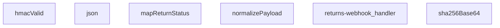

## Genel Bakış
Bu modül, iade kargo webhook'larını işleyen bir Supabase Edge Function'dır. Gelen kargo durum güncellemelerini doğrular, farklı kargo firmalarının payload formatlarını standart bir yapıya dönüştürür ve ilgili iade kaydını günceller. HMAC-SHA256 imza doğrulaması, durum haritalama ve standart yanıt oluşturma gibi yardımcı işlemleri içerir.

## Fonksiyon Grupları

### Standart Yardımcılar
JSON yanıtı oluşturma ve SHA-256 hash hesaplama gibi temel yardımcı işlevleri sağlar.
- json, sha256Base64

### İmza Doğrulama
Gelen webhook isteğinin HMAC-SHA256 imzasını doğrulayarak güvenlik kontrolü yapar.
- hmacValid

### Veri Dönüşümü
Kargo firmasının durum kodlarını iç durum kodlarına çevirir ve farklı payload formatlarını standart bir yapıya dönüştürür.
- mapReturnStatus, normalizePayload

### Ana Webhook İşleyici
Gelen HTTP isteklerini kabul eder, imza doğrulamasını başlatır, payload dönüşümlerini yapar ve iade kaydını güncellemek üzere gerekli adımları yönetir.
- returns-webhook_handler

---

## AXIOMS – Mimari Varsayımlar
Bu modül için özel aksiyom tanımlanmamıştır.

---

## FONKSIYON DETAYLARI

### json
**Ne yapar**: Bir HTTP yanıtı oluşturmak için kullanılan yardımcı fonksiyondur. Gövde olarak herhangi bir veri tipini (`unknown`) ve yanıt başlıkları/statü gibi yapılandırmaları (`ResponseInit`) alır.
**Nasıl yapar**: Çağrıldığında `body` parametresini ve `init` parametresini kullanarak bir `Response` nesnesi oluşturur. Detaylı iç mantık belirtilmemiştir; muhtemelen `new Response(JSON.stringify(body), init)` biçiminde çalışır.
**Parametreler**:
- `body: unknown` — Yanıtın gövdesi olarak gönderilecek JSON serileştirilebilir veri.
- `init: ResponseInit` — Yanıtın durum kodu, başlıklar gibi HTTP yanıt yapılandırmasını içeren nesne.
**Dönüş**: Belirtilmemiş (muhtemelen `Response`).

### hmacValid
**Ne yapar**: Webhook isteğinin HMAC imzasını doğrular. Verilen gizli anahtar, ham istek gövdesi ve `signature` başlık değerini kullanarak imzanın geçerli olup olmadığını belirler.
**Nasıl yapar**: `secret` anahtarı ve `raw` gövde ile HMAC-SHA256 hesaplar, elde edilen imzayı `signatureHeader` değeriyle karşılaştırır. Eşleşme durumunda `true`, aksi halde `false` döndüren bir `Promise` döner.
**Parametreler**:
- `secret: string` — HMAC hesaplamasında kullanılan gizli anahtar.
- `raw: string` — Doğrulanacak isteğin ham gövde metni.
- `signatureHeader: string` — İstek başlığında bulunan imza değeri (genellikle `x-signature`).
**Dönüş**: `Promise<boolean>` — İmza geçerli ise `true`, değilse `false`.

### mapReturnStatus
**Ne yapar**: Girdi olarak alınan iade durumu metnini (`input`) normalize edilmiş bir durum nesnesine dönüştürür. İsteğe bağlı olarak `setReceived` bayrağını da belirler.
**Nasıl yapar**: `input` değerine göre bir eşleme (switch-case veya map) yaparak `status` alanını belirler. Eğer `input` belirtilmemişse veya tanımlı değilse varsayılan bir durum atanabilir. `setReceived` bayrağı belirli durumlarda `true` olarak ayarlanır.
**Parametreler**:
- `input?: string` — İşlenecek iade durumu metni (opsiyonel).
**Dönüş**: `{ status?: string; setReceived?: boolean }` — `status` alanı eşlenmiş durum değerini, `setReceived` ise ilgili bayrağı içerir.

### normalizePayload
**Ne yapar**: Webhook'tan gelen ham payload'u (genellikle bir nesne) tutarlı bir formata dönüştürür veya içindeki alanları temizler/normalize eder.
**Nasıl yapar**: `obj` parametresini alır, tipine ve yapısına göre dönüşümler uygular. Örneğin, tarih alanlarını standardize edebilir, gereksiz alanları kaldırabilir veya alan adlarını map edebilir. Detaylı mantık belirtilmemiştir.
**Parametreler**:
- `obj: unknown` — Normalize edilecek ham payload nesnesi.
**Dönüş**: Belirtilmemiş (muhtemelen `void` veya normalize edilmiş nesne).

### sha256Base64
**Ne yapar**: Verilen bir metin girdisinin SHA-256 hash'ini hesaplar ve sonucu Base64 formatında döndürür.
**Nasıl yapar**: Web Crypto API veya benzeri bir kriptografik kütüphane kullanarak `input` string'inin SHA-256 özetini çıkarır, ardından bu ham baytları Base64 kodlu bir string'e dönüştürür. Asenkron bir şekilde çalışır.
**Parametreler**:
- `input: string` — Hash'lenecek metin.
**Dönüş**: `Promise<string>` — Base64 kodlanmış SHA-256 hash değeri.

### returns-webhook_handler
**Ne yapar**: Gelen webhook isteklerini işleyen ana HTTP handler fonksiyonudur. Bir `Request` nesnesi alır ve uygun bir `Response` döndürür.
**Nasıl yapar**: İsteğin HTTP metodunu, yolunu ve başlıklarını kontrol eder. İçeride `hmacValid`, `normalizePayload`, `mapReturnStatus` gibi yardımcı fonksiyonları kullanarak isteği doğrular, payload'u işler ve bir iade durumu belirler. Son olarak `json` fonksiyonu ile yanıt oluşturur.
**Parametreler**:
- `req: Request` — Gelen HTTP istek nesnesi (tüm başlık, gövde ve diğer bilgileri içerir).
**Dönüş**: `Response` — İşlem sonucuna göre döndürülen HTTP yanıtı (genellikle JSON formatında).

---

## AST POINTERS

### [N1_NASIL] AST Pointer: C:\Users\alize\venthub-hvac\supabase\functions\returns-webhook\index.ts::json
- **params**: (body: unknown, init: ResponseInit = {})
- **ic_degiskenler**:
  - `init` — `ResponseInit` nesnesi, isteğe bağlı; `status` ve `headers` alanları içerir.
- **Dönüş**: `Response` – JSON stringiyle oluşturulan HTTP yanıtı.

### [N2_NASIL] AST Pointer: C:\Users\alize\venthub-hvac\supabase\functions\returns-webhook\index.ts::hmacValid
- **params**: (secret: string, raw: string, signatureHeader: string)
- **ic_degiskenler**:
  - `key` — `CryptoKey` nesnesi, HMAC için içe aktarılan gizli anahtar.
  - `sigBytes` — `ArrayBuffer`, `raw` verisinin HMAC imzası.
  - `computed` — `string`, imzanın Base64 kodlu temsili.
  - `given` — `string`, `signatureHeader` içinden “sha256=” öneki kaldırılmış değer.
- **Dönüş**: `Promise<boolean>` – imza eşleşiyorsa `true`, hata durumunda `false`.

### [N3_NASIL] AST Pointer: C:\Users\alize\venthub-hvac\supabase\functions\returns-webhook\index.ts::mapReturnStatus
- **params**: (input?: string)
- **ic_degiskenler**:
  - `s` — `string`, `input`’un küçük harfe dönüştürülmüş ve boşlukları temizlenmiş hali.
- **Dönüş**: `{ status?: string; setReceived?: boolean }` – haritalanmış durum ve isteğe bağlı `setReceived` bayrağı.

### [N4_NASIL] AST Pointer: C:\Users\alize\venthub-hvac\supabase\functions\returns-webhook\index.ts::normalizePayload
- **params**: (obj: unknown)
- **ic_degiskenler**:
  - `rec` — `Record<string, unknown>`; `obj` nesnesi ise doğrudan, değilse boş obje.
  - `pick` — `(…keys: string[]) => unknown` fonksiyonu; verilen anahtarlar içinde ilk mevcut ve null olmayan değeri döndürür.
- **Dönüş**: `yok` – normalleştirilmiş alanları içeren obje döndürür (fonksiyon imzasında `yok` belirtilmiş, ancak gerçekte obje döner).

### [N5_NASIL] AST Pointer: C:\Users\alize\venthub-hvac\supabase\functions\returns-webhook\index.ts::sha256Base64
- **params**: (input: string)
- **ic_degiskenler**:
  - `bytes` — `Uint8Array`, `input` metninin UTF‑8 kodlaması.
  - `hash` — `ArrayBuffer`, SHA‑256 hash sonucu.
- **Dönüş**: `Promise<string>` – hash’in Base64 kodlu temsili.

### [N6_NASIL] AST Pointer: C:\Users\alize\venthub-hvac\supabase\functions\returns-webhook\index.ts::(anonymous handler)
- **params**: (req: Request)
- **ic_degiskenler**:
  - `raw` — `string`, istek gövdesinin ham metni.
  - `body` — `unknown`, `raw` JSON olarak ayrıştırılamazsa boş obje, aksi takdirde parse edilmiş veri.
  - `secret` — `string`, ortam değişkeni `RETURNS_WEBHOOK_SECRET` değeri.
  - `token` — `string`, ortam değişkeni `RETURNS_WEBHOOK_TOKEN` değeri.
  - `sign` — `string`, istek başlığındaki `x-signature` değeri.
  - `tok` — `string`, istek başlığındaki `x-webhook-token` değeri.
  - `ok` — `boolean`, kimlik doğrulama sonucunu tutar.
  - `SUPABASE_URL` — `string | undefined`, ortam değişkeni.
  - `SERVICE_KEY` — `string | undefined`, ortam değişkeni.
  - `supabase` — Supabase istemcisi, `createClient` ile oluşturulur.
  - `p` — `{ _return_id?: string; order_id?: string; carrier?: string; tracking_number?: string; status?: string; delivered_at?: string }`, normalizePayload sonucu.
  - `eventId` — `string`, `x-id` veya `x-event-id` başlıklarından alınan ve kırpılmış değer.
  - `returnId` — `string`, `_return_id` ya da sipariş‑takip‑numarasıyla bulunmaya çalışılan dönüş kimliği.
  - `cur` — `{ id: any; status: any } | undefined`, mevcut dönüş kaydı.
  - `curErr` — `any`, mevcut kayıt sorgusundaki hata.
  - `mapped` — `{ status?: string; setReceived?: boolean }`, `mapReturnStatus(p.status)` sonucu.
  - `patch` — `Record<string, unknown>`, güncellenecek alanları tutar.
  - `rank` — `Record<string, number>`, durumların sıralama ağırlıkları.
  - `curRank` — `number`, mevcut durumun ağırlığı.
  - `nextRank` — `number`, yeni durumun ağırlığı.
  - `updated` — `boolean`, veritabanı güncellemesinin başarılı olup olmadığını gösterir.
  - `bodyHash` — `string`, `raw` verisinin SHA‑256 Base64 hash’i.
  - `nextStatus` — `string`, işlem sonrası geçerli durum.
  - `rOrderId` — `string`, dönüş kaydından elde edilen veya fallback olarak kullanılan sipariş kimliği.
  - `reason` — `string`, dönüş kaydından alınan neden açıklaması.
  - `description` — `string`, dönüş kaydından alınan açıklama.
  - `orderNumber` — `string`, sipariş kaydından alınan sipariş numarası.
  - `userId` — `string`, sipariş kaydından alınan kullanıcı kimliği.
  - `customerEmail` — `string`, Auth Admin API’den alınan kullanıcı e‑posta adresi.
  - `customerName` — `string`, Auth Admin API’den alınan kullanıcı adı.
  - `row` — `any`, fetch sonuçlarından elde edilen tek satır (örnek: `row[0]`, `row[1]` gibi alt‑elemanlar ayrı değişken olarak görülmez; burada satır nesnesi olarak temsil edilir).
- **Dönüş**: `Response` – işlem sonucunu JSON olarak dönen HTTP yanıtı; başarılı olduğunda `{ ok: true, _return_id, status }`, hata durumlarında uygun hata mesajı ve HTTP durumu.

---

## MERMAID CALL GRAPH

## NODE ID STANDARD

  file: supabase\functions\returns-webhook\index.ts
  function: supabase\functions\returns-webhook\index.ts::json
  function: supabase\functions\returns-webhook\index.ts::hmacValid
  function: supabase\functions\returns-webhook\index.ts::mapReturnStatus
  function: supabase\functions\returns-webhook\index.ts::normalizePayload
  function: supabase\functions\returns-webhook\index.ts::sha256Base64
  function: supabase\functions\returns-webhook\index.ts::returns-webhook_handler

---

## DISA AKTARILANLAR (EXPORTS)
  export: hmacValid
  export: json
  export: mapReturnStatus
  export: normalizePayload
  export: returns-webhook_handler
  export: sha256Base64