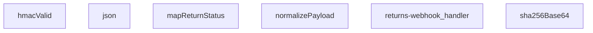

## Genel Bakış
Bu modül, kargo firmalarından gelen iade webhook isteklerini güvenli bir şekilde işleyen bir Supabase Edge Function'dır. HMAC-SHA256 imza doğrulaması ile kaynağın güvenilirliğini teyit ederek, farklı formatlardaki payload verilerini standart bir forma dönüştürür ve uygulama içi iade durum alanlarına eşler. Tek bir HTTP giriş noktası üzerinden tüm iş akışını orkestra eder.

## Fonksiyon Grupları
### Kriptografik Doğrulama
Webhook isteklerinin HMAC-SHA256 imzasını doğrulayarak kaynağın güvenilirliğini ve veri bütünlüğünü teyit eder.
- sha256Base64, hmacValid

### Veri Normalizasyonu ve Haritalama
Kargo firmalarından gelen farklı formatlı payload verilerini ortak bir yapıya dönüştürür ve firma bazlı durum kodlarını uygulama içi standart değerlerle eşler.
- normalizePayload, mapReturnStatus

### Yanıt Oluşturma
HTTP yanıtlarını JSON formatında ve uygun HTTP durum kodlarıyla paketler.
- json

### Ana Webhook İşleyici
HTTP isteğini alarak tüm iş akışını yönetir; imza doğrulaması, payload normalizasyonu ve durum eşleme adımlarını sırasıyla çalıştırarak nihai yanıtı üretir.
- returns-webhook_handler

---

## AXIOMS – Mimari Varsayımlar

Bu modül, kargo firmalarından gelen iade webhook isteklerini HMAC-SHA256 imza doğrulamasıyla güvenli bir şekilde işler, payload'ları normalize eder ve durum eşlemesi yapar.

[Aksiyom 1]: Eğer HMAC_SECRET_KEY ortam değişkeni yoksa veya boşsa, `hmacValid` fonksiyonu HMAC-SHA256 imza doğrulamasını doğru şekilde gerçekleştirilemez ve imza karşılaştırması tutarsız sonuç verebilir.

[Aksiyom 2]: Eğer HTTP isteğinde `X-Hub-Signature-256` header'ı yoksa veya boşsa, `hmacValid` fonksiyonu `signatureHeader` parametresine boş string olarak işlenir ve HMAC doğrulaması başarısız olur.

[Aksiyom 3]: Eğer `SKEW_MS` sabiti tanımlı değilse veya negatif bir değer alırsa, zaman damgası doğrulamasında (varsa) tolerans penceresi hatalı çalışır, geçerli istekler reddedilebilir veya geçersiz istekler kabul edilebilir.

[Aksiyom 4]: Eğer HTTP istek body'si geçerli bir JSON içermiyorsa (örn: bozuk JSON, boş body, veya non-JSON format), `normalizePayload` fonksiyonu veya `returns-webhook_handler` içindeki JSON parsing hata fırlatır.

[Aksiyom 5]: Eğer `mapReturnStatus` fonksiyonuna beklenmeyen veya eşlenmemiş bir `input` değeri verilirse, dönen `{ status, setReceived }` nesnesinde `status` alanı `undefined` olur.

[Aksiyom 6]: Eğer istek POST methoduyla gelmiyorsa, `returns-webhook_handler` fonksiyonu 405 Method Not Allowed yanıtı döndürmelidir (bu, handler'ın HTTP method kontrolüne dayalı bir varsayımdır).

[Aksiyom 7]: Eğer `normalizePayload` fonksiyonuna `null` veya `undefined` bir `obj` parametresi verilirse, fonksiyonun davranışı tanımsızdır (beklenen: null değerlerin korunması veya boş obje dönülmesi).

[Aksiyom 8]: Eğer `sha256Base64` fonksiyonuna boş string (`""`) girilirse, boş bir Base64 hash döndürülür (SHA256 boş string için tanımlı bir çıktı üretir).

[Aksiyom 9]: Eğer HMAC secret'ı ve imza doğru eşleşmiyorsa (geçersiz imza), `returns-webhook_handler` fonksiyonu 401 Unauthorized yanıtı döndürmelidir ve payload işlenmez.

[Aksiyom 10]: Eğer payload'da zorunlu alanlar eksikse (örn: `return_id`, `status` gibi alanlar), `normalizePayload` eksik alanları `undefined` olarak bırakır ve sonraki aşama bu alanları işleyemeyebilir.

---

## FONKSİYON DETAYLARI

### json
**Ne yapar**: Verilen gövdeyi ve yanıt başlatma seçeneklerini kullanarak, JSON formatında içerikli bir HTTP yanıtı oluşturur.
**Nasıl yapar**: Gelen `body` parametresini, iki boşluk girintili bir JSON dizesine dönüştürür. Varsayılan olarak `200` durum kodu ve `application/json; charset=utf-8` içerik türü ile bir `Response` nesnesi döndürür. Eklenen `init` parametresi ile durum kodu ve başlıklar özelleştirilebilir.
**Parametreler**:
- body: unknown — Yanıt gövdesi olarak kullanılacak veri. Herhangi bir tipte olabilir, JSON.stringify ile dizgeye dönüştürülür.
- init: ResponseInit — İsteğe bağlı. Durum kodu (`status`) ve başlıkları (`headers`) belirtmek için kullanılan standart ResponseInit nesnesi.
**Dönüş**: Response — Oluşturulan JSON içerikli HTTP yanıtı.

### hmacValid
**Ne yapar**: Verilen gizli anahtar, ham veri ve imza başlığını kullanarak bir HMAC-SHA256 imzasının geçerliliğini doğrular.
**Nasıl yapar**: Gizli anahtarı bir HMAC-SHA256 anahtarı olarak içe aktarır, ham veri ile bir imza hesaplar ve Base64 ile kodlanmış sonucu, gelen imza başlığındaki `sha256=` ön ekinden arındırılmış değer ile karşılaştırır. Doğrulama başarısız olursa `false` döner.
**Parametreler**:
- secret: string — HMAC imza hesaplamasında kullanılacak gizli anahtar.
- raw: string — İmza hesaplamasına giren ham veri (genellikle request body).
- signatureHeader: string — İsteğe gelen ve `sha256=...` formatında beklenen HMAC imzasını içeren başlık değeri.
**Dönüş**: Promise<boolean> — İmza geçerli ise `true`, değilse veya bir hata oluşursa `false` döner.

### mapReturnStatus
**Ne yapar**: Bir dize giriş değerini tanımlı bir durum nesnesine dönüştürür, nakliyede, teslim alınmış veya iptal edilmiş gibi durumları haritalandırır.
**Nasıl yapar**: Giriş dizesini küçük harfe dönüştürür ve tanımlı anahtar kelimeler listesine göre eşleştirir. 'in_transit' grubu için `in_transit` durumunu, 'received' grubu için `received` durumunu (ve `setReceived` flag'ini `true` yaparak) ve 'cancelled' grubu için `cancelled` durumunu döndürür. Tanınmayan bir değer girilirse, o değerin kendisi durum olarak kullanılır.
**Parametreler**:
- input: string | undefined — Haritalanacak ham durum dizesi.
**Dönüş**: { status?: string; setReceived?: boolean } — Eşlenen durum nesnesi. Giriş boşsa veya tanımsızsa boş bir nesne döner.

### normalizePayload

**Ne yapar**: Gelen ham webhook payload'unu standart bir iç formata dönüştürür. Farklı kaynaklardan gelen ve alan isimleri birbirinden farklı olabilen (örneğin snake_case veya camelCase varyasyonları) veriyi, sistemin beklediği tek tip ve tutarlı bir nesne yapısına normalizasyon yapar.

**Nasıl yapar**: Fonksiyon önce girdinin nesne olup olmadığını kontrol eder; eğer nesne ise `Record<string, unknown>` olarak ele alır, aksi takdirde boş bir nesne kullanır. Ardından dahili bir `pick` yardımcı fonksiyonu tanımlar: bu yardımcı, sıralı olarak verilen anahtar dizisinde ilk bulunan ve `null`/`undefined` olmayan değeri döndürür. Böylece farklı webhook sağlayıcılarının aynı bilgiyi farklı anahtarlarla (örneğin `return_id` vs `returnId` vs `rid`) göndermesi senaryosu sorunsuz şekilde ele alınır. Her bir zorunlu alan (`return_id`, `order_id`, `carrier`, `tracking_number`, `status`, `delivered_at`) için bu `pick` mekanizması çağrılır ve bulunan değer `.toString()` ile string'e çevrilir; hiçbir anahtar eşleşmezse boş string (`''`) varsayılan değer olarak kullanılır.

**Parametreler**:
- `obj`: `unknown` — Webhook'tan gelen ham payload verisi. Herhangi bir tipte olabilir; fonksiyon güvenli şekilde nesne olmayan durumları boş nesne olarak işler.

**Dönüş**: `{ return_id: string; order_id: string; carrier: string; tracking_number: string; status: string; delivered_at: string; }` — Standartlaştırılmış altı alandan oluşan bir nesne. Her alan her zaman bir string değer taşır; ham veride ilgili alan bulunamazsa boş string (`''`) döner.

### sha256Base64
**Ne yapar**: Verilen girdi dizesinin Base64 ile kodlanmış SHA-256 karması değerini hesaplar.
**Nasıl yapar**: Girdi dizesini UTF-8 byte dizisine dönüştürür, crypto.subtle.digest fonksiyonu ile SHA-256 hash'ini hesaplar ve sonucu Base64 formatına kodlayarak döndürür.
**Parametreler**:
- input: string — Hash'lenecek girdi dizesi.
**Dönüş**: Promise<string> — Base64 kodlanmış SHA-256 hash dizesi.

### returns-webhook_handler
**Ne yapar**: Bir iade web kancası (webhook) isteğini işler, HMAC imzasını doğrular, payload'ı normalize eder, durumunu haritalar ve ilgili yanıt veya hata mesajını döndürür.
**Nasıl yapar**: Bu, modülün ana web kancası işleyicisidir. İstek gövdesini HMAC-SHA256 ile doğrulamak için `hmacValid` fonksiyonunu kullanır. Doğrulama başarılı olursa, gövdeyi `normalizePayload` ile standartlaştırıp `mapReturnStatus` ile durumunu haritalar. İşleme mantığı bu fonksiyon gövdesinde tanımlıdır (detaylı docstring verilmemiştir).
**Parametreler**:
- req: Request — İşlenecek gelen HTTP istek nesnesi.
**Dönüş**: Response — İşleme sonucuna göre oluşturulmuş HTTP yanıtı (örn: 200 OK, 401 Unauthorized vb.).

---

## İTHALATLAR (IMPORTS)
- import: ../_shared/tenant.ts::tenantFromRow
- import: https://esm.sh/@supabase/supabase-js@2.45.4::createClient

---

## SABİTLER
- **SKEW_MS** (binary_expression) — `5 * 60 * 1000`

---

## AST POINTERS

### [N1_NASIL] AST Pointer: C:\Users\alize\venthub-wt-hotfix\supabase\functions\returns-webhook\index.ts::json
- **params**: (body: unknown, init: ResponseInit = {})
- **ic_degiskenler**: (yok)
- **Dönüş**: Response

### [N2_NASIL] AST Pointer: C:\Users\alize\venthub-wt-hotfix\supabase\functions\returns-webhook\index.ts::hmacValid
- **params**: (secret: string, raw: string, signatureHeader: string)
- **ic_degiskenler**:
  - `key` — HMAC-SHA256 anahtarı olarak kullanılmak üzere crypto.subtle.importKey ile oluşturulmuş WebCrypto anahtar nesnesi
  - `sigBytes` — raw verisi HMAC-SHA256 ile imzalandığında elde edilen byte dizisi
  - `computed` — sigBytes'in base64 formatında string karşılığı, karşılaştırma için hesaplanan imza
  - `given` — signatureHeader içinden "sha256=" prefix'i temizlenmiş ve trim edilmiş verilen imza değeri
- **Dönüş**: Promise<boolean> — imzalar eşleşiyorsa true, değilse veya hata oluştuysa false

### [N3_NASIL] AST Pointer: C:\Users\alize\venthub-wt-hotfix\supabase\functions\returns-webhook\index.ts::mapReturnStatus
- **params**: (input?: string)
- **ic_degiskenler**:
  - `s` — input parametresinin küçük harfe dönüştürülmüş hali, status eşleştirmelerinde kullanılır
- **Dönüş**: { status?: string; setReceived?: boolean } — eşleşen duruma göre status ve setReceived flag'leri

### [N4_NASIL] AST Pointer: C:\Users\alize\venthub-wt-hotfix\supabase\functions\returns-webhook\index.ts::normalizePayload
- **params**: (obj: unknown)
- **ic_degiskenler**:
  - `rec` — obj parametresinin Record<string, unknown> tipine dönüştürülmüş hali, key-value erişimi için
  - `pick` — rec içinden birden fazla anahtardan ilk bulunan değeri seçen iç fonksiyon, parametre olarak key listesi alır
- **Dönüş**: { return_id: string; order_id: string; carrier: string; tracking_number: string; status: string; delivered_at: string } — normalize edilmiş payload objesi

### [N5_NASIL] AST Pointer: C:\Users\alize\venthub-wt-hotfix\supabase\functions\returns-webhook\index.ts::sha256Base64
- **params**: (input: string)
- **ic_degiskenler**:
  - `bytes` — input string'in TextEncoder ile byte dizisine dönüştürülmüş hali
  - `hash` — bytes dizisinin SHA-256 hash'ini içeren ArrayBuffer
- **Dönüş**: Promise<string> — hash değerinin base64 formatında string karşılığı

### [N6_NASIL] AST Pointer: C:\Users\alize\venthub-wt-hotfix\supabase\functions\returns-webhook\index.ts::returns-webhook_handler
- **params**: (req: Request)
- **ic_degiskenler**:
  - `raw` — req.text() ile alınan ham request gövdesi, HMAC imzalama ve JSON parse için kullanılır
  - `body` — raw string'in JSON.parse ile parse edilmiş hali, webhook payload'ı
  - `secret` — Deno.env.get('RETURNS_WEBHOOK_SECRET') ile alınan HMAC secret anahtarı
  - `token` — Deno.env.get('RETURNS_WEBHOOK_TOKEN') ile alınan webhook token değeri
  - `sign` — req.headers.get('x-signature') ile alınan imza header'ı
  - `tok` — req.headers.get('x-webhook-token') ile alınan token header'ı
  - `ok` — HMAC veya token doğrulaması başarılıysa true olan boolean flag
  - `tsHeader` — req.headers.get('x-timestamp') veya req.headers.get('x-event-time') ile alınan timestamp header'ı
  - `t` — tsHeader'dan parse edilmiş epoch millisecond değeri, replay guard kontrolü için
  - `SUPABASE_URL` — Deno.env.get('SUPABASE_URL') ile alınan Supabase URL'i
  - `SERVICE_KEY` — Deno.env.get('SUPABASE_SERVICE_ROLE_KEY') ile alınan service role anahtarı
  - `supabase` — createClient(SUPABASE_URL, SERVICE_KEY) ile oluşturulmuş Supabase istemcisi
  - `p` — normalizePayload(body) ile normalize edilmiş webhook payload'ı
  - `eventId` — req.headers.get('x-id') veya req.headers.get('x-event-id') ile alınan olay ID'si
  - `returnId` — payload'dan veya order_id ile veritabanından çözülmüş iade ID'si
  - `cur` — venthub_returns tablosundan mevcut iade satırının id, status, tenant_id alanları
  - `tenantId` — tenantFromRow(cur) ile iade satırından türetilen tenant ID'si
  - `tenantSource` — tenantFromRow(cur) ile elde edilen tenant kaynağının belirteci (resource_row veya default)
  - `orderTenantFilter` — tenantSource resource_row ise tenant filtresi string'i, değilse boş string
  - `mapped` — mapReturnStatus(p.status) ile eşleştirilmiş durum nesnesi
  - `patch` — venthub_returns tablosuna uygulanacak güncelleme alanlarını içeren nesne
  - `rank` — durum sıralama haritası, progression kontrolü için
  - `curRank` — mevcut durumun rank değeri
  - `nextRank` — patch durumunun rank değeri
  - `updated` — veritabanı güncelleme başarılıysa true olan boolean flag
  - `rOrderId` — iade detayı sorgusundan alınan order_id (fallback olarak payload'dan)
  - `reason` — iade sebebi, returns tablosundan
  - `description` — iade açıklaması, returns tablosundan
  - `row` — returns sorgusundan dönen ilk satır
  - `orderNumber` — sipariş numarası, orders tablosundan
  - `userId` — kullanıcı ID'si, orders tablosundan
  - `row` — orders sorgusundan dönen ilk satır
  - `customerEmail` — müşteri e-postası, Auth Admin API'den
  - `customerName` — müşteri tam adı, Auth Admin API'den user_metadata'dan
  - `ju` — Auth Admin API yanıtının JSON'u
- **Dönüş**: Response — json() helper fonksiyonu ile oluşturulmuş HTTP yanıtı

---

## MERMAID CALL GRAPH

## NODE ID STANDARD

  file: supabase\functions\returns-webhook\index.ts
  function: supabase\functions\returns-webhook\index.ts::json
  function: supabase\functions\returns-webhook\index.ts::hmacValid
  function: supabase\functions\returns-webhook\index.ts::mapReturnStatus
  function: supabase\functions\returns-webhook\index.ts::normalizePayload
  function: supabase\functions\returns-webhook\index.ts::sha256Base64
  function: supabase\functions\returns-webhook\index.ts::returns-webhook_handler

---

## DISA AKTARILANLAR (EXPORTS)
  export: hmacValid
  export: json
  export: mapReturnStatus
  export: normalizePayload
  export: returns-webhook_handler
  export: sha256Base64