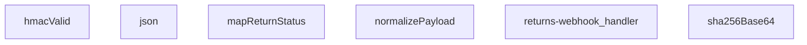

## Genel Bakış
Bu modül, Supabase Edge Function ortamında çalışan bir webhook işleyicisidir. Dış sistemlerden (kargo firmalarından) gelen iade durum bildirimlerini alır, HMAC‑SHA256 imzasını doğrular, payload’u ortak bir forma dönüştürür ve yanıtı JSON olarak döndürür.

## Fonksiyon Grupları
### Yardımcı Yanıt ve Kriptografi
Temel yardımcı işlevleri içerir; HTTP yanıtı oluşturmak ve SHA‑256 hash’ini Base64 formatında üretmek için kullanılır.  
- json, sha256Base64  

### İmza Doğrulama
Gelen isteğin `signatureHeader` değerini, paylaşılan `secret` ve ham istek gövdesi (`raw`) ile hesaplanan HMAC‑SHA256 imzası ile karşılaştırarak güvenliği sağlar.  
- hmacValid  

### Veri Normalizasyonu ve Durum Haritalama
Farklı kargo firmalarından gelen payload’ları ortak bir nesneye dönüştürür ve firmaya özgü durum kodlarını uygulama içinde kullanılan standart durum alanına (`status`, `setReceived`) eşler.  
- normalizePayload, mapReturnStatus  

### Ana Webhook İşleyici
HTTP isteğini alır, imza doğrulamasını başlatır, payload’u normalleştirir, durum haritalamasını uygular ve sonuçları JSON yanıtı olarak döndürür.  
- returns-webhook_handler

---

## AXIOMS – Mimari Varsayımlar
Bu modül için özel aksiyom tanımlanmamıştır.

---

---

## FONKSIYON DETAYLARI

### json
**Ne yapar**: HTTP yanıtı oluşturmak için JSON formatında bir gövde ve isteğe bağlı başlık bilgilerini işler.  
**Nasıl yapar**: `body` parametresi JSON serileştirilebilir bir veri olarak kabul edilir; `init` parametresi ise `ResponseInit` tipinde yanıt başlıklarını ve durum kodunu içerir. Fonksiyon, bu iki bilgiyi birleştirerek bir `Response` nesnesi üretir.  
**Parametreler**:
- body: unknown — JSON’a dönüştürülecek veri.
- init: ResponseInit — Yanıtın başlıkları, durum kodu ve diğer seçenekleri.
**Dönüş**: void (yanıt nesnesi oluşturulur, ancak fonksiyon kendisi bir değer döndürmez).

### hmacValid
**Ne yapar**: Gelen isteğin HMAC imzasını doğrular ve imzanın geçerli olup olmadığını belirler.  
**Nasıl yapar**: Paylaşılan `secret` anahtarıyla `raw` verisinin HMAC‑SHA256 imzası hesaplanır; bu imza, `signatureHeader` içinde gelen imza ile karşılaştırılır. Sonuç bir `Promise<boolean>` olarak döndürülür.  
**Parametreler**:
- secret: string — HMAC hesaplamasında kullanılan ortak anahtar.
- raw: string — İmzalanacak ham veri.
- signatureHeader: string — İstemciden gelen HMAC imzası.
**Dönüş**: Promise<boolean> — İmzanın geçerli olup olmadığını belirten bir promise.

### mapReturnStatus
**Ne yapar**: İsteğe bağlı bir durum kodu dizesini, daha anlamlı bir status nesnesine dönüştürür.  
**Nasıl yapar**: `input` parametresi sağlanırsa, bu değer belirli bir status anahtarına eşlenir; aynı zamanda `setReceived` bayrağı da gerektiğinde true olarak ayarlanır.  
**Parametreler**:
- input?: string — Dönüştürülecek durum kodu (isteğe bağlı).
**Dönüş**: { status?: string; setReceived?: boolean } — Status ve alındı işaretçisi içeren bir nesne.

### normalizePayload
**Ne yapar**: Gelen payload verisini standart bir forma getirir.  
**Nasıl yapar**: `obj` parametresi üzerinde tip kontrolü ve gerekli dönüşümler uygulanarak veri tutarlılığı sağlanır. Fonksiyon, dönüşümün yan etkileriyle çalışır ve doğrudan bir değer döndürmez.  
**Parametreler**:
- obj: unknown — Normalizasyon işlemi uygulanacak veri.
**Dönüş**: void (veri yerinde normalize edilir).

### sha256Base64
**Ne yapar**: Verilen metni SHA‑256 algoritmasıyla hashleyip, sonucu Base64 formatına çevirir.  
**Nasıl yapar**: `input` stringi önce SHA‑256 hash fonksiyonuna gönderilir; elde edilen ikili hash daha sonra Base64 kodlamasına tabi tutulur. Sonuç bir `Promise<string>` olarak döndürülür.  
**Parametreler**:
- input: string — Hashlenecek metin.
**Dönüş**: Promise<string> — Base64 kodlu SHA‑256 hash değeri.

### returns-webhook_handler
**Ne yapar**: Webhook isteğini alır, doğrulama ve işleme adımlarını yürütür, ardından uygun bir HTTP yanıtı üretir.  
**Nasıl yapar**: Gelen `Request` nesnesi `hmacValid` ile imza doğrulaması yapılır; payload `normalizePayload` ile normalize edilir; iş mantığı `mapReturnStatus` ve `json` fonksiyonlarıyla yanıt hazırlanır. Sonuç bir `Response` nesnesi olarak döndürülür.  
**Parametreler**:
- req: Request — Webhook isteğini temsil eden HTTP isteği nesnesi.
**Dönüş**: Response — İşlem sonucunu içeren HTTP yanıtı.

---

## SABİTLER
- **SKEW_MS** (binary_expression) — `5 * 60 * 1000`

---

## AST POINTERS

### [N1_NASIL] AST Pointer: C:\Users\alize\venthub-hvac\supabase\functions\returns-webhook\index.ts::json
- **params**: (body: unknown, init: ResponseInit = {})
- **ic_degiskenler**:
  - `init` — `ResponseInit` nesnesi, varsayılan olarak boş obje; `status` ve `headers` değerleri burada okunur.
- **Dönüş**: `Response` (JSON stringi ve uygun başlıklarla yeni Response nesnesi döner)

### [N2_NASIL] AST Pointer: C:\Users\alize\venthub-hvac\supabase\functions\returns-webhook\index.ts::hmacValid
- **params**: (secret: string, raw: string, signatureHeader: string)
- **ic_degiskenler**:
  - `key` — `CryptoKey` nesnesi, `secret` ile HMAC‑SHA256 imzası oluşturmak için kullanılır.
  - `sigBytes` — `ArrayBuffer`, `raw` verisinin HMAC imzası.
  - `computed` — `string`, `sigBytes` base64 kodlu hali.
  - `given` — `string`, `signatureHeader` başlığından alınan ve `sha256=` öneki temizlenmiş imza.
- **Dönüş**: `Promise<boolean>` (hesaplanan imza verilen imza ile eşleşiyorsa `true`, hata durumunda `false`)

### [N3_NASIL] AST Pointer: C:\Users\alize\venthub-hvac\supabase\functions\returns-webhook\index.ts::mapReturnStatus
- **params**: (input?: string)
- **ic_degiskenler**:
  - `s` — `string`, `input` değeri boşsa `''`, aksi takdirde küçük harfe dönüştürülmüş hali.
- **Dönüş**: `{ status?: string; setReceived?: boolean }` (girdi durumuna göre uygun status ve opsiyonel `setReceived` bayrağı)

### [N4_NASIL] AST Pointer: C:\Users\alize\venthub-hvac\supabase\functions\returns-webhook\index.ts::normalizePayload
- **params**: (obj: unknown)
- **ic_degiskenler**:
  - `rec` — `Record<string, unknown>`; `obj` bir nesne ise ona cast edilir, aksi takdirde boş obje.
  - `pick` — `(…keys: string[]) => unknown` fonksiyonu; verilen anahtarlar içinde ilk mevcut ve null olmayan değeri döndürür.
- **Dönüş**: `yok` (normalizasyon sonucu obje döndürülür; fonksiyonun dönüş tipi `void` olarak belirtilmiş)

### [N5_NASIL] AST Pointer: C:\Users\alize\venthub-hvac\supabase\functions\returns-webhook\index.ts::sha256Base64
- **params**: (input: string)
- **ic_degiskenler**:
  - `bytes` — `Uint8Array`, `input` metninin UTF‑8 kodlaması.
  - `hash` — `ArrayBuffer`, `bytes` üzerinde SHA‑256 hash’i.
- **Dönüş**: `Promise<string>` (hash’in base64 kodlu temsili)

### [N6_NASIL] AST Pointer: C:\Users\alize\venthub-hvac\supabase\functions\returns-webhook\index.ts::(anonymous) (returns-webhook_handler)
- **params**: (req: Request)
- **ic_degiskenler**:
  - `raw` — `string`, istek gövdesinin metin hali (`await req.text()`).
  - `body` — `unknown`, `raw` JSON parse edilirse elde edilen obje, aksi takdirde boş obje.
  - `secret` — `string`, ortam değişkeni `RETURNS_WEBHOOK_SECRET` değeri.
  - `token` — `string`, ortam değişkeni `RETURNS_WEBHOOK_TOKEN` değeri.
  - `sign` — `string`, istek başlığından `x-signature` değeri.
  - `tok` — `string`, istek başlığından `x-webhook-token` değeri.
  - `ok` — `boolean`, kimlik doğrulama sonucunu tutar.
  - `tsHeader` — `string`, `x-timestamp` veya `x-event-time` başlığının değeri.
  - `t` — `number`, zaman damgasının milisaniye cinsinden sayısal değeri.
  - `SUPABASE_URL` — `string | undefined`, ortam değişkeni `SUPABASE_URL`.
  - `SERVICE_KEY` — `string | undefined`, ortam değişkeni `SUPABASE_SERVICE_ROLE_KEY`.
  - `supabase` — Supabase client, `createClient(SUPABASE_URL, SERVICE_KEY)` ile oluşturulur.
  - `p` — `{ _return_id?: string; order_id?: string; carrier?: string; tracking_number?: string; status?: string; delivered_at?: string }`, `normalizePayload(body)` sonucu.
  - `eventId` — `string`, `x-id` veya `x-event-id` başlığının temizlenmiş değeri.
  - `exist` — `any`, `returns_webhook_events` tablosunda aynı `event_id` var mı kontrolü sonucu.
  - `returnId` — `string`, `_return_id` ya da `order_id` üzerinden sorgulanan dönüş kimliği.
  - `data` — `any`, `venthub_returns` tablosundan `order_id` eşleşmesiyle alınan ilk satır.
  - `cur` — `any`, mevcut dönüş kaydı (`id` ve `status` alanları).
  - `curErr` — `any`, mevcut kayıt sorgusundaki olası hata.
  - `mapped` — `{ status?: string; setReceived?: boolean }`, `mapReturnStatus(p.status)` sonucu.
  - `patch` — `Record<string, unknown>`, güncellenecek alanları tutar (`status` varsa eklenir).
  - `rank` — `Record<string, number>`, statusların ilerleme sıralaması.
  - `curRank` — `number`, mevcut statusun sıralaması.
  - `nextRank` — `number`, yeni statusun sıralaması.
  - `updated` — `boolean`, veritabanı güncellemesi başarılı olduysa `true`.
  - `bodyHash` — `string`, gelen gövdenin SHA‑256 base64 hash’i.
  - `nextStatus` — `string`, güncellenmiş ya da mevcut status.
  - `rOrderId` — `string`, dönüş kaydından elde edilen `order_id`.
  - `reason` — `string`, dönüş kaydının `reason` alanı.
  - `description` — `string`, dönüş kaydının `description` alanı.
  - `orderNumber` — `string`, sipariş kaydının `order_number` alanı.
  - `userId` — `string`, sipariş kaydının `user_id` alanı.
  - `customerEmail` — `string`, kullanıcı kaydının `email` alanı.
  - `customerName` — `string`, kullanıcı kaydının `full_name` veya `name` alanı.
  - `row` — `any`, fetch sonuçlarından alınan tek satır (örnek: `row.order_id`, `row.user_id` gibi alt alanlar ayrı değişken olarak listelenmez; sadece `row` üzerinden erişilir).
- **Dönüş**: `Response` (başarılı işlemde `{ ok: true, _return_id, status }` JSON’u, hata durumlarında ilgili hata mesajı ve HTTP kodu içeren JSON Response)

---

## MERMAID CALL GRAPH

## NODE ID STANDARD

  file: supabase\functions\returns-webhook\index.ts
  function: supabase\functions\returns-webhook\index.ts::json
  function: supabase\functions\returns-webhook\index.ts::hmacValid
  function: supabase\functions\returns-webhook\index.ts::mapReturnStatus
  function: supabase\functions\returns-webhook\index.ts::normalizePayload
  function: supabase\functions\returns-webhook\index.ts::sha256Base64
  function: supabase\functions\returns-webhook\index.ts::returns-webhook_handler

---

## DISA AKTARILANLAR (EXPORTS)
  export: hmacValid
  export: json
  export: mapReturnStatus
  export: normalizePayload
  export: returns-webhook_handler
  export: sha256Base64