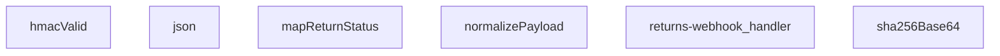

## Genel Bakış

Bu modül, kargo firmalarından gelen iade webhook isteklerini işleyen bir Supabase Edge Function'dır. HMAC-SHA256 imza doğrulaması ile güvenli kabul edilen istekler, farklı formatlardaki payload'lar standart forma dönüştürülerek uygulama içi iade durum alanlarına eşlenir. Modül tek bir HTTP giriş noktası üzerinden tüm iş akışını orkestra eder.

## Fonksiyon Grupları

### Kriptografik Doğrulama
Gelen webhook isteklerinin HMAC-SHA256 imzasını doğrulayarak kaynağın güvenilirliğini teyit eder. SHA-256 hash üretimi ve imza karşılaştırma işlemlerini kapsar.
- sha256Base64, hmacValid

### Veri Normalizasyonu ve Haritalama
Kargo firmalarından gelen farklı formatlardaki verileri ortak bir yapıya dönüştürür ve firma bazlı durum kodlarını uygulama içi standart değerler ile eşler.
- normalizePayload, mapReturnStatus

### Yanıt Oluşturma
HTTP yanıtlarını JSON formatında ve uygun HTTP durum kodlarıyla paketler.
- json

### Ana Webhook İşleyici
HTTP isteğini alarak tüm iş akışını yönetir; imza doğrulaması, payload normalizasyonu ve durum eşleme adımlarını sırasıyla çalıştırarak nihai yanıtı üretir.
- returns-webhook_handler

---

## AXIOMS – Mimari Varsayımlar

Bu modül, kargo firmalarından gelen webhook isteklerini HMAC-SHA256 ile doğrulayıp iade durumunu eşleyen bir Supabase Edge Function'dır.

---

**[Aksiyom 1]:** `hmacValid` fonksiyonu `secret`, `raw` ve `signatureHeader` parametrelerinin üçünü de alır. Eğer HMAC doğrulama secret'ı ortam değişkenlerinde yapılandırılmamışsa veya boş string olarak verilmişse, hiçbir webhook isteği geçerli kabul edilmez ve tüm istekler reddedilir.

**[Aksiyom 2]:** `SKEW_MS` sabiti, HMAC-SHA256 zaman damgası doğrulamasında saat sapması toleransını belirler. Eğer istek zaman damgası ile sunucu zamanı arasındaki fark `SKEW_MS` değerini aşarsa, HMAC imza doğrulaması başarısız olur (replay saldırısı koruması devreye girer).

**[Aksiyom 3]:** `mapReturnStatus` fonksiyonunun `input` parametresi opsiyoneldir (`?`). Eğer bilinmeyen veya eşlenemeyen bir iade durum değeri gelirse, fonksiyon bir varsayılan/benchmark durum döndürmelidir; undefined durumunda modülün durumu belirsizleşir.

**[Aksiyom 4]:** `normalizePayload` fonksiyonu `unknown` tipinde bir obje alır — bu, kargo firmalarının farklı JSON yapıları gönderebileceği anlamına gelir. Eğer payload tamamen `null` veya `undefined` olarak gelirse, normalize edilecek geçerli bir yapı olmadığından fonksiyon hata fırlatır veya boş/geçersiz bir sonuç döner.

**[Aksiyom 5]:** `returns-webhook_handler` fonksiyonu standart `Request` alıp `json` fonksiyonu aracılığıyla `Response` döner. Eğer handler içinde beklenmeyen bir exception fırlatılırsa ve yakalanmazsa, Supabase Edge Function varsayılan 500 hatasıyla yanıt verir.

**[Aksiyom 6]:** `hmacValid` için `raw` parametresi, HTTP request body'sinin birebir (ham) string karşılığıdır. Eğer body parsing sırasında orijinal ham content değiştirilmişse veya encoding farklılaşmışsa (örn: Unicode normalizasyonu), HMAC doğrulaması başarısız olur çünkü imza ile doğrulanacak ham veri uyuşmaz.

---

## FONKSİYON DETAYLARI

### json
**Ne yapar**: Verilen gövdeyi ve yanıt başlatma seçeneklerini kullanarak, JSON formatında içerikli bir HTTP yanıtı oluşturur.
**Nasıl yapar**: Gelen `body` parametresini, iki boşluk girintili bir JSON dizesine dönüştürür. Varsayılan olarak `200` durum kodu ve `application/json; charset=utf-8` içerik türü ile bir `Response` nesnesi döndürür. Eklenen `init` parametresi ile durum kodu ve başlıklar özelleştirilebilir.
**Parametreler**:
- body: unknown — Yanıt gövdesi olarak kullanılacak veri. Herhangi bir tipte olabilir, JSON.stringify ile dizgeye dönüştürülür.
- init: ResponseInit — İsteğe bağlı. Durum kodu (`status`) ve başlıkları (`headers`) belirtmek için kullanılan standart ResponseInit nesnesi.
**Dönüş**: Response — Oluşturulan JSON içerikli HTTP yanıtı.

### hmacValid
**Ne yapar**: Verilen gizli anahtar, ham veri ve imza başlığını kullanarak bir HMAC-SHA256 imzasının geçerliliğini doğrular.
**Nasıl yapar**: Gizli anahtarı bir HMAC-SHA256 anahtarı olarak içe aktarır, ham veri ile bir imza hesaplar ve Base64 ile kodlanmış sonucu, gelen imza başlığındaki `sha256=` ön ekinden arındırılmış değer ile karşılaştırır. Doğrulama başarısız olursa `false` döner.
**Parametreler**:
- secret: string — HMAC imza hesaplamasında kullanılacak gizli anahtar.
- raw: string — İmza hesaplamasına giren ham veri (genellikle request body).
- signatureHeader: string — İsteğe gelen ve `sha256=...` formatında beklenen HMAC imzasını içeren başlık değeri.
**Dönüş**: Promise<boolean> — İmza geçerli ise `true`, değilse veya bir hata oluşursa `false` döner.

### mapReturnStatus
**Ne yapar**: Bir dize giriş değerini tanımlı bir durum nesnesine dönüştürür, nakliyede, teslim alınmış veya iptal edilmiş gibi durumları haritalandırır.
**Nasıl yapar**: Giriş dizesini küçük harfe dönüştürür ve tanımlı anahtar kelimeler listesine göre eşleştirir. 'in_transit' grubu için `in_transit` durumunu, 'received' grubu için `received` durumunu (ve `setReceived` flag'ini `true` yaparak) ve 'cancelled' grubu için `cancelled` durumunu döndürür. Tanınmayan bir değer girilirse, o değerin kendisi durum olarak kullanılır.
**Parametreler**:
- input: string | undefined — Haritalanacak ham durum dizesi.
**Dönüş**: { status?: string; setReceived?: boolean } — Eşlenen durum nesnesi. Giriş boşsa veya tanımsızsa boş bir nesne döner.

### normalizePayload
**Ne yapar**: Farklı isimlendirmelerle gelen girdi nesnesini standart, tek bir şemaya dönüştürür.
**Nasıl yapar**: Girdi nesnesinden `_return_id`, `order_id`, `carrier`, `tracking_number`, `status` ve `delivered_at` alanlarını çeşitli alternatif anahtar isimleri (`returnId`, `orderId`, `provider`, vb.) kullanarak arar ve bulduğu ilk geçerli değeri alır. Her alanı string'e dönüştürerek döndürür.
**Parametreler**:
- obj: unknown — Normalize edilecek girdi nesnesi. Obje değilse boş bir nesne muamelesi görür.
**Dönüş**: { _return_id: string; order_id: string; carrier: string; tracking_number: string; status: string; delivered_at: string } — Standart alan adlarına sahip normalize edilmiş nesne.

### sha256Base64
**Ne yapar**: Verilen girdi dizesinin Base64 ile kodlanmış SHA-256 karması değerini hesaplar.
**Nasıl yapar**: Girdi dizesini UTF-8 byte dizisine dönüştürür, crypto.subtle.digest fonksiyonu ile SHA-256 hash'ini hesaplar ve sonucu Base64 formatına kodlayarak döndürür.
**Parametreler**:
- input: string — Hash'lenecek girdi dizesi.
**Dönüş**: Promise<string> — Base64 kodlanmış SHA-256 hash dizesi.

### returns-webhook_handler
**Ne yapar**: Bir iade web kancası (webhook) isteğini işler, HMAC imzasını doğrular, payload'ı normalize eder, durumunu haritalar ve ilgili yanıt veya hata mesajını döndürür.
**Nasıl yapar**: Bu, modülün ana web kancası işleyicisidir. İstek gövdesini HMAC-SHA256 ile doğrulamak için `hmacValid` fonksiyonunu kullanır. Doğrulama başarılı olursa, gövdeyi `normalizePayload` ile standartlaştırıp `mapReturnStatus` ile durumunu haritalar. İşleme mantığı bu fonksiyon gövdesinde tanımlıdır (detaylı docstring verilmemiştir).
**Parametreler**:
- req: Request — İşlenecek gelen HTTP istek nesnesi.
**Dönüş**: Response — İşleme sonucuna göre oluşturulmuş HTTP yanıtı (örn: 200 OK, 401 Unauthorized vb.).

---

## SABİTLER
- **SKEW_MS** (binary_expression) — `5 * 60 * 1000`

---

## AST POINTERS

### [N1_NASIL] AST Pointer: supabase/functions/returns-webhook/index.ts::json
- **params**: `body: unknown, init: ResponseInit = {}`
- **ic_degiskenler**:
  - (yok — parametreler doğrudan kullanılır)
- **Dönüş**: `Response` — JSON serialize edilmiş body ile oluşturulmuş Response nesnesi

---

## MERMAID CALL GRAPH

## NODE ID STANDARD

  file: supabase\functions\returns-webhook\index.ts
  function: supabase\functions\returns-webhook\index.ts::json
  function: supabase\functions\returns-webhook\index.ts::hmacValid
  function: supabase\functions\returns-webhook\index.ts::mapReturnStatus
  function: supabase\functions\returns-webhook\index.ts::normalizePayload
  function: supabase\functions\returns-webhook\index.ts::sha256Base64
  function: supabase\functions\returns-webhook\index.ts::returns-webhook_handler

---

## DISA AKTARILANLAR (EXPORTS)
  export: hmacValid
  export: json
  export: mapReturnStatus
  export: normalizePayload
  export: returns-webhook_handler
  export: sha256Base64