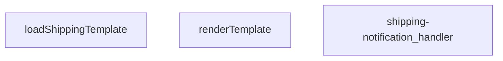

## Genel Bakış
Bu modül, Supabase Edge Functions olarak çalışan bir kargo bildirim işleyicisidir. Kargo bildirimlerinin içeriğini hazırlamak için şablon dosyalarını yükler, şablonları ilgili verilerle doldurur ve gelen HTTP isteklerine uygun yanıt üretir.

## Fonksiyon Grupları
### Şablon İşleme
Kargo bildirim şablonlarını depolama alanından yükler ve sağlanan verilerle doldurarak nihai bildirim metnini oluşturur.
- loadShippingTemplate, renderTemplate

### Ana İşleyici
Gelen HTTP isteklerini alır, şablon yükleme ve doldurma işlemlerini koordine eder, elde edilen içerikle uygun HTTP yanıtını döndürür.
- shipping-notification_handler

---

## AXIOMS – Mimari Varsayımlar
Bu modül, fonksiyonların doğru çalışabilmesi için giriş parametrelerinin tiplerinin ve dış bağımlılıkların mevcut olmasını varsayar.

**Aksiyom 1**: Eğer `renderTemplate` fonksiyonuna verilen **`tpl`** parametresi **string** türünde değilse, şablon işleme hatası oluşur.  
**Aksiyom 2**: Eğer `renderTemplate` fonksiyonuna verilen **`_data`** parametresi **Record<string, unknown>** (yani anahtar‑değer çiftlerinden oluşan bir nesne) tipinde değilse, şablon doldurma hatası oluşur.  
**Aksiyom 3**: Eğer `loadShippingTemplate` fonksiyonu çalıştırıldığında şablon dosyası (örneğin bir `.tpl` veya `.html` dosyası) **bulunmuyorsa** veya **erişilemezse**, şablon yükleme hatası meydana gelir.  
**Aksiyom 4**: Eğer `shipping-notification_handler` fonksiyonuna gelen **`req`** nesnesi **tanımlı değilse** veya **beklenen HTTP istek yapısını (örneğin `body`, `headers` vb.) içermiyorsa**, istek işleme hatası oluşur ve uygun bir HTTP yanıtı üretilemez.  
**Aksiyom 5**: Eğer `shipping-notification_handler` içinde `loadShippingTemplate` çağrısı başarısız olursa (örneğin şablon dosyası eksikse), handler şablon oluşturamadan yanıt döndürür ve hata durumu raporlanır.  
**Aksiyom 6**: Eğer `shipping-notification_handler` içinde `renderTemplate` çağrısı başarısız olursa (örneğin `tpl` tipi hatalıysa veya `_data` uygun formatta değilse), oluşturulan mesaj geçersiz olur ve gönderim hatası meydana gelir.

---

## FONKSIYON DETAYLARI

### renderTemplate
**Ne yapar**: Verilen şablon metninde yer alan değişken yer tutucularını, `_data` nesnesindeki karşılık gelen değerlerle değiştirir ve sonuç olarak doldurulmuş bir metin döndürür.  
**Nasıl yapar**: Şablon metninde `${...}` biçimindeki yer tutucuları tarar, her birini `_data` içinde aynı anahtara sahip değere çevirir. Değer bulunamazsa yer tutucu olduğu gibi bırakılır.  
**Parametreler**:
- tpl: string — Şablon metni, içinde değişken yer tutucuları barındırır.
- _data: Record<string, unknown> — Şablonda kullanılacak anahtar‑değer çiftlerini içeren nesne.  
**Dönüş**: string — Değişkenler yerleştirilmiş, tamamlanmış metin.

### loadShippingTemplate
**Ne yapar**: Sunucudaki sabit dosya sisteminden “shipping” şablon dosyasını okur ve içeriğini döndürür.  
**Nasıl yapar**: Dosya yolu sabit olarak belirlenir, `fs.promises.readFile` ile UTF‑8 olarak okunur. Dosya bulunamazsa `null` döndürülür.  
**Parametreler**: yok  
**Dönüş**: Promise<string | null> — Okunan şablon metni veya dosya yoksa `null`.

### shipping-notification_handler
**Ne yapar**: Gelen HTTP isteğini alır, taşıma bildirimine ilişkin verileri işler ve uygun yanıtı döndürür.  
**Nasıl yapar**:  
1. `req.body`’dan taşıma bilgilerini alır.  
2. `loadShippingTemplate` ile şablon okunur; eğer şablon yoksa 500 hatası döndürülür.  
3. `renderTemplate` ile şablon ve veri birleştirilir.  
4. Oluşturulan mesajı bir e-posta servisine gönderir (örnek: `sendEmail`).  
5. İşlem başarılı ise 200 OK, hata durumunda uygun hata kodu ile yanıt döndürülür.  
**Parametreler**:
- req: any — HTTP isteği nesnesi, içinde `body` alanı bulunur.  
**Dönüş**: Response — HTTP yanıt nesnesi, durum kodu ve isteğe bağlı mesaj içerir.

---

## INTERFACES

### ShippingNotificationRequest
- `order_id: string`
- `customer_email: string`
- `customer_name: string`
- `order_number?: string`
- `carrier: string`
- `tracking_number: string`
- `tracking_url?: string | null`

---

## AST POINTERS

### [N1_NASIL] AST Pointer: C:\Users\alize\venthub-hvac\supabase\functions\shipping-notification\index.ts::renderTemplate
- **params**: (tpl: string, _data: Record<string, unknown>)
- **ic_degiskenler**:
  - `tpl` — Şablon stringi; fonksiyon içinde replace işlemleriyle güncellenir ve sonunda döndürülür.
  - `_data` — Şablondaki değişkenlerin değerlerini tutan nesne; `{{key}}` ve `{{#if key}}` ifadelerinde okunur.
  - `v` — `_data[key]` sonucunda elde edilen değer; if‑bloğu ve değişken ikamesi için geçici tutucu.
  - `truthy` — `v` değerinin boolean karşılığı; string ise boş olup olmadığı, diğer tiplerde doğrudan boolean dönüşümü.
  - `inner` — `{{#if key}}...{{/if}}` bloğunun içeriği; koşul sağlanıyorsa döndürülür.
- **Dönüş**: `string` (işlenmiş şablon)

### [N2_NASIL] AST Pointer: C:\Users\alize\venthub-hvac\supabase\functions\shipping-notification\index.ts::loadShippingTemplate
- **params**: ()
- **ic_degiskenler**:
  - `url` — `import.meta.url` temel alınarak `./templates/email/shipping.html` dosyasının mutlak URL’si.
- **Dönüş**: `Promise<string | null>` (dosya içeriği okunursa string, hata durumunda null)

### [N3_NASIL] AST Pointer: C:\Users\alize\venthub-hvac\supabase\functions\shipping-notification\index.ts::(anonymous handler)
- **params**: (req)
- **ic_degiskenler**:
  - `requestOrigin` — `req.headers.get('origin')` sonucu; yoksa boş string.
  - `requestHeaders` — `req.headers.get('access-control-request-headers')` sonucu; yoksa varsayılan header listesi.
  - `requestMethod` — `req.headers.get('access-control-request-method')` sonucu; yoksa varsayılan method listesi.
  - `allowedOrigins` — `Deno.env.get('ALLOWED_ORIGINS')` env değişkeninden virgülle ayrılmış liste.
  - `originAllowed` — `allowedOrigins` boş mu veya `requestOrigin` izinli mi kontrolü.
  - `corsHeaders` — CORS yanıt başlıklarını içeren nesne.
  - `body` — `await req.json()` ile elde edilen istek gövdesi; parse hatası durumunda boş nesne.
  - `order_id`, `customer_email`, `customer_name`, `carrier`, `tracking_number`, `tracking_url` — `body` içinden çıkarılan zorunlu alanlar.
  - `order_number` — `body` içinden çıkarılan opsiyonel alan; eksikse daha sonra Supabase’dan çekilir.
  - `missing` — Eksik zorunlu alanların isimlerini tutan dizi.
  - `SUPABASE_URL` — `Deno.env.get('SUPABASE_URL')` env değişkeni.
  - `SERVICE_KEY` — `Deno.env.get('SUPABASE_SERVICE_ROLE_KEY')` env değişkeni.
  - `authHeader` — `req.headers.get('Authorization')` sonucu.
  - `isAuthorized` — Yetkilendirme durumunu belirten boolean.
  - `anonKey` — `Deno.env.get('SUPABASE_ANON_KEY')` env değişkeni.
  - `createClient` — Dinamik import ile elde edilen Supabase client factory fonksiyonu.
  - `authClient` — `createClient` ile oluşturulan Supabase istemcisi (anon key ve auth header ile).
  - `user` — `authClient.auth.getUser()` sonucunda elde edilen kullanıcı objesi.
  - `roleCheck` — Kullanıcının rolünü sorgulayan fetch isteği.
  - `arr` — `roleCheck.json()` dönüşü; rol bilgisi içeren dizi.
  - `role` — `arr[0]?.role` ile elde edilen rol stringi.
  - `RESEND_API_KEY` — `Deno.env.get('RESEND_API_KEY')` env değişkeni.
  - `EMAIL_FROM` — `Deno.env.get('EMAIL_FROM')` env değişkeni; varsayılan değer `'VentHub <onboarding@resend.dev>'`.
  - `o` — `order_number` eksikse Supabase’dan order_number çekmek için yapılan fetch isteği.
  - `prettyOrderNo` — Görsel amaçlı formatlanmış sipariş numarası (`#` ile başlayan).
  - `subject` — E‑posta konu satırı; `prettyOrderNo` içerir.
  - `html` — Şablon içeriği; `loadShippingTemplate()` sonucu veya fallback HTML.
  - `tracking_url` — `body.tracking_url`; varsa link eklenir, yoksa `#`.
  - `resp` — Resend API’ye gönderilen POST isteği sonucu.
  - `t` — `resp.text()` hatalı yanıt içeriği.
  - `result` — `resp.json()` başarılı yanıtı.
  - `msg` — Yakalanan hata nesnesinin mesajı.
- **Dönüş**: `Response` (HTTP yanıtı; başarılı, hata, CORS, yetkisiz vb. durumları kapsar)

---

## MERMAID CALL GRAPH

## NODE ID STANDARD

  file: supabase\functions\shipping-notification\index.ts
  function: supabase\functions\shipping-notification\index.ts::renderTemplate
  function: supabase\functions\shipping-notification\index.ts::loadShippingTemplate
  function: supabase\functions\shipping-notification\index.ts::shipping-notification_handler

---

## DISA AKTARILANLAR (EXPORTS)
  export: loadShippingTemplate
  export: renderTemplate
  export: shipping-notification_handler