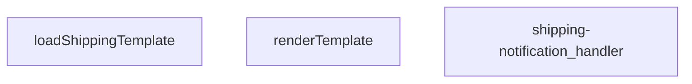

## Genel Bakış
Bu modül, kargo bildirimlerinin dinamik olarak oluşturulmasını ve sunulmasını sağlayan bir HTTP fonksiyonudur. Depolama alanından yüklendiği şablon dosyalarını, gelen istek verileriyle birleştirerek kişiselleştirilmiş bildirim metinleri üretir ve bunları istemciye bir HTTP yanıtı olarak döndürür.

## Fonksiyon Grupları
### Şablon İşleme
Gerekli kargo bildirim şablonunu depolama alanından getirir ve bu şablonu, verilen veri setiyle birleştirerek nihai bildirim metnini üretir.
- loadShippingTemplate, renderTemplate

### Ana İşleyici ve Koordinasyon
Gelen HTTP isteklerini karşılar, şablon yükleme ve işleme adımlarını yöneterek tüm sürecin sonucunda istemciye uygun bir yanıt paketi oluşturur.
- shipping-notification_handler

---

## AXIOMS – Mimari Varsayımlar

Bu modül için fonksiyon imzalarından çıkarılabilecek mimari varsayımlar sınırlıdır.

**[Aksiyom 1]**: Eğer `renderTemplate` fonksiyonuna geçilen `tpl` parametresi geçerli bir string değilse, şablon işleme başarısız olur.

**[Aksiyom 2]**: Eğer `renderTemplate` fonksiyonuna geçilen `_data` parametresi `Record<string, unknown>` yapısına uygun değilse, yer tutucu değişkenlerin değerleri yanlış veya eksik olarak yerine konur.

**[Aksiyom 3]**: Eğer `loadShippingTemplate` fonksiyonunun çağrıldığı ortamda şablon kaynağı erişilebilir değilse, fonksiyon geçerli bir şablon döndüremez.

**[Aksiyom 4]**: Eğer `shipping-notification_handler` fonksiyonuna geçilen `req` parametresi geçerli bir HTTP istek nesnesi değilse, istek işlenemez.

**[Aksiyom 5]**: Eğer `shipping-notification_handler` isteği başarıyla işlerse, bir HTTP yanıt döndürmesi beklenir.

> **Not**: Fonksiyon imzalarında default değer tanımlanmamıştır ve modül sabitleri belirtilmemiştir; bu nedenle eşik değerleri veya spesifik kabul kriterleri belirlenememiştir.

---

## FONKSİYON DETAYLARI

### renderTemplate
**Ne yapar**: Bu fonksiyon, bir şablon dizesi içindeki değişkenleri ve koşullu blokları, sağlanan bir veri nesnesindeki değerlerle değiştirerek dinamik bir çıktı üretir. Temel olarak basit bir şablon motoru görevi görür.

**Nasıl yapar**: Fonksiyon, iki aşamalı bir string değiştirme işlemi uygular. İlk olarak, `{{#if key}}...{{/if}}` sözdizimindeki koşullu blokları işler: `key` değerinin varlığını ve truthy olup olmadığını kontrol eder, doğru ise bloğun içeriğini korur, aksi halde boş string ile değiştirir. İkinci aşamada, kalan `{{key}}` değişkenlerini bulur ve veri nesnesindeki karşılık gelen değerle değiştirir; değer `null` veya `undefined` ise boş string kullanır.

**Parametreler**:
- `tpl`: string — Değiştirilecek olan şablon dizesi. İçerisinde `{{#if ...}}` blokları ve `{{...}}` değişken yer tutucuları bulunabilir.
- `_data`: Record<string, unknown> — Şablondaki yer tutucularla eşleşecek anahtar-değer çiftlerini içeren veri nesnesi.

**Dönüş**: string — Değişkenlerin ve koşullu blokların işlendiği, sonuç şablon dizesi.

### loadShippingTemplate
**Ne yapar**: Bu asenkron fonksiyon, kargo bildirimleri için kullanılan bir HTML e-posta şablonunu dosya sisteminden yükler.

**Nasıl yapar**: Fonksiyon, çağrıldığı dosyanın bulunduğu dizine göreceli olarak `./templates/email/shipping.html` yolundaki dosyayı okumak için `Deno.readTextFile` yöntemini kullanır. Bir `URL` nesnesi oluşturarak doğru mutlak yolu hesaplar. Dosya okuma işlemi başarısız olursa (örn. dosya mevcut değilse), bir `try...catch` bloğu ile yakalanır ve `null` değeri döndürülür.

**Parametreler**: Bu fonksiyon herhangi bir parametre almaz.

**Dönüş**: Promise<string | null> — Başarılı olursa HTML şablonunun içeriğini (string), başarısız olursa `null` değerini içeren bir promise.

### shipping-notification_handler
**Ne yapar**: Bu fonksiyon, kargo bildirimleriyle ilgili HTTP isteklerini işleyen bir sunucu işleyicisidir (handler). Gelen bir POST isteğini alır, ilgili iş mantığını yürütür ve bir HTTP yanıtı döndürür.

**Nasıl yapar**: Fonksiyonun gövdesi verilmemiştir; bu nedenle iç mantığı hakkında kesin bir bilgi bulunmamaktadır. Ancak imzasından ve adından yola çıkarak, bu fonksiyonun bir web framework'ün (örn. Deno Oak, Hono) istek işleyici (request handler) yapısında olduğu ve `Request` nesnesini `Response` nesnesine dönüştürdüğü çıkarılabilir. Fonksiyonun, bir kargo durumu güncellendiğinde tetiklenen bir webhook veya API endpoint'i işlediği varsayılabilir.

**Parametreler**:
- `req`: Request — Gelen HTTP istek nesnesi. İstek gövdesi, başlıkları ve URL parametrelerini içerir.

**Dönüş**: Response — İşlenen istekle ilgili HTTP yanıt nesnesi. Durum kodu, başlıklar ve opsiyonel bir gövde (örn. JSON yanıtı) içerebilir.

---

## INTERFACES

### ShippingNotificationRequest
- `order_id: string`
- `customer_email: string`
- `customer_name: string`
- `order_number?: string`
- `carrier: string`
- `tracking_number: string`
- `tracking_url?: string | null`

---

## AST POINTERS

### [N1_NASIL] AST Pointer: supabase/functions/shipping-notification/index.ts::renderTemplate
- **params**: `tpl: string`, `_data: Record<string, unknown>`
- **ic_degiskenler**:
  - `v` (if-block callback içinde) — `_data[key]` değerini okur, if-block'un truthy olup olmadığını belirler
  - `truthy` — `v` değerinin truthy olup olmadığını boolean'a çevirir, if-block içeriğinin korunup korunmayacağını belirler
  - `v` (variable callback içinde) — `_data[key]` değerini okur, template değişkeninin yerine konacak değeri sağlar
- **Dönüş**: `string` — if-block'ları ve değişken placeholder'ları işlenmiş nihai şablon metni

### [N2_NASIL] AST Pointer: supabase/functions/shipping-notification/index.ts::loadShippingTemplate
- **params**: (parametre yok)
- **ic_degiskenler**:
  - `url` — `import.meta.url` referansıyla `'./templates/email/shipping.html'` dosyasının mutlak URL nesnesini oluşturur
- **Dönüş**: `Promise<string | null>` — şablon dosyasının içeriği; dosya bulunamazsa `null`

### [N3_NASIL] AST Pointer: supabase/functions/shipping-notification/index.ts::shipping-notification_handler
- **params**: `req` (Request nesnesi)
- **ic_degiskenler**:
  - `requestOrigin` — isteğin `origin` header'ından gelen kaynak URL, CORS izin kontrolü için kullanılır
  - `requestHeaders` — isteğin `access-control-request-headers` header'ı, CORS ön isteği bilgisi
  - `requestMethod` — isteğin `access-control-request-method` header'ı, CORS ön isteği yöntemi
  - `allowedOrigins` — `ALLOWED_ORIGINS` env değişkeninden virgülle ayrılmış izinli origin listesi, boşluklar temizlenmiş ve boş elemanlar filtrelenmiş
  - `originAllowed` — `requestOrigin`'in `allowedOrigins` listesinde olup olmadığını belirten boolean, CORS kaynak doğrulaması
  - `corsHeaders` — CORS response header'ları nesnesi, tüm response'lara eklenir
  - `body` — `req.json()` ile parse edilmiş request gövdesi, `ShippingNotificationRequest` tipinde
  - `order_id` — `body`'den destructure edilen sipariş ID'si, zorunlu alan
  - `customer_email` — `body`'den destructure edilen müşteri e-posta adresi, zorunlu alan
  - `customer_name` — `body`'den destructure edilen müşteri adı, zorunlu alan
  - `carrier` — `body`'den destructure edilen kargo firması adı, zorunlu alan
  - `tracking_number` — `body`'den destructure edilen kargo takip numarası, zorunlu alan
  - `tracking_url` — `body`'den destructure edilen kargo takip URL'i, opsiyonel alan
  - `order_number` — `body`'den destructure edilen sipariş numarası (let ile tanımlı, eksikse DB'den çözülür)
  - `missing` — zorunlu alanların hangilerinin eksik olduğunu belirten string dizisi, 400 hatasında döndürülür
  - `SUPABASE_URL` — `SUPABASE_URL` env değişkeninden okunan Supabase proje URL'i
  - `SERVICE_KEY` — `SUPABASE_SERVICE_ROLE_KEY` env değişkeninden okunan service role anahtarı
  - `authHeader` — isteğin `Authorization` header'ından okunan bearer token
  - `isAuthorized` — kullanıcının yetkilendirilip yetkilendirilmediğini tutan boolean bayrak
  - `anonKey` — `SUPABASE_ANON_KEY` env değişkeninden okunan anonim anahtar, auth client oluşturulmasında kullanılır
  - `createClient` — dinamik import ile yüklenen `@supabase/supabase-js` modülünden Supabase istemci oluşturucu fonksiyon
  - `authClient` — kullanıcı token'ı ile oluşturulan Supabase auth istemcisi, kullanıcı bilgisi almak için kullanılır
  - `user` — `authClient.auth.getUser()` sonucundan extract edilen kullanıcı nesnesi
  - `roleCheck` — `user_profiles` tablosundan kullanıcının rolünü sorgulayan fetch response'u
  - `arr` (roleCheck içinde) — `roleCheck.json()` sonucu, rol bilgisi dizisi
  - `arr[0]?.role` — kullanıcının rolü, `admin` veya `superadmin` ise yetkilendirme başarılı sayılır
  - `err` — auth fallback bloğundaki yakalanan hata, konsola loglanır
  - `RESEND_API_KEY` — `RESEND_API_KEY` env değişkeninden okunan Resend API anahtarı, e-posta gönderimi için gerekli
  - `EMAIL_FROM` — `EMAIL_FROM` env değişkeninden okunan gönderen e-posta adresi, varsayılan olarak `'VentHub <onboarding@resend.dev>'`
  - `o` — eksik `order_number`'i çözmek için `venthub_orders` tablosuna yapılan fetch sonucu
  - `arr` (order_number çözümleme içinde) — `venthub_orders` sorgu sonucu dizi, `arr[0].order_number` ile sipariş numarası alınır
  - `prettyOrderNo` — sipariş numarasının display formatı; `order_number` varsa `#XX` formatında, yoksa `order_id`'nin son 8 karakteri
  - `subject` — e-posta konu satırı, `prettyOrderNo` ile birlikte oluşturulur
  - `html` — e-posta HTML içeriği; şablon dosyası yüklenemezse inline fallback HTML ile, yüklenirse `renderTemplate` ile oluşturulur
  - `resp` — Resend API'ye gönderilen e-posta isteği sonucu response
  - `t` — Resend API hata durumunda okunan hata metin response'u
  - `result` — başarılı Resend API yanıtının JSON body'si, e-posta gönderim detaylarını içerir
  - `error` — try-catch yakalanan genel hata nesnesi
  - `msg` — hatanın message string'i veya string'e çevrilmiş hata değeri, error response body'de döndürülür
- **Dönüş**: `Response` — OPTIONS isteklerinde 200, yetkilendirme başarısızsa 401, alan eksikse 400, method izinsizse 405, Resend disabled ise 200+disabled, başarıyla e-posta gönderildiyse 200+success, hata durumunda 500

---

## MERMAID CALL GRAPH

## NODE ID STANDARD

  file: supabase\functions\shipping-notification\index.ts
  function: supabase\functions\shipping-notification\index.ts::renderTemplate
  function: supabase\functions\shipping-notification\index.ts::loadShippingTemplate
  function: supabase\functions\shipping-notification\index.ts::shipping-notification_handler

---

## DISA AKTARILANLAR (EXPORTS)
  export: loadShippingTemplate
  export: renderTemplate
  export: shipping-notification_handler