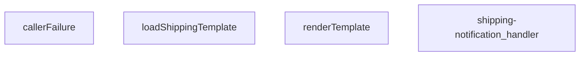

## Genel Bakış
Bu modül, bir Supabase Edge Function olarak kargo takip bildirimlerini dışarıya sunan bir HTTP API uç noktasıdır. Gelen istek verilerini alır, depolama alanından dinamik bir bildirim şablonu yükler, bu şablonu istek bilgileriyle doldurarak kişiselleştirilmiş bir içerik üretir ve istemciye yanıt olarak döndürür.

## Fonksiyon Grupları

### Şablon İşleme
Bu grup, bildirim içeriğinin dinamik ve yeniden kullanılabilir olmasını sağlayan temel mantığı barındırır. Dış depolama alanından ham şablon metni çekilir ve veri alanlarıyla birleştirilerek nihai, okunabilir bildirim metni üretilir.
- `loadShippingTemplate`, `renderTemplate`

### İstek Koordinasyonu
Bu grup, modülün dış dünya ile tek temas noktasıdır ve tüm gelen HTTP isteklerinin yaşam döngüsünü yönetir. İsteği alır, şablon işlemlerini sırasıyla çağırarak iş akışını koordine eder ve istemciye uygun durum koduyla birlikte yanıt döndürür.
- `shipping-notification_handler`

### Hata Yönetimi
Bu grup, modül genelinde oluşabilecek beklenmedik durumları yakalayıp standart bir hata yanıtı formatında dışarıya sunar. Fonksiyon, hata türünü analiz ederek anlamlı ve tutarlı bir geri bildirim üretir.
- `callerFailure`

---

## AXIOMS – Mimari Varsayımlar

Bu modül, bir Supabase Edge Function olarak kargo bildirim şablonlarını yükleyip, gelen HTTP istekleriyle birleştirerek kişiselleştirilmiş bildirim metni üreten bir API servisidir.

[Aksiyom 1]: Eğer `loadShippingTemplate` fonksiyonu depolama alanından bir şablon yükleyemezse (dosya yoksa, erişim hatası oluşursa veya depolama servisi müsait değilse), `null` değeri döndürür.
[Aksiyom 2]: Eğer `renderTemplate` fonksiyonuna geçersiz bir şablon deseni verilirse (sözdizimi hatalıysa), fonksiyon hata fırlatır veya beklenmeyen çıktı üretir.
[Aksiyom 3]: Eğer `renderTemplate` fonksiyonuna verilen `data` nesnesi, şablondaki değişken isimlerini karşılamıyorsa (eksik değişken varsa), fonksiyon hata fırlatır veya eksik değişkenleri boş/varsayılan değerle değiştirir.
[Aksiyom 4]: Eğer `shipping-notification_handler` isteği işlerken `loadShippingTemplate` fonksiyonu `null` döndürürse, handler istemciye bir hata yanıtı (muhtemelen 500) döndürür.
[Aksiyom 5]: Eğer `shipping-notification_handler` isteği işlerken `renderTemplate` fonksiyonu bir hata fırlatırsa, handler bu hatayı yakalar ve `callerFailure` aracılığıyla istemciye bir hata yanıtı döndürür.
[Aksiyom 6]: Eğer `callerFailure` fonksiyonuna bir `error` nesnesi verilirse, bu hata istemciler için güvenli bir hata mesajı ve uygun HTTP durum kodu içeren bir nesne döndürür; ancak bu hata nesnesi hakkında detaylı bilgi (hangi durum kodunu döndürdüğü) bilinmiyor.
[Aksiyom 7]: `shipping-notification_handler`'ın çağrıldığı `req` nesnesinin, handler'ın işleyebileceği geçerli bir HTTP isteği olduğu varsayılır.
[Aksiyom 8]: `renderTemplate` fonksiyonu, `tpl` parametresinin bir string ve `data` parametresinin key-value çiftlerinden oluşan bir nesne olduğunu varsayar; aksi takdirde fonksiyon hata fırlatır.

---

## FONKSİYON DETAYLARI

### callerFailure
**Ne yapar**: Bu fonksiyon, `shipping-notification` fonksiyonunun çağrılmasında oluşabilecek belirli hata türlerini yakalar ve bunları uygun HTTP durum kodlarıyla eşler. Temel amacı, çağrıcıya (HTTP istemcisine) anlamlı ve standartlaştırılmış bir hata yanıtı döndürerek sorunun kaynağını belirtmektir. Örneğin, bir kullanıcının yetkilendirilmemiş olduğu bir kiralamaya (tenant) erişmeye çalışması durumunda 403 Forbidden hatası üretir.

**Nasıl yapar**: Fonksiyon, gelen `error` nesnesinin türünü `instanceof` operatörünü kullanarak kontrol eden bir dizi koşullu ifade (if-else) bloğu çalıştırır. Her bir özel hata sınıfı (`TenantMismatchError`, `CallerConfigError`, `CallerLookupError`) için önceden tanımlanmış bir HTTP durum kodu ve bir hata mesajı içeren bir nesne döndürür. Eşleşmeyen veya bilinmeyen bir hata türü gelmesi durumunda, hiçbir eşleşme yapılamaz ve `null` değeri döndürülerek üst seviye hata işleyicinin devreye girmesi sağlanır.

**Parametreler**:
- `error: unknown` — Fonksiyona iletilen ve işlenmesi gereken hata nesnesi. Bu nesne, fonksiyonun içinde kontrol edilen `TenantMismatchError`, `CallerConfigError` veya `CallerLookupError` sınıflarından birine ait olabilir veya farklı bir hata türü olabilir. Tipi `unknown` olarak belirlenerek fonksiyonun her türlü hata girdisini kabul etmesi sağlanmıştır.

**Dönüş**: Fonksiyon, bir hata eşleşmesi bulunduğunda `{ status: number; error: string }` tipinde bir nesne döndürür. `status` alanı, HTTP durum kodunu (403, 500 veya 503), `error` alanı ise harici API yanıtlarında kullanılan kısa bir hata tanımlayıcısını (`tenant_mismatch`, `CONFIG_MISSING`, `profile_lookup_failed`) içerir. Hata eşleşmesi bulunamazsa `null` değeri döndürülür.

### renderTemplate

**Ne yapar**: Verilen bir şablon dizesindeki değişkenleri ve koşullu blokları (`{{#if ...}}`) gerçek verilerle değiştirerek nihai render edilmiş metni üretir. Basit bir şablon motoru görevi görür.

**Nasıl yapar**: Fonksiyon iki aşamalı bir regex tabanlı işleme uygular. Birinci aşamada, `{{#if KEY}}...{{/if}}` veya `{{#if KEY}}...{{if}}` kalıplarını eşleştirir; eğer `data` nesnesindeki ilgili anahtarın değeri truthy ise içeriği korur, aksi halde boş string ile değiştirir. İkinci aşamada, kalan `{{KEY}}` değişken kalıplarını eşleştirir ve `data` nesnesindeki karşılık gelen değeri (null veya undefined ise boş string, değilse `String()` ile dönüştürülmüş hali) ile değiştirir. Her iki aşama da `String.prototype.replace` ile global regex kullanılarak gerçekleştirilir.

**Parametreler**:
- `tpl`: `string` — İşlenecek şablon dizesi. İçerisinde `{{#if anahtar}}...{{/if}}` koşullu blokları ve `{{anahtar}}` değişken referansları barındırır.
- `data`: `Record<string, unknown>` — Şablondaki anahtar isimlerine karşılık gelen değerleri içeren nesne. Değerler herhangi bir tipte (`unknown`) olabilir; truthy/falsy kontrolü ve string dönüştürme buna göre yapılır.

**Dönüş**: `string` — Değişkenleri ve koşullu blokları işlenmiş, nihai render edilmiş metin döner.

### loadShippingTemplate
**Ne yapar**: Bu asenkron fonksiyon, kargo bildirimleri için kullanılan bir HTML e-posta şablonunu dosya sisteminden yükler.

**Nasıl yapar**: Fonksiyon, çağrıldığı dosyanın bulunduğu dizine göreceli olarak `./templates/email/shipping.html` yolundaki dosyayı okumak için `Deno.readTextFile` yöntemini kullanır. Bir `URL` nesnesi oluşturarak doğru mutlak yolu hesaplar. Dosya okuma işlemi başarısız olursa (örn. dosya mevcut değilse), bir `try...catch` bloğu ile yakalanır ve `null` değeri döndürülür.

**Parametreler**: Bu fonksiyon herhangi bir parametre almaz.

**Dönüş**: Promise<string | null> — Başarılı olursa HTML şablonunun içeriğini (string), başarısız olursa `null` değerini içeren bir promise.

### shipping-notification_handler
**Ne yapar**: Bu fonksiyon, kargo bildirimleriyle ilgili HTTP isteklerini işleyen bir sunucu işleyicisidir (handler). Gelen bir POST isteğini alır, ilgili iş mantığını yürütür ve bir HTTP yanıtı döndürür.

**Nasıl yapar**: Fonksiyonun gövdesi verilmemiştir; bu nedenle iç mantığı hakkında kesin bir bilgi bulunmamaktadır. Ancak imzasından ve adından yola çıkarak, bu fonksiyonun bir web framework'ün (örn. Deno Oak, Hono) istek işleyici (request handler) yapısında olduğu ve `Request` nesnesini `Response` nesnesine dönüştürdüğü çıkarılabilir. Fonksiyonun, bir kargo durumu güncellendiğinde tetiklenen bir webhook veya API endpoint'i işlediği varsayılabilir.

**Parametreler**:
- `req`: Request — Gelen HTTP istek nesnesi. İstek gövdesi, başlıkları ve URL parametrelerini içerir.

**Dönüş**: Response — İşlenen istekle ilgili HTTP yanıt nesnesi. Durum kodu, başlıklar ve opsiyonel bir gövde (örn. JSON yanıtı) içerebilir.

---

## İTHALATLAR (IMPORTS)
- import: ../_shared/cors.ts::getCorsHeaders
- import: ../_shared/sentry.ts::sentryCaptureException
- import: ../_shared/tenant_config.ts::getTenantBranding
- import: https://deno.land/std@0.168.0/http/server.ts::serve

---

## INTERFACES

### ShippingNotificationRequest
- `order_id: string`
- `customer_email: string`
- `customer_name: string`
- `order_number?: string`
- `carrier: string`
- `tracking_number: string`
- `tracking_url?: string | null`
- `tenant_id?: string`

### OrderRow
- `user_id?: string | null`
- `order_number?: string | null`
- `carrier?: string | null`
- `tracking_number?: string | null`
- `tracking_url?: string | null`

### AuthAdminUser
- `email?: string | null`
- `user_metadata?: { full_name?: string | null; name?: string | null } | null`

### ResendResult
- `id?: string`

---

## AST POINTERS

### [N1_NASIL] AST Pointer: supabase/functions/shipping-notification/index.ts::callerFailure
- **params**: `error: unknown`
- **ic_degiskenler**: (yok)
- **Dönüş**: `{ status: number; error: string } | null`

---

## MERMAID CALL GRAPH

## NODE ID STANDARD

  file: supabase\functions\shipping-notification\index.ts
  function: supabase\functions\shipping-notification\index.ts::callerFailure
  function: supabase\functions\shipping-notification\index.ts::renderTemplate
  function: supabase\functions\shipping-notification\index.ts::loadShippingTemplate
  function: supabase\functions\shipping-notification\index.ts::shipping-notification_handler

---

## DISA AKTARILANLAR (EXPORTS)
  export: callerFailure
  export: loadShippingTemplate
  export: renderTemplate
  export: shipping-notification_handler