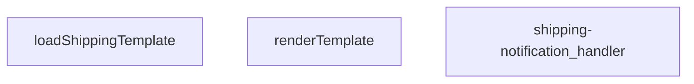

## Genel Bakış
Bu modül, bir Supabase Edge Function olarak kargo bildirimlerini yönetmek için tasarlanmış bir HTTP API uç noktasıdır. Temel işlevi, depolama alanından dinamik bir şablon yüklemek, gelen istek verileriyle birleştirerek kişiselleştirilmiş bir bildirim metni oluşturmaktır. Modül, istemcilerden gelen RESTful istekleri alıp, şablon tabanlı bir içerik üretim hattını koordine ederek sonucu döndürür.

## Fonksiyon Grupları
### Şablon Yönetimi
Bu grup, bildirim içeriğinin dinamik ve yeniden kullanılabilir olmasını sağlayan çekirdek şablon işleme mantığını kapsar. Fonksiyonlar, dış bir depolama alanından ham şablon şablonunu çeker ve bu şablonu belirli veri alanlarıyla doldurarak nihai, okunabilir metni üretir.
- `loadShippingTemplate`, `renderTemplate`

### İstek Koordinasyonu
Bu grup, modülün dış dünya ile olan tek temas noktasıdır ve tüm gelen HTTP isteklerinin yaşam döngüsünü yönetir. Aldığı ham isteği doğrulayıp işler, şablon yönetim fonksiyonlarını buna göre çağırır ve istemciye uygun durum kodları ve gövdelerle yanıt döndürerek iş akışını tamamlar.
- `shipping-notification_handler`

---

## AXIOMS – Mimari Varsayımlar
- Bu modül davranışsal mantık içermez (salt veri / konfigürasyon / tip tanımı).
- [Aksiyom 1]: Modülün dışa açtığı yapı (anahtar kümesi / şema) bir sözleşmedir; tüketiciler bu sabit yapıya bağlıdır — kırıcı değişiklik tüm tüketicileri etkiler.
- [Aksiyom 2]: Bir öğe ekleme/çıkarma yapısal-uyumlu olmalı; ilgili tipler ve seçiciler aynı commit'te güncel tutulmalıdır.

---

## FONKSİYON DETAYLARI

### renderTemplate

**Ne yapar**: Verilen bir şablon dizesindeki değişkenleri ve koşullu blokları (`{{#if ...}}`) gerçek verilerle değiştirerek nihai render edilmiş metni üretir. Basit bir şablon motoru görevi görür.

**Nasıl yapar**: Fonksiyon iki aşamalı bir regex tabanlı işleme uygular. Birinci aşamada, `{{#if KEY}}...{{/if}}` veya `{{#if KEY}}...{{if}}` kalıplarını eşleştirir; eğer `data` nesnesindeki ilgili anahtarın değeri truthy ise içeriği korur, aksi halde boş string ile değiştirir. İkinci aşamada, kalan `{{KEY}}` değişken kalıplarını eşleştirir ve `data` nesnesindeki karşılık gelen değeri (null veya undefined ise boş string, değilse `String()` ile dönüştürülmüş hali) ile değiştirir. Her iki aşama da `String.prototype.replace` ile global regex kullanılarak gerçekleştirilir.

**Parametreler**:
- `tpl`: `string` — İşlenecek şablon dizesi. İçerisinde `{{#if anahtar}}...{{/if}}` koşullu blokları ve `{{anahtar}}` değişken referansları barındırır.
- `data`: `Record<string, unknown>` — Şablondaki anahtar isimlerine karşılık gelen değerleri içeren nesne. Değerler herhangi bir tipte (`unknown`) olabilir; truthy/falsy kontrolü ve string dönüştürme buna göre yapılır.

**Dönüş**: `string` — Değişkenleri ve koşullu blokları işlenmiş, nihai render edilmiş metin döner.

### loadShippingTemplate
**Ne yapar**: Bu asenkron fonksiyon, kargo bildirimleri için kullanılan bir HTML e-posta şablonunu dosya sisteminden yükler.

**Nasıl yapar**: Fonksiyon, çağrıldığı dosyanın bulunduğu dizine göreceli olarak `./templates/email/shipping.html` yolundaki dosyayı okumak için `Deno.readTextFile` yöntemini kullanır. Bir `URL` nesnesi oluşturarak doğru mutlak yolu hesaplar. Dosya okuma işlemi başarısız olursa (örn. dosya mevcut değilse), bir `try...catch` bloğu ile yakalanır ve `null` değeri döndürülür.

**Parametreler**: Bu fonksiyon herhangi bir parametre almaz.

**Dönüş**: Promise<string | null> — Başarılı olursa HTML şablonunun içeriğini (string), başarısız olursa `null` değerini içeren bir promise.

### shipping-notification_handler
**Ne yapar**: Bu fonksiyon, kargo bildirimleriyle ilgili HTTP isteklerini işleyen bir sunucu işleyicisidir (handler). Gelen bir POST isteğini alır, ilgili iş mantığını yürütür ve bir HTTP yanıtı döndürür.

**Nasıl yapar**: Fonksiyonun gövdesi verilmemiştir; bu nedenle iç mantığı hakkında kesin bir bilgi bulunmamaktadır. Ancak imzasından ve adından yola çıkarak, bu fonksiyonun bir web framework'ün (örn. Deno Oak, Hono) istek işleyici (request handler) yapısında olduğu ve `Request` nesnesini `Response` nesnesine dönüştürdüğü çıkarılabilir. Fonksiyonun, bir kargo durumu güncellendiğinde tetiklenen bir webhook veya API endpoint'i işlediği varsayılabilir.

**Parametreler**:
- `req`: Request — Gelen HTTP istek nesnesi. İstek gövdesi, başlıkları ve URL parametrelerini içerir.

**Dönüş**: Response — İşlenen istekle ilgili HTTP yanıt nesnesi. Durum kodu, başlıklar ve opsiyonel bir gövde (örn. JSON yanıtı) içerebilir.

---

## İTHALATLAR (IMPORTS)
- import: ../_shared/cors.ts::getCorsHeaders
- import: ../_shared/sentry.ts::sentryCaptureException
- import: ../_shared/tenant_config.ts::getTenantBranding
- import: ../_shared/tenant_config.ts::resolveTenantId
- import: https://deno.land/std@0.168.0/http/server.ts::serve

---

## INTERFACES

### ShippingNotificationRequest
- `order_id: string`
- `customer_email: string`
- `customer_name: string`
- `order_number?: string`
- `carrier: string`
- `tracking_number: string`
- `tracking_url?: string | null`
- `tenant_id?: string`

### OrderRow
- `user_id?: string | null`
- `order_number?: string | null`
- `carrier?: string | null`
- `tracking_number?: string | null`
- `tracking_url?: string | null`

### AuthAdminUser
- `email?: string | null`
- `user_metadata?: { full_name?: string | null; name?: string | null } | null`

### ResendResult
- `id?: string`

### UserProfileRoleRow
- `role?: string | null`

---

## AST POINTERS

### [N1_NASIL] AST Pointer: supabase/functions/shipping-notification/index.ts::renderTemplate
- **params**: `(tpl: string, data: Record<string, unknown>)`
- **ic_degiskenler**:
  - `tpl` — Şablon stringi, if-block ve değişken replace işlemleri uygulanarak iteratif olarak güncellenir
  - `data` — Şablondaki `{{key}}` ve `{{#if key}}` ifadelerine karşılık gelen değerleri içeren dict
  - `_m` — İlk regex callback parametresi, eşleşen tam kalıbı temsil eder (kullanılmaz)
  - `key` — Regex grubundan çıkartılan değişken/blok adı (ör: `"tracking_number"`, `"is_shipped"`)
  - `inner` — `{{#if key}}...{{/if}}` arasındaki içerik stringi; koşul doğruysa korunur, değilse boş string ile değiştirilir
  - `v` — `data[key]` ile elde edilen değer; truthy kontrolü veya string dönüşümü için kullanılır
  - `truthy` — `v` değerinin boolean truthy olup olmadığı; if-block içeriğinin korunup korunmayacağını belirler
- **Dönüş**: `string` — Değişkenleri ve koşulları işlenmiş nihai şablon stringi

---

### [N2_NASIL] AST Pointer: supabase/functions/shipping-notification/index.ts::loadShippingTemplate
- **params**: `(yok)`
- **ic_degiskenler**:
  - `url` — `new URL('./templates/email/shipping.html', import.meta.url)` ile oluşturulan dosya yolu URL nesnesi; mevcut modül konumuna göremutlak dosya yolunu temsil eder
- **Dönüş**: `Promise<string | null>` — HTML şablon dosyasının içeriği; dosya bulunamazsa veya okunamazsa `null` döner

---

### [N3_NASIL] AST Pointer: supabase/functions/shipping-notification/index.ts::shipping-notification_handler
- **params**: `(req: Request)`
- **ic_degiskenler**:
  - `parsed` — Request body'sinden parse edilmiş JSON objesi; kargo bildirimi verilerini (alıcı, gönderici, sipariş no vb.) içerir
  - `RESEND_API_KEY` — Resend e-posta API anahtarı; `Authorization` header'da `Bearer` token olarak kullanılır
  - `fromAddr` — Gönderici e-posta adresi; `parsed` içinden提取 edilir ve Resend API'ye iletilir
  - `to` — Alıcı e-posta adresleri dizisi; Resend API'ye `to` alanında iletilir
  - `bccArr` — BCC alıcıları dizisi; boş değilse Resend API'ye `bcc` alanında iletilir, boşsa `undefined` gönderilir
  - `subject` — E-posta konu satırı; Resend API'ye `subject` alanında iletilir
  - `emailContent` — Doldurulmuş şablonun düz metin versiyonu; Resend API'ye `text` alanında iletilir
  - `html` — Doldurulmuş şablonun HTML versiyonu; Resend API'ye `html` alanında iletilir
  - `k` — Anonim `resolveField` callback içindeki döngü değişkeni; `keys` dizisi üzerinde iterasyon yapar
- **Dönüş**: `Response` — HTTP yanıt nesnesi; Resend API yanıtını veya hata yanıtını client'a iletir

---

### [N3a_NASIL] AST Pointer: supabase/functions/shipping-notification/index.ts::shipping-notification_handler::resolveField (anonim)
- **params**: `(keys: string[])`
- **ic_degiskenler**:
  - `k` — Mevcut iterasyondaki anahtar dizisi elemanı; `parsed` dict'inde aranır
  - `v` — `parsed[k]` ile elde edilen değer; string olup boş olmadığını veya number olup finite olup olmadığı kontrol edilir
  - `s` — `v` değerinin `.trim()` ile boşlukları temizlenmiş hali; boş string olup olmadığı denetlenir
- **Dönüş**: `string | null` — İlk geçerli (boş olmayan string veya finite number) değerin string karşılığı; hiçbiri uygun değilse `null`

---

### [N3b_NASIL] AST Pointer: supabase/functions/shipping-notification/index.ts::shipping-notification_handler::sendEmail (iç fonksiyon)
- **params**: `(fromAddr: string, to: string[], bccArr: string[])`
- **ic_degiskenler**:
  - `RESEND_API_KEY` — Ortam değişkeninden okunan Resend API anahtarı; `fetch` isteğinin `Authorization` header'ında kullanılır
  - `subject` — Üst kapsamdan erişilen e-posta konu satırı
  - `emailContent` — Üst kapsamdan erişilen düz metin e-posta içeriği
  - `html` — Üst kapsamdan erişilen HTML e-posta içeriği
- **Dönüş**: `Promise<Response>` — Resend API (`https://api.resend.com/emails`) POST yanıtını döner

---

## MERMAID CALL GRAPH

## NODE ID STANDARD

  file: supabase\functions\shipping-notification\index.ts
  function: supabase\functions\shipping-notification\index.ts::renderTemplate
  function: supabase\functions\shipping-notification\index.ts::loadShippingTemplate
  function: supabase\functions\shipping-notification\index.ts::shipping-notification_handler

---

## DISA AKTARILANLAR (EXPORTS)
  export: loadShippingTemplate
  export: renderTemplate
  export: shipping-notification_handler