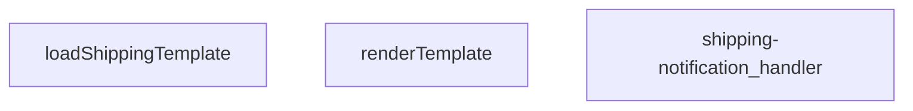

## Genel Bakış
Bu modül, Supabase üzerinden gönderilen bildirimlerin içeriğini hazırlayıp göndermek için kullanılır. Şablonları yükler, verileri bu şablonlara yerleştirir ve ardından HTTP isteği olarak yanıt üretir.

## Fonksiyon Grupları
### Şablon İşleme
Şablon dosyalarını okur ve gelen veriyle doldurarak最终 metni üretir.
- renderTemplate
- loadShippingTemplate

### Ana İşleyici
Gelen istekleri alır, gerekli verileri toplar, şablonu oluşturur ve uygun HTTP yanıtını döndürür.
- shipping-notification_handler

---

## AXIOMS – Mimari Varsayımlar
Bu modül, işlevlerinin doğru çalışabilmesi için girdi tiplerinin ve dış kaynakların mevcut olmasını varsayar.

[Aksiyom 1]: Eğer `renderTemplate` fonksiyonuna `tpl` parametresi string türünde değilse, şablon işleme hatası oluşur.  
[Aksiyom 2]: Eğer `renderTemplate` fonksiyonuna `_data` parametresi `Record<string, unknown>` türünde değilse (örneğin `null` veya primitive bir değer), veri eşleştirmesi beklenen şekilde çalışmaz.  
[Aksiyom 3]: Eğer `loadShippingTemplate` fonksiyonu çağrıldığında beklenen şablon dosyaları dosya sisteminde veya storage'da bulunamazsa, fonksiyon `undefined` ya da bir hata döndürür.  
[Aksiyom 4]: Eğer `shipping-notification_handler` fonksiyonuna gelen `req` nesnesi gerekli özellikleri (örneğin `body`, `method`) içermiyorsa, işleyici istek işleyemeyecek ve hata yanıtı döndürebilir.  
[Aksiyom 5]: Eğer `shipping-notification_handler` içindeki `renderTemplate` ve `loadShippingTemplate` çağrılarından biri başarısız olursa, handler hata durumuna düşer ve beklenen yanıt üretilemez.

---

## FONKSIYON DETAYLARI

### renderTemplate
**Ne yapar**: Verilen şablon stringini, sağlanan veri nesnesiyle doldurur ve sonuç stringini döndürür.  
**Nasıl yapar**: `tpl` parametresindeki şablon içinde yer tutucuları `_data` nesnesindeki anahtar-değer çiftleriyle değiştirerek işler.  
**Parametreler**:
- tpl: string — İşlenecek şablon metni  
- _data: Record<string, unknown> — Şablon içinde kullanılacak veri nesnesi  
**Dönüş**: string — Doldurulmuş şablon sonucu  

### loadShippingTemplate
**Ne yapar**: Gönderi bildirimi için kullanılan şablon dosyasını asenkron olarak okur ve içeriği döndürür.  
**Nasıl yapar**: Dosya sistemi veya bir depolama katmanından şablon içeriğini alır; başarılıysa string olarak, bulunamazsa null olarak Promise içinde döndürür.  
**Parametreler**: (yok)  
**Dönüş**: Promise<string | null> — Şablon içeriği veya bulunamadığı durumda null  

### shipping-notification_handler
**Ne yapar**: Gelen HTTP isteklerini işleyerek gönderi bildirimini oluşturur ve uygun HTTP yanıtını döndürür.  
**Nasıl yapar**: İstek nesnesinden gerekli bilgileri çıkarır, `loadShippingTemplate` ve `renderTemplate` fonksiyonlarını kullanarak bildirim içeriğini hazırlar ve bu içeriği taşıyan bir Response nesnesi üretir.  
**Parametreler**:
- req: — İşlenecek HTTP isteği (tipi belirtilmemiş)  
**Dönüş**: Response — İstemciye gönderilecek HTTP yanıtı

---

## INTERFACES

### ShippingNotificationRequest
- `order_id: string`
- `customer_email: string`
- `customer_name: string`
- `order_number?: string`
- `carrier: string`
- `tracking_number: string`
- `tracking_url?: string | null`

---

## AST POINTERS

### [N1_NASIL] AST Pointer: C:\Users\alize\venthub-hvac\supabase\functions\shipping-notification\index.ts::renderTemplate
- **params**: (tpl: string, _data: Record<string, unknown>)
- **ic_degiskenler**: her değişken için "isim — ne işe yarar" formatında
  - `tpl` — İşlenecek HTML şablon metni, regex değiştirmeleriyle güncellenir
  - `_data` — Şablondaki değişken ve koşullara doldurulacak veri kaynağı
  - `_m` — İlk regex replace'te tam eşleşen metin, kullanılmaz
  - `key` — If koşulunda kontrol edilen _data içindeki anahtar adı
  - `inner` - If koşulu doğruysa şablona eklenecek iç metin
  - `v` — _data üzerinden alınan anahtarın değeri
  - `truthy` — Değerin boolean olarak doğruluğunu hesaplayan değişken
  - `_m` — İkinci regex replace'te tam eşleşen metin, kullanılmaz
  - `key` — Değişken olarak işlenen _data içindeki anahtar adı
  - `v` — _data üzerinden alınan değişkenin değeri
- **Dönüş**: string (işlenmiş, tamamen doldurulmuş şablon metni)

### [N2_NASIL] AST Pointer: C:\Users\alize\venthub-hvac\supabase\functions\shipping-notification\index.ts::replace_if_callback
- **params**: (_m, key: string, inner: string)
- **ic_degiskenler**:
  - `v` — _data üzerinden alınan anahtarın değeri
  - `truthy` — Değerin geçerliliğini kontrol eden boolean değer
- **Dönüş**: string (koşul doğruysa iç metin, yanlışsa boş string)

### [N3_NASIL] AST Pointer: C:\Users\alize\venthub-hvac\supabase\functions\shipping-notification\index.ts::replace_var_callback
- **params**: (_m, key: string)
- **ic_degiskenler**:
  - `v` — _data üzerinden alınan anahtarın değeri
- **Dönüş**: string (değerin string hali, değer null/undefined ise boş string)

### [N4_NASIL] AST Pointer: C:\Users\alize\venthub-hvac\supabase\functions\shipping-notification\index.ts::loadShippingTemplate
- **params**: (parametre yok)
- **ic_degiskenler**:
  - `url` — Şablon dosyasının tam yolunu oluşturan URL nesnesi
  - `Deno.readTextFile` — Dosya okuma sistem çağrısı
- **Dönüş**: Promise<string | null> (şablon metni veya hata durumunda null)

### [N5_NASIL] AST Pointer: C:\Users\alize\venthub-hvac\supabase\functions\shipping-notification\index.ts::shipping-notification_handler
- **params**: (req)
- **ic_degiskenler**:
  - `requestOrigin` — İsteğin origin başlığından alınan kaynak adresi
  - `requestHeaders` — CORS istek başlıkları değeri
  - `requestMethod` — CORS izin verilen metot değeri
  - `Deno.env.get('ALLOWED_ORIGINS')` — İzin verilen originler ortam değişkeni değeri
  - `allowedOrigins` — Temizlenmiş, boş olmayan origin listesi
  - `originAllowed` — İsteğin origininin izin listesinde olup olmadığını gösteren boolean
  - `corsHeaders` — Tüm yanıtlara eklenecek CORS başlıklarını içeren nesne
  - `body` — İsteğin ayrıştırılmış JSON gövdesi
  - `order_id` — Gövbeden alınan sipariş benzersiz kimliği
  - `customer_email` — Müşterinin email adresi
  - `customer_name` — Müşterinin tam adı
  - `carrier` — Kargo firmasının adı
  - `tracking_number` — Kargo takip numarası
  - `tracking_url` — Kargo takip web bağlantısı
  - `order_number` — Siparişin kullanıcı dostu numarası
  - `missing` - Zorunlu olup gönderilmemiş alanların listesi
  - `Deno.env.get('SUPABASE_URL')` — Supabase proje URL'si ortam değişkeni
  - `Deno.env.get('SUPABASE_SERVICE_ROLE_KEY')` — Yönetici erişimli Supabase anahtarı
  - `authHeader` — İstekten alınan yetkilendirme başlığı değeri
  - `isAuthorized` — İsteğin yetkili olup olmadığını gösteren boolean
  - `Deno.env.get('SUPABASE_ANON_KEY')` — Herkese açık Supabase anon anahtarı
  - `createClient` — Supabase istemcisi oluşturma fonksiyonu (dynamik import)
  - `authClient` — Oluşturulan Supabase auth istemcisi
  - `user` - Auth sistemi üzerinden doğrulanan kullanıcı nesnesi
  - `roleCheck` — Kullanıcı rolü sorgusu için yapılan fetch yanıtı
  - `arr` — Rol sorgusundan dönen JSON yanıt dizisi
  - `arr[0]` — Sorgudan dönen ilk kullanıcı profili nesnesi
  - `role` — Kullanıcının sistemdeki rolü (admin/superadmin vb.)
  - `err` — Yetkilendirme adımında yakalanan hata nesnesi
  - `Deno.env.get('RESEND_API_KEY')` — Email gönderim servisi Resend'in API anahtarı
  - `Deno.env.get('EMAIL_FROM')` — Gönderici olarak kullanılacak email adresi
  - `o` — Sipariş numarası sorgusu için yapılan Supabase fetch yanıtı
  - `arr[0]` — Sipariş sorgusundan dönen ilk sipariş nesnesi
  - `prettyOrderNo` — Email içeriğinde gösterilecek formatlanmış sipariş numarası
  - `subject` — Email konusu metni
  - `html` — Email içeriği olarak kullanılacak HTML metni
  - `resp` — Resend API'ye gönderilen email isteği yanıtı
  - `t` — Resend hatası durumunda yanıt metni
  - `error` — Ana iş akışında yakalanan genel hata nesnesi
  - `msg` — Hata nesnesinden dönüştürülen string hata mesajı
  - `sentryCaptureException` — Hatayı hata takip servisi Sentry'ye gönderen fonksiyon çağrısı
- **Dönüş**: Response (tüm durumlar için uygun http durum kodu, başlık ve içerikle yanıt)

---

## MERMAID CALL GRAPH

## NODE ID STANDARD

  file: supabase\functions\shipping-notification\index.ts
  function: supabase\functions\shipping-notification\index.ts::renderTemplate
  function: supabase\functions\shipping-notification\index.ts::loadShippingTemplate
  function: supabase\functions\shipping-notification\index.ts::shipping-notification_handler

---

## DISA AKTARILANLAR (EXPORTS)
  export: loadShippingTemplate
  export: renderTemplate
  export: shipping-notification_handler