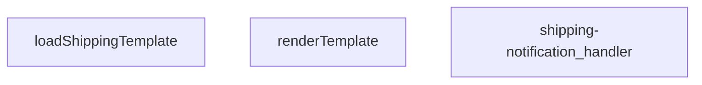

## Genel Bakış
Bu modül, kargo bildirimleri için bir HTTP uç noktasıdır. Gelen isteklere yanıt olarak, depolama alanındaki şablonları yükler, istek verileriyle birleştirerek bildirim metni oluşturur ve bunu istemciye iletir.

## Fonksiyon Grupları
### Şablon İşleme
Gerekli şablonu depolama alanından yükler ve şablon içindeki yer tutucuları verilen verilerle değiştirerek nihai bildirim metnini üretir.
- loadShippingTemplate, renderTemplate

### İstek Koordinasyonu
Gelen HTTP isteklerini yönetir, şablon yükleme ve işleme adımlarını koordine ederek istemciye uygun bir yanıt döndürür.
- shipping-notification_handler

---

## AXIOMS – Mimari Varsayımlar

Bu modül için temel mimari varsayımlar, fonksiyon imzaları ve mevcut doküman bilgisi temelinde aşağıdakilerdir.

[Aksiyom 1]: Eğer `loadShippingTemplate` fonksiyonu çağrıldığında depolama alanındaki şablon dosyası erişilebilir değilse veya mevcut değilse, fonksiyon hata fırlatır (örneğin, bir istisna) veya uygun bir hata yönetimi mekanizması devreye girer.

[Aksiyom 2]: Eğer `renderTemplate` fonksiyonu çağrıldığında `tpl` parametresi geçerli bir şablon dizesi değilse (örneğin, boş string veya `null`/`undefined`), fonksiyonun davranışı belirsizdir veya hata oluşur. Fonksiyon, şablonu `_data` parametresiyle birleştirebilir.

[Aksiyom 3]: Eğer `shipping-notification_handler` fonksiyonu bir HTTP isteği (`req`) ile çağrıldığında, istek içinde gerekli veriler (örneğin, şablonu dolduracak veri alanları) eksikse, şablon işleme kısmen tamamlanır veya eksik veriler için boş/varsayılan değerler kullanılır.

[Aksiyom 4]: Eğer `shipping-notification_handler` fonksiyonu bir HTTP isteği (`req`) ile çağrıldığında, istek yöntemi (HTTP method) modülün beklediği yöntem (örneğin, POST) değilse, fonksiyon uygun bir HTTP hata kodu (örneğin, 405 Method Not Allowed) ile yanıt verir.

[Aksiyom 5]: Eğer `loadShippingTemplate` fonksiyonu başarıyla bir şablon yüklerse, bu şablon `renderTemplate` fonksiyonuna geçerli bir string olarak传递 edilmelidir. Aksi halde, `renderTemplate` işlevi düzgün çalışamaz.

[Aksiyom 6]: Eğer `renderTemplate` fonksiyonu, `_data` parametresinde şablonda referans alan ancak veri setinde bulunmayan bir anahtar (key) içeriyorsa, bu anahtar için şablonda boş bir alan veya belirli bir hata işleme davranışı gösterilir.

[Aksiyom 7]: Eğer `shipping-notification_handler` fonksiyonu bir HTTP yanıtı oluştururken, yanıtın içeriği (content type) metin tabanlı olmalıdır (örneğin, `text/plain` veya `text/html`), çünkü modül bildirim metni üretir.

---

## FONKSİYON DETAYLARI

### renderTemplate

**Ne yapar**: Bir HTML şablonu dizesini alır ve içindeki değişken yer tutucularını (`{{değişken}}`) ile koşullu blokları (`{{#if değişken}}...{{/if}}`) verilen nesnedeki değerlerle değiştirerek son HTML çıktısını üretir.

**Nasıl yapar**: Fonksiyon iki aşamalı bir `String.replace` Zinciri kullanır. Birinci adımda, `{{#if anahtar}}içerik{{/if}}` kalıbını eşleştiren bir正则表达ión (regex) ile koşullu blokları işler: eğer `_data` nesnesindeki ilgili anahtarın değeri truthy ise bloğun içeriğini korur, aksi takdirde boş dize ile değiştirir. İkinci adımda, `{{anahtar}}` kalıbını eşleştiren bir regex ile kalan değişken yer tutucularını `_data` nesnesindeki karşılık gelen değerlerle (`String` dönüşümü yapılarak) değiştirir; değer `null` veya `undefined` ise boş dize kullanılır. Her iki regex操作ı da `[\s\S]*?` gibi `s` bayrağı emulasyonu içeren eşzamanlı (greedy olmayan) eşleştirmeler kullanarak çok satırlı içeriği doğru şekilde yakalar.

**Parametreler**:
- `tpl`: `string` — Değişkenler ve koşullu bloklar içeren ham HTML şablonu dizesi.
- `_data`: `Record<string, unknown>` — Şablondaki yer tutuculara karşılık gelecek değerleri barındıran anahtar-değer çiftlerinden oluşan nesne. Değerler `unknown` tipinde olup, koşullu bloklarda truthy/falsy kontrolüne tabi tutulur; değişken yerleştirmelerde ise `String()` ile dizeye dönüştürülür.

**Dönüş**: `string` — Tüm yer tutucuların ve koşullu blokların işlenmiş, doğrudan kullanılabilir ham HTML dizesi.

### loadShippingTemplate
**Ne yapar**: Bu asenkron fonksiyon, kargo bildirimleri için kullanılan bir HTML e-posta şablonunu dosya sisteminden yükler.

**Nasıl yapar**: Fonksiyon, çağrıldığı dosyanın bulunduğu dizine göreceli olarak `./templates/email/shipping.html` yolundaki dosyayı okumak için `Deno.readTextFile` yöntemini kullanır. Bir `URL` nesnesi oluşturarak doğru mutlak yolu hesaplar. Dosya okuma işlemi başarısız olursa (örn. dosya mevcut değilse), bir `try...catch` bloğu ile yakalanır ve `null` değeri döndürülür.

**Parametreler**: Bu fonksiyon herhangi bir parametre almaz.

**Dönüş**: Promise<string | null> — Başarılı olursa HTML şablonunun içeriğini (string), başarısız olursa `null` değerini içeren bir promise.

### shipping-notification_handler
**Ne yapar**: Bu fonksiyon, kargo bildirimleriyle ilgili HTTP isteklerini işleyen bir sunucu işleyicisidir (handler). Gelen bir POST isteğini alır, ilgili iş mantığını yürütür ve bir HTTP yanıtı döndürür.

**Nasıl yapar**: Fonksiyonun gövdesi verilmemiştir; bu nedenle iç mantığı hakkında kesin bir bilgi bulunmamaktadır. Ancak imzasından ve adından yola çıkarak, bu fonksiyonun bir web framework'ün (örn. Deno Oak, Hono) istek işleyici (request handler) yapısında olduğu ve `Request` nesnesini `Response` nesnesine dönüştürdüğü çıkarılabilir. Fonksiyonun, bir kargo durumu güncellendiğinde tetiklenen bir webhook veya API endpoint'i işlediği varsayılabilir.

**Parametreler**:
- `req`: Request — Gelen HTTP istek nesnesi. İstek gövdesi, başlıkları ve URL parametrelerini içerir.

**Dönüş**: Response — İşlenen istekle ilgili HTTP yanıt nesnesi. Durum kodu, başlıklar ve opsiyonel bir gövde (örn. JSON yanıtı) içerebilir.

---

## İTHALATLAR (IMPORTS)
- import: ../_shared/cors.ts::getCorsHeaders
- import: ../_shared/sentry.ts::sentryCaptureException
- import: ../_shared/tenant_config.ts::getTenantBranding
- import: ../_shared/tenant_config.ts::resolveTenantId
- import: https://deno.land/std@0.168.0/http/server.ts::serve

---

## INTERFACES

### ShippingNotificationRequest
- `order_id: string`
- `customer_email: string`
- `customer_name: string`
- `order_number?: string`
- `carrier: string`
- `tracking_number: string`
- `tracking_url?: string | null`
- `tenant_id?: string`

---

## AST POINTERS

### [N1_NASIL] AST Pointer: shipping-notification/index.ts::renderTemplate
- **params**: (tpl: string, _data: Record<string, unknown>)
- **ic_degiskenler**:
  - `_m` — regex eşleşmenin tam dizesi (ilk callback parametresi, kullanılmıyor)
  - `key` — template içindeki değişken adı ({{key}} formatında)
  - `inner` — if bloğu içindeki template içeriği (sadece {{#if}} callback'inde)
  - `v` — _data[key] ile elde edilen değer (hem if hem değişken callback'inde)
  - `truthy` — v değerinin truthy olup olmadığını gösteren boolean
- **Dönüş**: string

### [N2_NASIL] AST Pointer: shipping-notification/index.ts::loadShippingTemplate
- **params**: ()
- **ic_degiskenler**:
  - `url` — email template dosyasının URL nesnesi (import.meta.url referanslı)
- **Dönüş**: Promise<string | null>

### [N3_NASIL] AST Pointer: shipping-notification/index.ts::shipping-notification_handler
- **params**: (req: Request)
- **ic_degiskenler**:
  - `requestOrigin` — HTTP isteğinin origin header'ı
  - `allowedOrigins` — virgülle ayrılmış izin verilen kökenlerin listesi (env'den parse edilmiş)
  - `originAllowed` — istek kökeninin izin verilenler listesinde olup olmadığını gösteren boolean
  - `corsHeaders` — getCorsHeaders() ile elde edilen CORS header'ları
  - `body` — POST body'sinden parse edilen ShippingNotificationRequest nesnesi
  - `order_id` — sipariş ID'si (body.order_id)
  - `customer_email` — müşteri email adresi (body.customer_email)
  - `customer_name` — müşteri adı (body.customer_name)
  - `carrier` — kargo firması adı (body.carrier)
  - `tracking_number` — kargo takip numarası (body.tracking_number)
  - `tracking_url` — kargo takip URL'i (body.tracking_url)
  - `order_number` — sipariş numarası (body.order_number, opsiyonel)
  - `tenantId` — resolveTenantId() ile elde edilen kiracı ID'si
  - `branding` — getTenantBranding() ile elde edilen kiracı marka bilgileri
  - `missing` — eksik alanların listesi (validasyon hatası durumunda)
  - `SUPABASE_URL` — Supabase servis URL'i (env'den)
  - `SERVICE_KEY` — Supabase servis rolü anahtarı (env'den)
  - `authHeader` — HTTP Authorization header'ı
  - `isAuthorized` — kullanıcının yetkili olup olmadığını gösteren boolean
  - `anonKey` — Supabase anon anahtarı (env'den, auth fallback içinde)
  - `authClient` — Supabase kimlik doğrulama istemcisi (dinamik import ile)
  - `user` — authClient.auth.getUser() sonucundaki kullanıcı nesnesi
  - `roleCheck` — kullanıcı rolünü kontrol eden REST API isteği sonucu
  - `arr` — roleCheck.json() sonucu dizi (rol kontrolü için)
  - `role` — kullanıcının rolü (arr[0]?.role)
  - `RESEND_API_KEY` — Resend e-posta servisi API anahtarı (env'den)
  - `EMAIL_FROM` — e-posta gönderim adresi (branding.emailFrom'dan)
  - `o` — sipariş numarasını çeken REST API isteği sonucu (order_number eksikse)
  - `arr` — o.json() sonucu dizi (sipariş numarası çözümleme için)
  - `brandName` — kiracı marka adı (branding.brandName)
  - `brandPrimary` — kiracı ana renk kodu (branding.brandPrimaryColor)
  - `brandLogoUrl` — kiracı logo URL'i (branding.brandLogoUrl)
  - `prettyOrderNo` — formatlanmış sipariş numarası (# işareti ile)
  - `subject` — e-posta konu satırı
  - `html` — e-posta HTML içeriği (template veya fallback)
  - `resp` — Resend API'ye gönderilen e-posta isteği sonucu
  - `t` — resp.text() sonucu (hata durumunda)
  - `result` — resp.json() sonucu (başarılı gönderim sonrası)
- **Dönüş**: Promise<Response> (yan etkiler: e-posta gönderir, hata logları)

---

## MERMAID CALL GRAPH

## NODE ID STANDARD

  file: supabase\functions\shipping-notification\index.ts
  function: supabase\functions\shipping-notification\index.ts::renderTemplate
  function: supabase\functions\shipping-notification\index.ts::loadShippingTemplate
  function: supabase\functions\shipping-notification\index.ts::shipping-notification_handler

---

## DISA AKTARILANLAR (EXPORTS)
  export: loadShippingTemplate
  export: renderTemplate
  export: shipping-notification_handler