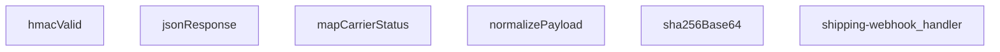

## Genel Bakış
Bu modül, kargo firmalarından gelen webhook bildirimlerini alıp işleyen merkezi bir Supabase Edge Function'dur. HMAC-SHA256 imza doğrulaması ile güvenli kabul edilen istekleri işler, farklı kargo firmalarının değişken veri yapılarını standart bir forma dönüştürerek siparişlerin kargo durumunu günceller. Mimari açıdan, tüm kargo entegrasyonları için tek bir giriş noktası ve veri normalizasyon katmanı sunarak bakım ve genişletmeyi kolaylaştırır.

## Fonksiyon Grupları
### Güvenlik ve Yanıt Yardımcıları
Bu grup, webhook isteklerinin otentikasyonu için kriptografik imza doğrulamasını ve standart JSON HTTP yanıtlarının oluşturulmasını sağlar.
- hmacValid, sha256Base64, jsonResponse

### Veri Dönüştürme ve Durum Haritalama
Farklı kargo firmalarının özel payload yapılarını merkezi ve işlenebilir bir normalize forma çevirir; ayrıca firma bazlı durum kodlarını modülün iç durum yapısına eşleyerek çoklu kargo desteği sağlar.
- normalizePayload, mapCarrierStatus

### Ana Webhook İşleyici
Modülün giriş noktasıdır; gelen HTTP isteğini alarak güvenlik doğrulaması, payload normalizasyonu, durum haritalama ve nihai güncelleme yanıtı oluşturma adımlarını orkestra eder.
- shipping-webhook_handler

---

## AXIOMS – Mimari Varsayımlar

Bu modül, kargo firması webhook'larını HMAC-SHA256 ile doğrulayıp, çoklu kargo firması formatlarını standart forma dönüştürerek kargo durumunu güncellemek üzere tasarlanmıştır.

**[Aksiyom 1 - HMAC Doğrulama Zinciri]:** Eğer `hmacValid` fonksiyonuna geçerli bir `secret`, orijinal `raw` gövde ve geçerli bir `signatureHeader` sağlanmazsa, istek HMAC-SHA256 doğrulamasından geçemez ve webhook işlenemez.

**[Aksiyom 2 - Kargo Firması Durum Eşleme]:** Eğer `mapCarrierStatus` fonksiyonuna bilinmeyen veya eşlenemeyen bir kargo durumu `input` değeri girilirse, dönen nesnede `status`, `setShipped` ve `setDelivered` alanlarının tamamı `undefined` kalır; sipariş durumu güncellenemez.

**[Aksiyom 3 - Payload Normalizasyonu]:** Eğer `normalizePayload` fonksiyonuna geçerli bir `carrierHint` (tanınmış kargo firması kodu) sağlanmazsa veya `obj` beklenen formatta bir payload içermiyorsa, payload standart forma normalize edilemez.

**[Aksiyom 4 - Zaman Kayması Toleransı]:** Eğer `SKEW_MS` sabiti (binary expression ile hesaplanan eşik değeri) HMAC zaman damgası doğrulamasında kullanılmazsa, geçerli istekler zaman aşımı nedeniyle reddedilebilir veya süresi dolmuş istekler kabul edilebilir.

**[Aksiyom 5 - Yanıt Formatı]:** Eğer `jsonResponse` fonksiyonu, geçerli bir HTTP `init` (status code, headers) ile çağrılmazsa, webhook istemcisi geçerli bir JSON yanıt alamaz ve hata durumu bildirilemez.

**[Aksiyom 6 - SHA256 Hash Hesaplama]:** Eğer `sha256Base64` fonksiyonuna geçerli bir string `input` sağlanmazsa, HMAC imza hesaplaması başarısız olur ve dolayısıyla tüm webhook istekleri reddedilir.

**[Aksiyom 7 - Ana Handler Akışı]:** Eğer `shipping-webhook_handler` fonksiyonu geçerli bir `Request` nesnesi almazsa veya istek gövdesi (body) okunamazsa, HMAC doğrulaması ve payload normalizasyonu gerçekleştirilemez; işlenmemiş bir hata yanıtı döner.

---

## FONKSİYON DETAYLARI

### jsonResponse
**Ne yapar**: Bu fonksiyon, HTTP yanıtları için standart bir JSON formatı oluşturur. Gövdeyi JSON stringine dönüştürür ve uygun `content-type` başlığını ekler.
**Nasıl yapar**: `JSON.stringify` kullanarak gövdeyi formatlanmış (2 boşluk girintili) bir string'e çevirir. Ardından, `ResponseInit` nesnesinden gelen başlıkları ve durum kodunu (varsayılan olarak 200) kullanarak yeni bir `Response` nesnesi döndürür.
**Parametreler**:
- body: unknown — Yanıt gövdesi olarak kullanılacak herhangi bir veri. Fonksiyon tarafından JSON'a dönüştürülecektir.
- init: ResponseInit — `status`, `headers` ve diğer HTTP yanıt seçeneklerini içeren opsiyonel bir nesne. Boş nesne `{}` varsayılanıdır.
**Dönüş**: `Response` — JSON verisini, uygun başlığı ve HTTP durum kodunu içeren standart bir HTTP yanıt nesnesi.

### hmacValid
**Ne yapar**: Verilen bir HMAC-SHA256 imzasının geçerliliğini doğrular. Bu, webhook isteklerinin kimliğini doğrulamak için kullanılır.
**Nasıl yapar**: `crypto.subtle` API'sini kullanarak verilen `secret` anahtarıyla ham `raw` verisinin HMAC-SHA256 imzasını hesaplar. Hesaplanan imzayı base64 formatına dönüştürür. Gelen `signatureHeader` değerini normalleştirerek (başındaki "sha256=" kısmını ve boşlukları temizleyerek) hesaplanan imzayla karşılaştırır.
**Parametreler**:
- secret: string — HMAC imza hesaplamasında kullanılacak gizli anahtar.
- raw: string — İmzası doğrulanacak ham veri (çoğunlukla HTTP gövdesi).
- signatureHeader: string — İstekle birlikte gelen ve doğrulanacak imza değeri (ör. "sha256=...").
**Dönüş**: `Promise<boolean>` — İmza geçerliyse `true`, değilse veya bir hata oluştuysa `false` döner.

### mapCarrierStatus
**Ne yapar**: Farklı kargo şirketlerinin durum metinlerini, uygulama içinde tutarlı ve tanımlı bir durum setine ve ilgili bayraklara dönüştürür.
**Nasıl yapar**: Girdiyi küçük harfe çevirir ve tanımlı durum listelerine göre eşleştirmeler yapar. Her eşleşme, uygulamanın kendi `status` alanını ve siparişin shipped/delivered olarak işaretlenip işaretlenmeyeceğini (`setShipped`, `setDelivered`) belirten boolean bayrakları döndürür. Tanımlanmamış bir durum ise olduğu gibi döner.
**Parametreler**:
- input?: string — Harita dışı bırakılacak kargo şirketi durum metni (ör. "IN_TRANSIT", "delivered"). Opsiyoneldir.
**Dönüş**: `{ status?: string; setShipped?: boolean; setDelivered?: boolean }` — Eşlenen durum bilgisini ve bayrakları içeren bir nesne. Tanınmayan bir durum girdisi varsa, `status` alanı girdinin kendisi olur.

### normalizePayload
**Ne yapar**: Farklı kargo şirketlerinin farklı yapıdaki webhook yüklerini (payload), uygulamanın beklediği tek ve standart bir formata dönüştürür.
**Nasıl yapar**: `carrierHint` parametresinden veya nesnenin kendi `carrier` alanından kargo şirketini belirler. `pick` adlı bir iç fonksiyon ile, olası farklı alan adlarını (ör. `order_id`, `orderId`, `id`) sırasıyla kontrol ederek ilk bulunan değeri alır. Bu sayede gelen verinin yapısı ne olursa olsun, aynı çıktı alanlarına (`order_id`, `tracking_number`, `status` vb.) sahip düzgün bir nesne oluşturulur.
**Parametreler**:
- carrierHint: string — Kargo şirketi bilgisi (ör. "ups", "fedex"). Yük içindeki `carrier` alanından önce kontrol edilir veya onu tamamlar.
- obj: unknown — Webhook'tan gelen ham JSON nesnesi.
**Dönüş**: `Record<string, string>` — `order_id`, `order_number`, `carrier`, `tracking_number`, `tracking_url`, `status`, `shipped_at` ve `delivered_at` alanlarını içeren, değerleri string'e dönüştürülmüş standart bir nesne.

### sha256Base64
**Ne yapar**: Verilen bir girdi string'inin SHA-256 özetini hesaplar ve sonucu base64 formatında döndürür.
**Nasıl yapar**: `TextEncoder` kullanarak string'i byte dizisine dönüştürür. `crypto.subtle.digest` ile SHA-256 hash hesaplar. Elde edilen byte dizisini `btoa(String.fromCharCode(...))`-yardımıyla base64 formatına kodlar.
**Parametreler**:
- input: string — Hash'i hesaplanacak veri.
**Dönüş**: `Promise<string>` — Hesaplanan SHA-256 özetinin base64 encoded hali.

### shipping-webhook_handler
**Ne yapar**: Gelen HTTP isteğini (webhook) işleyerek, taşıyıcıdan gelen veriyi doğrular, normalleştirir ve uygun yanıtı döndürür.  
**Nasıl yapar**: İstek `req` nesnesinden okunur, HMAC doğrulaması `hmacValid` ile yapılır, payload `normalizePayload` ile standartlaştırılır, taşıyıcı durumu `mapCarrierStatus` ile yorumlanır ve sonuç `jsonResponse` aracılığıyla JSON formatında yanıt olarak gönderilir.  
**Parametreler**:
- req: Request — Webhook çağrısını temsil eden HTTP isteği nesnesi.  
**Dönüş**: Response — İşlem sonucunu içeren HTTP yanıtı.

---

## İTHALATLAR (IMPORTS)
- import: ../_shared/tenant.ts::tenantFromRow
- import: https://esm.sh/@supabase/supabase-js@2.45.4::createClient

---

## SABİTLER
- **SKEW_MS** (binary_expression) — `5 * 60 * 1000`

---

## AST POINTERS

### [N1_NASIL] AST Pointer: `C:\Users\alize\venthub-wt-hotfix\supabase\functions\shipping-webhook\index.ts`::jsonResponse
- **params**: (body: unknown, init: ResponseInit = {})
- **ic_degiskenler**:
  - `body` — JSON'laştırılacak gövde
  - `init` — Response başlatma seçenekleri (status, headers)
- **Dönüş**: Response nesnesi

### [N2_NASIL] AST Pointer: `C:\Users\alize\venthub-wt-hotfix\supabase\functions\shipping-webhook\index.ts`::hmacValid
- **params**: (secret: string, raw: string, signatureHeader: string)
- **ic_degiskenler**:
  - `key` — HMAC-SHA256 için gizli anahtar
  - `sigBytes` — Hesaplanan imza baytları
  - `computed` — Base64'e kodlanmış hesaplanan imza
  - `normalize` — İmza başlığını normalleştiren fonksiyon (sha256= ön ekini kaldırır)
  - `given` — Verilen imza başlığı
- **Dönüş**: boolean (imza geçerli mi)

### [N3_NASIL] AST Pointer: `C:\Users\alize\venthub-wt-hotfix\supabase\functions\shipping-webhook\index.ts`::mapCarrierStatus
- **params**: (input?: string)
- **ic_degiskenler**:
  - `s` — Kullanıcı girdisinin küçük harfli versiyonu
- **Dönüş**: { status?: string; setShipped?: boolean; setDelivered?: boolean }

### [N4_NASIL] AST Pointer: `C:\Users\alize\venthub-wt-hotfix\supabase\functions\shipping-webhook\index.ts`::normalizePayload
- **params**: (carrierHint: string, obj: unknown)
- **ic_degiskenler**:
  - `rec` — obj'nin Record<string, unknown> tipine dönüştürülmüş hali
  - `c` — Kargo sağlayıcı adı (küçük harf, trim)
  - `pick` — birden fazla anahtar arasından ilk mevcut değeri alan fonksiyon
  - `norm` — normalize edilmiş payload nesnesi
  - `carrierHint` parametresi — istek başlığından gelen kargo ipucu
  - `obj` parametresi — ham payload verisi
- **Dönüş**: norm objesi (order_id, order_number, carrier, tracking_number, tracking_url, status, shipped_at, delivered_at alanlarını içerir)

### [N5_NASIL] AST Pointer: `C:\Users\alize\venthub-wt-hotfix\supabase\functions\shipping-webhook\index.ts`::sha256Base64
- **params**: (input: string)
- **ic_degiskenler**:
  - `bytes` — input'un TextEncoder ile kodlanmış hali
  - `hash` — SHA-256 hash'i
- **Dönüş**: Promise<string> (base64'e kodlanmış hash)

### [N6_NASIL] AST Pointer: `C:\Users\alize\venthub-wt-hotfix\supabase\functions\shipping-webhook\index.ts`::shipping-webhook_handler
- **params**: (req: Request)
- **ic_degiskenler**:
  - `raw` — İsteğin ham gövdesi (string)
  - `payload` — JSON'dan ayrıştırılmış veri
  - `secret` — SHIPPING_WEBHOOK_SECRET ortam değişkeni
  - `signature` — x-signature veya x-carrier-signature başlığı
  - `authorized` — Yetkilendirme durumu (boolean)
  - `token` — x-webhook-token başlığı (legacy fallback)
  - `expected` — SHIPPING_WEBHOOK_TOKEN ortam değişkeni
  - `tsHeader` — x-timestamp veya x-event-time başlığı
  - `t` — Zaman damgası (epoch ms)
  - `SUPABASE_URL` — SUPABASE_URL ortam değişkeni
  - `SERVICE_KEY` — SUPABASE_SERVICE_ROLE_KEY ortam değişkeni
  - `supabase` — Supabase istemcisi
  - `carrierHint` — x-carrier başlığı
  - `p` — normalizePayload ile normalize edilmiş payload
  - `eventId` — x-id veya x-event-id başlığı (dedup için)
  - `existing` — tekrar kontrolü için mevcut event satırları
  - `orderId` — Sipariş ID'si (p.order_id veya veritabanından türetilmiş)
  - `data` — venthub_orders tablosundan sipariş satırı (orderId araması için)
  - `error` — Supabase sorgu hatası (orderId araması için)
  - `current` — Mevcut sipariş satırı (id, tenant_id, status, shipped_at, delivered_at, tracking_number, tracking_url, carrier alanlarını içerir)
  - `curErr` — Supabase sorgu hatası (mevcut sipariş araması için)
  - `tenantId` — tenantFromRow ile türetilen kiracı ID'si
  - `patch` — Güncellenecek alanlar
  - `mapped` — mapCarrierStatus ile eşleştirilmiş durum
  - `curStatus` — Mevcut sipariş durumu (lowercase)
  - `next` — Sıradaki durum (lowercase)
  - `curRank` — Mevcut durum sırası
  - `nextRank` — Sıradaki durum sırası
  - `parseDate` — Tarih string'ini ISO formatına dönüştüren fonksiyon
  - `noChange` — Değişiklik olup olmadığını kontrol eden boolean
  - `bodyHash` — Ham gövdenin SHA-256 hash'i
  - `msg` — Hata mesajı
  - `t` (zaman damgası bloğu içinde) — Epoch ms olarak zaman damgası
  - `d` (t bloğu içinde) — Date.parse ile parse edilmiş zaman
- **Dönüş**: Response (JSON yanıtlar veya hata yanıtları)

---

## MERMAID CALL GRAPH

## NODE ID STANDARD

  file: supabase\functions\shipping-webhook\index.ts
  function: supabase\functions\shipping-webhook\index.ts::jsonResponse
  function: supabase\functions\shipping-webhook\index.ts::hmacValid
  function: supabase\functions\shipping-webhook\index.ts::mapCarrierStatus
  function: supabase\functions\shipping-webhook\index.ts::normalizePayload
  function: supabase\functions\shipping-webhook\index.ts::sha256Base64
  function: supabase\functions\shipping-webhook\index.ts::shipping-webhook_handler

---

## DISA AKTARILANLAR (EXPORTS)
  export: hmacValid
  export: jsonResponse
  export: mapCarrierStatus
  export: normalizePayload
  export: sha256Base64
  export: shipping-webhook_handler