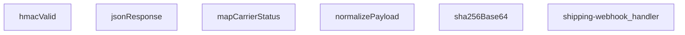

## Genel Bakış
Bu modül, kargo firmalarından gelen webhook taleplerini işleyen bir Supabase Edge Function'dur. Gelen farklı format ve yapılardaki kargo durumu güncellemelerini merkezi bir noktada toplayarak siparişlerin durumunu düzenli bir şekilde ilerletir. HMAC-SHA256 imza doğrulaması ile güvenli bir webhook altyapısı sunar.

## Fonksiyon Grupları

### HTTP Yanıtları ve Güvenlik Doğrulaması
Standart JSON yanıtlar oluşturma ve gelen isteklerin HMAC-SHA256 imzası ile otentikasyonunu sağlar. SHA-256 hash hesaplama fonksiyonu hem imza doğrulama hem de replay guard koruması için kullanılır.
- jsonResponse, hmacValid, sha256Base64

### Kargo Durumu Haritalama ve Normalizasyon
Birbirinden farklı kargo firmalarının durum kodlarını VentHub'ın kendi iç durum yapısına çevirir. Ayrıca her bir kargo firmasına özgü gelen payload'ları standart ve işlenebilir bir forma dönüştürür.
- mapCarrierStatus, normalizePayload

### Ana Webhook İşleyici
Modülün giriş noktasıdır; gelen HTTP isteklerini alarak güvenlik doğrulaması, payload normalizasyonu ve durum güncelleme adımlarını sırasıyla yönetir. İş akışının tüm aşamalarını koordine eder.
- shipping-webhook_handler

---

## Aksiyomlar – Mimari Varsayımlar

Bu modül, kargo firması webhook'larının güvenli şekilde alınıp normalize edilmesini sağlayan bir Edge Function'dur. Aşağıda modülün doğru çalışması için zorunlu olan mimari varsayımlar listelenmektedir.

**[Aksiyom 1]**: Eğer `hmacValid` fonksiyonuna geçirilen `secret` parametresi (webhook secret) geçersiz veya boşsa, imza doğrulama başarısız olmalı ve istek reddedilmelidir.

**[Aksiyom 2]**: Her bir kargo firması için `normalizePayload` fonksiyonuna özel bir `carrierHint` parametresi传递edilmelidir; bu, payload'ın doğru şablona göre ayrıştırılmasını sağlar.

**[Aksiyom 3]**: `mapCarrierStatus` fonksiyonunun döndürdüğü nesne, `setShipped` veya `setDelivered` alanlarından en az birini içermelidir; aksi halde sipariş durumu güncellenmez.

**[Aksiyom 4]**: Ana işleyici (`shipping-webhook_handler`), HMAC doğrulaması başarısız olduğunda 401/403 yanıtı döndürmeli ve işlemi sonlandırmalıdır.

**[Aksiyom 5]**: `jsonResponse` fonksiyonu, tüm HTTP yanıtları için tutarlı bir format sağlamak üzere kullanılmalıdır; modül içinden doğrudan `Response` nesnesi oluşturulmamalıdır.

---

## AXIOMS – Mimari Varsayımlar

Bu modül, kargo webhook'larını HMAC-SHA256 imza doğrulamasıyla işleyen bir Supabase Edge Function'dur.

**[Aksiyom 1]:** Eğer HMAC_SECRET ortam değişkeni tanımlı veya erişilebilir değilse, `hmacValid` fonksiyonu imza doğrulaması yapamaz ve tüm webhook istekleri reddedilir.

**[Aksiyom 2]:** Eğer `SKEW_MS` sabiti pozitif bir tamsayı değeri içermiyorsa, zaman damgası sapma toleransı çalışamaz veya anlamsız olur.

**[Aksiyom 3]:** Eğer `req.body` (Request body) okunamıyorsa veya boş/null ise, `shipping-webhook_handler` payload'u işleyemez.

**[Aksiyom 4]:** Eğer `carrierHint` boş bir string ise, `normalizePayload` kargo firmasına göre doğru normalize mantığını uygulayamaz.

**[Aksiyom 5]:** Eğer HMAC imza header'ı (`signatureHeader`) request'te mevcut değilse, `hmacValid` false döner ve istek yetkilendirme hatası ile reddedilir.

**[Aksiyom 6]:** Eğer `mapCarrierStatus` tanımsız/null bir input alırsa, normalize edilmiş durum döndüremez (varsayılan değer döndüğü varsayılır).

**[Aksiyom 7]:** Eğer `sha256Base64` fonksiyonu crypto API'ye erişemezse (Supabase Edge runtime dışı ortam), HMAC hesaplaması başarısız olur.

---

## FONKSİYON DETAYLARI

### jsonResponse
**Ne yapar**: Bu fonksiyon, HTTP yanıtları için standart bir JSON formatı oluşturur. Gövdeyi JSON stringine dönüştürür ve uygun `content-type` başlığını ekler.
**Nasıl yapar**: `JSON.stringify` kullanarak gövdeyi formatlanmış (2 boşluk girintili) bir string'e çevirir. Ardından, `ResponseInit` nesnesinden gelen başlıkları ve durum kodunu (varsayılan olarak 200) kullanarak yeni bir `Response` nesnesi döndürür.
**Parametreler**:
- body: unknown — Yanıt gövdesi olarak kullanılacak herhangi bir veri. Fonksiyon tarafından JSON'a dönüştürülecektir.
- init: ResponseInit — `status`, `headers` ve diğer HTTP yanıt seçeneklerini içeren opsiyonel bir nesne. Boş nesne `{}` varsayılanıdır.
**Dönüş**: `Response` — JSON verisini, uygun başlığı ve HTTP durum kodunu içeren standart bir HTTP yanıt nesnesi.

### hmacValid
**Ne yapar**: Verilen bir HMAC-SHA256 imzasının geçerliliğini doğrular. Bu, webhook isteklerinin kimliğini doğrulamak için kullanılır.
**Nasıl yapar**: `crypto.subtle` API'sini kullanarak verilen `secret` anahtarıyla ham `raw` verisinin HMAC-SHA256 imzasını hesaplar. Hesaplanan imzayı base64 formatına dönüştürür. Gelen `signatureHeader` değerini normalleştirerek (başındaki "sha256=" kısmını ve boşlukları temizleyerek) hesaplanan imzayla karşılaştırır.
**Parametreler**:
- secret: string — HMAC imza hesaplamasında kullanılacak gizli anahtar.
- raw: string — İmzası doğrulanacak ham veri (çoğunlukla HTTP gövdesi).
- signatureHeader: string — İstekle birlikte gelen ve doğrulanacak imza değeri (ör. "sha256=...").
**Dönüş**: `Promise<boolean>` — İmza geçerliyse `true`, değilse veya bir hata oluştuysa `false` döner.

### mapCarrierStatus
**Ne yapar**: Farklı kargo şirketlerinin durum metinlerini, uygulama içinde tutarlı ve tanımlı bir durum setine ve ilgili bayraklara dönüştürür.
**Nasıl yapar**: Girdiyi küçük harfe çevirir ve tanımlı durum listelerine göre eşleştirmeler yapar. Her eşleşme, uygulamanın kendi `status` alanını ve siparişin shipped/delivered olarak işaretlenip işaretlenmeyeceğini (`setShipped`, `setDelivered`) belirten boolean bayrakları döndürür. Tanımlanmamış bir durum ise olduğu gibi döner.
**Parametreler**:
- input?: string — Harita dışı bırakılacak kargo şirketi durum metni (ör. "IN_TRANSIT", "delivered"). Opsiyoneldir.
**Dönüş**: `{ status?: string; setShipped?: boolean; setDelivered?: boolean }` — Eşlenen durum bilgisini ve bayrakları içeren bir nesne. Tanınmayan bir durum girdisi varsa, `status` alanı girdinin kendisi olur.

### normalizePayload
**Ne yapar**: Farklı kargo şirketlerinin farklı yapıdaki webhook yüklerini (payload), uygulamanın beklediği tek ve standart bir formata dönüştürür.
**Nasıl yapar**: `carrierHint` parametresinden veya nesnenin kendi `carrier` alanından kargo şirketini belirler. `pick` adlı bir iç fonksiyon ile, olası farklı alan adlarını (ör. `order_id`, `orderId`, `id`) sırasıyla kontrol ederek ilk bulunan değeri alır. Bu sayede gelen verinin yapısı ne olursa olsun, aynı çıktı alanlarına (`order_id`, `tracking_number`, `status` vb.) sahip düzgün bir nesne oluşturulur.
**Parametreler**:
- carrierHint: string — Kargo şirketi bilgisi (ör. "ups", "fedex"). Yük içindeki `carrier` alanından önce kontrol edilir veya onu tamamlar.
- obj: unknown — Webhook'tan gelen ham JSON nesnesi.
**Dönüş**: `Record<string, string>` — `order_id`, `order_number`, `carrier`, `tracking_number`, `tracking_url`, `status`, `shipped_at` ve `delivered_at` alanlarını içeren, değerleri string'e dönüştürülmüş standart bir nesne.

### sha256Base64
**Ne yapar**: Verilen bir girdi string'inin SHA-256 özetini hesaplar ve sonucu base64 formatında döndürür.
**Nasıl yapar**: `TextEncoder` kullanarak string'i byte dizisine dönüştürür. `crypto.subtle.digest` ile SHA-256 hash hesaplar. Elde edilen byte dizisini `btoa(String.fromCharCode(...))`-yardımıyla base64 formatına kodlar.
**Parametreler**:
- input: string — Hash'i hesaplanacak veri.
**Dönüş**: `Promise<string>` — Hesaplanan SHA-256 özetinin base64 encoded hali.

### shipping-webhook_handler
**Ne yapar**: Gelen HTTP isteğini (webhook) işleyerek, taşıyıcıdan gelen veriyi doğrular, normalleştirir ve uygun yanıtı döndürür.  
**Nasıl yapar**: İstek `req` nesnesinden okunur, HMAC doğrulaması `hmacValid` ile yapılır, payload `normalizePayload` ile standartlaştırılır, taşıyıcı durumu `mapCarrierStatus` ile yorumlanır ve sonuç `jsonResponse` aracılığıyla JSON formatında yanıt olarak gönderilir.  
**Parametreler**:
- req: Request — Webhook çağrısını temsil eden HTTP isteği nesnesi.  
**Dönüş**: Response — İşlem sonucunu içeren HTTP yanıtı.

---

## SABİTLER
- **SKEW_MS** (binary_expression) — `5 * 60 * 1000`

---

## AST POINTERS

### [N1_NASIL] AST Pointer: C:\Users\alize\venthub-hvac\supabase\functions\shipping-webhook\index.ts::jsonResponse
- **params**: `body: unknown`, `init: ResponseInit = {}`
- **ic_degiskenler**:
  - (yok)
- **Dönüş**: `Response`

### [N2_NASIL] AST Pointer: C:\Users\alize\venthub-hvac\supabase\functions\shipping-webhook\index.ts::hmacValid
- **params**: `secret: string`, `raw: string`, `signatureHeader: string`
- **ic_degiskenler**:
  - `key` — crypto.subtle importKey ile oluşturulan HMAC anahtarı
  - `sigBytes` — HMAC-SHA256 imzasının byte dizisi
  - `computed` — hesaplanan imzanın base64 temsili
  - `normalize` — imza başlığını normalize eden fonksiyon (sha256= ön ekini kaldırır)
  - `given` — normalize edilmiş gelen imza
- **Dönüş**: `Promise<boolean>`

### [N3_NASIL] AST Pointer: C:\Users\alize\venthub-hvac\supabase\functions\shipping-webhook\index.ts::mapCarrierStatus
- **params**: `input?: string`
- **ic_degiskenler**:
  - `s` — input'un küçük harfe çevrilmiş hali veya boş string
- **Dönüş**: `{ status?: string; setShipped?: boolean; setDelivered?: boolean }`

### [N4_NASIL] AST Pointer: C:\Users\alize\venthub-hvac\supabase\functions\shipping-webhook\index.ts::normalizePayload
- **params**: `carrierHint: string`, `obj: unknown`
- **ic_degiskenler**:
  - `rec` — obj'nin Record<string, unknown> olarak cast edilmiş hali veya boş obje
  - `c` — carrier bilgisi (carrierHint veya obj.carrier'den)
  - `pick` — verilen anahtarlardan ilk non-null değeri seçen yardımcı fonksiyon
  - `norm` — normalize edilmiş payload objesi
- **Dönüş**: `yok` (norm objesini return eder)

### [N5_NASIL] AST Pointer: C:\Users\alize\venthub-hvac\supabase\functions\shipping-webhook\index.ts::sha256Base64
- **params**: `input: string`
- **ic_degiskenler**:
  - `bytes` — input'un TextEncoder ile byte dizisine çevrilmiş hali
  - `hash` — SHA-256 hash'inin byte dizisi
- **Dönüş**: `Promise<string>`

### [N6_NASIL] AST Pointer: C:\Users\alize\venthub-hvac\supabase\functions\shipping-webhook\index.ts::shipping-webhook_handler
- **params**: `req: Request`
- **ic_degiskenler**:
  - `raw` — isteğin ham body metni
  - `payload` — JSON.parse ile parse edilmiş payload veya boş obje
  - `tenantId` — resolveTenantId ile hesaplanan kiracı ID'si
  - `isMockEnv` — SUPABASE_SERVICE_ROLE_KEY'in 'service-key' olup olmadığını kontrol eden boolean
  - `secret` — SHIPPING_WEBHOOK_SECRET environment variable'ı
  - `signature` — x-signature veya x-carrier-signature header'ı
  - `authorized` — yetkilendirme durumu
  - `token` — x-webhook-token header'ı
  - `expected` — SHIPPING_WEBHOOK_TOKEN environment variable'ı
  - `tsHeader` — x-timestamp veya x-event-time header'ı
  - `t` — parse edilmiş timestamp (epoch ms veya ISO string)
  - `SUPABASE_URL` — Supabase URL environment variable'ı
  - `SERVICE_KEY` — Supabase service role key
  - `supabase` — Supabase client instance'ı
  - `carrierHint` — x-carrier header'ı
  - `p` — normalizePayload ile normalize edilmiş payload
  - `eventId` — x-id veya x-event-id header'ı
  - `existing` — shipping_webhook_events tablosundan mevcut event kaydı
  - `matched` — mevcut event kaydının ilk elemanı
  - `orderId` — sipariş ID'si (payload'dan veya order_number ile sorgudan)
  - `data` — venthub_orders tablosundan sipariş verisi (order_number ile arama)
  - `error` — sipariş arama hatası
  - `current` — venthub_orders tablosundan mevcut sipariş verisi
  - `curErr` — mevcut sipariş sorgu hatası
  - `patch` — sipariş güncellemesi için patch objesi
  - `mapped` — mapCarrierStatus ile eşleştirilmiş kargo durumu
  - `curStatus` — mevcut sipariş durumu (küçük harf)
  - `next` — bir sonraki durum (küçük harf)
  - `curRank` — mevcut durumun rank'ı
  - `nextRank` — bir sonraki durumun rank'ı
  - `parseDate` — tarih string'ini ISO formatına parse eden yardımcı fonksiyon
  - `noChange` — değişiklik olup olmadığını belirleyen boolean
  - `bodyHash` — raw body'nin SHA-256 base64 hash'i
- **Dönüş**: `Response` (JSON yanıt)

---

## MERMAID CALL GRAPH

## NODE ID STANDARD

  file: supabase\functions\shipping-webhook\index.ts
  function: supabase\functions\shipping-webhook\index.ts::jsonResponse
  function: supabase\functions\shipping-webhook\index.ts::hmacValid
  function: supabase\functions\shipping-webhook\index.ts::mapCarrierStatus
  function: supabase\functions\shipping-webhook\index.ts::normalizePayload
  function: supabase\functions\shipping-webhook\index.ts::sha256Base64
  function: supabase\functions\shipping-webhook\index.ts::shipping-webhook_handler

---

## DISA AKTARILANLAR (EXPORTS)
  export: hmacValid
  export: jsonResponse
  export: mapCarrierStatus
  export: normalizePayload
  export: sha256Base64
  export: shipping-webhook_handler