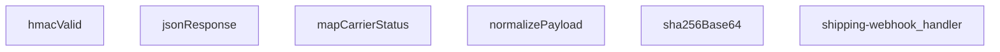

## Genel Bakış
Bu modül, kargo firmalarından gelen ve farklı formatlardaki webhook'ları işleyen bir Supabase Edge Function'dur. Gelen talepleri HMAC-SHA256 imza doğrulamasıyla güvenli bir şekilde alır, gelen veriyi standart bir forma dönüştürür ve siparişlerin kargo durumunu güncelleyerek iş akışını yönetir. Modül, merkezi bir kargo durumu güncelleme noktası olarak hizmet verir.

## Fonksiyon Grupları
### Güvenlik ve Yanıt Oluşturma
Bu grup, gelen HTTP isteklerinin HMAC-SHA256 imzasıyla otentikasyonunu sağlar ve istemciye standart JSON yanıtlar üretmek için yardımcı fonksiyonları içerir. İmza doğrulaması, ortam değişkenindeki bir gizli anahtar ve SHA-256 hash hesaplamasıyla yapılır.
- jsonResponse, hmacValid, sha256Base64

### Veri Normalizasyonu ve Durum Haritalama
Bu grup, farklı kargo firmalarının özel payload yapılarını standart, işlenebilir bir formata dönüştürür ve firma bazlı durum kodlarını modülün kendi iç durum yapısına eşler. Bu sayede çoklu kargo firması desteği için merkezi bir dönüşüm katmanı oluşturur.
- normalizePayload, mapCarrierStatus

### Ana Webhook İşleyici (Koordinatör)
Modülün giriş noktasıdır; gelen HTTP talebini alarak yukarıdaki tüm grupları sırayla koordine eder. İş akışı şu adımları yönetir: HMAC imza doğrulaması, payload normalizasyonu, durum haritalama ve nihai güncelleme yanıtı oluşturma.
- shipping-webhook_handler

---

## AXIOMS – Mimari Varsayımlar

Bu modül, kargo firmalarından gelen webhook'ları HMAC-SHA256 imza doğrulamasıyla güvenli bir şekilde işleyen bir Supabase Edge Function'dur.

**[Aksiyom 1]:** Eğer HMAC_SECRET ortam değişkeni (hmacValid fonksiyonuna `secret` parametresi olarak verilen değer) yoksa, tüm webhook istekleri HMAC doğrulaması başarısız olarak reddedilir.

**[Aksiyom 2]:** Eğer `signatureHeader` parametresi boş string veya undefined ise, hmacValid fonksiyonu false döner ve istek reddedilir.

**[Aksiyom 3]:** Eğer SKEW_MS sabiti tanımlı değilse veya zaman sapması kontrolü yapılamazsa, HMAC imza doğrulaması zaman pencereli olarak çalışamaz.

**[Aksiyom 4]:** Eğer mapCarrierStatus fonksiyonuna desteklenmeyen veya bilinmeyen bir kargo firması durum stringi girilirse, dönen nesnenin status alanı undefined olur ve setShipped/setDelivered boolean'ları false kalır.

**[Aksiyom 5]:** Eğer normalizePayload fonksiyonuna geçersiz veya nil bir `obj` parametresi verilirse, normalizasyon başarısız olur.

**[Aksiyom 6]:** Eğer normalizePayload fonksiyonuna boş string veya undefined `carrierHint` verilse bile, fonksiyon çalışır ancak kargo firması bazlı normalizasyon yapılamaz.

**[Aksiyom 7]:** Eğer Request nesnesinin body'si okunamaz veya parse edilemez ise, shipping-webhook_handler 400 Bad Request yanıtı döner.

**[Aksiyom 8]:** Eğer HMAC doğrulaması başarısız olursa (hmacValid false dönerse), webhook handler 401 Unauthorized yanıtı döner.

---

## FONKSİYON DETAYLARI

### jsonResponse
**Ne yapar**: Bu fonksiyon, HTTP yanıtları için standart bir JSON formatı oluşturur. Gövdeyi JSON stringine dönüştürür ve uygun `content-type` başlığını ekler.
**Nasıl yapar**: `JSON.stringify` kullanarak gövdeyi formatlanmış (2 boşluk girintili) bir string'e çevirir. Ardından, `ResponseInit` nesnesinden gelen başlıkları ve durum kodunu (varsayılan olarak 200) kullanarak yeni bir `Response` nesnesi döndürür.
**Parametreler**:
- body: unknown — Yanıt gövdesi olarak kullanılacak herhangi bir veri. Fonksiyon tarafından JSON'a dönüştürülecektir.
- init: ResponseInit — `status`, `headers` ve diğer HTTP yanıt seçeneklerini içeren opsiyonel bir nesne. Boş nesne `{}` varsayılanıdır.
**Dönüş**: `Response` — JSON verisini, uygun başlığı ve HTTP durum kodunu içeren standart bir HTTP yanıt nesnesi.

### hmacValid
**Ne yapar**: Verilen bir HMAC-SHA256 imzasının geçerliliğini doğrular. Bu, webhook isteklerinin kimliğini doğrulamak için kullanılır.
**Nasıl yapar**: `crypto.subtle` API'sini kullanarak verilen `secret` anahtarıyla ham `raw` verisinin HMAC-SHA256 imzasını hesaplar. Hesaplanan imzayı base64 formatına dönüştürür. Gelen `signatureHeader` değerini normalleştirerek (başındaki "sha256=" kısmını ve boşlukları temizleyerek) hesaplanan imzayla karşılaştırır.
**Parametreler**:
- secret: string — HMAC imza hesaplamasında kullanılacak gizli anahtar.
- raw: string — İmzası doğrulanacak ham veri (çoğunlukla HTTP gövdesi).
- signatureHeader: string — İstekle birlikte gelen ve doğrulanacak imza değeri (ör. "sha256=...").
**Dönüş**: `Promise<boolean>` — İmza geçerliyse `true`, değilse veya bir hata oluştuysa `false` döner.

### mapCarrierStatus
**Ne yapar**: Farklı kargo şirketlerinin durum metinlerini, uygulama içinde tutarlı ve tanımlı bir durum setine ve ilgili bayraklara dönüştürür.
**Nasıl yapar**: Girdiyi küçük harfe çevirir ve tanımlı durum listelerine göre eşleştirmeler yapar. Her eşleşme, uygulamanın kendi `status` alanını ve siparişin shipped/delivered olarak işaretlenip işaretlenmeyeceğini (`setShipped`, `setDelivered`) belirten boolean bayrakları döndürür. Tanımlanmamış bir durum ise olduğu gibi döner.
**Parametreler**:
- input?: string — Harita dışı bırakılacak kargo şirketi durum metni (ör. "IN_TRANSIT", "delivered"). Opsiyoneldir.
**Dönüş**: `{ status?: string; setShipped?: boolean; setDelivered?: boolean }` — Eşlenen durum bilgisini ve bayrakları içeren bir nesne. Tanınmayan bir durum girdisi varsa, `status` alanı girdinin kendisi olur.

### normalizePayload
**Ne yapar**: Farklı kargo şirketlerinin farklı yapıdaki webhook yüklerini (payload), uygulamanın beklediği tek ve standart bir formata dönüştürür.
**Nasıl yapar**: `carrierHint` parametresinden veya nesnenin kendi `carrier` alanından kargo şirketini belirler. `pick` adlı bir iç fonksiyon ile, olası farklı alan adlarını (ör. `order_id`, `orderId`, `id`) sırasıyla kontrol ederek ilk bulunan değeri alır. Bu sayede gelen verinin yapısı ne olursa olsun, aynı çıktı alanlarına (`order_id`, `tracking_number`, `status` vb.) sahip düzgün bir nesne oluşturulur.
**Parametreler**:
- carrierHint: string — Kargo şirketi bilgisi (ör. "ups", "fedex"). Yük içindeki `carrier` alanından önce kontrol edilir veya onu tamamlar.
- obj: unknown — Webhook'tan gelen ham JSON nesnesi.
**Dönüş**: `Record<string, string>` — `order_id`, `order_number`, `carrier`, `tracking_number`, `tracking_url`, `status`, `shipped_at` ve `delivered_at` alanlarını içeren, değerleri string'e dönüştürülmüş standart bir nesne.

### sha256Base64
**Ne yapar**: Verilen bir girdi string'inin SHA-256 özetini hesaplar ve sonucu base64 formatında döndürür.
**Nasıl yapar**: `TextEncoder` kullanarak string'i byte dizisine dönüştürür. `crypto.subtle.digest` ile SHA-256 hash hesaplar. Elde edilen byte dizisini `btoa(String.fromCharCode(...))`-yardımıyla base64 formatına kodlar.
**Parametreler**:
- input: string — Hash'i hesaplanacak veri.
**Dönüş**: `Promise<string>` — Hesaplanan SHA-256 özetinin base64 encoded hali.

### shipping-webhook_handler
**Ne yapar**: Gelen HTTP isteğini (webhook) işleyerek, taşıyıcıdan gelen veriyi doğrular, normalleştirir ve uygun yanıtı döndürür.  
**Nasıl yapar**: İstek `req` nesnesinden okunur, HMAC doğrulaması `hmacValid` ile yapılır, payload `normalizePayload` ile standartlaştırılır, taşıyıcı durumu `mapCarrierStatus` ile yorumlanır ve sonuç `jsonResponse` aracılığıyla JSON formatında yanıt olarak gönderilir.  
**Parametreler**:
- req: Request — Webhook çağrısını temsil eden HTTP isteği nesnesi.  
**Dönüş**: Response — İşlem sonucunu içeren HTTP yanıtı.

---

## İTHALATLAR (IMPORTS)
- import: ../_shared/tenant_config.ts::resolveTenantId
- import: https://esm.sh/@supabase/supabase-js@2::createClient

---

## SABİTLER
- **SKEW_MS** (binary_expression) — `5 * 60 * 1000`

---

## AST POINTERS

### [N1_NASIL] AST Pointer: `supabase/functions/shipping-webhook/index.ts`::jsonResponse
- **params**: `(body: unknown, init: ResponseInit = {})`
- **ic_degiskenler**:
  - parametreler doğrudan kullanılır, ek iç değişken yok
- **Dönüş**: `Response` — JSON.stringify ile serialize edilmiş body'yi, `content-type: application/json` header'ı ve status kodu ile Response nesnesi döner

---

### [N2_NASIL] AST Pointer: `supabase/functions/shipping-webhook/index.ts`::hmacValid
- **params**: `(secret: string, raw: string, signatureHeader: string)`
- **ic_degiskenler**:
  - `key` — `crypto.subtle.importKey` ile secret'tan ham byte'lardan üretilen HMAC-SHA256 anahtarı
  - `sigBytes` — `crypto.subtle.sign` ile raw string üzerine hesaplanan HMAC imzasının byte dizisi
  - `computed` — `sigBytes`'ın `btoa(String.fromCharCode(...))` ile base64'e çevrilmiş hali; verilen imza ile karşılaştırılacak referans değer
  - `normalize` — inner fonksiyon; signature header'ındaki `sha256=` prefix'ini ve boşlukları temizleyen lambda
  - `given` — `normalize(signatureHeader)` çağrısıyla elde edilmiş, temizlenmiş istemci imzası
- **Dönüş**: `Promise<boolean>` — computed === given eşleşmesi varsa `true`, herhangi bir hata yakalanırsa `false`

---

### [N3_NASIL] AST Pointer: `supabase/functions/shipping-webhook/index.ts`::mapCarrierStatus
- **params**: `(input?: string)`
- **ic_degiskenler**:
  - `s` — `input`'un `(input || '').toLowerCase()` ile küçük harfe çevrilmiş normalize hali; tüm status eşleştirmeleri bu değer üzerinden yapılır
- **Dönüş**: `{ status?: string; setShipped?: boolean; setDelivered?: boolean }` — taşıcı durumunu iç statüye eşler; `setShipped`/`setDelivered` flag'leri order güncelleme mantığını yönlendirir

---

### [N4_NASIL] AST Pointer: `supabase/functions/shipping-webhook/index.ts`::normalizePayload
- **params**: `(carrierHint: string, obj: unknown)`
- **ic_degiskenler**:
  - `rec` — `obj`'nin nesne olup olmadığı kontrol edilip `Record<string, unknown>` olarak cast edilmiş hali; tüm alan erişimleri bu üzerinden yapılır
  - `c` — carrier adının normalize edilmiş hali: önce `carrierHint` parametresi, sonra `rec.carrier` alanından türetilir, trim + toLowerCase uygulanır
  - `pick` — inner fonksiyon; sırasıyla verilen anahtar isimlerini `rec` içinde arayan ve ilk `null` olmayan değeri dönen helper; tüm alan eşleştirmeleri bu üzerinden yürütülür
  - `norm` — normalize edilmiş payload objesi; `order_id`, `order_number`, `carrier`, `tracking_number`, `tracking_url`, `status`, `shipped_at`, `delivered_at` alanlarını standart isimlerle birleştirir
- **Dönüş**: `norm` objesi (standartlaştırılmış webhook payload'u)

---

### [N5_NASIL] AST Pointer: `supabase/functions/shipping-webhook/index.ts`::sha256Base64
- **params**: `(input: string)`
- **ic_degiskenler**:
  - `bytes` — `input` string'inin `TextEncoder.encode()` ile UTF-8 byte dizisine çevrilmiş hali
  - `hash` — `crypto.subtle.digest('SHA-256', bytes)` çağrısıyla elde edilen SHA-256 hash'inin ArrayBuffer'ı
- **Dönüş**: `Promise<string>` — hash'in `btoa(String.fromCharCode(...))` ile base64'e kodlanmış hali

---

### [N6_NASIL] AST Pointer: `supabase/functions/shipping-webhook/index.ts`::shipping-webhook_handler
- **params**: `(req: Request)`
- **ic_degiskenler**:
  - `raw` — `req.text()` ile okunan request body'sinin ham string hali; HMAC imza doğrulaması ve bodyHash hesaplamasında kullanılır
  - `payload` — `raw`'ın `JSON.parse` ile parse edilmiş hali; `try-catch` ile sarmalanmıştır, parse hatasında `{}` fallback'i alınır
  - `tenantId` — `resolveTenantId(req, payload)` çağrısı ile request ve payload'tan dinamik olarak çözümlenen kiracı ID'si; tüm veritabanı operations'da row-level security bağlamını belirler
  - `isMockEnv` — `Deno.env.get('SUPABASE_SERVICE_ROLE_KEY') === 'service-key'` karşılaştırmasıyla belirlenen mock ortam bayrağı; tenant_id eşleşme kontrollerini atlar
  - `secret` — `Deno.env.get('SHIPPING_WEBHOOK_SECRET')` ile alınan HMAC gizli anahtarı; boş string fallback'i var
  - `signature` — `x-signature` veya `x-carrier-signature` header'ından alınan taşıcı imza değeri
  - `authorized` — yetkilendirme durum bayrağı; HMAC veya token fallback ile `true`'ya ayarlanır
  - `token` — `x-webhook-token` header'ından alınan legacy sandbox token'ı
  - `expected` — `Deno.env.get('SHIPPING_WEBHOOK_TOKEN')` ile alınan beklenen legacy token değeri
  - `tsHeader` — `x-timestamp` veya `x-event-time` header'ından alınan zaman damgası string'i; replay guard için zorunlu
  - `t` — `tsHeader`'ın epoch ms veya ISO formatından parse edilmiş numerik zaman damgası; `SKEW_MS` sabiti ile `Date.now()` karşılaştırması yapılır
  - `SUPABASE_URL` — `Deno.env.get('SUPABASE_URL')` ile alınan Supabase proje URL'i; client oluşturma ve `delivery-notification` çağrısında kullanılır
  - `SERVICE_KEY` — `Deno.env.get('SUPABASE_SERVICE_ROLE_KEY')` ile alınan servis rolü anahtarı; Supabase client ve edge function çağrısı için kullanılır
  - `supabase` — `createClient(SUPABASE_URL, SERVICE_KEY)` ile oluşturulan Supabase istemcisi; tüm DB operations bu üzerinden yürütülür
  - `carrierHint` — `x-carrier` header'ından alınan taşıcı ipucu string'i; `normalizePayload`'a geçirilir
  - `p` — `normalizePayload(carrierHint, payload)` dönüş değeri; `order_id`, `order_number`, `carrier`, `tracking_number`, `tracking_url`, `status`, `shipped_at`, `delivered_at` alanlarını içeren normalize edilmiş payload
  - `eventId` — `x-id` veya `x-event-id` header'ından alınan, opsiyonel deduplication amaçlı event ID'si
  - `existing` — deduplication sorgusunun `shipping_webhook_events` tablosundan dönen mevcut kayıt listesi (varsa)
  - `matched` — `existing[0]` olarak alınan ilk eşleşen satır; `tenant_id` kontrolü için kullanılır
  - `orderId` — siparişin `venthub_orders.tablosundaki` `id` değeri; önce `p.order_id`'den, yoksa `p.order_number` ile join sorgusundan çözümlenir
  - `data` (birinci kullanım) — `p.order_number` ile `venthub_orders` tablosunda `id, tenant_id` seçen sorgunun sonucu; `orderId`'yiresolve eder
  - `error` (birinci kullanım) — aynı sorgunun hata objesi; sipariş bulunamazsa 404 döner
  - `current` — `venthub_orders` tablosundan mevcut siparişin `id, tenant_id, status, shipped_at, delivered_at, tracking_number, tracking_url, carrier` alanlarını çeken sorgunun sonucu; monotonik durum ilerlemesi kontrolü ve idempotency için kullanılır
  - `curErr` — mevcut sipariş sorgusunun hata objesi
  - `patch` — `Partial<OrderRow> & Record<string, unknown>` türündeki güncelleme sözlüğü; değiştirilecek alanlar bu biriktiriciye eklenir
  - `mapped` — `mapCarrierStatus(p.status)` çağrısının sonucu; `status`, `setShipped`, `setDelivered` alanlarını içerir
  - `curStatus` — `current.status`'un küçük harfe çevrilmiş string karşılığı; monotonik sıralama karşılaştırması için referans
  - `next` — `mapped.status`'un küçük harfe çevrilmiş hali; sıradaki potansiyel durum
  - `curRank` — `RANK[curStatus]` sözlük erişimiyle elde edilen mevcut durumun sıralama sayısı; 0'da fallback yapılır
  - `nextRank` — `RANK[next]` sözlük erişimiyle elde edilen sonraki durumun sıralama sayısı; `nextRank >= curRank` koşulu monotonik ilerlemeyi garanti eder
  - `parseDate` — inner fonksiyon; opsiyonel string tarih değerini `new Date(s).toISOString()` ile ISO formatına çevirir, boşsa `undefined` döner
  - `noChange` — boolean bayrak; `patch` ile `current` arasındaki tüm alanların eşit olup olmadığını kontrol eder; `true` ise update atlanır
  - `bodyHash` (birinci kullanım) — unchanged yolunda `sha256Base64(raw)` ile hesaplanan request body hash'i; event audit kaydı için kullanılır
  - `data` (ikinci kullanım) — `venthub_orders.update(patch).eq('id', orderId).select(...).single()` sorgusunun güncellenmiş satır sonucu; `id, tenant_id, status, carrier, tracking_number, tracking_url, shipped_at, delivered_at, order_number, customer_email, customer_name` alanlarını içerir
  - `error` (ikinci kullanım) — update sorgusunun hata objesi
  - `msg` — `error.message`'dan çıkarılan hata mesajı string'i; fallback olarak `'Update failed'` alınır
  - `bodyHash` (ikinci kullanım) — güncelleme yolunda `sha256Base64(raw)` ile hesaplanan request body hash'i; event audit kaydı için kullanılır
  - `_e` —外 katman `try-catch`'in yakaladığı beklenmedik hata objesi; `console.error` ile loglanır ve `_e instanceof Error ? _e.message : 'Unexpected error'` ile döner
- **Dönüş**: `Response` — `jsonResponse` ile oluşturulmuş HTTP yanıtı; başarılı senaryolarda `{ ok: true, order_id, shipping, unchanged? }`, hata durumlarında `{ error }` body'si ve uygun HTTP status kodu döner

---

## MERMAID CALL GRAPH

## NODE ID STANDARD

  file: supabase\functions\shipping-webhook\index.ts
  function: supabase\functions\shipping-webhook\index.ts::jsonResponse
  function: supabase\functions\shipping-webhook\index.ts::hmacValid
  function: supabase\functions\shipping-webhook\index.ts::mapCarrierStatus
  function: supabase\functions\shipping-webhook\index.ts::normalizePayload
  function: supabase\functions\shipping-webhook\index.ts::sha256Base64
  function: supabase\functions\shipping-webhook\index.ts::shipping-webhook_handler

---

## DISA AKTARILANLAR (EXPORTS)
  export: hmacValid
  export: jsonResponse
  export: mapCarrierStatus
  export: normalizePayload
  export: sha256Base64
  export: shipping-webhook_handler