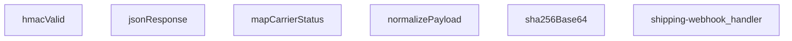

## Genel Bakış
Bu modül, kargo firmalarından gelen webhook taleplerini işleyen bir Edge Function'dur. Gelen farklı formattaki kargo durumlarını normalleştirerek sipariş durumunu monoton bir şekilde ilerletir (pending → paid → shipped → delivered) ve geri dönüşleri engeller. HMAC-SHA256 imza doğrulaması, replay guard koruması ve teslimat tamamlandığında otomatik bildirim tetikleme gibi güvenlik ve iş akışı özelliklerini içerir.

## Fonksiyon Grupları
### HTTP Yanıtları ve Güvenlik
Standart JSON yanıtlar oluşturma, isteklerin HMAC-SHA256 imzasını doğrulama ve replay guard için SHA-256 hash hesaplama işlemlerini yapar.
- jsonResponse, hmacValid, sha256Base64

### Kargo Durumu Haritalama ve Normalizasyon
Birden çok kargo firmasının durum kodlarını VentHub iç durumuna çevirir ve gelen payload'ları standart bir yapıya dönüştürür.
- mapCarrierStatus, normalizePayload

### Ana Webhook İşleyici
Tüm webhook isteklerini karşılayan ana fonksiyondur; doğrulama, durum güncelleme ve gerektiğinde bildirim tetikleme sürecini yönetir.
- shipping-webhook_handler

---

## AXIOMS – Mimari Varsayımlar
Bu modül için özel aksiyom tanımlanmamıştır.

---

## FONKSIYON DETAYLARI

### jsonResponse
**Ne yapar**: HTTP yanıtı oluşturmak için verilen gövdeyi ve isteğe bağlı başlıkları (init) kullanır.  
**Nasıl yapar**: `body` parametresi JSON olarak serileştirilir ve `Response` nesnesi `init` ayarlarıyla birlikte döndürülür.  
**Parametreler**:
- body: unknown — Yanıt gövdesi, JSON serileştirilebilir herhangi bir veri tipi.
- init: ResponseInit — HTTP yanıtının durum kodu, başlıkları ve diğer seçeneklerini içeren nesne.  
**Dönüş**: void (fonksiyon yanıtı doğrudan gönderir veya yanıt nesnesi oluşturur, dönüş değeri yoktur).

### hmacValid
**Ne yapar**: Gelen isteğin HMAC imzasını doğrular.  
**Nasıl yapar**: Paylaşılan `secret` anahtarıyla `raw` verisinin HMAC‑SHA256 imzası hesaplanır, ardından bu imza `signatureHeader` içinde gelen imza ile karşılaştırılır; eşleşme sonucu bir boolean değer olarak döndürülür.  
**Parametreler**:
- secret: string — HMAC hesaplamasında kullanılan gizli anahtar.
- raw: string — İmzalanacak ham veri (genellikle istek gövdesi).
- signatureHeader: string — İsteğin `Signature` başlığında gelen HMAC imzası.  
**Dönüş**: Promise<boolean> — İmzanın geçerli olup olmadığını belirten asenkron sonuç.

### mapCarrierStatus
**Ne yapar**: Taşıyıcıdan gelen durum kodunu uygulama içinde kullanılan daha anlamlı bir duruma dönüştürür.  
**Nasıl yapar**: Gelen `input` değerine göre bir nesne döndürülür; bu nesne `status` metni ve `setShipped`, `setDelivered` bayraklarını içerir.  
**Parametreler**:
- input: string (opsiyonel) — Taşıyıcıdan gelen durum kodu veya metni.  
**Dönüş**: { status?: string; setShipped?: boolean; setDelivered?: boolean } — Durumun haritalandığı nesne; alanlar isteğe bağlıdır.

### normalizePayload
**Ne yapar**: Farklı taşıyıcıların gönderdiği veri yapısını tek tip bir formata dönüştürür.  
**Nasıl yapar**: `carrierHint` parametresi taşıyıcı tipini belirler, ardından `obj` içindeki alanlar bu tip için tanımlı kurallara göre yeniden yapılandırılır; sonuç `norm` adlı standartlaştırılmış nesne olur.  
**Parametreler**:
- carrierHint: string — Veri hangi taşıyıcıdan geldiğini belirten ipucu.
- obj: unknown — Normalleştirilecek ham veri nesnesi.  
**Dönüş**: norm — Normalleştirilmiş ve uygulama içinde kullanılabilecek tutarlı veri yapısı (tipi belirtilmemiştir).

### sha256Base64
**Ne yapar**: Verilen metni SHA‑256 algoritmasıyla hashleyip, sonucu Base64 formatına çevirir.  
**Nasıl yapar**: `input` metni önce UTF‑8 olarak kodlanır, SHA‑256 hash fonksiyonu uygulanır ve elde edilen ikili veri Base64 stringine dönüştürülür; işlem asenkron olarak gerçekleştirilir.  
**Parametreler**:
- input: string — Hashlenmesi istenen metin.  
**Dönüş**: Promise<string> — Base64 kodlu SHA‑256 hash değeri.

### shipping-webhook_handler
**Ne yapar**: Gelen HTTP isteğini (webhook) işleyerek, taşıyıcıdan gelen veriyi doğrular, normalleştirir ve uygun yanıtı döndürür.  
**Nasıl yapar**: İstek `req` nesnesinden okunur, HMAC doğrulaması `hmacValid` ile yapılır, payload `normalizePayload` ile standartlaştırılır, taşıyıcı durumu `mapCarrierStatus` ile yorumlanır ve sonuç `jsonResponse` aracılığıyla JSON formatında yanıt olarak gönderilir.  
**Parametreler**:
- req: Request — Webhook çağrısını temsil eden HTTP isteği nesnesi.  
**Dönüş**: Response — İşlem sonucunu içeren HTTP yanıtı.

---

## SABİTLER
- **SKEW_MS** (binary_expression) — `5 * 60 * 1000`

---

`## AST POINTERS

### [N1_jsonResponse_NASIL] AST Pointer: supabase/functions/shipping-webhook/index.ts::jsonResponse
- **params**:
  - `body` (unknown) — JSON.stringify ile stringleştirilecek veri
  - `init` (ResponseInit, default `{}`) — HTTP yanıtını yapılandıran nesne (status, headers)
- **ic_degiskenler**: yok
- **Dönüş**: Response

### [N2_hmacValid_NASIL] AST Pointer: supabase/functions/shipping-webhook/index.ts::hmacValid
- **params**:
  - `secret` (string) — HMAC imzasını doğrulamak için kullanılan gizli anahtar
  - `raw` (string) — imzalanmış ham istek gövdesi
  - `signatureHeader` (string) — gelen imza değeri (base64 veya hex, isteğe bağlı `sha256=` öneki ile)
- **ic_degiskenler**:
  - `key` — `crypto.subtle.importKey` ile oluşturulmuş HMAC anahtarı (CryptoKey)
  - `sigBytes` — `crypto.subtle.sign` ile üretilmiş HMAC imza baytları (ArrayBuffer)
  - `computed` — imzanın base64 kodlanmış hali (string)
  - `normalize` — gelen imza başlığını temizleyen ve normalize eden ok fonksiyonu (s: string) => string
  - `given` — `normalize` fonksiyonundan geçirilmiş gelen imza (string)
- **Dönüş**: Promise\<boolean\>

### [N3_mapCarrierStatus_NASIL] AST Pointer: supabase/functions/shipping-webhook/index.ts::mapCarrierStatus
- **params**:
  - `input` (string, optional) — kargo firmasından gelen ham durum
- **ic_degiskenler**:
  - `s` — `input` boş ise boş string, değilse küçük harfe dönüştürülmüş hali (string)
- **Dönüş**: { status?: string; setShipped?: boolean; setDelivered?: boolean }

### [N4_normalizePayload_NASIL] AST Pointer: supabase/functions/shipping-webhook/index.ts::normalizePayload
- **params**:
  - `carrierHint` (string) — kargo firması ipucu (genellikle `x-carrier` header’ından)
  - `obj` (unknown) — normalize edilecek ham yük (JSON ayrıştırılmış nesne)
- **ic_degiskenler**:
  - `rec` — `obj` bir obje ise `obj`’nin `Record<string, unknown>` cast edilmiş hali, değilse boş obje
  - `c` — `carrierHint` veya `rec.carrier`’dan türetilmiş, trim edilmiş, küçük harfe çevrilmiş carrier değeri (string)
  - `pick` — verilen anahtar listesinde `rec` içinde ilk null olmayan değeri döndüren ok fonksiyonu ((...keys: string[]) => unknown)
  - `norm` — normalize edilmiş payload nesnesi; alanlar: order_id, order_number, carrier, tracking_number, tracking_url, status, shipped_at, delivered_at (her biri string)
- **Dönüş**: Record\<string, string\> (norm nesnesi)

### [N5_pick_NASIL] AST Pointer: supabase/functions/shipping-webhook/index.ts::pick (normalizePayload iç fonksiyonu)
- **params**:
  - `keys` (rest parameter, string[]) — aranacak anahtar listesi
- **ic_degiskenler**:
  - `k` — `keys` dizisinden her bir anahtar (string)
  - `v` — `rec` nesnesinde `k` anahtarına karşılık gelen değer (unknown)
- **Dönüş**: unknown (değer bulunursa ilgili değer, bulunamazsa `undefined`)

### [N6_sha256Base64_NASIL] AST Pointer: supabase/functions/shipping-webhook/index.ts::sha256Base64
- **params**:
  - `input` (string) — hash’i hesaplanacak metin
- **ic_degiskenler**:
  - `bytes` — `input`’un `TextEncoder` ile UTF-8 kodlanmış hali (Uint8Array)
  - `hash` — `crypto.subtle.digest` ile üretilmiş SHA-256 imza baytları (ArrayBuffer)
- **Dönü

---

## MERMAID CALL GRAPH

## NODE ID STANDARD

  file: supabase\functions\shipping-webhook\index.ts
  function: supabase\functions\shipping-webhook\index.ts::jsonResponse
  function: supabase\functions\shipping-webhook\index.ts::hmacValid
  function: supabase\functions\shipping-webhook\index.ts::mapCarrierStatus
  function: supabase\functions\shipping-webhook\index.ts::normalizePayload
  function: supabase\functions\shipping-webhook\index.ts::sha256Base64
  function: supabase\functions\shipping-webhook\index.ts::shipping-webhook_handler

---

## DISA AKTARILANLAR (EXPORTS)
  export: hmacValid
  export: jsonResponse
  export: mapCarrierStatus
  export: normalizePayload
  export: sha256Base64
  export: shipping-webhook_handler