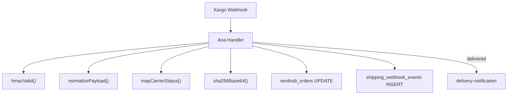

## Genel Bakış
Kargo firmasından gelen webhook'ları alan ve siparişin kargo durumunu güncelleyen Edge Function. Farklı kargo firmalarının payload formatlarını normalize eder, monoton durum ilerlemesi uygular (pending→paid→shipped→delivered, geri dönüş engellenir), HMAC-SHA256 imza doğrulaması ve replay guard koruması içerir. Teslimat tamamlandığında otomatik olarak `delivery-notification` fonksiyonunu tetikler.

## Fonksiyon Grupları

### HTTP & Güvenlik
- `jsonResponse(body, init)` — Standart JSON response.
- `hmacValid(secret, raw, signatureHeader)` — HMAC-SHA256 imza doğrulama.
- `sha256Base64(input)` — SHA-256 hash (audit dedup).

### Durum Haritalama
- `mapCarrierStatus(input)` — Kargo firması durum kodunu VentHub iç durumuna çevirir.
- `normalizePayload(carrierHint, obj)` — Çoklu kargo firması payload'ını standart yapıya dönüştürür.

### Ana Handler
- `Deno.serve(handler)` — Webhook endpoint'i.

## Fonksiyon Detayları

### hmacValid
**Ne yapar:** Webhook isteğinin HMAC-SHA256 imzasını doğrular. Base64 ve hex formatlarını kabul eder.
**Parametreler:**
- `secret: string` — Paylaşılan gizli anahtar
- `raw: string` — Ham request body
- `signatureHeader: string` — İmza header'ı
**Dönüş:** `Promise<boolean>`

### mapCarrierStatus
**Ne yapar:** Kargo durum kodunu VentHub sipariş durumuna çevirir.
**Haritalama:**
- `label_created, created, ready, info_received` → `paid`
- `accepted, picked_up, in_transit, out_for_delivery` → `shipped` (setShipped=true)
- `delivered, completed` → `delivered` (setDelivered=true)
- `failed, exception, return_to_sender, cancelled` → `failed`
**Dönüş:** `{ status?: string; setShipped?: boolean; setDelivered?: boolean }`

### normalizePayload
**Ne yapar:** Farklı kargo firmalarının JSON yapısını standart formata çevirir. `x-carrier` header'ı ile firma ipucu alır.
**Çıktı alanları:** `order_id`, `order_number`, `carrier`, `tracking_number`, `tracking_url`, `status`, `shipped_at`, `delivered_at`

### Ana Handler (Deno.serve callback)
**Method:** POST
**Yetkilendirme:** HMAC-SHA256 (`SHIPPING_WEBHOOK_SECRET`) + replay guard (`x-timestamp`, 5 dk tolerans) veya legacy token (`SHIPPING_WEBHOOK_TOKEN`)
**Akış:**
1. İmza doğrulama → 401
2. Replay guard: `x-timestamp` header varsa 5 dk zaman penceresi kontrolü
3. Payload normalize etme (carrier hint ile)
4. Event dedup: `shipping_webhook_events` tablosu
5. `order_id` yoksa `order_number` ile `venthub_orders`'dan çözümleme
6. Mevcut sipariş durumunu çekme
7. Monoton durum kontrolü: `pending(0) → paid(1) → confirmed(2) → shipped(3) → delivered(4)`
8. Patch oluşturma: `carrier`, `tracking_number`, `tracking_url`, `shipped_at`, `delivered_at`
9. Değişiklik yoksa short-circuit (unchanged)
10. `venthub_orders` güncelleme
11. Audit event kaydı
12. Durum `delivered` olduysa → `delivery-notification` fonksiyonunu tetikle

**Sabitler:**
- `RANK` — Durum öncelik sırası: `{ pending:0, paid:1, confirmed:2, shipped:3, delivered:4 }`
- `SKEW_MS` — Replay guard toleransı: 5 dakika (300.000 ms)

**Tablolar:** `venthub_orders` (okuma/yazma), `shipping_webhook_events` (yazma)
**Dış Çağrılar:** `delivery-notification` Edge Function
**Env:** `SUPABASE_URL`, `SUPABASE_SERVICE_ROLE_KEY`, `SHIPPING_WEBHOOK_SECRET`, `SHIPPING_WEBHOOK_TOKEN`

---

## ÇAĞRI HARİTASI
- **Ana handler** → `hmacValid()` → imza doğrulama
- **Ana handler** → `normalizePayload()` → payload standartlaştırma
- **Ana handler** → `mapCarrierStatus()` → durum haritalama
- **Ana handler** → `sha256Base64()` → audit hash
- **Ana handler** → `delivery-notification` (dış fonksiyon çağrısı, delivered durumunda)

## NODE ID STANDARD
  file: supabase/functions/shipping-webhook/index.ts
  function: supabase/functions/shipping-webhook/index.ts::jsonResponse
  function: supabase/functions/shipping-webhook/index.ts::hmacValid
  function: supabase/functions/shipping-webhook/index.ts::mapCarrierStatus
  function: supabase/functions/shipping-webhook/index.ts::normalizePayload
  function: supabase/functions/shipping-webhook/index.ts::sha256Base64
  function: supabase/functions/shipping-webhook/index.ts::shipping-webhook_handler

## DISA AKTARILANLAR (EXPORTS)
  export: jsonResponse
  export: hmacValid
  export: mapCarrierStatus
  export: normalizePayload
  export: sha256Base64
  export: shipping-webhook_handler
