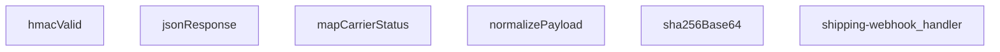

## Genel Bakış
Bu modül, kargo firmalarından gelen webhook taleplerini işleyen bir Supabase Edge Function'dur. Gelen farklı format ve yapılardaki kargo durumu güncellemelerini merkezi bir noktada toplayarak siparişlerin durumunu düzenli bir şekilde ilerletir. HMAC-SHA256 imza doğrulaması ile güvenli bir webhook altyapısı sunar.

## Fonksiyon Grupları
### HTTP Yanıtları ve Güvenlik Doğrulaması
Standart JSON yanıtlar oluşturma ve gelen isteklerin HMAC-SHA256 imzası ile otentikasyonunu sağlar. SHA-256 hash hesaplama fonksiyonu hem imza doğrulama hem de replay guard koruması için kullanılır.
- jsonResponse, hmacValid, sha256Base64

### Kargo Durumu Haritalama ve Normalizasyon
Birbirinden farklı kargo firmalarının durum kodlarını VentHub'ın kendi iç durum yapısına çevirir. Ayrıca her bir kargo firmasına özgü gelen payload'ları standart ve işlenebilir bir forma dönüştürür.
- mapCarrierStatus, normalizePayload

### Ana Webhook İşleyici
Modülün giriş noktasıdır; gelen HTTP isteklerini alarak güvenlik doğrulaması, payload normalizasyonu ve durum güncelleme adımlarını sırasıyla yönetir. İş akışının tüm aşamalarını koordine eder.
- shipping-webhook_handler

---

## AXIOMS – Mimari Varsayımlar

Bu modül, kargo firması webhook'larının güvenli şekilde alınıp normalize edilmesini sağlayan bir Edge Function'dur. Aşağıda modülün doğru çalışması için zorunlu olan mimari varsayımlar listelenmektedir.

**[Aksiyom 1]**: Eğer `hmacValid` fonksiyonuna geçirilen `secret` parametresi (webhook secret key) ortam değişkenlerinde tanımlı değilse veya boş string olarak geçilmişse, HMAC-SHA256 imza doğrulaması her zaman başarısız olur ve tüm webhook istekleri reddedilir.

**[Aksiyom 2]**: Eğer `SKEW_MS` sabiti (replay guard için izin verilen saat sapması) çok küçük bir değer olarak ayarlanmışsa, saat farkı nedeniyle meşru istekler haksız yere reddedilir; çok büyük bir değer olarak ayarlanmışsa, eski/replay isteklerin sisteme girmesine izin verilmiş olur.

**[Aksiyom 3]**: Eğer `hmacValid` fonksiyonuna geçirilen `signatureHeader` (isteğin `X-Signature` veya benzeri header'ı) request header'larından çıkarılamazsa (örn. header yoksa veya boşsa), imza doğrulama başarısız olur ve istek 401/403 ile reddedilir.

**[Aksiyom 4]**: Eğer `normalizePayload` fonksiyonuna geçirilen `carrierHint` parametresi, modülün bildiği bir kargo firması koduna karşılık gelmiyorsa, payload normalizasyonu ya varsayılan/genel bir şablona düşer ya da hata ile sonuçlanır — beklenmeyen alan haritası oluşur.

**[Aksiyom 5]**: Eğer `mapCarrierStatus` fonksiyonuna geçirilen `input` parametresi `undefined` veya `null` ise, fonksiyon bir varsayılan/durum-bilinmiyor değeri döndürmelidir; aksi halde downstream'de monoton ilerleme kontrolü (pending → paid → shipped → delivered) çalışamaz.

**[Aksiyom 6]**: Eğer `sha256Base64` fonksiyonuna boş string (`""`) geçirilirse, belirli ve tutarlı bir base64-encoded hash değeri üretmelidir; aksi halde replay guard'un benzersiz istek tespit mekanizması bozulur.

**[Aksiyom 7]**: Eğer `shipping-webhook_handler`'a geçirilen `Request` nesnesinin gövde (body) kısmı okunamaz (örn. body çoktan_consumed edilmişse veya stream kapanmışsa), webhook payload'ı extract edilemez ve istek hata ile sonuçlanır.

**[Aksiyom 8]**: Eğer `jsonResponse` fonksiyonuna geçilen `init.status` değeri success durumunda 2xx aralığında değilse (örn. webhook'u başarıyla işledikten sonra 500 dönürse), kargo firması tarafında gereksiz retry döngüsü tetiklenir.

**[Aksiyom 9]**: Eğer modülün monoton durum ilerleme mantığı (pending → paid → shipped → delivered) uygulanmıyorsa veya eski bir durum kodu yeni durumun üzerine yazılabilirse, sipariş durumu geriye doğru kayabilir ve teslim edilmiş bir sipariş "shipped" olarak görünür hale gelebilir.

---

## FONKSİYON DETAYLARI

### jsonResponse
**Ne yapar**: Bu fonksiyon, HTTP yanıtları için standart bir JSON formatı oluşturur. Gövdeyi JSON stringine dönüştürür ve uygun `content-type` başlığını ekler.
**Nasıl yapar**: `JSON.stringify` kullanarak gövdeyi formatlanmış (2 boşluk girintili) bir string'e çevirir. Ardından, `ResponseInit` nesnesinden gelen başlıkları ve durum kodunu (varsayılan olarak 200) kullanarak yeni bir `Response` nesnesi döndürür.
**Parametreler**:
- body: unknown — Yanıt gövdesi olarak kullanılacak herhangi bir veri. Fonksiyon tarafından JSON'a dönüştürülecektir.
- init: ResponseInit — `status`, `headers` ve diğer HTTP yanıt seçeneklerini içeren opsiyonel bir nesne. Boş nesne `{}` varsayılanıdır.
**Dönüş**: `Response` — JSON verisini, uygun başlığı ve HTTP durum kodunu içeren standart bir HTTP yanıt nesnesi.

### hmacValid
**Ne yapar**: Verilen bir HMAC-SHA256 imzasının geçerliliğini doğrular. Bu, webhook isteklerinin kimliğini doğrulamak için kullanılır.
**Nasıl yapar**: `crypto.subtle` API'sini kullanarak verilen `secret` anahtarıyla ham `raw` verisinin HMAC-SHA256 imzasını hesaplar. Hesaplanan imzayı base64 formatına dönüştürür. Gelen `signatureHeader` değerini normalleştirerek (başındaki "sha256=" kısmını ve boşlukları temizleyerek) hesaplanan imzayla karşılaştırır.
**Parametreler**:
- secret: string — HMAC imza hesaplamasında kullanılacak gizli anahtar.
- raw: string — İmzası doğrulanacak ham veri (çoğunlukla HTTP gövdesi).
- signatureHeader: string — İstekle birlikte gelen ve doğrulanacak imza değeri (ör. "sha256=...").
**Dönüş**: `Promise<boolean>` — İmza geçerliyse `true`, değilse veya bir hata oluştuysa `false` döner.

### mapCarrierStatus
**Ne yapar**: Farklı kargo şirketlerinin durum metinlerini, uygulama içinde tutarlı ve tanımlı bir durum setine ve ilgili bayraklara dönüştürür.
**Nasıl yapar**: Girdiyi küçük harfe çevirir ve tanımlı durum listelerine göre eşleştirmeler yapar. Her eşleşme, uygulamanın kendi `status` alanını ve siparişin shipped/delivered olarak işaretlenip işaretlenmeyeceğini (`setShipped`, `setDelivered`) belirten boolean bayrakları döndürür. Tanımlanmamış bir durum ise olduğu gibi döner.
**Parametreler**:
- input?: string — Harita dışı bırakılacak kargo şirketi durum metni (ör. "IN_TRANSIT", "delivered"). Opsiyoneldir.
**Dönüş**: `{ status?: string; setShipped?: boolean; setDelivered?: boolean }` — Eşlenen durum bilgisini ve bayrakları içeren bir nesne. Tanınmayan bir durum girdisi varsa, `status` alanı girdinin kendisi olur.

### normalizePayload
**Ne yapar**: Farklı kargo şirketlerinin farklı yapıdaki webhook yüklerini (payload), uygulamanın beklediği tek ve standart bir formata dönüştürür.
**Nasıl yapar**: `carrierHint` parametresinden veya nesnenin kendi `carrier` alanından kargo şirketini belirler. `pick` adlı bir iç fonksiyon ile, olası farklı alan adlarını (ör. `order_id`, `orderId`, `id`) sırasıyla kontrol ederek ilk bulunan değeri alır. Bu sayede gelen verinin yapısı ne olursa olsun, aynı çıktı alanlarına (`order_id`, `tracking_number`, `status` vb.) sahip düzgün bir nesne oluşturulur.
**Parametreler**:
- carrierHint: string — Kargo şirketi bilgisi (ör. "ups", "fedex"). Yük içindeki `carrier` alanından önce kontrol edilir veya onu tamamlar.
- obj: unknown — Webhook'tan gelen ham JSON nesnesi.
**Dönüş**: `Record<string, string>` — `order_id`, `order_number`, `carrier`, `tracking_number`, `tracking_url`, `status`, `shipped_at` ve `delivered_at` alanlarını içeren, değerleri string'e dönüştürülmüş standart bir nesne.

### sha256Base64
**Ne yapar**: Verilen bir girdi string'inin SHA-256 özetini hesaplar ve sonucu base64 formatında döndürür.
**Nasıl yapar**: `TextEncoder` kullanarak string'i byte dizisine dönüştürür. `crypto.subtle.digest` ile SHA-256 hash hesaplar. Elde edilen byte dizisini `btoa(String.fromCharCode(...))`-yardımıyla base64 formatına kodlar.
**Parametreler**:
- input: string — Hash'i hesaplanacak veri.
**Dönüş**: `Promise<string>` — Hesaplanan SHA-256 özetinin base64 encoded hali.

### shipping-webhook_handler
**Ne yapar**: Gelen HTTP isteğini (webhook) işleyerek, taşıyıcıdan gelen veriyi doğrular, normalleştirir ve uygun yanıtı döndürür.  
**Nasıl yapar**: İstek `req` nesnesinden okunur, HMAC doğrulaması `hmacValid` ile yapılır, payload `normalizePayload` ile standartlaştırılır, taşıyıcı durumu `mapCarrierStatus` ile yorumlanır ve sonuç `jsonResponse` aracılığıyla JSON formatında yanıt olarak gönderilir.  
**Parametreler**:
- req: Request — Webhook çağrısını temsil eden HTTP isteği nesnesi.  
**Dönüş**: Response — İşlem sonucunu içeren HTTP yanıtı.

---

## SABİTLER
- **SKEW_MS** (binary_expression) — `5 * 60 * 1000`

---

## AST POINTERS

### [N1_NASIL] AST Pointer: supabase/functions/shipping-webhook/index.ts::jsonResponse
- **params**: `(body: unknown, init: ResponseInit = {})`
- **ic_degiskenler**:
  - Değişken yok — parametreler doğrudan kullanılır
- **Dönüş**: `Response` — JSON.stringify ile serileştirilmiş body, content-type ve status ayarlanmış Response nesnesi

---

### [N2_NASIL] AST Pointer: supabase/functions/shipping-webhook/index.ts::hmacValid
- **params**: `(secret: string, raw: string, signatureHeader: string)`
- **ic_degiskenler**:
  - `key` — crypto.subtle.importKey ile HMAC-SHA256 anahtarına dönüştürülmüş raw secret
  - `sigBytes` — crypto.subtle.sign ile HMAC-SHA256 ile imzalanmış raw byte dizisi
  - `computed` — sigBytes'ın base64'e çevrilmiş hali (btoa ile)
  - `normalize` — signature string'ini temizleyip sha256= prefix'ini kaldıran yerel arrow fonksiyon
  - `given` — normalize edilmiş signatureHeader (verilen imza)
- **Dönüş**: `Promise<boolean>` — given === computed ise true, aksi halde false (catch bloğunda false döner)

---

### [N3_NASIL] AST Pointer: supabase/functions/shipping-webhook/index.ts::mapCarrierStatus
- **params**: `(input?: string)`
- **ic_degiskenler**:
  - `s` — input'un lowercase'e çevrilmiş hali, boşsa boş string
- **Dönüş**: `{ status?: string; setShipped?: boolean; setDelivered?: boolean }` — carrier durumuna göre status ve flag'ler

---

### [N4_NASIL] AST Pointer: supabase/functions/shipping-webhook/index.ts::normalizePayload
- **params**: `(carrierHint: string, obj: unknown)`
- **ic_degiskenler**:
  - `rec` — obj'nin Record<string, unknown> olarak cast edilmiş hali, obje değilse boş obje
  - `c` — carrierHint, rec.carrier veya boş string'den elde edilen normalize edilmiş carrier adı (lowercase, trim)
  - `pick` — inner helper arrow fonksiyon; verilen key dizisinde ilk mevcut ve null olmayan değeri döner (order_id, tracking_number vb. alanları bulmak için kullanılır)
  - `norm` — normalize edilmiş payload objesi; order_id, order_number, carrier, tracking_number, tracking_url, status, shipped_at, delivered_at alanlarını pick ile toplar
- **Dönüş**: `norm` objesi — { order_id, order_number, carrier, tracking_number, tracking_url, status, shipped_at, delivered_at }

---

### [N5_NASIL] AST Pointer: supabase/functions/shipping-webhook/index.ts::sha256Base64
- **params**: `(input: string)`
- **ic_degiskenler**:
  - `bytes` — input'un TextEncoder ile UTF-8 byte dizisine çevrilmiş hali
  - `hash` — crypto.subtle.digest('SHA-256', bytes) ile hesaplanmış SHA-256 hash byte dizisi
- **Dönüş**: `Promise<string>` — hash'in base64'e çevrilmiş string'i

---

### [N6_NASIL] AST Pointer: supabase/functions/shipping-webhook/index.ts::shipping-webhook_handler
- **params**: `(req: Request)`
- **ic_degiskenler**:
  - `raw` — `await req.text()` ile okunan ham HTTP body string'i; imza doğrulaması ve hash için kullanılır
  - `payload` — `JSON.parse(raw)` ile parse edilmiş JSON, parse edilemezse boş obje `{}`
  - `secret` — `Deno.env.get('SHIPPING_WEBHOOK_SECRET') || ''` — HMAC imza doğrulama için webhook secret key
  - `signature` — `req.headers.get('x-signature') || req.headers.get('x-carrier-signature') || ''` — gelen imza header'ı
  - `authorized` — boolean flag, HMAC veya token ile yetkilendirme durumu (başlangıçta false)
  - `token` — `req.headers.get('x-webhook-token') || ''` — legacy token header'ı (sandbox fallback)
  - `expected` — `Deno.env.get('SHIPPING_WEBHOOK_TOKEN') || ''` — beklenen webhook token değeri
  - `tsHeader` — `req.headers.get('x-timestamp') || req.headers.get('x-event-time') || ''` — replay guard için zaman damgası header'ı
  - `t` — tsHeader'dan parse edilmiş epoch ms timestamp (başlangıçta 0)
  - `d` — `Date.parse(tsHeader)` ile parse edilmiş ISO tarih sonucu
  - `SUPABASE_URL` — `Deno.env.get('SUPABASE_URL')` — Supabase proje URL'i
  - `SERVICE_KEY` — `Deno.env.get('SUPABASE_SERVICE_ROLE_KEY')` — Supabase service role key
  - `supabase` — `createClient(SUPABASE_URL, SERVICE_KEY)` ile oluşturulmuş Supabase istemcisi
  - `carrierHint` — `req.headers.get('x-carrier') || ''` — carrier identifier header'ı
  - `p` — `normalizePayload(carrierHint, payload)` çağrısından dönen normalize edilmiş payload objesi (order_id, order_number, carrier, tracking_number, tracking_url, status, shipped_at, delivered_at alanları)
  - `eventId` — `req.headers.get('x-id') || req.headers.get('x-event-id') || ''` — duplicate kontrol için event identifier (trim edilmiş)
  - `existing` — supabase `shipping_webhook_events` tablosundan eventId ile sorgulanan mevcut event kaydı (dedup kontrolü)
  - `orderId` — `(p.order_id || '').trim()` — sipariş identifier'ı
  - `data` — order_number ile `venthub_orders` tablosundan sorgulanan sipariş satırı (sadece id)
  - `error` — order_number sorgusundaki Supabase hatası
  - `current` — `venthub_orders` tablosundan orderId ile çekilen mevcut sipariş satırı (id, status, shipped_at, delivered_at, tracking_number, tracking_url, carrier)
  - `curErr` — current sorgusundaki Supabase hatası
  - `patch` — `Partial<OrderRow> & Record<string, unknown>` — güncelleme için birleştirilecek alanları tutan obje (carrier, tracking_number, tracking_url, status, shipped_at, delivered_at yazılabilir)
  - `mapped` — `mapCarrierStatus(p.status)` çağrısından dönen { status, setShipped, setDelivered } objesi
  - `curStatus` — `String(current.status || 'pending').toLowerCase()` — mevcut sipariş durumu (lowercase)
  - `next` — `mapped.status.toLowerCase()` — bir sonraki hedef durum
  - `curRank` — `RANK[curStatus] ?? 0` — mevcut durumun sıralama rank'ı
  - `nextRank` — `RANK[next] ?? curRank` — bir sonraki durumun sıralama rank'ı
  - `parseDate` — `(s?: string) => (s ? new Date(s).toISOString() : undefined)` — tarih string'ini ISO formatına çeviren inner arrow fonksiyon
  - `noChange` — boolean — patch ile mevcut durum karşılaştırması sonucu hiçbir etkili değişiklik olup olmadığını belirler (status, tracking_number, tracking_url, carrier, shipped_at, delivered_at kontrolü)
  - `bodyHash` — `await sha256Base64(raw)` — request body'sinin SHA-256 hash'i (audit log için)
  - `data` (update sonrası) — `venthub_orders` tablosunda update edilen satır (id, status, carrier, tracking_number, tracking_url, shipped_at, delivered_at, order_number, customer_email, customer_name)
  - `error` (update sonrası) — update sorgusundaki Supabase hatası
  - `msg` — `error?.message` veya `'Update failed'` — kullanıcıya dönen hata mesajı
  - `_e` — try-catch bloğundaki yakalanan genel exception (Error instance veya bilinmeyen tipte)
- **Dönüş**: `Response` — jsonResponse ile sarılmış yanıt; başarılı güncelleme sonrası `{ ok: true, order_id, shipping }`, hata durumlarında `{ error }` ve uygun HTTP status code

---

## MERMAID CALL GRAPH

## NODE ID STANDARD

  file: supabase\functions\shipping-webhook\index.ts
  function: supabase\functions\shipping-webhook\index.ts::jsonResponse
  function: supabase\functions\shipping-webhook\index.ts::hmacValid
  function: supabase\functions\shipping-webhook\index.ts::mapCarrierStatus
  function: supabase\functions\shipping-webhook\index.ts::normalizePayload
  function: supabase\functions\shipping-webhook\index.ts::sha256Base64
  function: supabase\functions\shipping-webhook\index.ts::shipping-webhook_handler

---

## DISA AKTARILANLAR (EXPORTS)
  export: hmacValid
  export: jsonResponse
  export: mapCarrierStatus
  export: normalizePayload
  export: sha256Base64
  export: shipping-webhook_handler