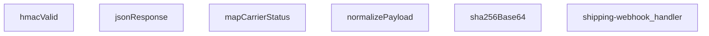

## Genel Bakış
Bu modül, kargo firmalarından gelen webhook bildirimlerini işleyen bir Supabase Edge Function'dır. HMAC-SHA256 imza doğrulamasıyla güvenli bir şekilde istekleri alır, farklı kargo firmalarının değişken formatlarındaki verileri standart bir forma dönüştürür ve siparişlerin kargo durumunu günceller. Modül, merkezi bir kargo durumu güncelleme noktası olarak çoklu kargo firması desteği sunar.

## Fonksiyon Grupları

### Güvenlik ve Yanıt Yardımcıları
Bu grup, webhook isteklerinin HMAC-SHA256 imzasıyla otentikasyonunu sağlar ve HTTP yanıtlarını standart JSON formatında oluşturmak için yardımcı fonksiyonları içerir.
- jsonResponse, hmacValid, sha256Base64

### Veri Dönüştürme ve Durum Eşleme
Farklı kargo firmalarının özel payload yapılarını merkezi, işlenebilir bir normalize forma çevirir ve firma bazlı durum kodlarını modülün iç durum yapısına eşler. Bu sayede tek bir işleyici ile çoklu kargo firması entegrasyonu mümkün olur.
- normalizePayload, mapCarrierStatus

### Ana Webhook İşleyici
Modülün giriş noktasıdır; gelen HTTP isteğini alarak HMAC doğrulaması, payload normalizasyonu, durum haritalama ve güncelleme yanıtı oluşturma adımlarını sırayla koordine eder.
- shipping-webhook_handler

---

## AXIOMS – Mimari Varsayımlar

Bu modül, kargo webhook'larını HMAC-SHA256 imza doğrulamasıyla alıp standart forma dönüştüren bir Supabase Edge Function'dur.

**[Aksiyom 1]:** Eğer `HMAC_SECRET` ortam değişkeni (veya fonksiyonun erişeceği benzer bir gizli anahtar kaynağı) yoksa, `hmacValid` fonksiyonu tüm imza doğrulamalarında başarısız olur ve webhook istekleri reddedilir.

**[Aksiyom 2]:** Eğer gelen HTTP isteği `signatureHeader` içeren bir imza header'ı (örn. `x-hub-signature-256` veya benzeri) taşımıyorsa, `hmacValid` fonksiyonu imza doğrulamasını başaramaz ve `shipping-webhook_handler` geçersiz imza ile yanıt döner.

**[Aksiyom 3]:** Eğer `SKEW_MS` sabiti zaman sapması toleransını tanımlıyorsa ve bu değer `0`'a eşit veya negatif ise, HMAC zaman damgası doğrulaması (varsa) hiçbir zaman penceresini kabul etmez; istekler zaman aşımı nedeniyle reddedilir.

**[Aksiyom 4]:** Eğer `mapCarrierStatus` fonksiyonuna bilinmeyen bir kargo durum string'i (kendi sözlüğünde eşleşmeyen bir值) girilirse, dönen nesnenin `status`, `setShipped` ve `setDelivered` alanlarının tümü `undefined` olur.

**[Aksiyom 5]:** Eğer `normalizePayload` fonksiyonuna geçersiz veya beklenmeyen yapıda bir `obj` parametresi girilirse (örn. `null`, `undefined` veya beklenen alanları içermeyen bir nesne), fonksiyon standart formata dönüştürme işlemini tamamlayamaz;调用çı standart dışı veya eksik veri ile karşılaşır.

**[Aksiyom 6]:** Eğer `sha256Base64` fonksiyonuna boş string (`""`) girilirse, boş bir string'in SHA-256 hash'inin base64 karşılığını döner; bu durum, HMAC hesaplamasında boş payload ile aynı sonucu verir.

**[Aksiyom 7]:** Eğer `shipping-webhook_handler` isteği `Request` nesnesi olarak geçerli bir HTTP isteği değilse (örn. `null`, `undefined` veya geçersiz bir obje), fonksiyon çağrılamaz ve runtime hatası oluşur.

---

## FONKSİYON DETAYLARI

### jsonResponse
**Ne yapar**: Bu fonksiyon, HTTP yanıtları için standart bir JSON formatı oluşturur. Gövdeyi JSON stringine dönüştürür ve uygun `content-type` başlığını ekler.
**Nasıl yapar**: `JSON.stringify` kullanarak gövdeyi formatlanmış (2 boşluk girintili) bir string'e çevirir. Ardından, `ResponseInit` nesnesinden gelen başlıkları ve durum kodunu (varsayılan olarak 200) kullanarak yeni bir `Response` nesnesi döndürür.
**Parametreler**:
- body: unknown — Yanıt gövdesi olarak kullanılacak herhangi bir veri. Fonksiyon tarafından JSON'a dönüştürülecektir.
- init: ResponseInit — `status`, `headers` ve diğer HTTP yanıt seçeneklerini içeren opsiyonel bir nesne. Boş nesne `{}` varsayılanıdır.
**Dönüş**: `Response` — JSON verisini, uygun başlığı ve HTTP durum kodunu içeren standart bir HTTP yanıt nesnesi.

### hmacValid
**Ne yapar**: Verilen bir HMAC-SHA256 imzasının geçerliliğini doğrular. Bu, webhook isteklerinin kimliğini doğrulamak için kullanılır.
**Nasıl yapar**: `crypto.subtle` API'sini kullanarak verilen `secret` anahtarıyla ham `raw` verisinin HMAC-SHA256 imzasını hesaplar. Hesaplanan imzayı base64 formatına dönüştürür. Gelen `signatureHeader` değerini normalleştirerek (başındaki "sha256=" kısmını ve boşlukları temizleyerek) hesaplanan imzayla karşılaştırır.
**Parametreler**:
- secret: string — HMAC imza hesaplamasında kullanılacak gizli anahtar.
- raw: string — İmzası doğrulanacak ham veri (çoğunlukla HTTP gövdesi).
- signatureHeader: string — İstekle birlikte gelen ve doğrulanacak imza değeri (ör. "sha256=...").
**Dönüş**: `Promise<boolean>` — İmza geçerliyse `true`, değilse veya bir hata oluştuysa `false` döner.

### mapCarrierStatus
**Ne yapar**: Farklı kargo şirketlerinin durum metinlerini, uygulama içinde tutarlı ve tanımlı bir durum setine ve ilgili bayraklara dönüştürür.
**Nasıl yapar**: Girdiyi küçük harfe çevirir ve tanımlı durum listelerine göre eşleştirmeler yapar. Her eşleşme, uygulamanın kendi `status` alanını ve siparişin shipped/delivered olarak işaretlenip işaretlenmeyeceğini (`setShipped`, `setDelivered`) belirten boolean bayrakları döndürür. Tanımlanmamış bir durum ise olduğu gibi döner.
**Parametreler**:
- input?: string — Harita dışı bırakılacak kargo şirketi durum metni (ör. "IN_TRANSIT", "delivered"). Opsiyoneldir.
**Dönüş**: `{ status?: string; setShipped?: boolean; setDelivered?: boolean }` — Eşlenen durum bilgisini ve bayrakları içeren bir nesne. Tanınmayan bir durum girdisi varsa, `status` alanı girdinin kendisi olur.

### normalizePayload
**Ne yapar**: Farklı kargo şirketlerinin farklı yapıdaki webhook yüklerini (payload), uygulamanın beklediği tek ve standart bir formata dönüştürür.
**Nasıl yapar**: `carrierHint` parametresinden veya nesnenin kendi `carrier` alanından kargo şirketini belirler. `pick` adlı bir iç fonksiyon ile, olası farklı alan adlarını (ör. `order_id`, `orderId`, `id`) sırasıyla kontrol ederek ilk bulunan değeri alır. Bu sayede gelen verinin yapısı ne olursa olsun, aynı çıktı alanlarına (`order_id`, `tracking_number`, `status` vb.) sahip düzgün bir nesne oluşturulur.
**Parametreler**:
- carrierHint: string — Kargo şirketi bilgisi (ör. "ups", "fedex"). Yük içindeki `carrier` alanından önce kontrol edilir veya onu tamamlar.
- obj: unknown — Webhook'tan gelen ham JSON nesnesi.
**Dönüş**: `Record<string, string>` — `order_id`, `order_number`, `carrier`, `tracking_number`, `tracking_url`, `status`, `shipped_at` ve `delivered_at` alanlarını içeren, değerleri string'e dönüştürülmüş standart bir nesne.

### sha256Base64
**Ne yapar**: Verilen bir girdi string'inin SHA-256 özetini hesaplar ve sonucu base64 formatında döndürür.
**Nasıl yapar**: `TextEncoder` kullanarak string'i byte dizisine dönüştürür. `crypto.subtle.digest` ile SHA-256 hash hesaplar. Elde edilen byte dizisini `btoa(String.fromCharCode(...))`-yardımıyla base64 formatına kodlar.
**Parametreler**:
- input: string — Hash'i hesaplanacak veri.
**Dönüş**: `Promise<string>` — Hesaplanan SHA-256 özetinin base64 encoded hali.

### shipping-webhook_handler
**Ne yapar**: Gelen HTTP isteğini (webhook) işleyerek, taşıyıcıdan gelen veriyi doğrular, normalleştirir ve uygun yanıtı döndürür.  
**Nasıl yapar**: İstek `req` nesnesinden okunur, HMAC doğrulaması `hmacValid` ile yapılır, payload `normalizePayload` ile standartlaştırılır, taşıyıcı durumu `mapCarrierStatus` ile yorumlanır ve sonuç `jsonResponse` aracılığıyla JSON formatında yanıt olarak gönderilir.  
**Parametreler**:
- req: Request — Webhook çağrısını temsil eden HTTP isteği nesnesi.  
**Dönüş**: Response — İşlem sonucunu içeren HTTP yanıtı.

---

## İTHALATLAR (IMPORTS)
- import: ../_shared/tenant_config.ts::resolveTenantId
- import: https://esm.sh/@supabase/supabase-js@2.45.4::createClient

---

## SABİTLER
- **SKEW_MS** (binary_expression) — `5 * 60 * 1000`

---

## AST POINTERS

### [N1_NASIL] AST Pointer: supabase/functions/shipping-webhook/index.ts::jsonResponse
- **params**: `(body: unknown, init: ResponseInit = {})`
- **ic_degiskenler**: (yok — parametreler doğrudan kullanılır)
- **Dönüş**: `Response` — JSON.stringify ile serialize edilmiş body'yi application/json content-type ile Response nesnesi olarak döner

---

### [N2_NASIL] AST Pointer: supabase/functions/shipping-webhook/index.ts::hmacValid
- **params**: `(secret: string, raw: string, signatureHeader: string)`
- **ic_degiskenler**:
  - `key` — crypto.subtle.importKey ile oluşturulmuş HMAC-SHA-256 crypto key nesnesi; secret'tan ham byte'lara convert edilerek import edilir
  - `sigBytes` — crypto.subtle.sign ile HMAC-SHA-256 imzasının ham byte dizisi
  - `computed` — sigBytes'ın base64 string'e encode edilmiş hali; verilen imza ile karşılaştırılır
  - `normalize` — `(s: string) => string` arrow fonksiyonu; signatureHeader'dan trim ve `sha256=` prefix'ini kaldırarak base64 değerini normalize eder
  - `given` — normalize edilmiş (temizlenmiş) imza değeri; computed ile eşleştirilir
- **Dönüş**: `Promise<boolean>` — imzalar eşleşiyorsa true, aksi halde veya hata durumunda false

---

### [N3_NASIL] AST Pointer: supabase/functions/shipping-webhook/index.ts::mapCarrierStatus
- **params**: `(input?: string)`
- **ic_degiskenler**:
  - `s` — input'un null-safe lowercase'e çevrilmiş hali; kargo durumu eşleştirmesi için kullanılır
- **Dönüş**: `{ status?: string; setShipped?: boolean; setDelivered?: boolean }` — carrier durumunu iç sipariş durumuna (paid/shipped/delivered/failed) eşler

---

### [N4_NASIL] AST Pointer: supabase/functions/shipping-webhook/index.ts::normalizePayload
- **params**: `(carrierHint: string, obj: unknown)`
- **ic_degiskenler**:
  - `rec` — obj'in Record<string, unknown>'a cast edilmiş hali; obj nesne ise doğrudan, değilse boş obje olarak alınır
  - `c` — carrier adının lowercase trim edilmiş hali; carrierHint parametresinden, yoksa rec.carrier alanından çözümlenir
  - `pick` — `(...keys: string[]) => unknown` arrow fonksiyonu; rec içindeki alanları sırayla arar, ilk non-null değeri döner (alias'ları resolve eder: order_id/orderId/id gibi)
  - `norm` — normalize edilmiş payload nesnesi; pick() kullanarak order_id, order_number, carrier, tracking_number, tracking_url, status, shipped_at, delivered_at alanlarını standart forma getirir
- **Dönüş**: `norm` nesnesi — tüm kargo sağlayıcı formatlarından standart formata normalize edilmiş order/shipping bilgisi

---

### [N5_NASIL] AST Pointer: supabase/functions/shipping-webhook/index.ts::sha256Base64
- **params**: `(input: string)`
- **ic_degiskenler**:
  - `bytes` — input string'in TextEncoder ile UTF-8 byte dizisine çevrilmiş hali
  - `hash` — crypto.subtle.digest('SHA-256', bytes) ile hesaplanmış 256-bit hash'in Uint8Array'i
- **Dönüş**: `Promise<string>` — hash'in base64 string olarak encode edilmiş hali

---

### [N6_NASIL] AST Pointer: supabase/functions/shipping-webhook/index.ts::shipping-webhook_handler
- **params**: `(req: Request)`
- **ic_degiskenler**:
  - `raw` — req.text() ile okunan ham HTTP body string'i; HMAC imza doğrulaması ve payload parse için kullanılır
  - `payload` — JSON.parse(raw) ile parse edilmiş request body nesnesi; hata olursa boş obje `{}`
  - `tenantId` — resolveTenantId(req, payload) ile çözümlenen kiracı ID'si; tüm DB sorgularında row-level security/tenant filtresi için kullanılır
  - `isMockEnv` — `SUPABASE_SERVICE_ROLE_KEY === 'service-key'` kontrolü; test/sandbox ortamında tenant eşleşme kontrollerini atlar
  - `secret` — Deno.env.get('SHIPPING_WEBHOOK_SECRET') ile okunan webhook HMAC secret anahtarı; boş string fallback
  - `signature` — req.headers.get('x-signature') veya req.headers.get('x-carrier-signature') ile alınan kargo imza header değeri
  - `authorized` — yetkilendirme durumu boolean flag; HMAC veya legacy token ile true olur
  - `token` — req.headers.get('x-webhook-token') ile alınan legacy yetkilendirme token'ı
  - `expected` — Deno.env.get('SHIPPING_WEBHOOK_TOKEN') ile okunan beklenen legacy token değeri
  - `tsHeader` — req.headers.get('x-timestamp') veya req.headers.get('x-event-time') ile alınan replay guard timestamp header'ı
  - `t` — tsHeader'dan parse edilmiş epoch millisecond timestamp; hem epoch ms hem ISO format desteklenir
  - `SUPABASE_URL` — Deno.env.get('SUPABASE_URL') ile okunan Supabase proje URL'i
  - `SERVICE_KEY` — Deno.env.get('SUPABASE_SERVICE_ROLE_KEY') ile okunan service role anahtarı
  - `supabase` — createClient(SUPABASE_URL, SERVICE_KEY) ile oluşturulmuş Supabase istemcisi; tüm DB ve edge function çağrıları için kullanılır
  - `carrierHint` — req.headers.get('x-carrier') ile alınan kargo sağlayıcı adı hint'i; normalizePayload'aPassedılır
  - `p` — normalizePayload(carrierHint, payload) dönüş değeri; order_id, order_number, carrier, tracking_number, tracking_url, status, shipped_at, delivered_at alanlarını standart formatta içerir
  - `eventId` — req.headers.get('x-id') veya req.headers.get('x-event-id') ile alınan dedup event ID'si; boşsa dedup atlanır
  - `existing` — shipping_webhook_events tablosundan eventId ile sorgulanmış mevcut event kayıtları dizisi; duplicate kontrolü için kullanılır
  - `matched` — `existing[0]` — ilk eşleşen mevcut event kaydı; tenant_id eşleşmesi kontrol edilir
  - `orderId` — p.order_id trim edilmiş hali; boşsa p.order_number ile venthub_orders tablosundan çözümlenir
  - `data` (order_number lookup) — venthub_orders tablosundan `.eq('order_number', p.order_number)` ile bulunan sipariş kaydı; `{ id, tenant_id }` shape'inde
  - `error` (order_number lookup) — order_number sorgu hatası; data ile birlikte 404 kontrolü için kullanılır
  - `current` — venthub_orders tablosundan `orderId` ile fetch edilmiş mevcut sipariş kaydı; id, tenant_id, status, shipped_at, delivered_at, tracking_number, tracking_url, carrier alanlarını içerir
  - `curErr` — current fetch sorgu hatası; order bulunamazsa 404 döner
  - `patch` — `Partial<OrderRow> & Record<string, unknown>` tipinde güncellenecek alanlar nesnesi; carrier, tracking_number, tracking_url, status, shipped_at, delivered_at alanlarını koşullu olarak doldurulur
  - `mapped` — mapCarrierStatus(p.status) dönüş değeri; status, setShipped, setDelivered alanlarını içerir
  - `curStatus` — `current.status || 'pending'` değerinin lowercase'i; mevcut sipariş durumu rank karşılaştırması için
  - `next` — `mapped.status` değerinin lowercase'i; hedef durum
  - `curRank` — `RANK[curStatus] ?? 0` — mevcut durumun sıralama rank'ı; monotonik ilerleme kontrolü için
  - `nextRank` — `RANK[next] ?? curRank` — hedef durumun sıralama rank'ı
  - `parseDate` — `(s?: string) => string | undefined` arrow fonksiyonu; string tarih ISO'ya parse eder, geçerliyse ISO string döner
  - `noChange` — boolean flag; patch'te etkili bir değişim olup olmadığını kontrol eder (status, tracking_number, tracking_url, carrier, shipped_at, delivered_at alanlarının tamamı değişmemişse true)
  - `bodyHash` — `sha256Base64(raw)` ile hesaplanmış request body SHA-256 hash'inin base64 hali; event audit kaydı için kullanılır
  - `data` (update result) — venthub_orders tablosunda `.update(patch)` sonrası dönen güncellenmiş sipariş kaydı; id, tenant_id, status, carrier, tracking_number, tracking_url, shipped_at, delivered_at, order_number, customer_email, customer_name alanlarını içerir
  - `error` (update result) — update sorgu hatası; varsa message提取 edilip 500 döner
  - `msg` — error.message'in string kontrolü ile extract edilmiş hata mesajı; hata response body'sinde kullanılır
- **Dönüş**: `Response` — jsonResponse() ile oluşturulmuş JSON response; başarılı durumda `{ ok, order_id, shipping, unchanged?, duplicate? }`, hatalı durumda `{ error }`

---

## MERMAID CALL GRAPH

## NODE ID STANDARD

  file: supabase\functions\shipping-webhook\index.ts
  function: supabase\functions\shipping-webhook\index.ts::jsonResponse
  function: supabase\functions\shipping-webhook\index.ts::hmacValid
  function: supabase\functions\shipping-webhook\index.ts::mapCarrierStatus
  function: supabase\functions\shipping-webhook\index.ts::normalizePayload
  function: supabase\functions\shipping-webhook\index.ts::sha256Base64
  function: supabase\functions\shipping-webhook\index.ts::shipping-webhook_handler

---

## DISA AKTARILANLAR (EXPORTS)
  export: hmacValid
  export: jsonResponse
  export: mapCarrierStatus
  export: normalizePayload
  export: sha256Base64
  export: shipping-webhook_handler