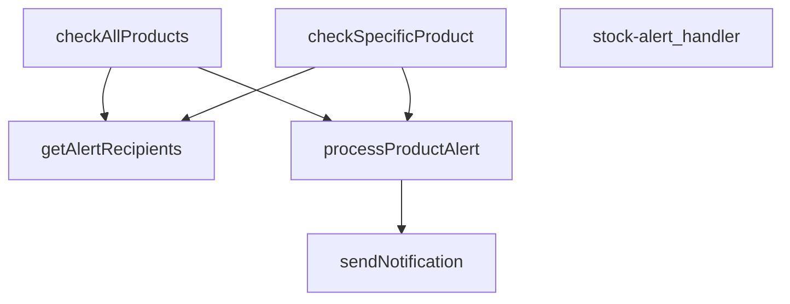

## Genel Bakış
VentHub HVAC platformu için tasarlanmış bir Supabase Edge Fonksiyonudur. Temel amacı, ürün stok seviyelerinin önceden tanımlı kritik eşik değerlerin altına düştüğünde otomatik uyarılar üreterek tedarik zinciri süreçlerini başlatmaktır. Modül, hem tüm ürün envanterini tarayan toplu kontrol hem de belirli bir ürünü hedefleyen tetikleme modları ile esnek bir uyarı yönetimi sunar.

## Fonksiyon Grupları
### İstek Kabul ve Yönlendirme
Gelen HTTP isteğini dinler, istek parametrelerini analiz eder ve verilen komuta bağlı olarak stok kontrol işinin doğru metodunu başlatır.
- stock-alert_handler

### Stok Kontrol ve Değerlendirme
Veritabanındaki ürün stoklarını çekerek definedik eşik değerleriyle karşılaştırır. İstenen kapsamda (tüm ürünler veya tek bir ürün) stok yetersizliği tespit eder.
- checkAllProducts, checkSpecificProduct

### Uyarı İşleme ve Bildirim Tetikleme
Stok uyarısı oluşturulan her bir ürün için ilgili alıcıların listesini çeker ve tanımlı bildirim kanalları üzerinden öncelik sırasına göre ulaşılabilir uyarılar gönderir.
- processProductAlert, getAlertRecipients, sendNotification

---

## AXIOMS – Mimari Varsayımlar

Bu modül, stok seviyeleri belirli bir eşiğin altına düştüğünde bildirim göndererek tedarik süreçlerini tetikler. Fonksiyon imzaları ve modül yapısı dikkate alınarak aşağıdaki aksiyomlar türetilmiştir:

[Aksiyom 1]: Eğer `stock-alert_handler` fonksiyonuna geçerli bir HTTP isteği (`Request`) ulaşmazsa, fonksiyon uygun bir hata yanıtı (örn. 400/405) döndürmeli veya işlenmemelidir; aksi halde beklenmeyen davranış veya çökme olur.

[Aksiyom 2]: Eğer `supabase` istemcisi (`SupabaseClient`) `checkAllProducts` veya `checkSpecificProduct` fonksiyonlarına başarıyla bağlanamazsa (örn. kimlik doğrulama hatası, ağ kesintisi), stok kontrolü yapılamaz ve dolayısıyla hiçbir uyarı bildirimi gönderilemez; bu durumda ilgili hata loglanmalı veya çağrıya hata ile dönülmelidir.

[Aksiyom 3]: Eğer `checkSpecificProduct` fonksiyonuna geçerli bir `_productId` parametresi verilmezse (boş string, null veya tanımsız), fonksiyon o ürünü işleyemez; bu durumda o ürüne ait uyarı kontrolü atlanır veya hata döndürülür.

[Aksiyom 4]: Eğer `processProductAlert` fonksiyonunda `product` nesnesi içinde stok seviyesi veya eşik değeri bilgisi eksikse (bu değerlerin hangisi olduğu bilinmiyor), ürünün düşük stoklu olup olmadığı değerlendirilemez; bu durumda o ürün için uyarı işlemi yapılamaz.

[Aksiyom 5]: Eğer `processProductAlert` fonksiyonuna verilen `recipients` listesi boşsa (`AlertRecipient[]` boş dizi), stok uyarısı için bildirim gönderilecek alıcı bulunmaz; bu durumda `sendNotification` çağrılmaz veya uyarı işlemi tamamlanmaz.

[Aksiyom 6]: Eğer `sendNotification` fonksiyonuna `priority` parametresi geçerli bir değer değilse (örn. tanımsız string, boş string), bildirimin önceliği belirlenemez; bu durumda bildirim ya gönderilemez ya da varsayılan

---

## FONKSİYON DETAYLARI

### stock-alert_handler
**Ne yapar**: Bu fonksiyon, stok alert sisteminin ana HTTP istek işleyicisidir. Gelen bir Request nesnesini alır ve ilgili iş mantığını (belirli bir ürünü veya tüm ürünleri kontrol etme) çağırarak bir Response nesnesi döndürür.
**Nasıl yapar**: Fonksiyonun gövdesi verilmemiştir, ancak adı ve parametreleri göz önüne alındığında, HTTP isteğinin içeriğine (örneğin bir `productId` parametresi varlığına) göre `checkSpecificProduct` veya `checkAllProducts` fonksiyonlarından birini çağıran bir yönlendirici (router) gibi davranması beklenir.
**Parametreler**:
- `req: Request` — Gelen HTTP isteği nesnesi, istemciden gelen verileri ve headers'ları içerir.
**Dönüş**: `Response` — İşlemin sonucunu içeren, istemciye gönderilecek HTTP yanıtı.

### checkAllProducts
**Ne yapar**: Stok seviyesi eşik değerinin altında kalan tüm ürünleri sorgular ve her biri için uyarı bildirimleri gönderir. Stok yönetimi için toplu kontrol yapan ana işlevdir.

**Nasıl yapar**: Supabase üzerinden `products` tablosundan `stock_qty` değeri 10 veya altında olan ürünleri çeker. JS tarafında filtreleme yaparak `low_stock_threshold` değerinin altına düşen ürünleri belirler. N+1 sorgu optimizasyonu uygulayarak alıcı listesini tek seferde çeker, ardından her ürün için `processProductAlert` fonksiyonunu sıralı olarak çağırır. Bulunan ürün sayısını konsola警告 olarak kaydeder.

**Parametreler**:
- supabase: SupabaseClient — Veritabanı işlemleri için Supabase istemcisi. Tablolardan veri okuma ve yazma işlemlerinde kullanılır.

**Dönüş**: Promise<Array<{product: string, alertType: string, notifications: number, success: boolean}>> — İşlenen her ürün için sonuç nesnelerini içeren dizi. Her sonuç; ürün adı, uyarı türü, gönderilen bildirim sayısı ve başarı durumunu içerir.

### checkSpecificProduct
**Ne yapar**: Verilen **tek bir ürünün** stok seviyesini kontrol eder ve belirlenen eşik değerinin altındaysa uyarı sürecini başlatır.
**Nasıl yapar**: Supabase istemcisi ile belirtilen `_productId`'ye sahip ürünü `products` tablosundan çeker. Ürün bulunamazsa hata fırlatır. Ürünün stok miktarı, eşik değerinden yüksekse uyarı yapılmaz ve basit bir bilgi mesajı döndürülür. Düşük veya eşit ise, alıcıları çekerek `processProductAlert` fonksiyonunu çağırır ve sonucu döndürür.
**Parametreler**:
- `supabase: SupabaseClient` — Veritabanı işlemleri için kullanılan Supabase istemcisi nesnesi.
- `_productId: string` — Kontrol edilecek ürünün benzersiz kimliği (ID'si).
**Dönüş**: Uyarı yapıldığında, `processProductAlert` fonksiyonunun sonucunu içeren tek elemanlı bir dizi (array). Stok eşik değerinin üzerindeyse, `product.name` ve "Stock above threshold" mesajını içeren bir nesne dizisi.

### processProductAlert
**Ne yapar**: Belirli bir ürün için stok durumuna göre bir uyarı türü (`out_of_stock` veya `low_stock`) belirler ve öncelikli olarak tanımlanmış alıcılara bu uyarı bildirimlerini gönderir.
**Nasıl yapar**: Ürünün `stock_qty` değerine bakarak uyarı türünü ve önceliğini belirler. `alertData` adında bir nesne oluşturarak ürün detaylarını paketler. Sonra, her bir alıcının (`recipients`) tercih ettiği bildirim kanallarına (WhatsApp, SMS, Email) göre döngü yapar ve her bir kanal için `sendNotification` fonksiyonunu çağırarak bildirimleri gönderir. Fonksiyon, gönderilen bildirim sayısını ve tüm bildirimlerin başarılı olup olmadığını özetleyen bir sonuç nesnesi döndürür.
**Parametreler**:
- `supabase: SupabaseClient` — Veritabanı işlemleri için kullanılan Supabase istemcisi nesnesi.
- `product: Product` — Uyarı gönderilecek ürünün tüm detaylarını (id, name, stock_qty, low_stock_threshold) içeren nesne.
- `recipients: AlertRecipient[]` — Uyarı bildirimlerinin gönderileceği kişi/kişilerin listesi ve tercih ettikleri bildirim kanallarını tanımlayan dizi.
**Dönüş**: `{ product, alertType, notifications, success }` — İşlem sonucunu özetleyen bir nesne. `product` (ürün adı), `alertType` ('out_of_stock' veya 'low_stock'), `notifications` (gönderilen bildirim sayısı), `success` (tüm bildirimler başarılıysa true, değilse false).

### sendNotification
**Ne yapar**: Bu fonksiyon, belirtilen türde bir bildirim (e-posta, SMS vb.) alıcısına göndermek için Supabase'deki `notification-service` edge fonksiyonunu çağırır. Temel olarak, stok uyarıları gibi belirli bir veri setini alarak harici bir hizmete iletir.

**Nasıl yapar**: Fonksiyon, ortam değişkenlerinden `SUPABASE_URL` ve `SUPABASE_SERVICE_ROLE_KEY` değerlerini okur. Ardından, `notification-service` endpoint'ine `POST` isteği göndermek için `fetch` kullanır. İstek gövdesi, bildirim türü, alıcı, öncelik, zorunlu bir `message` alanı ve orijinal veriyi genişleten bir `data` nesnesi içerir. `message` alanı, `data.alertType` değerine göre dinamik olarak oluşturulur; bu, notification-service'in şablon olmadığında kullanacağı gövdeyi tanımlar ve önceki bir hatayı (`.replace()` çağrısının 500 hatası vermesi) önler. İşlem başarıyla tamamlanırsa `{ type, recipient, success: true }` döner, bir hata yakalanırsa hata günlüğe yazılır ve `{ success: false }` döner.

**Parametreler**:
- `type`: string — Gönderilecek bildirim türünü belirtir (örn: "email", "sms").
- `to`: string — Bildirimin gönderileceği alıcının adresi veya numarası.
- `data`: AlertData — Bildirim için gerekli tüm verileri (ürün adı, mevcut stok, eşik değeri, uyarı türü) içeren bir nesne.
- `priority`: string — Bildirimin öncelik seviyesini belirtir (örn: "high", "low").

**Dönüş**: `Promise<{ type: string; recipient: string; success: boolean }>` — Bildirim denemesinin sonucunu ve alıcıyı içeren bir nesne döner.

### getAlertRecipients
**Ne yapar**: Stok uyarı bildirimlerinin gönderileceği alıcıların listesini veritabanından çeker. Varsayılan bir alıcı (sistem yöneticisi) sağlamaya çalışır ve bulamazsa sabit bir acil durum email adresi ile geri dönüş (fallback) yapar.
**Nasıl yapar**: `inventory_settings` tablosundan ana `alert_email` adresini çeker. Eğer bu adres mevcutsa, onu bir `AlertRecipient` nesnesine dönüştürüp listeye ekler. Eğer bu adrese ulaşılamazsa veya hiç alıcı bulunamazsa, `stok@venthub.com` adresini içeren sabit bir geri dönüş alıcısı oluşturur. Her iki durumda da alıcıya sadece email bildirimi enabled olan, düşük ve kritik stok uyarılarını da alan bir yapı atar.
**Parametreler**:
- `supabase: SupabaseClient` — Veritabanı işlemleri için kullanılan Supabase istemcisi nesnesi.
**Dönüş**: `Promise<AlertRecipient[]>` — Bildirim gönderilecek alıcıların (isim, telefon, email, whatsapp, rol, ve hangi bildirim türlerini/alıcıları istediği) listesini içeren asenkron dizi.

---

## İTHALATLAR (IMPORTS)
- import: ../_shared/cors.ts::getCorsHeaders
- import: https://deno.land/std@0.168.0/http/server.ts::serve
- import: https://esm.sh/@supabase/supabase-js@2.39.3::SupabaseClient
- import: https://esm.sh/@supabase/supabase-js@2.39.3::createClient

---

## INTERFACES

### Product
- `id: string`
- `name: string`
- `stock_qty: number`
- `low_stock_threshold: number`

### AlertRecipient
- `name: string`
- `phone: string`
- `email: string`
- `whatsapp: string`
- `role: 'admin' | 'manager' | 'buyer'`
- `notifications: {`

### AlertData
- `productName: string`
- `_productId: string`
- `currentStock: number`
- `threshold: number`
- `alertType: 'out_of_stock' | 'low_stock'`

---

## AST POINTERS

### [N1_NASIL] AST Pointer: supabase/functions/stock-alert/index.ts::stock-alert_handler
- **params**: `(req: Request)`
- **ic_degiskenler**:
  - `corsHeaders` — `getCorsHeaders(req)` ile üretilen CORS response header nesnesi, tüm yanıtlara eklenir
  - `supabaseUrl` — `Deno.env.get('SUPABASE_URL')` ile okunan Supabase proje URL'i
  - `serviceRoleKey` — `Deno.env.get('SUPABASE_SERVICE_ROLE_KEY')` ile okunan admin servis anahtarı
  - `authHeader` — `req.headers.get('Authorization')` ile gelen Bearer token header'ı
  - `isAuthorized` — boolean flag, kullanıcının yetkili olup olmadığını tutar (başlangıç: `false`)
  - `anonKey` — `Deno.env.get('SUPABASE_ANON_KEY')` ile okunan anonymous key, auth fallback'te kullanılır
  - `createClientAuth` — **dinamik/lazy import**: `await import('https://esm.sh/@supabase/supabase-js@2.45.4')` ile yüklenen `createClient` fonksiyonu (auth client oluşturmak için)
  - `authClient` — anonKey + Authorization header ile oluşturulan Supabase auth istemcisi
  - `user` — `authClient.auth.getUser()` sonucundan elde edilen authenticated kullanıcı nesnesi
  - `roleCheck` — `fetch()` ile `/rest/v1/user_profiles` endpoint'ine yapılan role kontrol isteği sonucu (Response)
  - `arr` — `roleCheck.json()` sonucu, user_profiles satır dizisi; `.catch(() => [])` ile boş dizi fallback'i
  - `role` — `arr[0]` erişimi ile alınan kullanıcının rolü (`'admin'` veya `'superadmin'` olmalı)
  - `supabase` — `createClient(supabaseUrl, serviceRoleKey)` ile oluşturulan service-role Supabase client'ı
  - `alertResults` — `unknown[]` tipinde, işlenen uyarı sonuçları dizisi (GET: `checkAllProducts`, POST: `checkSpecificProduct` dönüşü)
  - `_productId` — POST body'sinden `req.json()` ile parse edilen ürün ID'si (POST isteklerinde kullanılır)
  - `error` — try-catch bloğundan yakalanan hata nesnesi
  - `msg` — `error instanceof Error ? error.message : String(error)` ile güvenli hata mesajı dönüşümü
- **Subscript Erişimleri**:
  - `arr[0]?.role` — roleCheck JSON yanıtının ilk satırından rol alanı okunur
- **Dönüş**: `Response` (CORS header'lı, JSON body'li HTTP yanıtı)

---

### [N2_NASIL] AST Pointer: supabase/functions/stock-alert/index.ts::checkAllProducts
- **params**: `(supabase: SupabaseClient)`
- **ic_degiskenler**:
  - `allLowStock` — `supabase.from('products').select(...).filter('stock_qty', 'lte', 10)` sorgusundan dönen düşük stoklu tüm ürünler dizisi
  - `fetchErr` — Supabase sorgu hatası; varsa `throw fetchErr` ile fırlatılır
  - `productsToAlert` — `allLowStock` dizisi `.filter()` ile `stock_qty <= (low_stock_threshold || 5)` koşuluna göre filtrelenmiş nihai ürün listesi; `Product[]` tipine cast edilmiş
  - `recipients` — `getAlertRecipients(supabase)` çağrısı ile全球 tek seferde çekilen bildirim alıcıları listesi (N+1 optimizasyonu)
  - `results` — işlenen her ürünün sonuç nesnelerini toplayan dizi
- **Subscript Erişimleri**:
  - `p.stock_qty` — döngüde her ürünün stok miktarı
  - `p.low_stock_threshold` — döngüde her ürünün düşük stok eşik değeri (fallback: `5`)
  - `p.name` — ürün adı (result objesinde kullanılır)
  - `p.id` — ürün ID'si (result objesinde kullanılır)
- **Dönüş**: `results` dizisi — her biri `{ product, alertType, notifications, success }` nesnesi olan array

---

### [N3_NASIL] AST Pointer: supabase/functions/stock-alert/index.ts::checkSpecificProduct
- **params**: `(supabase: SupabaseClient, _productId: string)`
- **ic_degiskenler**:
  - `product` — `supabase.from('products').select(...).eq('id', _productId).single()` ile çekilen tek ürün nesnesi (`Product`)
  - `error` — Supabase sorgu hatası; `error || !product` koşulunda hata fırlatılır
  - `recipients` — `getAlertRecipients(supabase)` çağrısı ile çekilen bildirim alıcıları listesi
- **Subscript Erişimleri**:
  - `product.stock_qty` — ürünün stok miktarı, eşik kontrolünde kullanılır
  - `product.low_stock_threshold` — ürünün düşük stok eşik değeri (fallback: `5`)
  - `product.name` — ürün adı, stok eşik üstündeyse mesaj nesnesinde kullanılır
- **Dönüş**: Dizi — stok eşik üstündeyse `[{ product: string, message: string }]`, eşik altındaysa `processProductAlert` dönüşü

---

### [N4_NASIL] AST Pointer: supabase/functions/stock-alert/index.ts::processProductAlert
- **params**: `(supabase: SupabaseClient, product: Product, recipients: AlertRecipient[])`
- **ic_degiskenler**:
  - `alertType` — `'out_of_stock'` veya `'low_stock'`, `product.stock_qty <= 0` koşuluna göre belirlenir
  - `priority` — `'critical'` veya `'high'`, aynı stoq koşuluna göre belirlenir
  - `alertData` — `AlertData` tipinde nesne, bildirim şablonuna gönderilecek ürün bilgilerini içerir (`productName`, `_productId`, `currentStock`, `threshold`, `alertType`)
  - `notifications` — gönderilen her bildirim sonucunu toplayan dizi
- **Subscript Erişimleri**:
  - `recipient.notifications[alertType]` — **dinamik key erişimi**: alıcının bu alert type için bildirim tercihi (`true`/`false`)
  - `recipient.notifications.whatsapp` — alıcının WhatsApp bildirim tercihi
  - `recipient.notifications.sms` — alıcının SMS bildirim tercihi
  - `recipient.notifications.email` — alıcının email bildirim tercihi
  - `recipient.whatsapp` — alıcının WhatsApp numarası/hesabı
  - `recipient.phone` — alıcının telefon numarası
  - `recipient.email` — alıcının email adresi
  - `notifications.every(n => n.success)` — tüm bildirimlerin başarılı olup olmadığını kontrol eden dizi metodu
- **Dönüş**: `{ product: string, alertType: string, notifications: number, success: boolean }`

---

### [N5_NASIL] AST Pointer: supabase/functions/stock-alert/index.ts::sendNotification
- **params**: `(type: string, to: string, data: AlertData, priority: string)`
- **ic_degiskenler**:
  - `supabaseUrl` — `Deno.env.get('SUPABASE_URL')` ile okunan Supabase URL'i (fonksiyon içinde tekrar okunur)
  - `serviceRoleKey` — `Deno.env.get('SUPABASE_SERVICE_ROLE_KEY')` ile okunan servis anahtarı (fonksiyon içinde tekrar okunur)
  - `response` — `fetch()` ile `notification-service` Edge Function'ına yapılan POST isteği sonucu (Response)
- **Subscript Erişimleri**:
  - `data.alertType` — bildirim tipi (`'out_of_stock'`/`'low_stock'`), mesaj şablonu koşulunda kullanılır
  - `data.productName` — ürün adı, mesaj şablonunda string interpolation ile yerleştirilir
  - `data.threshold` — eşik değeri, mesaj şablonunda gösterilir
  - `data.currentStock` — mevcut stok miktarı, mesaj şablonunda gösterilir
- **Dönüş**: `{ type: string, recipient: string, success: boolean }` — bildirim sonucu nesnesi

---

### [N6_NASIL] AST Pointer: supabase/functions/stock-alert/index.ts::getAlertRecipients
- **params**: `(supabase: SupabaseClient)`
- **ic_degiskenler**:
  - `settings` — `supabase.from('inventory_settings').select('alert_email').maybeSingle()` sorgusundan dönen ayarlar nesnesi (null olabilir)
  - `recipients` — `AlertRecipient[]` tipinde, bildirim yapılacak alıcıların toplandığı dizi
- **Subscript Erişimleri**:
  - `settings?.alert_email` — inventory_settings tablosundan okunan ana alarm email adresi
  - `recipients.length` — dizinin boş olup olmadığını kontrol etmek için kullanılır (fallback koşulu)
- **Dönüş**: `AlertRecipient[]` — en az bir alıcı listesi (settings'den veya `stok@venthub.com` fallback'inden)

---

## MERMAID CALL GRAPH

## NODE ID STANDARD

  file: supabase\functions\stock-alert\index.ts
  function: supabase\functions\stock-alert\index.ts::stock-alert_handler
  function: supabase\functions\stock-alert\index.ts::checkAllProducts
  function: supabase\functions\stock-alert\index.ts::checkSpecificProduct
  function: supabase\functions\stock-alert\index.ts::processProductAlert
  function: supabase\functions\stock-alert\index.ts::sendNotification
  function: supabase\functions\stock-alert\index.ts::getAlertRecipients

---

## DISA AKTARILANLAR (EXPORTS)
  export: checkAllProducts
  export: checkSpecificProduct
  export: getAlertRecipients
  export: processProductAlert
  export: sendNotification
  export: stock-alert_handler