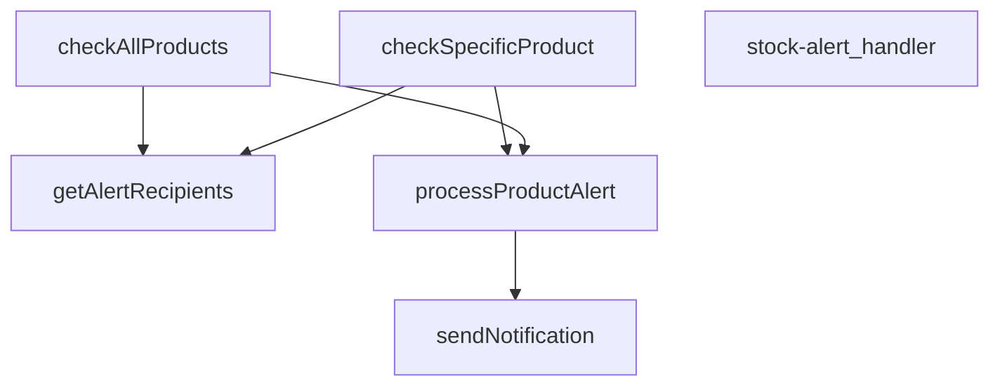

## Genel Bakış
Bu modül, VentHub HVAC platformu için bir Supabase Edge Fonksiyonu olarak stok uyarıları yönetir. Stok seviyeleri belirli bir eşiğin altına düştüğünde, ilgili alıcılara bildirim göndermek suretiyle tedarik süreçlerinin zamanında başlatılmasını sağlar. Modül, HTTP istekleriyle tetiklenir ve ürün bazlı veya toplu stok kontrolü yapabilir.

## Fonksiyon Grupları
### İstek Kabul ve Yönlendirme
Gelen HTTP isteğini analiz ederek hangi stok kontrol methodunun çalıştırılacağına karar verir ve işlem sonucunu HTTP yanıtı olarak döndürür.
- stock-alert_handler

### Stok Kontrol ve Değerlendirme
Veritabanındaki ürünlerin stok seviyelerini eşik değerleriyle karşılaştırır. Tüm ürünleri tarayabileceği gibi tek bir belirli ürünü de kontrol edebilir.
- checkAllProducts, checkSpecificProduct

### Uyarı İşleme ve Bildirim Tetikleme
Stok uyarısı gereken ürünler için alıcı listesini çeker ve her bir alıcıya uygun bildirimleri gönderir.
- processProductAlert, getAlertRecipients, sendNotification

---

---

## FONKSİYON DETAYLARI

### stock-alert_handler
**Ne yapar**: Bu fonksiyon, stok alert sisteminin ana HTTP istek işleyicisidir. Gelen bir Request nesnesini alır ve ilgili iş mantığını (belirli bir ürünü veya tüm ürünleri kontrol etme) çağırarak bir Response nesnesi döndürür.
**Nasıl yapar**: Fonksiyonun gövdesi verilmemiştir, ancak adı ve parametreleri göz önüne alındığında, HTTP isteğinin içeriğine (örneğin bir `productId` parametresi varlığına) göre `checkSpecificProduct` veya `checkAllProducts` fonksiyonlarından birini çağıran bir yönlendirici (router) gibi davranması beklenir.
**Parametreler**:
- `req: Request` — Gelen HTTP isteği nesnesi, istemciden gelen verileri ve headers'ları içerir.
**Dönüş**: `Response` — İşlemin sonucunu içeren, istemciye gönderilecek HTTP yanıtı.

### checkAllProducts
**Ne yapar**: Veritabanındaki **tüm ürünleri** stok seviyelerine göre tarar, stok miktarı belirlenmiş eşik değerin (veya varsayılan 5 birim) altında veya eşitinde olan ürünler için uyarı sürecini başlatır.
**Nasıl yapar**: Supabase istemcisi aracılığıyla `products` tablosundan düşük stoklu olabilecek tüm ürünleri çeker. SQL tarafında karmaşık filtreleme yerine, JavaScript tarafında her bir ürünün `stock_qty` değerini, kendi `low_stock_threshold` alanı (yoksa 5) ile karşılaştırarak filtreler. Ardından, alıcıları tek seferde çekip (N+1 sorgu optimizasyonu) her uygun ürün için `processProductAlert` fonksiyonunu çağırarak sonuçları derler.
**Parametreler**:
- `supabase: SupabaseClient` — Veritabanı işlemleri için kullanılan Supabase istemcisi nesnesi.
**Dönüş**: `results` — Her bir işlenen ürün için `processProductAlert` fonksiyonunun döndüğü sonuç nesnelerinden oluşan bir dizi (array). Her sonuç, ürün adını, uyarı türünü, gönderilen bildirim sayısını ve başarı durumunu içerir.

### checkSpecificProduct
**Ne yapar**: Verilen **tek bir ürünün** stok seviyesini kontrol eder ve belirlenen eşik değerinin altındaysa uyarı sürecini başlatır.
**Nasıl yapar**: Supabase istemcisi ile belirtilen `_productId`'ye sahip ürünü `products` tablosundan çeker. Ürün bulunamazsa hata fırlatır. Ürünün stok miktarı, eşik değerinden yüksekse uyarı yapılmaz ve basit bir bilgi mesajı döndürülür. Düşük veya eşit ise, alıcıları çekerek `processProductAlert` fonksiyonunu çağırır ve sonucu döndürür.
**Parametreler**:
- `supabase: SupabaseClient` — Veritabanı işlemleri için kullanılan Supabase istemcisi nesnesi.
- `_productId: string` — Kontrol edilecek ürünün benzersiz kimliği (ID'si).
**Dönüş**: Uyarı yapıldığında, `processProductAlert` fonksiyonunun sonucunu içeren tek elemanlı bir dizi (array). Stok eşik değerinin üzerindeyse, `product.name` ve "Stock above threshold" mesajını içeren bir nesne dizisi.

### processProductAlert
**Ne yapar**: Belirli bir ürün için stok durumuna göre bir uyarı türü (`out_of_stock` veya `low_stock`) belirler ve öncelikli olarak tanımlanmış alıcılara bu uyarı bildirimlerini gönderir.
**Nasıl yapar**: Ürünün `stock_qty` değerine bakarak uyarı türünü ve önceliğini belirler. `alertData` adında bir nesne oluşturarak ürün detaylarını paketler. Sonra, her bir alıcının (`recipients`) tercih ettiği bildirim kanallarına (WhatsApp, SMS, Email) göre döngü yapar ve her bir kanal için `sendNotification` fonksiyonunu çağırarak bildirimleri gönderir. Fonksiyon, gönderilen bildirim sayısını ve tüm bildirimlerin başarılı olup olmadığını özetleyen bir sonuç nesnesi döndürür.
**Parametreler**:
- `supabase: SupabaseClient` — Veritabanı işlemleri için kullanılan Supabase istemcisi nesnesi.
- `product: Product` — Uyarı gönderilecek ürünün tüm detaylarını (id, name, stock_qty, low_stock_threshold) içeren nesne.
- `recipients: AlertRecipient[]` — Uyarı bildirimlerinin gönderileceği kişi/kişilerin listesi ve tercih ettikleri bildirim kanallarını tanımlayan dizi.
**Dönüş**: `{ product, alertType, notifications, success }` — İşlem sonucunu özetleyen bir nesne. `product` (ürün adı), `alertType` ('out_of_stock' veya 'low_stock'), `notifications` (gönderilen bildirim sayısı), `success` (tüm bildirimler başarılıysa true, değilse false).

### sendNotification
**Ne yapar**: Belirli bir iletişim kanalı (tip) üzerinden, belirli bir alıcıya (to), öncelikli bir stok uyarısı bildirimi göndermek için harici bir `notification-service` fonksiyonunu çağırır.
**Nasıl yapar**: Ortam değişkenlerinden (`SUPABASE_URL`, `SUPABASE_SERVICE_ROLE_KEY`) servis bilgilerini alır. `notification-service` edge fonksiyonuna bir HTTP POST isteği gönderir. İstek gövdesinde bildirim tipi, alıcı, öncelik ve ürün verileriyle birlikte bir `subject` alanı (ürün durumuna göre emoji ve başlık) oluşturur. İşlem sonucu (başarılı olup olmadığı) hakkında bir sonuç nesnesi döndürür veya hata durumunda başarısızlık sonucu döndürür.
**Parametreler**:
- `type: string` — Bildirim gönderilecek kanalın tipi (örn: 'whatsapp', 'sms', 'email').
- `to: string` — Bildirimin gönderileceği alıcının iletişim adresi (telefon numarası veya email).
- `data: AlertData` — Bildirim içeriğini oluşturan ürün detaylarını (ürün adı, id, stok miktarı, eşik, uyarı türü) içeren veri nesnesi.
- `priority: string` — Bildirimin öncelik seviyesi (örn: 'critical', 'high').
**Dönüş**: `{ type, recipient, success }` — Gönderim denemesinin sonucunu gösteren nesne. `type` (kanal), `recipient` (alıcı), `success` (istek başarılıysa true, değilse false).

### getAlertRecipients
**Ne yapar**: Stok uyarı bildirimlerinin gönderileceği alıcıların listesini veritabanından çeker. Varsayılan bir alıcı (sistem yöneticisi) sağlamaya çalışır ve bulamazsa sabit bir acil durum email adresi ile geri dönüş (fallback) yapar.
**Nasıl yapar**: `inventory_settings` tablosundan ana `alert_email` adresini çeker. Eğer bu adres mevcutsa, onu bir `AlertRecipient` nesnesine dönüştürüp listeye ekler. Eğer bu adrese ulaşılamazsa veya hiç alıcı bulunamazsa, `stok@venthub.com` adresini içeren sabit bir geri dönüş alıcısı oluşturur. Her iki durumda da alıcıya sadece email bildirimi enabled olan, düşük ve kritik stok uyarılarını da alan bir yapı atar.
**Parametreler**:
- `supabase: SupabaseClient` — Veritabanı işlemleri için kullanılan Supabase istemcisi nesnesi.
**Dönüş**: `Promise<AlertRecipient[]>` — Bildirim gönderilecek alıcıların (isim, telefon, email, whatsapp, rol, ve hangi bildirim türlerini/alıcıları istediği) listesini içeren asenkron dizi.

---

## INTERFACES

### Product
- `id: string`
- `name: string`
- `stock_qty: number`
- `low_stock_threshold: number`

### AlertRecipient
- `name: string`
- `phone: string`
- `email: string`
- `whatsapp: string`
- `role: 'admin' | 'manager' | 'buyer'`
- `notifications: {
`

### AlertData
- `productName: string`
- `_productId: string`
- `currentStock: number`
- `threshold: number`
- `alertType: 'out_of_stock' | 'low_stock'`

---

## SABİTLER
- **corsHeaders** (object) — `{

    'Access-Control-Allow-Origin': '*',

    'Access-Control-Allow-Headers...`

---

## AST POINTERS

### [N1_NASIL] AST Pointer: supabase/functions/stock-alert/index.ts::stock-alert_handler
- **params**: (req: Request)
- **ic_degiskenler**:
  - `supabaseUrl` — Supabase URL'sini ortam değişkeninden alır
  - `serviceRoleKey` — Supabase service role key'ini ortam değişkeninden alır
  - `authHeader` — İstek başlığındaki Authorization değerini alır
  - `isAuthorized` — Kimlik doğrulama durumunu tutar (başlangıçta false)
  - `authClient` — Anonymous key ile oluşturulan kimlik doğrulama istemcisi
  - `user` — Kimlik doğrulanmış kullanıcı nesnesi
  - `roleCheck` — Kullanıcı rolünü kontrol eden REST API isteği sonucu
  - `arr` — roleCheck JSON yanıtını parse eder
  - `role` — Kullanıcının rolü (arr[0]?.role)
  - `supabase` — Service role key ile oluşturulan Supabase istemcisi
  - `alertResults` — İşlenen uyarı sonuçları dizisi
  - `_productId` — POST isteğinden gelen ürün ID'si
  - `error` — Try-catch bloğunda yakalanan hata
  - `msg` — Hata mesajı stringi
- **Dönüş**: Response (farklı durumlarda farklı Response nesneleri)

### [N2_NASIL] AST Pointer: supabase/functions/stock-alert/index.ts::checkAllProducts
- **params**: (supabase: SupabaseClient)
- **ic_degiskenler**:
  - `allLowStock` — products tablosundan çekilen düşük stoklu ürünler verisi
  - `fetchErr` — Supabase sorgusu hata nesnesi
  - `productsToAlert` — Eşik değerin altında kalan ürünler (JS tarafında filtrelenmiş)
  - `recipients` — Uyarı alıcıları listesi (getAlertRecipients fonksiyonundan)
  - `results` — İşlenen uyarı sonuçlarını toplayan dizi
  - `product` — Döngüdeki her bir ürün nesnesi (Product tipinde)
- **Dönüş**: results dizisi (ProductAlertResult[])

### [N3_NASIL] AST Pointer: supabase/functions/stock-alert/index.ts::checkSpecificProduct
- **params**: (supabase: SupabaseClient, _productId: string)
- **ic_degiskenler**:
  - `product` — Belirli bir ürünün verisi (Supabase'den çekilen)
  - `error` — Supabase sorgusu hata nesnesi
  - `recipients` — Uyarı alıcıları listesi (getAlertRecipients fonksiyonundan)
- **Dönüş**: Dizi (ProductAlertResult[])

### [N4_NASIL] AST Pointer: supabase/functions/stock-alert/index.ts::processProductAlert
- **params**: (supabase: SupabaseClient, product: Product, recipients: AlertRecipient[])
- **ic_degiskenler**:
  - `alertType` — Uyarı türü (out_of_stock veya low_stock)
  - `priority` — Öncelik seviyesi (critical veya high)
  - `alertData` — Uyarı verisi nesnesi (productName, _productId, currentStock, threshold, alertType içerir)
  - `notifications` — Gönderilen bildirim sonuçlarını toplayan dizi
  - `recipient` — Döngüdeki her bir alıcı (AlertRecipient tipinde)
- **Dönüş**: { product, alertType, notifications, success }

### [N5_NASIL] AST Pointer: supabase/functions/stock-alert/index.ts::sendNotification
- **params**: (type: string, to: string, data: AlertData, priority: string)
- **ic_degiskenler**:
  - `supabaseUrl` — Supabase URL'sini ortam değişkeninden alır
  - `serviceRoleKey` — Supabase service role key'ini ortam değişkeninden alır
  - `response` — notification-service fonksiyonuna yapılan fetch isteği sonucu
  - `err` — Try-catch bloğunda yakalanan hata
- **Dönüş**: { type, recipient, success }

### [N6_NASIL] AST Pointer: supabase/functions/stock-alert/index.ts::getAlertRecipients
- **params**: (supabase: SupabaseClient)
- **ic_degiskenler**:
  - `settings` — inventory_settings tablosundan çekilen ayarlar verisi
  - `recipients` — Uyarı alıcıları dizisi (başlangıçta boş)
- **Dönüş**: Promise<AlertRecipient[]>

---

## MERMAID CALL GRAPH

## NODE ID STANDARD

  file: supabase\functions\stock-alert\index.ts
  function: supabase\functions\stock-alert\index.ts::stock-alert_handler
  function: supabase\functions\stock-alert\index.ts::checkAllProducts
  function: supabase\functions\stock-alert\index.ts::checkSpecificProduct
  function: supabase\functions\stock-alert\index.ts::processProductAlert
  function: supabase\functions\stock-alert\index.ts::sendNotification
  function: supabase\functions\stock-alert\index.ts::getAlertRecipients

---

## DISA AKTARILANLAR (EXPORTS)
  export: checkAllProducts
  export: checkSpecificProduct
  export: getAlertRecipients
  export: processProductAlert
  export: sendNotification
  export: stock-alert_handler