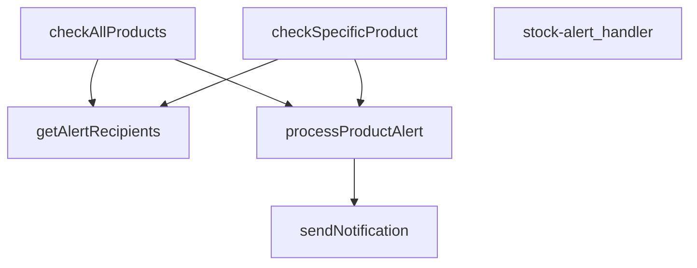

## Genel Bakış
VentHub HVAC stok yönetim sisteminin tetikleyici bir bileşenidir. Modül, ürün stoklarının kritik seviyelere düşmesi durumunda otomatik uyarılar üreterek tedarik ve sipariş süreçlerini başlatır. Esnek yapısı sayesinde hem toplu envanter taraması hem de belirli bir ürüne yönelik tetiklemeler desteklenmektedir.

## Fonksiyon Grupları
### İstek Yönlendirme ve Başlatma
Gelen HTTP isteklerini karşılar, istek içeriğine göre ilgili stok kontrol iş akışını başlatır. Modülün dışarıya açılan tek kapısıdır.
- stock_alert_handler

### Stok Değerlendirme ve Tespit
Veritabanındaki ürün stok seviyelerini çeker ve tanımlı kritik eşik değerlerle karşılaştırır. Uyarı gerektiren ürünleri tespit eder.
- check_all_products, check_specific_product

### Uyarı Yönetimi ve Bildirim Gönderimi
Tespit edilen her kritik stok durumu için uygun alıcıları belirler ve seçilen bildirim kanalı aracılığıyla öncelik sırasına göre bilgilendirme yapar.
- process_product_alert, get_alert_recipients, send_notification

---

## AXIOMS – Mimari Varsayımlar

Bu modül, stok uyarı sistemi için HTTP isteklerini işleyen bir Supabase Edge Fonksiyonu olarak tasarlanmıştır. Fonksiyon imzalarından çıkarılabilecek mimari varsayımlar aşağıdadır.

**[Aksiyom 1]**: Eğer `checkAllProducts` veya `checkSpecificProduct` için geçerli bir `SupabaseClient` bağlantısı yoksa, ürün sorgulama işlemleri başarısız olur.

**[Aksiyom 2]**: Eğer `checkSpecificProduct` için geçerli bir `_productId` değeri (geçersiz veya boş) yoksa, belirli ürüne ait uyarı kontrolü çalıştırılamaz.

**[Aksiyom 3]**: Eğer `processProductAlert` için geçerli bir `Product` nesnesi veya en az bir `AlertRecipient` alıcısı (`recipients` boş dizi) yoksa, ürün uyarı işleme süreci tamamlanamaz.

**[Aksiyom 4]**: Eğer `sendNotification` için `type` veya `to` parametreleri boş/geçersizse, bildirim gönderme işlemi başarısız olur.

**[Aksiyom 5]**: Eğer `sendNotification` için `priority` parametresi belirtilmemişse, varsayılan olarak `"normal"` öncelik kullanılır.

**[Aksiyom 6]**: Eğer `getAlertRecipients` için geçerli bir `SupabaseClient` bağlantısı yoksa, uyarı alıcıları listesi alınamaz.

---

## FONKSİYON DETAYLARI

### stock-alert_handler
**Ne yapar**: Bu fonksiyon, stok alert sisteminin ana HTTP istek işleyicisidir. Gelen bir Request nesnesini alır ve ilgili iş mantığını (belirli bir ürünü veya tüm ürünleri kontrol etme) çağırarak bir Response nesnesi döndürür.
**Nasıl yapar**: Fonksiyonun gövdesi verilmemiştir, ancak adı ve parametreleri göz önüne alındığında, HTTP isteğinin içeriğine (örneğin bir `productId` parametresi varlığına) göre `checkSpecificProduct` veya `checkAllProducts` fonksiyonlarından birini çağıran bir yönlendirici (router) gibi davranması beklenir.
**Parametreler**:
- `req: Request` — Gelen HTTP isteği nesnesi, istemciden gelen verileri ve headers'ları içerir.
**Dönüş**: `Response` — İşlemin sonucunu içeren, istemciye gönderilecek HTTP yanıtı.

### checkAllProducts
**Ne yapar**: Stok seviyesi eşik değerinin altında kalan tüm ürünleri sorgular ve her biri için uyarı bildirimleri gönderir. Stok yönetimi için toplu kontrol yapan ana işlevdir.

**Nasıl yapar**: Supabase üzerinden `products` tablosundan `stock_qty` değeri 10 veya altında olan ürünleri çeker. JS tarafında filtreleme yaparak `low_stock_threshold` değerinin altına düşen ürünleri belirler. N+1 sorgu optimizasyonu uygulayarak alıcı listesini tek seferde çeker, ardından her ürün için `processProductAlert` fonksiyonunu sıralı olarak çağırır. Bulunan ürün sayısını konsola警告 olarak kaydeder.

**Parametreler**:
- supabase: SupabaseClient — Veritabanı işlemleri için Supabase istemcisi. Tablolardan veri okuma ve yazma işlemlerinde kullanılır.

**Dönüş**: Promise<Array<{product: string, alertType: string, notifications: number, success: boolean}>> — İşlenen her ürün için sonuç nesnelerini içeren dizi. Her sonuç; ürün adı, uyarı türü, gönderilen bildirim sayısı ve başarı durumunu içerir.

### checkSpecificProduct
**Ne yapar**: Verilen **tek bir ürünün** stok seviyesini kontrol eder ve belirlenen eşik değerinin altındaysa uyarı sürecini başlatır.
**Nasıl yapar**: Supabase istemcisi ile belirtilen `_productId`'ye sahip ürünü `products` tablosundan çeker. Ürün bulunamazsa hata fırlatır. Ürünün stok miktarı, eşik değerinden yüksekse uyarı yapılmaz ve basit bir bilgi mesajı döndürülür. Düşük veya eşit ise, alıcıları çekerek `processProductAlert` fonksiyonunu çağırır ve sonucu döndürür.
**Parametreler**:
- `supabase: SupabaseClient` — Veritabanı işlemleri için kullanılan Supabase istemcisi nesnesi.
- `_productId: string` — Kontrol edilecek ürünün benzersiz kimliği (ID'si).
**Dönüş**: Uyarı yapıldığında, `processProductAlert` fonksiyonunun sonucunu içeren tek elemanlı bir dizi (array). Stok eşik değerinin üzerindeyse, `product.name` ve "Stock above threshold" mesajını içeren bir nesne dizisi.

### processProductAlert
**Ne yapar**: Belirli bir ürün için stok durumuna göre bir uyarı türü (`out_of_stock` veya `low_stock`) belirler ve öncelikli olarak tanımlanmış alıcılara bu uyarı bildirimlerini gönderir.
**Nasıl yapar**: Ürünün `stock_qty` değerine bakarak uyarı türünü ve önceliğini belirler. `alertData` adında bir nesne oluşturarak ürün detaylarını paketler. Sonra, her bir alıcının (`recipients`) tercih ettiği bildirim kanallarına (WhatsApp, SMS, Email) göre döngü yapar ve her bir kanal için `sendNotification` fonksiyonunu çağırarak bildirimleri gönderir. Fonksiyon, gönderilen bildirim sayısını ve tüm bildirimlerin başarılı olup olmadığını özetleyen bir sonuç nesnesi döndürür.
**Parametreler**:
- `supabase: SupabaseClient` — Veritabanı işlemleri için kullanılan Supabase istemcisi nesnesi.
- `product: Product` — Uyarı gönderilecek ürünün tüm detaylarını (id, name, stock_qty, low_stock_threshold) içeren nesne.
- `recipients: AlertRecipient[]` — Uyarı bildirimlerinin gönderileceği kişi/kişilerin listesi ve tercih ettikleri bildirim kanallarını tanımlayan dizi.
**Dönüş**: `{ product, alertType, notifications, success }` — İşlem sonucunu özetleyen bir nesne. `product` (ürün adı), `alertType` ('out_of_stock' veya 'low_stock'), `notifications` (gönderilen bildirim sayısı), `success` (tüm bildirimler başarılıysa true, değilse false).

### sendNotification
**Ne yapar**: Bu fonksiyon, belirtilen türde bir bildirim (e-posta, SMS vb.) alıcısına göndermek için Supabase'deki `notification-service` edge fonksiyonunu çağırır. Temel olarak, stok uyarıları gibi belirli bir veri setini alarak harici bir hizmete iletir.

**Nasıl yapar**: Fonksiyon, ortam değişkenlerinden `SUPABASE_URL` ve `SUPABASE_SERVICE_ROLE_KEY` değerlerini okur. Ardından, `notification-service` endpoint'ine `POST` isteği göndermek için `fetch` kullanır. İstek gövdesi, bildirim türü, alıcı, öncelik, zorunlu bir `message` alanı ve orijinal veriyi genişleten bir `data` nesnesi içerir. `message` alanı, `data.alertType` değerine göre dinamik olarak oluşturulur; bu, notification-service'in şablon olmadığında kullanacağı gövdeyi tanımlar ve önceki bir hatayı (`.replace()` çağrısının 500 hatası vermesi) önler. İşlem başarıyla tamamlanırsa `{ type, recipient, success: true }` döner, bir hata yakalanırsa hata günlüğe yazılır ve `{ success: false }` döner.

**Parametreler**:
- `type`: string — Gönderilecek bildirim türünü belirtir (örn: "email", "sms").
- `to`: string — Bildirimin gönderileceği alıcının adresi veya numarası.
- `data`: AlertData — Bildirim için gerekli tüm verileri (ürün adı, mevcut stok, eşik değeri, uyarı türü) içeren bir nesne.
- `priority`: string — Bildirimin öncelik seviyesini belirtir (örn: "high", "low").

**Dönüş**: `Promise<{ type: string; recipient: string; success: boolean }>` — Bildirim denemesinin sonucunu ve alıcıyı içeren bir nesne döner.

### getAlertRecipients
**Ne yapar**: Stok uyarı bildirimlerinin gönderileceği alıcıların listesini veritabanından çeker. Varsayılan bir alıcı (sistem yöneticisi) sağlamaya çalışır ve bulamazsa sabit bir acil durum email adresi ile geri dönüş (fallback) yapar.
**Nasıl yapar**: `inventory_settings` tablosundan ana `alert_email` adresini çeker. Eğer bu adres mevcutsa, onu bir `AlertRecipient` nesnesine dönüştürüp listeye ekler. Eğer bu adrese ulaşılamazsa veya hiç alıcı bulunamazsa, `stok@venthub.com` adresini içeren sabit bir geri dönüş alıcısı oluşturur. Her iki durumda da alıcıya sadece email bildirimi enabled olan, düşük ve kritik stok uyarılarını da alan bir yapı atar.
**Parametreler**:
- `supabase: SupabaseClient` — Veritabanı işlemleri için kullanılan Supabase istemcisi nesnesi.
**Dönüş**: `Promise<AlertRecipient[]>` — Bildirim gönderilecek alıcıların (isim, telefon, email, whatsapp, rol, ve hangi bildirim türlerini/alıcıları istediği) listesini içeren asenkron dizi.

---

## İTHALATLAR (IMPORTS)
- import: ../_shared/cors.ts::getCorsHeaders
- import: https://deno.land/std@0.168.0/http/server.ts::serve
- import: https://esm.sh/@supabase/supabase-js@2.45.4::SupabaseClient
- import: https://esm.sh/@supabase/supabase-js@2.45.4::createClient

---

## INTERFACES

### Product
- `id: string`
- `name: string`
- `stock_qty: number`
- `low_stock_threshold: number`

### AlertRecipient
- `name: string`
- `phone: string`
- `email: string`
- `whatsapp: string`
- `role: 'admin' | 'manager' | 'buyer'`
- `notifications: {`

### AlertData
- `productName: string`
- `_productId: string`
- `currentStock: number`
- `threshold: number`
- `alertType: 'out_of_stock' | 'low_stock'`

---

## AST POINTERS

### [N1_NASIL] AST Pointer: `supabase/functions/stock-alert/index.ts`::stock-alert_handler
- **params**: `(req: Request)`
- **ic_degiskenler**:
  - `corsHeaders` — `getCorsHeaders(req)` ile elde edilen CORS başlıkları; tüm response'lara eklenir
  - `supabaseUrl` — `Deno.env.get('SUPABASE_URL')` ile environment'tan okunan Supabase servis URL'i
  - `serviceRoleKey` — `Deno.env.get('SUPABASE_SERVICE_ROLE_KEY')` ile environment'tan okunan service role anahtarı
  - `authHeader` — `req.headers.get('Authorization')` ile gelen HTTP Authorization header'ı
  - `isAuthorized` — Boolean; istekcinin yetkili olup olmadığını tutar, başlangıçta `false`
  - `anonKey` — `Deno.env.get('SUPABASE_ANON_KEY')` ile alınan anon key; auth fallback dalında anon client oluşturmak için kullanılır
  - `createClientAuth` — Dinamik import (`await import('https://esm.sh/@supabase/supabase-js@2.45.4')`) ile alınan `createClient` fonksiyonu; anon key ile auth client oluşturmak için
  - `authClient` — `createClientAuth(supabaseUrl, anonKey, ...)` ile oluşturulan Supabase client; kullanıcı doğrulaması için kullanılır
  - `user` — `authClient.auth.getUser()` sonucundan `data` içinden çıkarılan kullanıcı objesi (`{ user }` destructuring)
  - `roleCheck` — `fetch()` ile `user_profiles` tablosundan kullanıcının rolünü sorgulayan HTTP response objesi
  - `arr` — `roleCheck.json()` ile parse edilen JSON array; `catch` durumunda boş dizi `[]` döner
  - `role` — `arr[0]?.role` ile alınan kullanıcının rolü; `'admin'` veya `'superadmin'` ise yetkilendirme başarılı
  - `supabase` — `createClient(supabaseUrl, serviceRoleKey)` ile oluşturulan Supabase servis client'ı; tüm veritabanı operasyonlarında kullanılır
  - `alertResults` — `unknown[]` tipinde; işlenen alert sonuçlarını tutar, GET'te `checkAllProducts`'tan, POST'ta `checkSpecificProduct`'tan döner
  - `_productId` — `await req.json()` destructuring ile alınan POST body'deki ürün ID'si; sadece POST isteklerinde kullanılır
  - `error` — `catch (error: unknown)` bloğundaki yakalanan hata objesi
  - `msg` — `error instanceof Error ? error.message : String(error)` ile hata mesajının string karşılığı
- **Dönüş**: `Response` — 200 (başarılı JSON), 401 (yetkisiz), 500 (config eksik veya hata)

---

### [N2_NASIL] AST Pointer: `supabase/functions/stock-alert/index.ts`::checkAllProducts
- **params**: `(supabase: SupabaseClient)`
- **ic_degiskenler**:
  - `allLowStock` — `supabase.from('products').select('id, name, stock_qty, low_stock_threshold').filter('stock_qty', 'lte', 10)` sorgusundan dönen düşük stoklu ürünler dizisi; SQL tarafında genel filtre uygulanır
  - `fetchErr` — Supabase ürün sorgusundaki hata objesi; `throw fetchErr` ile yukarı fırlatılır
  - `productsToAlert` — `allLowStock` dizisinin `filter()` ile `p.stock_qty <= (p.low_stock_threshold || 5)` koşulunu sağlayan alt kümesi; tipi `Product[]`
  - `recipients` — `getAlertRecipients(supabase)` asenkron çağrısı ile çekilen alıcı listesi; N+1 optimizasyonu için döngü dışına alınmış
  - `results` — Boş dizi; her ürün için `processProductAlert` sonuçlarının push edileceği toplama dizisi
  - `product` — `for...of` döngüsünde `productsToAlert` dizisinin her bir elemanı; `processProductAlert`'e parametre olarak verilir
- **Dönüş**: `results` dizisi — her eleman `processProductAlert`'in döndüğü `{ product, alertType, notifications, success }` objesi

---

### [N3_NASIL] AST Pointer: `supabase/functions/stock-alert/index.ts`::checkSpecificProduct
- **params**: `(supabase: SupabaseClient, _productId: string)`
- **ic_degiskenler**:
  - `product` — `supabase.from('products').select('id, name, stock_qty, low_stock_threshold').eq('id', _productId).single()` ile çekilen tekil ürün objesi; `_productId`'ye eşleşen ürün
  - `error` — Supabase `single()` sorgusundaki hata objesi; `error || !product` durumunda `throw` edilir
  - `recipients` — `getAlertRecipients(supabase)` asenkron çağrısı ile çekilen alıcı listesi; N+1 optimizasyonu için kullanılır
- **Dönüş**: `[{ product: product.name, message: 'Stock above threshold' }]` (eşik üstüyse) veya `[processProductAlert(...)]` sonucu

---

### [N4_NASIL] AST Pointer: `supabase/functions/stock-alert/index.ts`::processProductAlert
- **params**: `(supabase: SupabaseClient, product: Product, recipients: AlertRecipient[])`
- **ic_degiskenler**:
  - `alertType` — `product.stock_qty <= 0` ise `'out_of_stock'`, değilse `'low_stock'`; bildirim türünü belirler
  - `priority` — `product.stock_qty <= 0` ise `'critical'`, değilse `'high'`; bildirim önceliğini belirler
  - `alertData` — `AlertData` tipinde obje; `productName`, `_productId`, `currentStock`, `threshold`, `alertType` alanlarını içerir; `product.low_stock_threshold || 5` fallback ile eşik değeri set edilir
  - `notifications` — Boş dizi; her bir alıcıya gönderilen bildirim sonuçlarının (`{ type, recipient, success }`) toplanacağı dizi
  - `recipient` — `for...of` döngüsünde `recipients` dizisinin her bir alıcısı; `recipient.notifications[alertType]`, `recipient.notifications.whatsapp`, `recipient.notifications.sms`, `recipient.notifications.email` alanları kontrol edilerek kanal seçilir
- **Dönüş**: `{ product: product.name, alertType, notifications: notifications.length, success: notifications.every(n => n.success) }` — alert özeti ve bildirim başarısı

---

### [N5_NASIL] AST Pointer: `supabase/functions/stock-alert/index.ts`::sendNotification
- **params**: `(type: string, to: string, data: AlertData, priority: string)`
- **ic_degiskenler**:
  - `supabaseUrl` — `Deno.env.get('SUPABASE_URL')` ile environment'tan okunan Supabase servis URL'i
  - `serviceRoleKey` — `Deno.env.get('SUPABASE_SERVICE_ROLE_KEY')` ile environment'tan okunan service role anahtarı
  - `response` — `fetch()` ile `${supabaseUrl}/functions/v1/notification-service` endpoint'ine POST isteği gönderilen HTTP response objesi; `response.ok` durumu success belirler
  - `err` — `catch` bloğundaki hata objesi; `console.error` ile loglanır
- **Dönüş**: `{ type, recipient: to, success: response.ok }` (başarılı) veya `{ type, recipient: to, success: false }` (hata durumunda)

---

### [N6_NASIL] AST Pointer: `supabase/functions/stock-alert/index.ts`::getAlertRecipients
- **params**: `(supabase: SupabaseClient)`
- **ic_degiskenler**:
  - `settings` — `supabase.from('inventory_settings').select('alert_email').maybeSingle()` ile çekilen ayarlar objesi; `settings?.alert_email` erişimi ile ana alert email adresi alınır
  - `recipients` — `AlertRecipient[]` tipinde boş dizi; `settings.alert_email` varsa Sistem Yöneticisi, yoksa fallback (stok@venthub.com) olarak push edilir
- **Dönüş**: `AlertRecipient[]` — en az bir alıcı içeren dizi (yapılandırma yoksa bile fallback ile)

---

## MERMAID CALL GRAPH

## NODE ID STANDARD

  file: supabase\functions\stock-alert\index.ts
  function: supabase\functions\stock-alert\index.ts::stock-alert_handler
  function: supabase\functions\stock-alert\index.ts::checkAllProducts
  function: supabase\functions\stock-alert\index.ts::checkSpecificProduct
  function: supabase\functions\stock-alert\index.ts::processProductAlert
  function: supabase\functions\stock-alert\index.ts::sendNotification
  function: supabase\functions\stock-alert\index.ts::getAlertRecipients

---

## DISA AKTARILANLAR (EXPORTS)
  export: checkAllProducts
  export: checkSpecificProduct
  export: getAlertRecipients
  export: processProductAlert
  export: sendNotification
  export: stock-alert_handler