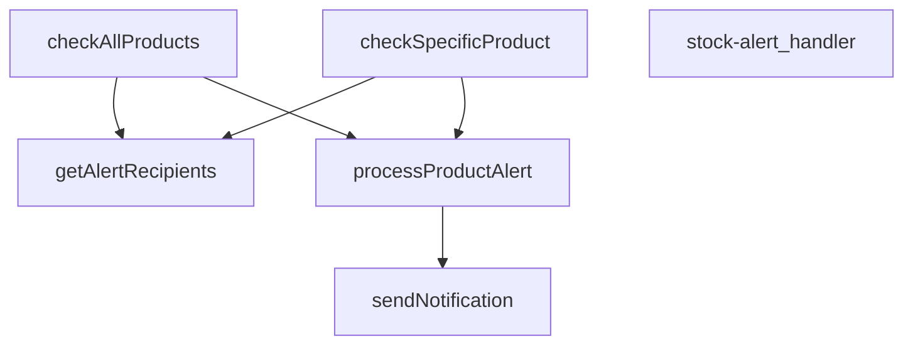

## Genel Bakış
VentHub HVAC platformu için tasarlanmış bir Supabase Edge Fonksiyonudur. Temel amacı, ürün stok seviyelerinin önceden tanımlı kritik eşik değerlerin altına düştüğünde otomatik uyarılar üreterek tedarik zinciri süreçlerini başlatmaktır. Modül, hem tüm ürün envanterini tarayan toplu kontrol hem de belirli bir ürünü hedefleyen tetikleme modları ile esnek bir uyarı yönetimi sunar.

## Fonksiyon Grupları
### İstek Kabul ve Yönlendirme
Gelen HTTP isteğini dinler, istek parametrelerini analiz eder ve verilen komuta bağlı olarak stok kontrol işinin doğru metodunu başlatır.
- stock-alert_handler

### Stok Kontrol ve Değerlendirme
Veritabanındaki ürün stoklarını çekerek definedik eşik değerleriyle karşılaştırır. İstenen kapsamda (tüm ürünler veya tek bir ürün) stok yetersizliği tespit eder.
- checkAllProducts, checkSpecificProduct

### Uyarı İşleme ve Bildirim Tetikleme
Stok uyarısı oluşturulan her bir ürün için ilgili alıcıların listesini çeker ve tanımlı bildirim kanalları üzerinden öncelik sırasına göre ulaşılabilir uyarılar gönderir.
- processProductAlert, getAlertRecipients, sendNotification

---

## AXIOMS – Mimari Varsayımlar

Bu modül, stok seviyeleri belirli bir eşiğin altına düştüğünde bildirim göndererek tedarik süreçlerini tetikler. Fonksiyon imzaları ve modül yapısı dikkate alınarak aşağıdaki aksiyomlar türetilmiştir:

[Aksiyom 1]: Eğer `stock-alert_handler` fonksiyonuna geçerli bir HTTP isteği (`Request`) ulaşmazsa, fonksiyon uygun bir hata yanıtı (örn. 400/405) döndürmeli veya işlenmemelidir; aksi halde beklenmeyen davranış veya çökme olur.

[Aksiyom 2]: Eğer `supabase` istemcisi (`SupabaseClient`) `checkAllProducts` veya `checkSpecificProduct` fonksiyonlarına başarıyla bağlanamazsa (örn. kimlik doğrulama hatası, ağ kesintisi), stok kontrolü yapılamaz ve dolayısıyla hiçbir uyarı bildirimi gönderilemez; bu durumda ilgili hata loglanmalı veya çağrıya hata ile dönülmelidir.

[Aksiyom 3]: Eğer `checkSpecificProduct` fonksiyonuna geçerli bir `_productId` parametresi verilmezse (boş string, null veya tanımsız), fonksiyon o ürünü işleyemez; bu durumda o ürüne ait uyarı kontrolü atlanır veya hata döndürülür.

[Aksiyom 4]: Eğer `processProductAlert` fonksiyonunda `product` nesnesi içinde stok seviyesi veya eşik değeri bilgisi eksikse (bu değerlerin hangisi olduğu bilinmiyor), ürünün düşük stoklu olup olmadığı değerlendirilemez; bu durumda o ürün için uyarı işlemi yapılamaz.

[Aksiyom 5]: Eğer `processProductAlert` fonksiyonuna verilen `recipients` listesi boşsa (`AlertRecipient[]` boş dizi), stok uyarısı için bildirim gönderilecek alıcı bulunmaz; bu durumda `sendNotification` çağrılmaz veya uyarı işlemi tamamlanmaz.

[Aksiyom 6]: Eğer `sendNotification` fonksiyonuna `priority` parametresi geçerli bir değer değilse (örn. tanımsız string, boş string), bildirimin önceliği belirlenemez; bu durumda bildirim ya gönderilemez ya da varsayılan

---

## FONKSİYON DETAYLARI

### stock-alert_handler
**Ne yapar**: Bu fonksiyon, stok alert sisteminin ana HTTP istek işleyicisidir. Gelen bir Request nesnesini alır ve ilgili iş mantığını (belirli bir ürünü veya tüm ürünleri kontrol etme) çağırarak bir Response nesnesi döndürür.
**Nasıl yapar**: Fonksiyonun gövdesi verilmemiştir, ancak adı ve parametreleri göz önüne alındığında, HTTP isteğinin içeriğine (örneğin bir `productId` parametresi varlığına) göre `checkSpecificProduct` veya `checkAllProducts` fonksiyonlarından birini çağıran bir yönlendirici (router) gibi davranması beklenir.
**Parametreler**:
- `req: Request` — Gelen HTTP isteği nesnesi, istemciden gelen verileri ve headers'ları içerir.
**Dönüş**: `Response` — İşlemin sonucunu içeren, istemciye gönderilecek HTTP yanıtı.

### checkAllProducts
**Ne yapar**: Veritabanındaki **tüm ürünleri** stok seviyelerine göre tarar, stok miktarı belirlenmiş eşik değerin (veya varsayılan 5 birim) altında veya eşitinde olan ürünler için uyarı sürecini başlatır.
**Nasıl yapar**: Supabase istemcisi aracılığıyla `products` tablosundan düşük stoklu olabilecek tüm ürünleri çeker. SQL tarafında karmaşık filtreleme yerine, JavaScript tarafında her bir ürünün `stock_qty` değerini, kendi `low_stock_threshold` alanı (yoksa 5) ile karşılaştırarak filtreler. Ardından, alıcıları tek seferde çekip (N+1 sorgu optimizasyonu) her uygun ürün için `processProductAlert` fonksiyonunu çağırarak sonuçları derler.
**Parametreler**:
- `supabase: SupabaseClient` — Veritabanı işlemleri için kullanılan Supabase istemcisi nesnesi.
**Dönüş**: `results` — Her bir işlenen ürün için `processProductAlert` fonksiyonunun döndüğü sonuç nesnelerinden oluşan bir dizi (array). Her sonuç, ürün adını, uyarı türünü, gönderilen bildirim sayısını ve başarı durumunu içerir.

### checkSpecificProduct
**Ne yapar**: Verilen **tek bir ürünün** stok seviyesini kontrol eder ve belirlenen eşik değerinin altındaysa uyarı sürecini başlatır.
**Nasıl yapar**: Supabase istemcisi ile belirtilen `_productId`'ye sahip ürünü `products` tablosundan çeker. Ürün bulunamazsa hata fırlatır. Ürünün stok miktarı, eşik değerinden yüksekse uyarı yapılmaz ve basit bir bilgi mesajı döndürülür. Düşük veya eşit ise, alıcıları çekerek `processProductAlert` fonksiyonunu çağırır ve sonucu döndürür.
**Parametreler**:
- `supabase: SupabaseClient` — Veritabanı işlemleri için kullanılan Supabase istemcisi nesnesi.
- `_productId: string` — Kontrol edilecek ürünün benzersiz kimliği (ID'si).
**Dönüş**: Uyarı yapıldığında, `processProductAlert` fonksiyonunun sonucunu içeren tek elemanlı bir dizi (array). Stok eşik değerinin üzerindeyse, `product.name` ve "Stock above threshold" mesajını içeren bir nesne dizisi.

### processProductAlert
**Ne yapar**: Belirli bir ürün için stok durumuna göre bir uyarı türü (`out_of_stock` veya `low_stock`) belirler ve öncelikli olarak tanımlanmış alıcılara bu uyarı bildirimlerini gönderir.
**Nasıl yapar**: Ürünün `stock_qty` değerine bakarak uyarı türünü ve önceliğini belirler. `alertData` adında bir nesne oluşturarak ürün detaylarını paketler. Sonra, her bir alıcının (`recipients`) tercih ettiği bildirim kanallarına (WhatsApp, SMS, Email) göre döngü yapar ve her bir kanal için `sendNotification` fonksiyonunu çağırarak bildirimleri gönderir. Fonksiyon, gönderilen bildirim sayısını ve tüm bildirimlerin başarılı olup olmadığını özetleyen bir sonuç nesnesi döndürür.
**Parametreler**:
- `supabase: SupabaseClient` — Veritabanı işlemleri için kullanılan Supabase istemcisi nesnesi.
- `product: Product` — Uyarı gönderilecek ürünün tüm detaylarını (id, name, stock_qty, low_stock_threshold) içeren nesne.
- `recipients: AlertRecipient[]` — Uyarı bildirimlerinin gönderileceği kişi/kişilerin listesi ve tercih ettikleri bildirim kanallarını tanımlayan dizi.
**Dönüş**: `{ product, alertType, notifications, success }` — İşlem sonucunu özetleyen bir nesne. `product` (ürün adı), `alertType` ('out_of_stock' veya 'low_stock'), `notifications` (gönderilen bildirim sayısı), `success` (tüm bildirimler başarılıysa true, değilse false).

### sendNotification
**Ne yapar**: Belirli bir iletişim kanalı (tip) üzerinden, belirli bir alıcıya (to), öncelikli bir stok uyarısı bildirimi göndermek için harici bir `notification-service` fonksiyonunu çağırır.
**Nasıl yapar**: Ortam değişkenlerinden (`SUPABASE_URL`, `SUPABASE_SERVICE_ROLE_KEY`) servis bilgilerini alır. `notification-service` edge fonksiyonuna bir HTTP POST isteği gönderir. İstek gövdesinde bildirim tipi, alıcı, öncelik ve ürün verileriyle birlikte bir `subject` alanı (ürün durumuna göre emoji ve başlık) oluşturur. İşlem sonucu (başarılı olup olmadığı) hakkında bir sonuç nesnesi döndürür veya hata durumunda başarısızlık sonucu döndürür.
**Parametreler**:
- `type: string` — Bildirim gönderilecek kanalın tipi (örn: 'whatsapp', 'sms', 'email').
- `to: string` — Bildirimin gönderileceği alıcının iletişim adresi (telefon numarası veya email).
- `data: AlertData` — Bildirim içeriğini oluşturan ürün detaylarını (ürün adı, id, stok miktarı, eşik, uyarı türü) içeren veri nesnesi.
- `priority: string` — Bildirimin öncelik seviyesi (örn: 'critical', 'high').
**Dönüş**: `{ type, recipient, success }` — Gönderim denemesinin sonucunu gösteren nesne. `type` (kanal), `recipient` (alıcı), `success` (istek başarılıysa true, değilse false).

### getAlertRecipients
**Ne yapar**: Stok uyarı bildirimlerinin gönderileceği alıcıların listesini veritabanından çeker. Varsayılan bir alıcı (sistem yöneticisi) sağlamaya çalışır ve bulamazsa sabit bir acil durum email adresi ile geri dönüş (fallback) yapar.
**Nasıl yapar**: `inventory_settings` tablosundan ana `alert_email` adresini çeker. Eğer bu adres mevcutsa, onu bir `AlertRecipient` nesnesine dönüştürüp listeye ekler. Eğer bu adrese ulaşılamazsa veya hiç alıcı bulunamazsa, `stok@venthub.com` adresini içeren sabit bir geri dönüş alıcısı oluşturur. Her iki durumda da alıcıya sadece email bildirimi enabled olan, düşük ve kritik stok uyarılarını da alan bir yapı atar.
**Parametreler**:
- `supabase: SupabaseClient` — Veritabanı işlemleri için kullanılan Supabase istemcisi nesnesi.
**Dönüş**: `Promise<AlertRecipient[]>` — Bildirim gönderilecek alıcıların (isim, telefon, email, whatsapp, rol, ve hangi bildirim türlerini/alıcıları istediği) listesini içeren asenkron dizi.

---

## İTHALATLAR (IMPORTS)
- import: ../_shared/cors.ts::getCorsHeaders
- import: https://deno.land/std@0.168.0/http/server.ts::serve
- import: https://esm.sh/@supabase/supabase-js@2.39.3::SupabaseClient
- import: https://esm.sh/@supabase/supabase-js@2.39.3::createClient

---

## INTERFACES

### Product
- `id: string`
- `name: string`
- `stock_qty: number`
- `low_stock_threshold: number`

### AlertRecipient
- `name: string`
- `phone: string`
- `email: string`
- `whatsapp: string`
- `role: 'admin' | 'manager' | 'buyer'`
- `notifications: {
`

### AlertData
- `productName: string`
- `_productId: string`
- `currentStock: number`
- `threshold: number`
- `alertType: 'out_of_stock' | 'low_stock'`

---

## SABİTLER
- **corsHeaders** (object) — `{
  'Access-Control-Allow-Headers': 'authorization, x-client-info, apikey, c...`

---

## AST POINTERS

### [N1_NASIL] AST Pointer: stock-alert/index.ts::stock-alert_handler
- **params**: (req: Request)
- **ic_degiskenler**:
  - `supabaseUrl` — Supabase proje URL'si, environment variable'dan alınır
  - `serviceRoleKey` — Supabase service role anahtarı, environment variable'dan alınır
  - `authHeader` — İsteğin Authorization header'ı
  - `isAuthorized` — Yetkilendirme durumunu takip eden boolean
  - `anonKey` — Supabase anon key, auth fallback için kullanılır
  - `createClientAuth` — Dinamik import ile yüklenen Supabase client factory
  - `authClient` — Kullanıcı doğrulama için oluşturulan Supabase client
  - `user` — Doğrulanmış kullanıcı nesnesi
  - `roleCheck` — Kullanıcı rolünü kontrol eden fetch isteği sonucu
  - `arr` — Rol kontrolü sonucu JSON array
  - `role` — Kullanıcının rolü (array[0].role)
  - `supabase` — Service role ile oluşturulan ana Supabase client
  - `alertResults` — İşlenen uyarı sonuçları dizisi
  - `_productId` — POST isteğinden gelen ürün ID'si
  - `error` — Try-catch bloğundaki yakalanan hata
- **Dönüş**: Response (JSON yanıt veya hata yanıtı)

### [N2_NASIL] AST Pointer: stock-alert/index.ts::checkAllProducts
- **params**: (supabase: SupabaseClient)
- **ic_degiskenler**:
  - `allLowStock` — Veritabanından çekilen düşük stoklu ürünler dizisi
  - `fetchErr` — Ürünleri çekerken oluşabilecek hata
  - `productsToAlert` — Eşik değerin altında kalan filtrelenmiş ürünler
  - `recipients` — Uyarı alıcıları dizisi
  - `results` — İşlenen ürünlerin sonuçlarını tutan dizi
- **Dönüş**: Promise<any[]> (işlenen uyarı sonuçları)

### [N3_NASIL] AST Pointer: stock-alert/index.ts::checkSpecificProduct
- **params**: (supabase: SupabaseClient, _productId: string)
- **ic_degiskenler**:
  - `product` — Tek bir ürünün verileri
  - `error` — Ürün çekerken oluşabilecek hata
  - `recipients` — Uyarı alıcıları dizisi
- **Dönüş**: Promise<any[]> (ürün işlenme sonucu)

### [N4_NASIL] AST Pointer: stock-alert/index.ts::processProductAlert
- **params**: (supabase: SupabaseClient, product: Product, recipients: AlertRecipient[])
- **ic_degiskenler**:
  - `alertType` — Uyarı türü ('out_of_stock' veya 'low_stock')
  - `priority` — Bildirim önceliği ('critical' veya 'high')
  - `alertData` — Uyarı verisi nesnesi
  - `notifications` — Bildirim sonuçları dizisi
- **Dönüş**: Promise<{product: string, alertType: string, notifications: number, success: boolean}>

### [N5_NASIL] AST Pointer: stock-alert/index.ts::sendNotification
- **params**: (type: string, to: string, data: AlertData, priority: string)
- **ic_degiskenler**:
  - `supabaseUrl` — Supabase URL'si
  - `serviceRoleKey` — Service role anahtarı
  - `response` — notification-service fonksiyonuna yapılan fetch isteği sonucu
  - `err` — Bildirim gönderirken oluşabilecek hata
- **Dönüş**: Promise<{type: string, recipient: string, success: boolean}>

### [N6_NASIL] AST Pointer: stock-alert/index.ts::getAlertRecipients
- **params**: (supabase: SupabaseClient)
- **ic_degiskenler**:
  - `settings` — inventory_settings tablosundan çekilen ayarlar
  - `recipients` — Alıcılar dizisi (varsayılan değerlerle)
- **Dönüş**: Promise<AlertRecipient[]> (alıcılar dizisi)

---

## MERMAID CALL GRAPH

## NODE ID STANDARD

  file: supabase\functions\stock-alert\index.ts
  function: supabase\functions\stock-alert\index.ts::stock-alert_handler
  function: supabase\functions\stock-alert\index.ts::checkAllProducts
  function: supabase\functions\stock-alert\index.ts::checkSpecificProduct
  function: supabase\functions\stock-alert\index.ts::processProductAlert
  function: supabase\functions\stock-alert\index.ts::sendNotification
  function: supabase\functions\stock-alert\index.ts::getAlertRecipients

---

## DISA AKTARILANLAR (EXPORTS)
  export: checkAllProducts
  export: checkSpecificProduct
  export: getAlertRecipients
  export: processProductAlert
  export: sendNotification
  export: stock-alert_handler