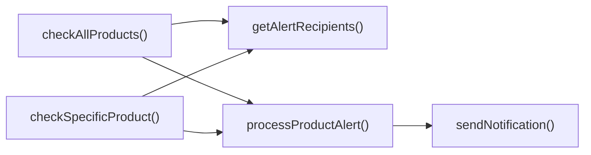

## Genel Bakış
Bu modül, VentHub HVAC platformu için geliştirilen Supabase Edge Fonksiyonudur. Stok seviyeleri eşik değerinin altına düştüğünde ilgili kişilere otomatik bildirim gönderme işlevini yerine getirir. Gelen HTTP istekleriyle tetiklenir, ürün stok kontrolü ve bildirim iletimi süreçlerini koordine eder.

## Fonksiyon Grupları
### İstek İşleme ve Koordinasyon
Gelen HTTP isteğini alır, isteğin parametrelerine göre tüm ürünleri ya da tek bir ürünü stok kontrolü için seçer ve ilgili fonksiyonları tetikler. İşlem sonucunu uygun HTTP yanıtı olarak döndürür.
- stock-alert_handler, checkAllProducts, checkSpecificProduct

### Ürün Stok Değerlendirmesi ve Uyarı İşleme
Veritabanından ürün verilerini çeker, stok seviyelerini önceden tanımlanmış eşik değerleri ile karşılaştırır. Uyarı koşulu sağlanan ürünler için bildirim oluşturma sürecini başlatır.
- processProductAlert, checkAllProducts, checkSpecificProduct

### Bildirim ve Alıcı Yönetimi
Uyarı alıcılarının listesini veritabanından çeker, belirlenen tip, öncelik ve içerikteki bildirimleri ilgili alıcılara iletir.
- sendNotification, getAlertRecipients

---

## AXIOMS – Mimari Varsayımlar
Bu modül için özel aksiyom tanımlanmamıştır.

---

## FONKSIYON DETAYLARI

### stock-alert_handler
**Ne yapar**: Gelen HTTP isteğini alır ve stok uyarı sistemi için uygun yanıtı üretir.  
**Nasıl yapar**: `Request` nesnesini işleyerek gerekli kontrolleri ve veri çekme işlemlerini başlatır, ardından bir `Response` nesnesi döndürür.  
**Parametreler**:
- req: Request — HTTP isteği nesnesi, içinde sorgu ve gövde bilgileri bulunur.  
**Dönüş**: Response — İşlem sonucunu içeren HTTP yanıtı.  

### checkAllProducts
**Ne yapar**: Supabase veritabanındaki tüm ürünleri tarar ve stok durumlarını değerlendirir.  
**Nasıl yapar**: Sağlanan `SupabaseClient` üzerinden ürün tablosuna sorgu gönderir, her ürün için uyarı koşullarını kontrol eder ve sonuçları toplar.  
**Parametreler**:
- supabase: SupabaseClient — Supabase veritabanına erişim sağlayan istemci nesnesi.  
**Dönüş**: results — Tüm ürünlerin kontrol sonuçlarını içeren veri yapısı (tam tipi belirtilmemiştir).  

### checkSpecificProduct
**Ne yapar**: Belirli bir ürünün stok durumunu inceler ve gerekirse uyarı sürecini başlatır.  
**Nasıl yapar**: `supabase` istemcisi ile verilen `_productId` üzerinden ürün kaydını çeker, ardından `processProductAlert` fonksiyonunu asenkron olarak çalıştırarak uyarı oluşturur.  
**Parametreler**:
- supabase: SupabaseClient — Supabase veritabanına erişim sağlayan istemci.  
- _productId: string — Kontrol edilecek ürünün benzersiz kimliği.  
**Dönüş**: `processProductAlert` fonksiyonunun döndürdüğü değer (genellikle bir uyarı raporu).  

### processProductAlert
**Ne yapar**: Bir ürün için uyarı oluşturur, alıcıları belirler ve bildirimleri gönderir.  
**Nasıl yapar**: Ürün bilgilerini ve alıcı listesini alır, uyarı tipini belirler, `sendNotification` ile her alıcıya bildirim gönderir ve gönderilen bildirim sayısını sayar; sonunda bir sonuç nesnesi döndürür.  
**Parametreler**:
- supabase: SupabaseClient — Veritabanı işlemleri için kullanılan istemci.  
- product: Product — Uyarı oluşturulacak ürün nesnesi.  
- recipients: AlertRecipient[] — Bildirim gönderilecek alıcıların listesi.  
**Dönüş**: Bir nesne — `{ product: product.name, alertType, notifications: notifications.length, success }` şeklinde, ürün adı, uyarı tipi, gönderilen bildirim sayısı ve işlem başarısı bilgilerini içerir.  

### sendNotification
**Ne yapar**: Belirtilen alıcıya, seçilen tipte bir uyarı mesajı gönderir.  
**Nasıl yapar**: `type`, `to`, `data` ve `priority` parametrelerini kullanarak uygun iletişim kanalını (ör. e‑posta, SMS) seçer ve mesajı iletir; işlem sonucunu geri döndürmez.  
**Parametreler**:
- type: string — Bildirim tipini tanımlayan değer (ör. "email", "sms").  
- to: string — Bildirimin gönderileceği alıcı adresi veya kimliği.  
- data: AlertData — Bildirim içeriğini taşıyan veri nesnesi.  
- priority: string — Bildirimin öncelik seviyesi (ör. "high", "normal").  
**Dönüş**: void veya bilinmeyen — Fonksiyonun dönüş tipi belirtilmemiştir.  

### getAlertRecipients
**Ne yapar**: Uyarı alıcılarının listesini veritabanından çeker ve asenkron olarak döndürür.  
**Nasıl yapar**: `supabase` istemcisi üzerinden alıcı tablosuna sorgu gönderir, sonuçları `AlertRecipient` nesneleri olarak toplar ve bir `Promise` içinde sunar.  
**Parametreler**:
- supabase: SupabaseClient — Supabase veritabanına erişim sağlayan istemci.  
**Dönüş**: Promise<AlertRecipient[]> — Alıcı nesnelerinin bir dizisini içeren asenkron sonuç.

---

## INTERFACES

### Product
- `id: string`
- `name: string`
- `stock_qty: number`
- `low_stock_threshold: number`

### AlertRecipient
- `name: string`
- `phone: string`
- `email: string`
- `whatsapp: string`
- `role: 'admin' | 'manager' | 'buyer'`
- `notifications: {
`

### AlertData
- `productName: string`
- `_productId: string`
- `currentStock: number`
- `threshold: number`
- `alertType: 'out_of_stock' | 'low_stock'`

---

## SABİTLER
- **corsHeaders** (object) — `{
    'Access-Control-Allow-Origin': '*',
    'Access-Control-Allow-Headers...`

---

## AST POINTERS

### [N1_NASIL] AST Pointer: C:\Users\alize\venthub-hvac\supabase\functions\stock-alert\index.ts::stock-alert_handler
- **params**: req: Request
- **ic_degiskenler**:
  - `supabaseUrl` — Deno.env.get('SUPABASE_URL') ile alınan Supabase proje URL'si, konfigürasyon kontrolü ve istemci oluşturma için kullanılır
  - `serviceRoleKey` — Deno.env.get('SUPABASE_SERVICE_ROLE_KEY') ile alınan Supabase servis rolü anahtarı, yetkilendirme ve istemci oluşturma için kullanılır
  - `authHeader` — req.headers.get('Authorization') ile alınan istek Authorization başlığı, yetkilendirme kontrolü için kullanılır
  - `isAuthorized` — İstek sahibinin yetkili olup olmadığını tutan boolean bayrak, erişim kontrolü için kullanılır
  - `anonKey` — Deno.env.get('SUPABASE_ANON_KEY') ile alınan Supabase anonim anahtarı, anonim istemci oluşturma için kullanılır
  - `createClientAuth` — Dinamik import edilen @supabase/supabase-js'in createClient fonksiyonu, yetkilendirme istemcisi oluşturmak için kullanılır
  - `authClient` — anonKey ve authHeader ile oluşturulan Supabase istemcisi, kullanıcı doğrulaması için kullanılır
  - `user` — authClient.auth.getUser() ile dönen doğrulanmış kullanıcı nesnesi, rol kontrolü için kullanılır
  - `roleCheck` — user_profiles tablosundan kullanıcı rolünü çekmek için yapılan fetch isteğinin Response nesnesi
  - `arr` — roleCheck.json() ile dönen kullanıcı profilleri dizisi, rol değerini almak için kullanılır
  - `role` — arr[0]?.role ile alınan kullanıcı rolü, admin/superadmin yetkisi kontrolü için kullanılır
  - `supabase` — supabaseUrl ve serviceRoleKey ile oluşturulan ana Supabase istemcisi, işlevlerde kullanılır
  - `alertResults` — İşlenen stok uyarısı sonuçlarını tutan dizi, yanıt olarak döndürülür
  - `_productId` — POST isteğinde req.json() ile alınan spesifik ürün ID'si, ilgili ürün kontrolü için kullanılır
  - `error` — try-catch bloğunda yakalanan genel hata nesnesi, hata yanıtı oluşturmak için kullanılır
  - `msg` — error nesnesinin mesajını string'e çeviren değer, hata yanıtında kullanılır
- **Dönüş**: Response (OPTIONS, yetkisiz, başarılı, hata yanıtları)

### [N2_NASIL] AST Pointer: C:\Users\alize\venthub-hvac\supabase\functions\stock-alert\index.ts::checkAllProducts
- **params**: supabase: SupabaseClient
- **ic_degiskenler**:
  - `allLowStock` — Supabase products tablosundan çekilen, stock_qty <= 10 olan ürünler verisi
  - `fetchErr` — Ürünleri çekerken oluşan Supabase hatası nesnesi
  - `productsToAlert` — allLowStock içinden, stok_miktarı <= low_stock_threshold (veya 5) olan filtrelenmiş ürünler dizisi
  - `recipients` — getAlertRecipients(supabase) ile alınan uyarı alıcıları dizisi
  - `results` — Her ürün için processProductAlert sonuçlarını tutan dizi
  - `product` — productsToAlert dizisi üzerinde döngüdeki her ürün nesnesi
- **Dönüş**: results (her ürün için uyarı sonuçlarını içeren dizi)

### [N3_NASIL] AST Pointer: C:\Users\alize\venthub-hvac\supabase\functions\stock-alert\index.ts::checkSpecificProduct
- **params**: supabase: SupabaseClient, _productId: string
- **ic_degiskenler**:
  - `product` — Supabase products tablosundan _productId ile çekilen tek ürün nesnesi
  - `error` — Ürünü çekerken oluşan Supabase hatası nesnesi
  - `recipients` — getAlertRecipients(supabase) ile alınan uyarı alıcıları dizisi
- **Dönüş**: Tek elemanlı dizi (ya stok eşik üstü mesajı ya da processProductAlert sonucu)

### [N4_NASIL] AST Pointer: C:\Users\alize\venthub-hvac\supabase\functions\stock-alert\index.ts::processProductAlert
- **params**: supabase: SupabaseClient, product: Product, recipients: AlertRecipient[]
- **ic_degiskenler**:
  - `alertType` — Ürün stock_qty <= 0 ise 'out_of_stock', değilse 'low_stock' olan uyarı tipi
  - `priority` — alertType 'out_of_stock' ise 'critical', değilse 'high' olan bildirim önceliği
  - `alertData` — Ürün adı, ID, güncel stok, eşik değer ve alertType içeren AlertData nesnesi
  - `notifications` — Gönderilen her bildirimin sonucunu tutan dizi
  - `recipient` — recipients dizisi üzerinde döngüdeki her uyarı alıcısı nesnesi
  - `recipient.notifications[alertType]` — Alıcının ilgili uyarı tipini alıp almayacağını kontrol eden boolean değer
  - `recipient.notifications.whatsapp` — Alıcının WhatsApp bildirimlerini alıp almayacağını kontrol eden boolean
  - `recipient.whatsapp` — Alıcının WhatsApp iletişim numarası
  - `recipient.notifications.sms` — Alıcının SMS bildirimlerini alıp almayacağını kontrol eden boolean
  - `recipient.phone` — Alıcının telefon numarası
  - `recipient.notifications.email` — Alıcının e-posta bildirimlerini alıp almayacağını kontrol eden boolean
  - `recipient.email` — Alıcının e-posta adresi
- **Dönüş**: { product: string, alertType: string, notifications: number, success: boolean } tipinde nesne

### [N5_NASIL] AST Pointer: C:\Users\alize\venthub-hvac\supabase\functions\stock-alert\index.ts::sendNotification
- **params**: type: string, to: string, data: AlertData, priority: string
- **ic_degiskenler**:
  - `supabaseUrl` — Deno.env.get('SUPABASE_URL') ile alınan Supabase URL'si, notification-service çağrısı için kullanılır
  - `serviceRoleKey` — Deno.env.get('SUPABASE_SERVICE_ROLE_KEY') ile alınan servis rolü anahtarı, yetkilendirme için kullanılır
  - `response` — notification-service'e yapılan POST fetch isteğinin Response nesnesi
  - `err` — try-catch bloğunda yakalanan bildirim gönderme hatası nesnesi
- **Dönüş**: { type: string, recipient: string, success: boolean } tipinde nesne

### [N6_NASIL] AST Pointer: C:\Users\alize\venthub-hvac\supabase\functions\stock-alert\index.ts::getAlertRecipients
- **params**: supabase: SupabaseClient
- **ic_degiskenler**:
  - `settings` — Supabase inventory_settings tablosundan çekilen alert_email ayarını içeren nesne
  - `recipients` — Oluşturulan uyarı alıcıları dizisi (en az bir alıcı olacak şekilde yapılandırılır)
  - `settings.alert_email` — inventory_settings'den alınan yönetici uyarı e-postası
- **Dönüş**: Promise<AlertRecipient[]> (uyarı alıcıları dizisi)

---

## ÇAĞRI HARİTASI

### Disariya Cagrilar (Outgoing)
- **checkAllProducts()**, ürün uyarılarını işlemek ve alıcı listesini almak için `processProductAlert` ve `getAlertRecipients` fonksiyonlarını çağırır.  
- **checkSpecificProduct()**, benzer şekilde belirli bir ürünün uyarılarını işlemek ve alıcıları almak için `processProductAlert` ve `getAlertRecipients` fonksiyonlarını çağırır.  
- **processProductAlert()**, oluşturulan uyarıyı kullanıcıya iletmek için `sendNotification` fonksiyonunu çağırır.

### Disaridan Cagrilanlar (Incoming)
Verilen çağrı grafiğinde bu modülü çağıran dış bir fonksiyon veya modül bilgisi bulunmamaktadır.

### Ic Ice Fonksiyonlar (Nested)
Yok

---

## DOSYA-İÇİ ÇAĞRI GRAFİĞİ
  checkAllProducts() → getAlertRecipients()
  checkAllProducts() → processProductAlert()
  checkSpecificProduct() → getAlertRecipients()
  checkSpecificProduct() → processProductAlert()
  processProductAlert() → sendNotification()

---

## NODE ID STANDARD

  file: supabase\functions\stock-alert\index.ts
  function: supabase\functions\stock-alert\index.ts::stock-alert_handler
  function: supabase\functions\stock-alert\index.ts::checkAllProducts
  function: supabase\functions\stock-alert\index.ts::checkSpecificProduct
  function: supabase\functions\stock-alert\index.ts::processProductAlert
  function: supabase\functions\stock-alert\index.ts::sendNotification
  function: supabase\functions\stock-alert\index.ts::getAlertRecipients

---

## DISA AKTARILANLAR (EXPORTS)
  export: checkAllProducts
  export: checkSpecificProduct
  export: getAlertRecipients
  export: processProductAlert
  export: sendNotification
  export: stock-alert_handler