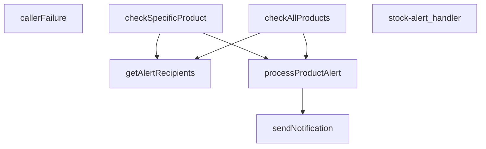

## Genel Bakış
Bu modül, Supabase üzerinde çalışan bir stok uyarı fonksiyonudur. Ürün stoklarını kontrol eder ve belirlenen alıcılara bildirim göndererek otomatik bir uyarı sistemi sağlar. Modül, hem toplu hem de tekil ürün kontrolü yapabilir ve hata yönetimini içerir.

## Fonksiyon Grupları
### İstek İşleme ve Hata Yönetimi
Gelen HTTP isteklerini karşılar, yönlendirir ve oluşabilecek hataları standart bir formatta işleyerek yanıt üretir.
- stock-alert_handler, callerFailure

### Stok Kontrolü
Veritabanındaki tüm ürünleri veya belirli bir ürünü stok durumuna göre kontrol ederek uyarı tetikleme koşullarını belirler.
- checkAllProducts, checkSpecificProduct

### Uyarı Oluşturma ve Bildirim
Uyarı alıcılarını getirir, kontrol edilen ürünler için uyarıları işler ve harici bildirim servisleri aracılığıyla bildirim gönderir.
- getAlertRecipients, processProductAlert, sendNotification

---

## AXIOMS – Mimari Varsayımlar
- Bu modül davranışsal mantık içermez (salt veri / konfigürasyon / tip tanımı).
- [Aksiyom 1]: Modülün dışa açtığı yapı (anahtar kümesi / şema) bir sözleşmedir; tüketiciler bu sabit yapıya bağlıdır — kırıcı değişiklik tüm tüketicileri etkiler.
- [Aksiyom 2]: Bir öğe ekleme/çıkarma yapısal-uyumlu olmalı; ilgili tipler ve seçiciler aynı commit'te güncel tutulmalıdır.

---

## FONKSİYON DETAYLARI

### callerFailure
**Ne yapar**: Kapı katmanında yakalanan hataları HTTP durum kodlarına eşler. Beş bildirim ucuyla birebir aynı metni kullanarak `TenantMismatchError` → 403, `CallerConfigError` → 500, `CallerLookupError` → 503 eşleştirmesi yapar. Fonksiyon `null` dönerse hata bu kapıya ait değildir ve yeniden fırlatılması gerekir; dıştaki catch bloğu bu durumda 500 döner.

**Nasıl yapar**: Gelen `error` parametresinin `instanceof` kontrolüyle hangi özel hata sınıfına ait olduğunu belirler. Her hata türü için sabit bir HTTP durum kodu ve hata anahtarı içeren nesne döndürür. Üç bilinen hata sınıfından hiçbiriyle eşleşmezse `null` döndürerek hatanın bu kapıya ait olmadığını işaret eder.

**Parametreler**:
- error: unknown — Yakalanan hata nesnesi; `TenantMismatchError`, `CallerConfigError` veya `CallerLookupError` türlerinden biri olabilir.

**Dönüş**: `{ status: number; error: string } | null` — Eşleşen hata için HTTP durum kodu ve hata anahtarı içeren nesne; eşleşme yoksa `null`.

### stock-alert_handler
**Ne yapar**: Geliştirildi ancak detay üretilemedi.

### checkAllProducts
**Ne yapar**: Geliştirildi ancak detay üretilemedi.

### checkSpecificProduct
**Ne yapar**: Geliştirildi ancak detay üretilemedi.

### processProductAlert
**Ne yapar**: Geliştirildi ancak detay üretilemedi.

### sendNotification
**Ne yapar**: Geliştirildi ancak detay üretilemedi.

### getAlertRecipients
**Ne yapar**: Geliştirildi ancak detay üretilemedi.

---

## İTHALATLAR (IMPORTS)
- import: ../_shared/cors.ts::getCorsHeaders
- import: https://deno.land/std@0.168.0/http/server.ts::serve
- import: https://esm.sh/@supabase/supabase-js@2.45.4::SupabaseClient
- import: https://esm.sh/@supabase/supabase-js@2.45.4::createClient

---

## INTERFACES

### Product
- `id: string`
- `name: string`
- `stock_qty: number`
- `low_stock_threshold: number`

### AlertRecipient
- `name: string`
- `phone: string`
- `email: string`
- `whatsapp: string`
- `role: 'admin' | 'manager' | 'buyer'`
- `notifications: {
`

### AlertData
- `productName: string`
- `_productId: string`
- `currentStock: number`
- `threshold: number`
- `alertType: 'out_of_stock' | 'low_stock'`

---

## AST POINTERS

### [N1_NASIL] AST Pointer: supabase/functions/stock-alert/index.ts::callerFailure
- **params**: `error` (unknown)
- **ic_degiskenler**: yok — fonksiyon gövdesinde yalnızca ardışık `instanceof` kontrolleri ve sabit dönüş nesneleri var; atanmış bir değişken yok
- **Dönüş**: `{ status: number; error: string } | null` — `error` bir `TenantMismatchError` ise `{ status: 403, error: 'tenant_mismatch' }`, `CallerConfigError` ise `{ status: 500, error: 'CONFIG_MISSING' }`, `CallerLookupError` ise `{ status: 503, error: 'profile_lookup_failed' }`; bunların hiçbiri değilse `null`

---

### [N2_NASIL] AST Pointer: supabase/functions/stock-alert/index.ts::stock-alert_handler
- **params**: `req` (Request)
- **ic_degiskenler**:
  - `corsHeaders` — `getCorsHeaders(req)` çağrısından dönen, `req`'e özgü CORS başlık nesnesi
  - `supabaseUrl` — `Deno.env.get('SUPABASE_URL')` ile okunan ortam değişkeni; yoksa 500 dönülür
  - `serviceRoleKey` — `Deno.env.get('SUPABASE_SERVICE_ROLE_KEY')` ile okunan ortam değişkeni; yoksa 500 dönülür
  - `ctx` — `resolveCaller(req, {})` ile üretilen `CallerContext` nesnesi; `ctx.kind` ve `ctx.role` alanları yetki denetiminde kullanılır
  - `failure` — `callerFailure(err)` çağrısının dönüşü; `null` değilse hata HTTP yanıtı olarak döndürülür
  - `supabase` — `createClient(supabaseUrl, serviceRoleKey)` ile oluşturulan `SupabaseClient` örneği
  - `alertResults` — `unknown[]` türünde, `checkAllProducts` veya `checkSpecificProduct` dönüşlerini tutan dizi
  - `_productId` — `req.json()` ile POST gövdesinden çıkarılan ürün kimliği; yoksa hata fırlatılır
  - `error` — `catch` bloğunda yakalanan hata nesnesi
  - `msg` — `error instanceof Error` ise `error.message`, aksi halde `String(error)` ile üretilen hata mesajı dizesi
- **Dönüş**: `Response` — OPTIONS isteğine `200 'ok'`, başarılı işleme `200` ile JSON (`success`, `alerts_processed`, `results`, `timestamp`), yetki reddine `401`/`403`, yapılandırma eksikliğine `500`, yakalanan hatalara `500` ile `{ error, success: false }`

---

### [N3_NASIL] AST Pointer: supabase/functions/stock-alert/index.ts::checkAllProducts
- **params**: `supabase` (SupabaseClient)
- **ic_degiskenler**:
  - `esikSatiri` — `supabase.from('products').select('low_stock_threshold').order(...).limit(1).maybeSingle()` ile alınan, en yüksek eşik değerini içeren satır; `esikSatiri?.low_stock_threshold` okunur
  - `esikErr` — eşik sorgusunun hatası; varsa throw edilir
  - `enBuyukEsik` — `Math.max(Number(esikSatiri?.low_stock_threshold ?? 0) || 0, VARSAYILAN_ESIK)` ile hesaplanan ön-filtre sınırı
  - `allLowStock` — `supabase.from('products').select('id, name, stock_qty, low_stock_threshold').filter('stock_qty', 'lte', enBuyukEsik)` ile alınan ürün dizisi
  - `fetchErr` — ürün sorgusunun hatası; varsa throw edilir
  - `productsToAlert` — `allLowStock` üzerinde `p.stock_qty <= (p.low_stock_threshold || VARSAYILAN_ESIK)` koşuluyla filtrelenmiş `Product[]` dizisi
  - `recipients` — `getAlertRecipients(supabase)` ile alınan `AlertRecipient[]` dizisi; boşsa ve ürün varsa hata fırlatılır
  - `results` — her ürün için `processProductAlert` çağrılarının dönüşlerini biriktiren dizi
  - `product` — `for` döngüsünde kullanılan tekil `Product` nesnesi
- **Dönüş**: `results` dizisi (her eleman `processProductAlert` dönüşü)

---

### [N4_NASIL] AST Pointer: supabase/functions/stock-alert/index.ts::checkSpecificProduct
- **params**: `supabase` (SupabaseClient), `_productId` (string)
- **ic_degiskenler**:
  - `product` — `supabase.from('products').select('id, name, stock_qty, low_stock_threshold').eq('id', _productId).single()` ile alınan tekil ürün; bulunamazsa hata fırlatılır
  - `error` — ürün sorgusunun hatası; varsa throw edilir
  - `recipients` — `getAlertRecipients(supabase)` ile alınan `AlertRecipient[]` dizisi
- **Dönüş**: dizi — `product.stock_qty` eşik üstündeyse `[{ product: product.name, message: 'Stock above threshold' }]`, değilse `[processProductAlert(supabase, product, recipients)]`

---

### [N5_NASIL] AST Pointer: supabase/functions/stock-alert/index.ts::processProductAlert
- **params**: `supabase` (SupabaseClient), `product` (Product), `recipients` (AlertRecipient[])
- **ic_degiskenler**:
  - `alertType` — `product.stock_qty <= 0` ise `'out_of_stock'`, aksi halde `'low_stock'`
  - `priority` — `product.stock_qty <= 0` ise `'critical'`, aksi halde `'high'`
  - `alertData` — `AlertData` nesnesi; `productName`, `_productId`, `currentStock`, `threshold`, `alertType` alanlarını içerir
  - `notifications` — `sendNotification` çağrılarının dönüşlerini biriktiren dizi
  - `recipient` — `for` döngüsünde kullanılan tekil `AlertRecipient` nesnesi; `recipient.notifications[alertType]` false ise atlanır; `recipient.notifications.whatsapp`, `recipient.notifications.sms`, `recipient.notifications.email` ve karşılık gelen iletişim alanları (`whatsapp`, `phone`, `email`) kontrol edilerek bildirim gönderilir
- **Dönüş**: `{ product: string, alertType: string, notifications: number, success: boolean }` — `success`, `notifications.every(n => n.success)` ile belirlenir

---

### [N6_NASIL] AST Pointer: supabase/functions/stock-alert/index.ts::sendNotification
- **params**: `type` (string), `to` (string), `data` (AlertData), `priority` (string)
- **ic_degiskenler**:
  - `supabaseUrl` — `Deno.env.get('SUPABASE_URL')` ile okunan ortam değişkeni
  - `serviceRoleKey` — `Deno.env.get('SUPABASE_SERVICE_ROLE_KEY')` ile okunan ortam değişkeni
  - `response` — `fetch` ile `${supabaseUrl}/functions/v1/notification-service` adresine POST yapılan isteğin sonucu; gövdede `type`, `to`, `priority`, `message` (alertType'a göre koşullu metin), `data` (orijinal data + `subject` alanı) gönderilir
  - `err` — `catch` bloğunda yakalanan hata; konsola yazılır
- **Dönüş**: `{ type: string, recipient: string, success: boolean }` — başarılıysa `response.ok`, hata durumunda `false`

---

### [N7_NASIL] AST Pointer: supabase/functions/stock-alert/index.ts::getAlertRecipients
- **params**: `supabase` (SupabaseClient)
- **ic_degiskenler**:
  - `settings` — `supabase.from('inventory_settings').select('alert_email').maybeSingle()` ile alınan satır; `settings?.alert_email` okunur
  - `recipients` — `AlertRecipient[]` türünde dizi; `settings.alert_email` varsa tek elemanlı (`name: 'Sistem Yöneticisi'`, `email: settings.alert_email`, `role: 'manager'`, `notifications: { low_stock: true, out_of_stock: true, sms: false, whatsapp: false, email: true }`); yoksa boş
- **Dönüş**: `AlertRecipient[]` — boş liste döndürülebilir; yedek/gömülü adres yok

---

## MERMAID CALL GRAPH

## NODE ID STANDARD

  file: index.ts
  function: index.ts::callerFailure
  function: index.ts::stock-alert_handler
  function: index.ts::checkAllProducts
  function: index.ts::checkSpecificProduct
  function: index.ts::processProductAlert
  function: index.ts::sendNotification
  function: index.ts::getAlertRecipients

---

## DISA AKTARILANLAR (EXPORTS)
  export: callerFailure
  export: checkAllProducts
  export: checkSpecificProduct
  export: getAlertRecipients
  export: processProductAlert
  export: sendNotification
  export: stock-alert_handler