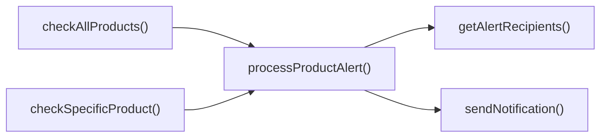

## Genel Bakış
Bu modül, stok seviyeleri belirli eşiklerin altına düştüğünde ilgili kişilere uyarı göndermeyi sağlayan bir fonksiyon setidir. HTTP isteğiyle tetiklenen ana işleyici, tüm ürünleri ya da tek bir ürünü kontrol eder, gerekli uyarı mantığını çalıştırır ve sonuçları bildirim olarak iletir.

## Fonksiyon Grupları
### İstek İşleme ve Koordinasyon
Gelen HTTP isteğini alır, isteğin içeriğine göre tüm ürünleri mi yoksa tek bir ürünü mü kontrol edeceğine karar verir ve ilgili kontrol fonksiyonlarını başlatır.  
- stock-alert_handler, checkAllProducts, checkSpecificProduct

### Ürün Kontrolü ve Uyarı İşleme
Veritabanından ürün bilgilerini çekerek stok seviyelerini değerlendirir, uyarı koşulları sağlandığında uyarı oluşturma sürecini yürütür.  
- processProductAlert, checkAllProducts, checkSpecificProduct

### Bildirim ve Alıcı Yönetimi
Uyarı tetiklendiğinde alıcı listesini sorgular, bildirim içeriğini hazırlar ve belirlenen öncelik ve tipte kullanıcıya gönderir.  
- sendNotification, getAlertRecipients

---

## AXIOMS – Mimari Varsayımlar
Bu modül için özel aksiyom tanımlanmamıştır.

---

## FONKSIYON DETAYLARI

### stock-alert_handler
**Ne yapar**: Gelen HTTP isteğini alır, stok uyarılarını işlemek için gerekli verileri toplar ve uygun yanıtı döndürür.  
**Nasıl yapar**: `Request` nesnesinden gerekli parametreleri çıkarır, `checkAllProducts` veya `checkSpecificProduct` fonksiyonlarını çağırarak ürünlerin stok durumlarını kontrol eder, ardından sonuçları `Response` formatında döner.  
**Parametreler**:
- req: Request — HTTP isteği nesnesi
**Dönüş**: Response — HTTP yanıtı

### checkAllProducts
**Ne yapar**: Supabase veritabanındaki tüm ürünleri kontrol eder ve her bir ürün için stok uyarılarını işler.  
**Nasıl yapar**: Supabase istemcisiyle ürün tablosundan tüm kayıtları çeker, her ürün için `processProductAlert` fonksiyonunu çağırır ve sonuçları toplar.  
**Parametreler**:
- supabase: SupabaseClient — Supabase istemcisi
**Dönüş**: results — Ürün uyarı sonuçlarının dizisi

### checkSpecificProduct
**Ne yapar**: Belirtilen ürün kimliğine sahip tek bir ürünü kontrol eder ve stok uyarısını işler.  
**Nasıl yapar**: Supabase istemcisiyle `_productId` ile eşleşen ürünü çeker, ardından `processProductAlert` fonksiyonunu çağırır ve sonucu döner.  
**Parametreler**:
- supabase: SupabaseClient — Supabase istemcisi  
- _productId: string — Kontrol edilecek ürünün kimliği
**Dönüş**: [await processProductAlert(supabase, product as Product)] — Tek bir ürün için uyarı işleme sonucunun dizisi

### processProductAlert
**Ne yapar**: Tek bir ürünün stok durumunu değerlendirir, gerekirse uyarı türünü belirler ve bildirimleri gönderir.  
**Nasıl yapar**: Ürünün stok seviyesini kontrol eder, uyarı türünü (`alertType`) belirler, `sendNotification` fonksiyonunu çağırarak bildirimleri gönderir ve işlem sonucunu döner.  
**Parametreler**:
- supabase: SupabaseClient — Supabase istemcisi  
- product: Product — İşlenecek ürün nesnesi
**Dönüş**:  
### sendNotification
**Ne yapar**: Belirtilen tipte bir bildirim gönderir.  
**Nasıl yapar**: `type`, `to`, `data` ve `priority` parametrelerini kullanarak uygun bildirim kanalına mesajı iletir.  
**Parametreler**:
- type: string — Bildirim tipi  
- to: string — Alıcı adresi  
- data: AlertData — Bildirim içeriği  
- priority: string — Bildirim önceliği
**Dönüş**: (belirtilmemiş) – Fonksiyonun dönüş tipi bilinmiyor

### getAlertRecipients
**Ne yapar**: Bildirim alacak kişilerin listesini Supabase veritabanından çeker.  
**Nasıl yapar**: Supabase istemcisiyle `AlertRecipient` tablosundan kayıtları sorgular ve sonuçları döner.  
**Parametreler**:
- supabase: SupabaseClient — Supabase istemcisi
**Dönüş**: Promise<AlertRecipient[]> — Bildirim alıcılarının listesi

---

## INTERFACES

### Product
- `id: string`
- `name: string`
- `stock_qty: number`
- `low_stock_threshold: number`

### AlertRecipient
- `name: string`
- `phone: string`
- `email: string`
- `whatsapp: string`
- `role: 'admin' | 'manager' | 'buyer'`
- `notifications: {
`

### AlertData
- `productName: string`
- `_productId: string`
- `currentStock: number`
- `threshold: number`
- `alertType: 'out_of_stock' | 'low_stock'`

---

## SABİTLER
- **corsHeaders** (object) — `{
    'Access-Control-Allow-Origin': '*',
    'Access-Control-Allow-Headers...`

---

## AST POINTERS

### [N1_NASIL] AST Pointer: C:\Users\alize\venthub-hvac\supabase\functions\stock-alert\index.ts::stock-alert_handler
- **params**: (req: Request)
- **ic_degiskenler**:
  - `corsHeaders` — dışarıdan import edilen CORS başlıkları nesnesi, tüm yanıtların `headers` alanına eklenir.
  - `supabaseUrl` — `Deno.env.get('SUPABASE_URL')` ile ortam değişkeninden okunan Supabase proje URL’si.
  - `serviceRoleKey` — `Deno.env.get('SUPABASE_SERVICE_ROLE_KEY')` ile ortam değişkeninden okunan servis rol anahtarı.
  - `authHeader` — gelen isteğin `Authorization` başlığının değeri (`req.headers.get('Authorization')`).
  - `isAuthorized` — isteğin yetkilendirilip yetkilendirilmediğini tutan boolean; başlangıçta `false`.
  - `anonKey` — `Deno.env.get('SUPABASE_ANON_KEY')` ile okunan anonim anahtar; yoksa boş string.
  - `createClientAuth` — dinamik import edilen `@supabase/supabase-js` paketinden `createClient` fonksiyonunun takma adı.
  - `authClient` — anonim anahtar ve `Authorization` başlığıyla oluşturulan geçici Supabase istemcisi.
  - `user` — `authClient.auth.getUser()` çağrısının sonucunda elde edilen oturum kullanıcısı nesnesi.
  - `roleCheck` — kullanıcı profilini `fetch` ile sorgulayan HTTP yanıtı.
  - `arr` — `roleCheck.json()` sonucunda elde edilen dizi; hata durumunda boş dizi.
  - `arr[0]` — `arr` dizisinin ilk elemanı; rol bilgisini içerir.
  - `role` — `arr[0]?.role` ifadesinden elde edilen kullanıcı rolü (`admin`, `superadmin` vb.).
  - `supabase` — `createClient(supabaseUrl, serviceRoleKey)` ile oluşturulan ana Supabase istemcisi.
  - `alertResults` — işlenen uyarıların toplandığı dizi; `GET` isteğinde `checkAllProducts`, `POST` isteğinde `checkSpecificProduct` sonuçları eklenir.
  - `_productId` — `POST` isteğinde gelen JSON gövdesinden çıkarılan ürün kimliği.
  - `error` — `catch` bloğunda yakalanan hatayı tutan değişken (`unknown` tipinde).
  - `msg` — yakalanan hatanın mesajı; `Error` ise `error.message`, değilse `String(error)`.
- **Dönüş**: `Response` – HTTP yanıtı döndürür; başarılı, yetkisiz, konfigürasyon hatası veya iç hata durumlarına göre farklı içerik ve durum kodları üretir.

### [N2_NASIL] AST Pointer: C:\Users\alize\venthub-hvac\supabase\functions\stock-alert\index.ts::checkAllProducts
- **params**: (supabase: SupabaseClient)
- **ic_degiskenler**:
  - `allLowStock` — `supabase.from('products').select(...).filter('stock_qty','lte',10)` sorgusunun `data` kısmı; düşük stoklu ürünlerin ham listesi.
  - `fetchErr` — aynı sorgunun `error` kısmı; hata oluşursa fırlatılır.
  - `productsToAlert` — `allLowStock` üzerindeki ek JS filtresi; `stock_qty` eşik değerinin (`low_stock_threshold` veya 5) altında olan ürünler.
  - `results` — işlenen ürün uyarılarının toplandığı dizi; `processProductAlert` çağrılarının döndürdüğü değerler eklenir.
  - `product` — `for...of` döngüsünde tek tek işlenen `Product` nesnesi.
- **Dönüş**: `Array<any>` – her ürün için `processProductAlert` sonucunu içeren dizi.

### [N3_NASIL] AST Pointer: C:\Users\alize\venthub-hvac\supabase\functions\stock-alert\index.ts::checkSpecificProduct
- **params**: (supabase: SupabaseClient, _productId: string)
- **ic_degiskenler**:
  - `product` — `supabase.from('products').select(...).eq('id', _productId).single()` sorgusunun `data` kısmı; istenen tek ürün.
  - `error` — aynı sorgunun `error` kısmı; hata veya ürün bulunamazsa fırlatılır.
  - `alertData` — (fonksiyon içinde doğrudan oluşturulmaz; sadece `processProductAlert` çağrısına parametre olarak geçilir) işlenecek ürünün uyarı bilgileri.
- **Dönüş**: `Array<any>` – ürün stok seviyesi eşik altında ise `processProductAlert` sonucunu, üstündeyse tek bir bilgi nesnesi (`{ product: product.name, message: 'Stock above threshold' }`) içeren dizi.

### [N4_NASIL] AST Pointer: C:\Users\alize\venthub-hvac\supabase\functions\stock-alert\index.ts::processProductAlert
- **params**: (supabase: SupabaseClient, product: Product)
- **ic_degiskenler**:
  - `recipients` — `getAlertRecipients(supabase)` çağrısının döndürdüğü alıcı listesi.
  - `alertType` — ürünün `stock_qty` değerine göre `'out_of_stock'` (stok 0) ya da `'low_stock'` (düşük stok) belirlenir.
  - `priority` — `alertType` ile eşleşen öncelik; `'critical'` (stok 0) ya da `'high'` (düşük stok).
  - `alertData` — gönderilecek uyarı içeriği; `productName`, `_productId`, `currentStock`, `threshold`, `alertType` alanlarını barındırır.
  - `notifications` — her alıcı için başarılı/başarısız bildirim sonuçlarını tutan dizi.
  - `recipient` — `for...of` döngüsünde tek tek işlenen `AlertRecipient` nesnesi.
- **Dönüş**: `Object` – `{ product: product.name, alertType, notifications: notifications.length, success: notifications.every(n => n.success) }`

### [N5_NASIL] AST Pointer: C:\Users\alize\venthub-hvac\supabase\functions\stock-alert\index.ts::sendNotification
- **params**: (type: string, to: string, data: AlertData, priority: string)
- **ic_degiskenler**:
  - `supabaseUrl` — `Deno.env.get('SUPABASE_URL')` ile okunan Supabase URL’si.
  - `serviceRoleKey` — `Deno.env.get('SUPABASE_SERVICE_ROLE_KEY')` ile okunan servis rol anahtarı.
  - `response` — `fetch` ile `supabaseUrl/functions/v1/notification-service` endpointine yapılan POST isteğinin yanıtı.
- **Dönüş**: `Object` – `{ type, recipient: to, success: response.ok }` (başarılı ise `true`, hata durumunda `false`).

### [N6_NASIL] AST Pointer: C:\Users\alize\venthub-hvac\supabase\functions\stock-alert\index.ts::getAlertRecipients
- **params**: (supabase: SupabaseClient)
- **ic_degiskenler**:
  - `settings` — `supabase.from('inventory_settings').select('alert_email').maybeSingle()` sorgusunun `data` kısmı; sistem yöneticisinin ana e‑posta adresi.
  - `recipients` — `AlertRecipient` nesnelerinin toplandığı dizi; `settings.alert_email` varsa bir kayıt eklenir, yoksa fallback kayıt eklenir.
- **Dönüş**: `Promise<AlertRecipient[]>` – alıcıların listesi.

---

## ÇAĞRI HARİTASI

### Disariya Cagrilar (Outgoing)
- checkAllProducts() fonksiyonu, genel ürün kontrolleri sonrası uyarı işleme akışını tetiklemek için processProductAlert fonksiyonunu çağırır.
- checkSpecificProduct() fonksiyonu, belirli ürünlerin kontrolü sonrası uyarı işleme akışını tetiklemek için processProductAlert fonksiyonunu çağırır.
- processProductAlert() fonksiyonu, ürün uyarısı için gerekli alıcıları almak üzere getAlertRecipients, sonra da bildirim göndermek için sendNotification fonksiyonlarını çağırır.

### Disaridan Cagrilanlar (Incoming)
Verilen dosya-içi çağrı verisinde bu modülü kullanan dış dosya/fonksiyon bilgisi bulunmamaktadır.

### Ic Ice Fonksiyonlar (Nested)
Yok

---

## DOSYA-İÇİ ÇAĞRI GRAFİĞİ
  checkAllProducts() → processProductAlert()
  checkSpecificProduct() → processProductAlert()
  processProductAlert() → getAlertRecipients()
  processProductAlert() → sendNotification()

---

## NODE ID STANDARD

  file: supabase\functions\stock-alert\index.ts
  function: supabase\functions\stock-alert\index.ts::stock-alert_handler
  function: supabase\functions\stock-alert\index.ts::checkAllProducts
  function: supabase\functions\stock-alert\index.ts::checkSpecificProduct
  function: supabase\functions\stock-alert\index.ts::processProductAlert
  function: supabase\functions\stock-alert\index.ts::sendNotification
  function: supabase\functions\stock-alert\index.ts::getAlertRecipients

---

## DISA AKTARILANLAR (EXPORTS)
  export: checkAllProducts
  export: checkSpecificProduct
  export: getAlertRecipients
  export: processProductAlert
  export: sendNotification
  export: stock-alert_handler