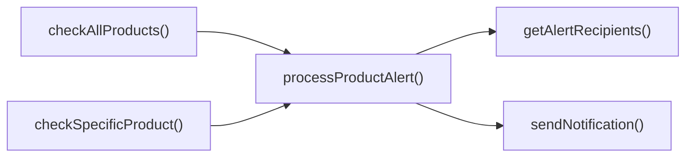

## Genel Bakış
Bu modül, stok seviyelerinin belirli eşiklerin altına düşüp düşmediğini izleyen ve gerektiğinde ilgili kullanıcılara bildirim gönderen bir uyarı sistemini uygular. HTTP isteğiyle tetiklenen ana işleyici, tüm ürünleri veya tek bir ürünü kontrol ederek gerekli uyarı işlemlerini başlatır ve sonuçları yanıt olarak döndürür.

## Fonksiyon Grupları
### İstek İşleme ve Koordinasyon
Bu grup, dışarıdan gelen istekleri alır, hangi ürünlerin kontrol edileceğine karar verir ve ilgili kontrol fonksiyonlarını çağırarak iş akışını yönetir.
- stock-alert_handler, checkAllProducts, checkSpecificProduct

### Ürün Kontrolü ve İşleme
Bu grup, ürünlerin stok durumunu değerlendirir, her ürün için gerekli uyarı koşullarını kontrol eder ve uyarı tetiklenmesi gerektiğinde ilgili işlemleri yürütür.
- processProductAlert, checkAllProducts, checkSpecificProduct

### Bildirim Gönderimi ve Alıcı Alma
Bu grup, uyarı tetiklendiğinde kullanıcıya bildirim göndermek için gerekli alıcı listesini alır ve bildirim iletimini gerçekleştirir.
- sendNotification, getAlertRecipients

---

## AXIOMS – Mimari Varsayımlar
Bu modülün fonksiyonları, parametrelerinin geçerli ve tanımlı olduğundan varsayar.

[Aksiyom 1]: Eğer stock-alert_handler fonksiyonuna req nesnesi geçilmezse, fonksiyon hata verir veya çalışmaz.  
[Aksiyom 2]: Eğer checkAllProducts fonksiyonuna supabase istemcisi geçilmezse, fonksiyon veritabanı işlemlerini yapamaz.  
[Aksiyom 3]: Eğer checkSpecificProduct fonksiyonuna supabase istemcisi veya productId geçilmezse, fonksiyon ürün kontrolü yapamaz.  
[Aksiyom 4]: Eğer processProductAlert fonksiyonuna supabase istemcisi veya product nesnesi geçilmezse, fonksiyon ürün için uyarı işleyemez.  
[Aksiyom 5]: Eğer sendNotification fonksiyonuna type, to, data veya priority parametrelerinden biri eksikse, bildirim gönderilemez.  
[Aksiyom 6]: Eğer getAlertRecipients fonksiyonuna supabase istemcisi geçilmezse, alıcı listesi çekilemez.  
[Aksiyom 7]: Eğer corsHeaders nesnesi tanımlı değilse, CORS yanıtları doğru başlıklarla gönderilemez.

---

## FONKSIYON DETAYLARI

### stock-alert_handler
**Ne yapar**: Gelen HTTP isteğini işleyerek stok uyarı sürecini başlatır ve uygun bir HTTP yanıtı döndürür.  
**Nasıl yapar**: Fonksiyon, `req` parametresi üzerinden istek detaylarını okur, gerekli kontrol ve bildirim işlemlerini tetikler ve sonucu bir `Response` nesnesi olarak geri gönderir.  
**Parametreler**:  
- req: Request — İşlenecek HTTP isteği nesnesi (başlıklar, gövde, query parametreleri vb.)  
**Dönüş**: Response — İsteğe yönelik HTTP yanıt nesnesi (durum kodu, başlıklar ve gövde içerir).

### checkAllProducts
**Ne yapar**: Veritabanındaki tüm ürünleri tarar ve her biri için stok uyarı kontrolünü gerçekleştirir.  
**Nasıl yapar**: `supabase` istemcisi üzerinden ürün listesini çeker, her ürün için `checkSpecificProduct` (veya benzer bir işlev) çağrısı yaparak toplu sonuçları derler ve bu sonuçları döndürür.  
**Parametreler**:  
- supabase: SupabaseClient — Supabase veritabanı ile etkileşim kurmak için kullanılan istemci nesnesi  
**Dönüş**: results — İşlem sonucu elde edilen veri kümesi (tipi belgelenmemiş, ancak genellikle her ürünün kontrol sonucunu içerir).

### checkSpecificProduct
**Ne yapar**: Belirli bir ürünün stok durumunu değerlendirir ve gerekirse ürün için uyarı işlemini başlatır.  
**Nasıl yapar**: `supabase` ile ürün kimliği (`_productId`) ile ilgili ürün kaydını getirir, ardından bu ürün üzerinden `processProductAlert` fonksiyonunu çağırır; dönüş değeri bir dizi olarak paketlenerek geri döndürülür.  
**Parametreler**:  
- supabase: SupabaseClient — Veritabanı erişimi için istemci  
- _productId: string — Kontrol edilecek ürünün benzersiz kimliği  
**Dönüş**: [await processProductAlert(supabase, product as Product)] — `processProductAlert` tarafından üretilen nesnelerin dizisi (her bir ürün için bir uyarı sonucu).

### processProductAlert
**Ne yapar**: Tek bir ürünün stok seviyesini kontrol eder, gerekli uyarı türünü belirler ve bildirim gönderme işlemini hazırlar.  
**Nasıl yapar**: Ürünün mevcut stok miktarını önceden tanımlanmış eşiklerle karşılaştırır, uyarı tipi (ör. düşük stok, aşırı stok) ve alıcı listesini belirler, ardından `sendNotification` üzerinden gerekli bildirimleri tetikler ve işlem sonucunu özetleyen bir nesne döndürür.  
**Parametreler**:  
- supabase: SupabaseClient — Veritabanı işlemleri için istemci  
- product: Product — Kontrol edilecek ürünün tamamı (ad, stok miktarı, eşik değerleri vb.)  
**Dönüş**: {  
    product: product.name,  
    alertType,  
    notifications: notifications.length,  
    success  
} — Ürün adı, tetiklenen uyarı tipi, gönderilen bildirim sayısı ve işlemin başarılı olup olmadığını gösteren boolean değeri içeren nesne.

### sendNotification
**Ne yapar**: Belirtilen tür ve öncelikte bir uyarı mesajını alıcıya iletir.  
**Nasıl yapar**: `type`, `to`, `data` ve `priority` parametrelerini kullanarak uygun bildirim kanalını (e-posta, SMS, push vb.) seçer, mesaj içeriğini oluşturur ve ilgili servise gönderir; fonksiyonun dönüş tipi belirsiz olduğu için genellikle `void` kabul edilir.  
**Parametreler**:  
- type: string — Bildirimin türü (ör. email, sms, push)  
- to: string — Mesajın gönderilecek alıcı adresi veya kimliği  
- data: AlertData — Bildirimin içeriği ve ekstra verileri taşıyan nesne  
- priority: string — Bildirimin öncelik seviyesi (ör. high, low)  
**Dönüş**: void veya bilinmiyor — Fonksiyonun açıkça bir değer döndürmediği belirtilmiş; dönüş tipi belirsiz olduğu için güvenli bir varsayım `void` olarak kabul edilebilir.

### getAlertRecipients
**Ne yapar**: Sistemde uyarı alıcıları olarak kayıtlı tüm kullanıcıların veya grup bilgilerini getirir.  
**Nasıl yapar**: `supabase` istemcisi üzerinden `alert_recipients` tablosu (veya benzeri) sorgulanır, sonuçlar `AlertRecipient` tipinde bir diziye dönüştürülür ve bu dizi bir `Promise` içinde döndürülür.  
**Parametreler**:  
- supabase: SupabaseClient — Veritabanı erişimi için istemci  
**Dönüş**: Promise<AlertRecipient[]> — Alıcı nesnelerinin dizisini içeren vaat (promise); tamamlandığında alıcı listesi sağlanır.

---

## INTERFACES

### Product
- `id: string`
- `name: string`
- `stock_qty: number`
- `low_stock_threshold: number`

### AlertRecipient
- `name: string`
- `phone: string`
- `email: string`
- `whatsapp: string`
- `role: 'admin' | 'manager' | 'buyer'`
- `notifications: {
`

### AlertData
- `productName: string`
- `_productId: string`
- `currentStock: number`
- `threshold: number`
- `alertType: 'out_of_stock' | 'low_stock'`

---

## SABİTLER
- **corsHeaders** (object) — `{
    'Access-Control-Allow-Origin': '*',
    'Access-Control-Allow-Headers...`

---

## AST POINTERS

### [N1_NASIL] AST Pointer: C:\Users\alize\venthub-hvac\supabase\functions\stock-alert\index.ts::stock-alert_handler
- **params**: req: Request
- **ic_degiskenler**:
  - `supabaseUrl` — Supabase proje URL'si, Deno ortam değişkeninden alınır
  - `serviceRoleKey` — Supabase service role anahtarı, Deno ortam değişkeninden alınır
  - `authHeader` — İstek başlığındaki Authorization değeri
  - `isAuthorized` — Yetkilendirme kontrolü sonucu, true/false
  - `anonKey` — Supabase anon anahtarı (fallback yetkilendirme için)
  - `createClientAuth` — Geçici Supabase istemci oluşturma fonksiyonu (anon yetkilendirme)
  - `authClient` — Anon anahtarıyla oluşturulan Supabase istemci nesnesi
  - `user` — authClient.auth.getUser() ile alınan kullanıcı bilgisi
  - `roleCheck` — Kullanıcının rolünü kontrol etmek için gönderilen HTTP isteği
  - `arr` — roleCheck yanıtının JSON olarak ayrıştırılmış rol dizisi
  - `role` — Kullanıcının rolü (admin/superadmin vb.)
  - `err` — Auth fallback sırasında yakalanan hata nesnesi
  - `supabase` — Supabase istemci örneği (service role ile)
  - `alertResults` — İşlenen ürün uyarılarını tutan dizi
  - `_productId` — POST isteğinden gelen ürün kimliği
  - `error` — Try bloğunda yakalanan genel hata
  - `msg` — Hata nesnesinin mesajı (string)
  - `corsHeaders` — CORS başlıkları (dış tanımla, fonksiyon içinde kullanılır)
- **Dönüş**: Response

### [N2_NASIL] AST Pointer: C:\Users\alize\venthub-hvac\supabase\functions\stock-alert\index.ts::checkAllProducts
- **params**: supabase: SupabaseClient
- **ic_degiskenler**:
  - `allLowStock` — products tablosundan çekilen düşük stoklu ürünlerin verisi (data)
  - `fetchErr` — Supabase sorgusundan gelen hata nesnesi
  - `productsToAlert` — Stok miktarı eşik değerinin altında veya eşit olan ürünlerin filtrelenmiş listesi
  - `results` — Her ürün için processProductAlert çağrısının sonuçlarını tutan dizi
  - `product` — productsToAlert döngüsündeki mevcut ürün nesnesi
- **Dönüş**: Promise<AlertResult[]>

### [N3_NASIL] AST Pointer: C:\Users\alize\venthub-hvac\supabase\functions\stock-alert\index.ts::checkSpecificProduct
- **params**: supabase: SupabaseClient, _productId: string
- **ic_degiskenler**:
  - `product` — supabase'dan çekilen tek ürün nesnesi (data)
  - `error` — Supabase sorgusundan gelen hata nesnesi
- **Dönüş**: Promise<AlertResult[]>

### [N4_NASIL] AST Pointer: C:\Users\alize\venthub-hvac\supabase\functions\stock-alert\index.ts::processProductAlert
- **params**: supabase: SupabaseClient, product: Product
- **ic_degiskenler**:
  - `recipients` — getAlertRecipients ile alınan bildirim alıcıları listesi
  - `alertType` — Stok durumuna göre 'out_of_stock' veya 'low_stock'
  - `priority` — Bildirim önceliği ('critical' veya 'high')
  - `alertData` — Bildirime eklenecek ürün bilgilerini içeren nesne
  - `notifications` — Gönderilen bildirimlerin sonuçlarını tutan dizi
  - `recipient` — recipients döngüsündeki mevcut alıcı nesnesi
- **Dönüş**: { product: string, alertType: string, notifications: number, success: boolean }

### [N5_NASIL] AST Pointer: C:\Users\alize\venthub-hvac\supabase\functions\stock-alert\index.ts::sendNotification
- **params**: type: string, to: string, data: AlertData, priority: string
- **ic_degiskenler**:
  - `supabaseUrl` — Supabase proje URL'si (Deno env)
  - `serviceRoleKey` — Supabase service role anahtarı (Deno env)
  - `response` — notification-service fonksiyonuna yapılan HTTP POST yanıtı
  - `err` — Fetch işlemi sırasında yakalanan hata
- **Dönüş**: { type: string, recipient: string, success: boolean }

### [N6_NASIL] AST Pointer: C:\Users\alize\venthub-hvac\supabase\functions\stock-alert\index.ts::getAlertRecipients
- **params**: supabase: SupabaseClient
- **ic_degiskenler**:
  - `settings` — inventory_settings tablosundan tek satır veri (data)
  - `recipients` — döndürülecek AlertRecipient nesnelerinin listesi
- **Dönüş**: Promise<AlertRecipient[]>

---

## ÇAĞRI HARİTASI

### Disariya Cagrilar (Outgoing)
- **checkAllProducts()** → `processProductAlert` (tüm ürünlerin değişikliklerini işlemek için)  
- **checkSpecificProduct()** → `processProductAlert` (belirli bir ürünün uyarısını işlemek için)  
- **processProductAlert()** → `sendNotification`, `getAlertRecipients` (uyarı bildirimini göndermek ve alıcı listesini elde etmek için)  
- **sendNotification()** → (verilen veri setinde dışarıya yönelik bir çağır bulunmamaktadır)  
- **getAlertRecipients()** → (verilen veri setinde dışarıya yönelik bir çağır bulunmamaktadır)

### Disaridan Cagrilanlar (Incoming)
- Verilen dosya‑içi çağrı verisinde bu modülü kullanan harici dosya veya fonksiyon bilgisi bulunmamaktadır; dolayısıyla harici gelen çağrılar belirtilmemiştir.

### Ic Ice Fonksiyonlar (Nested)
- Yok

---

## DOSYA-İÇİ ÇAĞRI GRAFİĞİ
  checkAllProducts() → processProductAlert()
  checkSpecificProduct() → processProductAlert()
  processProductAlert() → getAlertRecipients()
  processProductAlert() → sendNotification()

---

## NODE ID STANDARD

  file: supabase\functions\stock-alert\index.ts
  function: supabase\functions\stock-alert\index.ts::stock-alert_handler
  function: supabase\functions\stock-alert\index.ts::checkAllProducts
  function: supabase\functions\stock-alert\index.ts::checkSpecificProduct
  function: supabase\functions\stock-alert\index.ts::processProductAlert
  function: supabase\functions\stock-alert\index.ts::sendNotification
  function: supabase\functions\stock-alert\index.ts::getAlertRecipients

---

## DISA AKTARILANLAR (EXPORTS)
  export: checkAllProducts
  export: checkSpecificProduct
  export: getAlertRecipients
  export: processProductAlert
  export: sendNotification
  export: stock-alert_handler