## Genel Bakış
Bu modül, HVAC sistemi için yazılmış e2e testlerinde kullanılmak üzere adversarial (saldırgan) test senaryoları için yardımcı fonksiyonlar ve araçlar içerir. Temel amacı, sistemdeki güvenlik kontrollerinin, veri çözümleme mekanizmalarının ve önbellek yapılarının doğru çalışmasını test etmek için gerekli ortamı oluşturmaktır.

## Fonksiyon Grupları
### Güvenlik ve Doğrulama Yardımcıları
Bu grup, testlerdeki sahte verileri oluşturmak ve kritik güvenlik imzası doğrulamalarını simüle etmek için kullanılır.
- mockUserResolver, computeSignature

### Tenant ve Fatura Yolu Çözümleyicileri
Bu grup, çoklu kiracılı (multi-tenant) mimaride gelen isteklere göre doğru kiracıyı ve fatura kaynağını belirlemek için kullanılan test edilmiş çözümleme fonksiyonlarını kapsar.
- secureResolveTenant, secureResolveInvoicePath

### Veri ve Önbellekleme Araçları
Bu grup, test senaryolarında verilerin temizlenmesini ve önbellekleme anahtarı üretimini kontrol eden araçları içerir.
- sanitizeBrandConfig, naiveBuildKey
- SecureCacheEngine sınıfı (buildKey, get, set metotları ile anahtar üretimi ve önbellek yönetimi)

---

## AXIOMS – Mimari Varsayımlar

Bu modül, HVAC sistemi için adversarial (saldırgan) test senaryolarında kullanılan yardımcı fonksiyonları ve güvenli önbellek motorunu kapsar. Güvenlik mekanizmalarının doğru çalışmasını test etmek için kritik varsayımlar taşır.

---

**[Aksiyom 1 - Tenant Izolasyonu]:** `SecureCacheEngine` tarafından depolanan değerler, `tenantId` parameteresine göre kesinlikle izole olmalıdır.
*Eğer farklı `tenantId` değerleri ile aynı `key` ve `lang` kullanılarak `set` ve `get` işlemleri yapılırsa, farklı tenantlar için farklı değerler dönmelidir. Aksi halde, tenant veri sızıntısı (tenant data leakage) oluşur.*

---

**[Aksiyom 2 - Host Çözümleme Sınırları]:** `secureResolveTenant` fonksiyonu `host` parametresi `null` veya `undefined` olduğunda bile çalışabilir durumda olmalıdır.
*Eğer `host` parametresi `null` veya `undefined` geldiğinde fonksiyon hata fırlatırsa, beklenmeyen host değerleri için sistem çöker. Güvenli bir varsayılan tenant veya hata yönetimi ile sonuç döndürmelidir.*

---

**[Aksiyom 3 - İmza Hesaplama Bileşenleri]:** `computeSignature(secret, body)` fonksiyonu için hem `secret` hem de `body` non-empty string olmalıdır.
*Eğer `secret` boş string olarak verilirse, hesaplanan imza güvenliksiz ve tahmin edilebilir hale gelir. Eğer `body` boş string olursa, imza tutarsız ve reprodukible olmayan sonuçlar doğurur.*

---

**[Aksiyom 4 - Güvenli vs. Naif Anahtar Üretimi]:** `naiveBuildKey` ve `SecureCacheEngine.buildKey` fonksiyonları farklı güvenlik seviyelerine sahip olmalıdır.
*Eğer `naiveBuildKey` ile `SecureCacheEngine.buildKey` aynı inputlar için aynı çıktıyı üretirse, naif implementasyonun güvenli implementasyondan farkı kalmaz ve adversary testleri anlamını yitirir. `naiveBuildKey` kasıtlı olarak zayıf bir anahtar üretim stratejisi izlemelidir.*

---

**[Aksiyom 5 - Marka Konfigürasyonu Alan Zorunluluğu]:** `sanitizeBrandConfig` tarafından işlenen config objesinin `brandName`, `brandPrimaryColor` ve `brandLogoUrl` alanlarının tümü var olmalıdır.
*Eğer bu alanlardan herhangi biri eksik veya farklı bir tipte gelirse, sanitizasyon süreci tanımsız davranış (undefined behavior) sergileyebilir. Eksik alan durumunda varsayılan değer mi yoksa hata mı döndürüleceği modülün test senaryoları ile tutarlı olmalıdır.*

---

**[Aksiyom 6 - Fatura Yolu Deterministikliği]:** `secureResolveInvoicePath(tenantId, invoiceId)` aynı `tenantId` ve `invoiceId` değerleri için her zaman aynı yolu döndürmelidir.
*Eğer aynı inputlar için farklı path'ler döndürülürse, fatura dosyalarına erişim tutarsız hale gelir ve dosya sistemi tabanlı testler başarısız olur.*

---

**[Aksiyom 7 - Cache Anahtar Formatı]:** `SecureCacheEngine.buildKey` fonksiyonu, `key`, `lang` ve `tenantId` bileşenlerinden deterministik ve benzersiz bir anahtar üretmelidir.
*Eğer farklı `(key, lang, tenantId)` üçlülerinden aynı cache anahtarı üretilirse, cache çakışmaları (collision) oluşur ve yanlış veriler okunur.*

---

**[Aksiyom 8 - Mock User Resolver Çıktı Yapısı]:** `mockUserResolver()` fonksiyonu, bir kullanıcı objesi döndürmelidir ve bu obje至少 `id` alanı içermelidir.
*Eğer mock user objesi geçerli bir yapıya sahip değilse, user-referanslı fonksiyonların test

---

## FONKSİYON DETAYLARI

### mockUserResolver
**Ne yapar**: Mock bir kullanici resolver fonksiyonu ve buna sarili, tenant dogrulamasi yapan guvenli bir middleware sarmali olusturur. Amaci, testlerde yetkisiz erisim senaryolarini (bos tenant_id veya gecersiz slug ile) simule etmektir.
**Nasil yapar**: Once mockUserResolver'ı, belirli bir test kullanıcısı (admin rolü, boş tenant_id ile) donen sabit bir fonksiyon olarak yeniden tanimlar. Ardından, mevcut middleware'i saran `secureMiddleware` adli asenkron bir wrapper olusturur. Bu wrapper, middleware'in 200 basarili dondurmesi durumunda, resolver'dan alinan kullanici nesnesindeki `app_metadata.tenant_id` alaninin bos olup olmadigini kontrol eder. Bos ise kullaniciyi ana sayfaya, `auth_error` parametresiyle yonlendirir.
**Parametreler**:
- Yok (parasiz bir fonksiyondur).
**Dönüş**: Fonksiyon, `(user: any, error: any)` nesnesi donen ve bu nesneyi mock eden bir resolver fonksiyonu返回 eder. Ancak asil cikisi, iceride olusturulan ve test istekleri uzerinde calistirilacak `secureMiddleware` fonksiyonunun kendisidir.

### computeSignature
**Ne yapar**: Verilen bir gizli anahtar (secret) ve govde (body) icerigi icin HMAC-SHA256 imzasi hesaplar. Bu, API isteklerinin veya webhook payload'larin dogrulanmasinda kullanilir.
**Nasil yapar**: `crypto.subtle` API kullanarak once ham anahtar dizisinden (raw key) HMAC-SHA-256 algoritmasiyla imzalama yetkisine sahip bir `CryptoKey` nesnesi olusturur. Sonra, bu anahtari kullanarak govde uzerinde bir imza uretir. Uretilen imza byte dizisini Base64 formatina cevirerek字符串 olarak dondurur.
**Parametreler**:
- secret: string — HMAC algoritmasinda kullanilacak gizli anahtar.
- body: string — Imzalanacak ham govde veya icerik字符串i.
**Dönüş**: `Promise<string>` — Hesaplanmis Base64 formatindaki HMAC imzasi.

### secureResolveTenant
**Ne yapar**: Bir hostname'ten tenant bilgisini cozer ve slug'in guvenli oldugundan emin olur. Gecersiz karakterler iceren slug'lari "invalid" olarak isaretleyerek potansiyel saldirilari onler.
**Nasil yapar**: once `resolveTenant` fonksiyonunu cagirarak temel tenant nesnesini alir. Sonra, elde edilen `slug` alaninin yalnizca harf, rakam ve tire karakterleri icerdigini dogrulamak icin bir正则表达式 kontrolu yapar. Eger slug bu kaliba uymuyorsa (ornegin noktalı virgül veya斜杠 iceriyorsa), `base.slug` degerini `"invalid"` olarak degistirir ve guvenli hale getirilmis nesneyi dondurur.
**Parametreler**:
- host: string | null | undefined — Tenant'i belirlemek icin kullanilacak hostname.
**Dönüş**: `{ slug: string; ... }` — Guvenli hale getirilmis tenant nesnesi. `slug` alaninin guvenli olmayan degerlere karsi temizlendiği garanti edilir.

### naiveBuildKey
**Ne yapar**: Basit bir sekilde bir onbellek anahtari olusturur. guvenlik kontrolleri veya karmasiklik onlemleri yoktur.
**Nasil yapar**: Parametre olarak verilen `key`, `lang` ve `tenantId` degerlerini tire (-) karakterleri ile birlestirerek duz bir string olusturur ve dondurur. Bu yontem, prototype pollution veya token manipulasyonu gibi saldirilara karsi savunmasizdir.
**Parametreler**:
- key: string — Anahtar olusturmak icin kullanilan temel anahtar.
- lang: string — Dil kodu (ornegin "tr", "en").
- tenantId: string — Tenant'i tanimlayan benzersiz kimlik.
**Dönüş**: `string` — Birlestirilmis, duz formatta anahtar字符串i.

### secureResolveInvoicePath
**Ne yapar**: Bir tenant ID ve fatura ID kullanarak dosya sistemindeki guvenli bir fatura PDF dosyasi yolunu olusturur. Girislerdeki yol gezintisi (path traversal) saldirilarini ve gecersiz karakterleri onler.
**Nasil yapar**: Once `tenantId`'nin gecerli karakterler (harf, rakam, tire) icerdigini dogrular; icermiyorsa hata firlatir. Ardindan, `invoiceId`'yi URL-decode eder ve icerisinde `..`, `/` veya `\` gibi yol gezintisi kaliplarini arar. Boyle bir kalip bulursa hata firlatir. Tum kontrollerden gecerse, `tenants/{tenantId}/invoices/{invoiceId}.pdf` formatinda guvenli yolu返回 eder.
**Parametreler**:
- tenantId: string — Faturanin ait oldugu tenant'in benzersiz kimligi.
- invoiceId: string — Faturanin benzersiz kimligi veya numarasi.
**Dönüş**: `string` — Guvenli, normalize edilmis dosya yolu.

### sanitizeBrandConfig
**Ne yapar**: Bir marka konfigurasyon nesnesindeki (ad, renk, logo URL) degerleri temizler ve guvenli hale getirir. Kullanicidan gelen kirli verileri, XSS ve veri enjeksiyonu gibi saldirilara karsi arindirir.
**Nasil yapar**: 1) `brandName` icin DOMPurify kutuphanesini kullanarak HTML etiketlerini tamamen temizler. 2) `brandPrimaryColor`'u, gecerli CSS renk formatlariyla (hex, rgb, rgba) eslesen bir正则表达式 ile dogrular; eslesmiyorsa varsayilan guvenli bir renk (`#2563eb`) kullanir. 3) `brandLogoUrl`'i bir `URL` nesnesine ayirir ve protocolun yalnizca http: veya https: olup olmadigini kontrol eder; baska bir protocol (ornegin javascript:) veya gecersiz bir URL ise varsayilan guvenli bir logo URL'sine yonlendirir.
**Parametreler**:
- config: `{ brandName: string; brandPrimaryColor: string; brandLogoUrl: string }` — Temizlenecek ham marka konfigurasyon nesnesi.
**Dönüş**: `{ brandName: string; brandPrimaryColor: string; brandLogoUrl: string }` — Her alaninin guvenli ve gecerli formata temizlenmis hali.

### buildKey
**Ne yapar**: Güvenli bir cache anahtarı oluşturur. Verilen key, dil ve tenant bilgilerini birleştirerek prototip manipülasyonu saldırılarına karşı korumalı bir string üretir.

**Nasıl yapar**: İlk olarak prototype pollution guard uygulayarak `__proto__` veya `constructor` değerlerini engeller. Ardından parametreleri bir array içinde JSON.stringify ile serialize ederek yapısal olarak güvenli bir anahtar oluşturur.

**Parametreler**:
- key: string — Cache'de depolanacak verinin tanımlayıcısı
- lang: string — Dil kodu bilgisi
- tenantId: string — Kiracı (tenant) tanımlayıcısı

**Dönüş**: string — JSON formatında serialize edilmiş güvenli cache anahtarı

### get
**Ne yapar**: Geliştirildi ancak detay üretilemedi.

### set
**Ne yapar**: Geliştirildi ancak detay üretilemedi.

---

## MERMAID CALL GRAPH

```mermaid
graph TD
    adversarial_test_ts__buildKey["buildKey"]
    adversarial_test_ts__computeSignature["computeSignature"]
    adversarial_test_ts__get["get"]
    adversarial_test_ts__mockUserResolver["mockUserResolver"]
    adversarial_test_ts__naiveBuildKey["naiveBuildKey"]
    adversarial_test_ts__sanitizeBrandConfig["sanitizeBrandConfig"]
    adversarial_test_ts__secureResolveInvoicePath["secureResolveInvoicePath"]
    adversarial_test_ts__secureResolveTenant["secureResolveTenant"]
    adversarial_test_ts__set["set"]
```

## NODE ID STANDARD

  file: tests\e2e\adversarial.test.ts
  function: tests\e2e\adversarial.test.ts::mockUserResolver
  function: tests\e2e\adversarial.test.ts::computeSignature
  function: tests\e2e\adversarial.test.ts::secureResolveTenant
  function: tests\e2e\adversarial.test.ts::naiveBuildKey
  function: tests\e2e\adversarial.test.ts::secureResolveInvoicePath
  function: tests\e2e\adversarial.test.ts::sanitizeBrandConfig
  class: tests\e2e\adversarial.test.ts::SecureCacheEngine

---

## DISA AKTARILANLAR (EXPORTS)
  export: SecureCacheEngine
  export: computeSignature
  export: mockUserResolver
  export: naiveBuildKey
  export: sanitizeBrandConfig
  export: secureResolveInvoicePath
  export: secureResolveTenant