## Genel Bakış
Bu modül, HVAC sistemi için yazılmış e2e testlerinde kullanılmak üzere adversarial (saldırgan) test senaryoları için yardımcı fonksiyonlar ve araçlar içerir. Temel amacı, sistemdeki güvenlik kontrollerinin, veri çözümleme mekanizmalarının ve önbellek yapılarının doğru çalışmasını test etmek için gerekli ortamı oluşturmaktır.

## Fonksiyon Grupları
### Güvenlik ve Doğrulama Yardımcıları
Bu grup, testlerdeki sahte verileri oluşturmak ve kritik güvenlik imzası doğrulamalarını simüle etmek için kullanılır.
- mockUserResolver, computeSignature

### Tenant ve Fatura Yolu Çözümleyicileri
Bu grup, çoklu kiracılı (multi-tenant) mimaride gelen isteklere göre doğru kiracıyı ve fatura kaynağını belirlemek için kullanılan test edilmiş çözümleme fonksiyonlarını kapsar.
- secureResolveTenant, secureResolveInvoicePath

### Veri ve Önbellekleme Araçları
Bu grup, test senaryolarında verilerin temizlenmesini ve önbellekleme anahtarı üretimini kontrol eden araçları içerir.
- sanitizeBrandConfig, naiveBuildKey
- SecureCacheEngine sınıfı (buildKey, get, set metotları ile anahtar üretimi ve önbellek yönetimi)

---

---

## FONKSİYON DETAYLARI

### mockUserResolver
**Ne yapar**: Mock bir kullanici resolver fonksiyonu ve buna sarili, tenant dogrulamasi yapan guvenli bir middleware sarmali olusturur. Amaci, testlerde yetkisiz erisim senaryolarini (bos tenant_id veya gecersiz slug ile) simule etmektir.
**Nasil yapar**: Once mockUserResolver'ı, belirli bir test kullanıcısı (admin rolü, boş tenant_id ile) donen sabit bir fonksiyon olarak yeniden tanimlar. Ardından, mevcut middleware'i saran `secureMiddleware` adli asenkron bir wrapper olusturur. Bu wrapper, middleware'in 200 basarili dondurmesi durumunda, resolver'dan alinan kullanici nesnesindeki `app_metadata.tenant_id` alaninin bos olup olmadigini kontrol eder. Bos ise kullaniciyi ana sayfaya, `auth_error` parametresiyle yonlendirir.
**Parametreler**:
- Yok (parasiz bir fonksiyondur).
**Dönüş**: Fonksiyon, `(user: any, error: any)` nesnesi donen ve bu nesneyi mock eden bir resolver fonksiyonu返回 eder. Ancak asil cikisi, iceride olusturulan ve test istekleri uzerinde calistirilacak `secureMiddleware` fonksiyonunun kendisidir.

### computeSignature
**Ne yapar**: Verilen bir gizli anahtar (secret) ve govde (body) icerigi icin HMAC-SHA256 imzasi hesaplar. Bu, API isteklerinin veya webhook payload'larin dogrulanmasinda kullanilir.
**Nasil yapar**: `crypto.subtle` API kullanarak once ham anahtar dizisinden (raw key) HMAC-SHA-256 algoritmasiyla imzalama yetkisine sahip bir `CryptoKey` nesnesi olusturur. Sonra, bu anahtari kullanarak govde uzerinde bir imza uretir. Uretilen imza byte dizisini Base64 formatina cevirerek字符串 olarak dondurur.
**Parametreler**:
- secret: string — HMAC algoritmasinda kullanilacak gizli anahtar.
- body: string — Imzalanacak ham govde veya icerik字符串i.
**Dönüş**: `Promise<string>` — Hesaplanmis Base64 formatindaki HMAC imzasi.

### secureResolveTenant
**Ne yapar**: Bir hostname'ten tenant bilgisini cozer ve slug'in guvenli oldugundan emin olur. Gecersiz karakterler iceren slug'lari "invalid" olarak isaretleyerek potansiyel saldirilari onler.
**Nasil yapar**: once `resolveTenant` fonksiyonunu cagirarak temel tenant nesnesini alir. Sonra, elde edilen `slug` alaninin yalnizca harf, rakam ve tire karakterleri icerdigini dogrulamak icin bir正则表达式 kontrolu yapar. Eger slug bu kaliba uymuyorsa (ornegin noktalı virgül veya斜杠 iceriyorsa), `base.slug` degerini `"invalid"` olarak degistirir ve guvenli hale getirilmis nesneyi dondurur.
**Parametreler**:
- host: string | null | undefined — Tenant'i belirlemek icin kullanilacak hostname.
**Dönüş**: `{ slug: string; ... }` — Guvenli hale getirilmis tenant nesnesi. `slug` alaninin guvenli olmayan degerlere karsi temizlendiği garanti edilir.

### naiveBuildKey
**Ne yapar**: Basit bir sekilde bir onbellek anahtari olusturur. guvenlik kontrolleri veya karmasiklik onlemleri yoktur.
**Nasil yapar**: Parametre olarak verilen `key`, `lang` ve `tenantId` degerlerini tire (-) karakterleri ile birlestirerek duz bir string olusturur ve dondurur. Bu yontem, prototype pollution veya token manipulasyonu gibi saldirilara karsi savunmasizdir.
**Parametreler**:
- key: string — Anahtar olusturmak icin kullanilan temel anahtar.
- lang: string — Dil kodu (ornegin "tr", "en").
- tenantId: string — Tenant'i tanimlayan benzersiz kimlik.
**Dönüş**: `string` — Birlestirilmis, duz formatta anahtar字符串i.

### secureResolveInvoicePath
**Ne yapar**: Bir tenant ID ve fatura ID kullanarak dosya sistemindeki guvenli bir fatura PDF dosyasi yolunu olusturur. Girislerdeki yol gezintisi (path traversal) saldirilarini ve gecersiz karakterleri onler.
**Nasil yapar**: Once `tenantId`'nin gecerli karakterler (harf, rakam, tire) icerdigini dogrular; icermiyorsa hata firlatir. Ardindan, `invoiceId`'yi URL-decode eder ve icerisinde `..`, `/` veya `\` gibi yol gezintisi kaliplarini arar. Boyle bir kalip bulursa hata firlatir. Tum kontrollerden gecerse, `tenants/{tenantId}/invoices/{invoiceId}.pdf` formatinda guvenli yolu返回 eder.
**Parametreler**:
- tenantId: string — Faturanin ait oldugu tenant'in benzersiz kimligi.
- invoiceId: string — Faturanin benzersiz kimligi veya numarasi.
**Dönüş**: `string` — Guvenli, normalize edilmis dosya yolu.

### sanitizeBrandConfig
**Ne yapar**: Bir marka konfigurasyon nesnesindeki (ad, renk, logo URL) degerleri temizler ve guvenli hale getirir. Kullanicidan gelen kirli verileri, XSS ve veri enjeksiyonu gibi saldirilara karsi arindirir.
**Nasil yapar**: 1) `brandName` icin DOMPurify kutuphanesini kullanarak HTML etiketlerini tamamen temizler. 2) `brandPrimaryColor`'u, gecerli CSS renk formatlariyla (hex, rgb, rgba) eslesen bir正则表达式 ile dogrular; eslesmiyorsa varsayilan guvenli bir renk (`#2563eb`) kullanir. 3) `brandLogoUrl`'i bir `URL` nesnesine ayirir ve protocolun yalnizca http: veya https: olup olmadigini kontrol eder; baska bir protocol (ornegin javascript:) veya gecersiz bir URL ise varsayilan guvenli bir logo URL'sine yonlendirir.
**Parametreler**:
- config: `{ brandName: string; brandPrimaryColor: string; brandLogoUrl: string }` — Temizlenecek ham marka konfigurasyon nesnesi.
**Dönüş**: `{ brandName: string; brandPrimaryColor: string; brandLogoUrl: string }` — Her alaninin guvenli ve gecerli formata temizlenmis hali.

### buildKey
**Ne yapar**: `SecureCacheEngine` sinifinin bir yontemi olarak, prototype pollution saldirilarini onleyen guvenli bir onbellek anahtari uretir.
**Nasil yapar**: Gelen `key`, `lang` ve `tenantId` parametrelerinden herhangi birinin `"__proto__"` veya `"constructor"` gibi prototype zincirini manipule edebilecek degerler olup olmadigini kontrol eder. Boyle bir deger tespit ederse hata firlatir. Aksi takdirde, parametreleri bir dizi icine koyup `JSON.stringify` ile serialize ederek, token manipulasyonu cakismalarini onleyen yapısal olarak guvenli bir anahtar字符串i返回 eder.
**Parametreler**:
- key: string — Anahtar olusturmak icin kullanilan temel anahtar.
- lang: string — Dil kodu.
- tenantId: string — Tenant benzersiz kimligi.
**Dönüş**: `string` — JSON.stringify ile uretilmis guvenli,唯一 anahtar字符串i.

### get
**Ne yapar**: `SecureCacheEngine` sinifinin bir yontemi olarak, guvenli sekilde olusturulmus bir anahtarla onbellek deposundan deger okur.
**Nasil yapar**: `this.buildKey` yontemini cagirarak, verilen parametrelerden guvenli bir anahtar uretir. Bu anahtari kullanarak `this.store` (bir Map veya benzeri depo) uzerinde `get` islemi yapar ve degeri返回 eder.
**Parametreler**:
- key: string — Onbellek anahtari icin temel deger.
- lang: string — Dil kodu.
- tenantId: string — Tenant benzersiz kimligi.
**Dönüş**: `any` — Onbellekte bulunan deger; anahtar yoksa `undefined`.

### set
**Ne yapar**: `SecureCacheEngine` sinifinin bir yontemi olarak, guvenli sekilde olusturulmus bir anahtarla bir degeri onbellek deposuna yazar.
**Nasil yapar**: `this.buildKey` yontemini cagirarak, verilen parametrelerden guvenli bir anahtar uretir. Bu anahtari kullanarak `this.store` uzerinde `set` islemi yaparak verilen degeri kaydeder.
**Parametreler**:
- key: string — Onbellek anahtari icin temel deger.
- lang: string — Dil kodu.
- tenantId: string — Tenant benzersiz kimligi.
- value: any — Onbellekte saklanacak deger.
**Dönüş**: Fonksiyonun belirgin bir返回 degeri yoktur (muhtemelen `void`). Yalnizca yan etki olarak depoyu gunceller.

---

## AST POINTERS

### [N1_NASIL] AST Pointer: tests\e2e\adversarial.test.ts::mockUserResolver
- **params**: (parametre yok)
- **ic_degiskenler**: (değişken yok, doğrudan literal nesne döndürür)
- **Dönüş**: { user: any; error: any }

### [N2_NASIL] AST Pointer: tests\e2e\adversarial.test.ts::computeSignature
- **params**: `secret: string`, `body: string`
- **ic_degiskenler**:
  - `encoder` — Metinleri ikili (binary) forma dönüştüren TextEncoder örneği
  - `key` — HMAC-SHA-256 imzası için imp ortlanmış (imported) kripto anahtarı
  - `signature` — HMAC ile hesaplanmış ham imza bytes dizisi
- **Dönüş**: string (base64 kodlanmış imza)

### [N3_NASIL] AST Pointer: tests\e2e\adversarial.test.ts::secureResolveTenant
- **params**: `host: string | null | undefined`
- **ic_degiskenler**:
  - `base` — resolveTenant() çağrısından dönen ham tenant çözümleme sonucu
- **Dönüş**: `{ slug, tenantId, ... }` nesnesi (slug'ı potentially 'invalid' olarak değiştirilmiş)

### [N4_NASIL] AST Pointer: tests\e2e\adversarial.test.ts::naiveBuildKey
- **params**: `key: string`, `lang: string`, `tenantId: string`
- **ic_degiskenler**: (değişken yok, doğrudan template literal döndürür)
- **Dönüş**: string (`key-lang-tenantId` formatında birleşik dize)

### [N5_NASIL] AST Pointer: tests\e2e\adversarial.test.ts::secureResolveInvoicePath
- **params**: `tenantId: string`, `invoiceId: string`
- **ic_degiskenler**:
  - `normalizedInvoiceId` — decodeURIComponent() ile URL-kodlanmış traversal karakterleri çözümlenmiş fatura ID'si
- **Dönüş**: string (`tenants/{tenantId}/invoices/{normalizedInvoiceId}.pdf` formatında depolama yolu)

### [N6_NASIL] AST Pointer: tests\e2e\adversarial.test.ts::sanitizeBrandConfig
- **params**: `config: { brandName: string; brandPrimaryColor: string; brandLogoUrl: string }`
- **ic_degiskenler**:
  - `brandName` — config.brandName değerinden DOMPurify ile HTML etiketleri temizlenmiş ve trim edilmiş güvenli marka adı
  - `colorRegex` — Geçerli renk formatlarını (hex, rgb, rgba) doğrulayan regular expression deseni
  - `brandPrimaryColor` — Regex eşleşmesi ile doğrulanmış veya '#2563eb' güvenli varsayılana düşürülmüş ana renk
  - `brandLogoUrl` — config.brandLogoUrl'den gelen URL, protocol doğrulamasıyla güvenli hale getirilmiş veya varsayılana düşürülmüş
  - `parsed` — config.brandLogoUrl değerini parsed URL nesnesi (try bloğu içinde)
- **Dönüş**: `{ brandName: string; brandPrimaryColor: string; brandLogoUrl: string }`

### [N7_NASIL] AST Pointer: tests\e2e\adversarial.test.ts::SecureCacheEngine.buildKey
- **params**: `key: string`, `lang: string`, `tenantId: string`
- **ic_degiskenler**: (değişken yok, doğrudan JSON.stringify ile döndürür)
- **Dönüş**: string (JSON.stringify([key, lang, tenantId]) formatında korumalı anahtar)

### [N8_NASIL] AST Pointer: tests\e2e\adversarial.test.ts::SecureCacheEngine.get
- **params**: `key: string`, `lang: string`, `tenantId: string`
- **ic_degiskenler**:
  - `safeKey` — buildKey() çağrısı ile üretilmiş güvenli anahtar
- **Dönüş**: any (this.store.get(safeKey) sonucu)

### [N9_NASIL] AST Pointer: tests\e2e\adversarial.test.ts::SecureCacheEngine.set
- **params**: `key: string`, `lang: string`, `tenantId: string`, `value: any`
- **ic_degiskenler**:
  - `safeKey` — buildKey() çağrısı ile üretilmiş güvenli anahtar
- **Dönüş**: yok (this.store.set() ile yan etki: store haritasına değer ekler)

---

## MERMAID CALL GRAPH

```mermaid
graph TD
    adversarial_test_ts__buildKey["buildKey"]
    adversarial_test_ts__computeSignature["computeSignature"]
    adversarial_test_ts__get["get"]
    adversarial_test_ts__mockUserResolver["mockUserResolver"]
    adversarial_test_ts__naiveBuildKey["naiveBuildKey"]
    adversarial_test_ts__sanitizeBrandConfig["sanitizeBrandConfig"]
    adversarial_test_ts__secureResolveInvoicePath["secureResolveInvoicePath"]
    adversarial_test_ts__secureResolveTenant["secureResolveTenant"]
    adversarial_test_ts__set["set"]
```

## NODE ID STANDARD

  file: tests\e2e\adversarial.test.ts
  function: tests\e2e\adversarial.test.ts::mockUserResolver
  function: tests\e2e\adversarial.test.ts::computeSignature
  function: tests\e2e\adversarial.test.ts::secureResolveTenant
  function: tests\e2e\adversarial.test.ts::naiveBuildKey
  function: tests\e2e\adversarial.test.ts::secureResolveInvoicePath
  function: tests\e2e\adversarial.test.ts::sanitizeBrandConfig
  class: tests\e2e\adversarial.test.ts::SecureCacheEngine

---

## DISA AKTARILANLAR (EXPORTS)
  export: SecureCacheEngine
  export: computeSignature
  export: mockUserResolver
  export: naiveBuildKey
  export: sanitizeBrandConfig
  export: secureResolveInvoicePath
  export: secureResolveTenant