## Genel Bakış
Bu modül, uygulamanın güvenlik kontrollerini adversarial (düşmanca) senaryolarla test eden uçtan uca test dosyasıdır. Güvenli ve naif (güvensiz) çözümlemeler arasındaki farkları doğrulayarak yol çözümleme, anahtar oluşturma, imza doğrulama ve veri temizleme gibi kritik güvenlik katmanlarının saldırılara karşı dayanıklılığını sınar.

## Fonksiyon Grupleri

### Test Ortamı ve Mock'lar
Test senaryoları için sahte bağımlılıklar üretir; gerçek servisleri çağırmadan kontrollü test ortamı sağlar.
- mockUserResolver

### İmza ve Kimlik Doğrulama
İstek bütünlüğünü doğrulamak için kriptografik imza hesaplar.
- computeSignature

### Güvenli Yol ve Tenant Çözümleme
Girdi doğrulaması yaparak host ve fatura yolu çözümlemesinde yol traversali veya yetkisiz erişim gibi saldırıları engelleyen fonksiyonlar içerir.
- secureResolveTenant, secureResolveInvoicePath

### Naif (Güvensiz) Anahtar Oluşturma
Güvenlik kontrolü uygulamadan anahtar üretir; güvenli muadiliyle karşılaştırma yapılarak güvenlik açığı senaryolarının test edilmesinde kullanılır.
- naiveBuildKey

### Veri Temizleme
Marka yapılandırma verisindeki zararlı veya beklenmedik girdileri temizleyerek enjeksiyon saldırılarını önler.
- sanitizeBrandConfig

### Güvenli Önbellek Motoru
Tenant ve dil bazlı anahtar çözümlemesiyle önbellek erişimi sağlayan sınıf; güvenli anahtar oluşturma, okuma ve yazma işlemlerini yönetir.
- SecureCacheEngine.buildKey, SecureCacheEngine.get, SecureCacheEngine.set

### Fonksiyonlar Arası İlişkiler
- `naiveBuildKey` ile `SecureCacheEngine.buildKey` aynı işi farklı güvenlik seviyelerinde yapar; testler muhtemelen bu ikisini karşılaştırarak enjeksiyon veya yetki aşımı senaryolarını doğrular.
- `mockUserResolver` test ortamında kullanıcı kimliği çözümlemesini simüle eder; diğer fonksiyonların bağımsız çalışmasını sağlar.
- `secureResolveTenant` ve `secureResolveInvoicePath` birlikte kullanılarak zincirleme yol traversali saldırıları test edilebilir.
- `computeSignature` API güvenlik testlerinde istek imzası doğrulama akışını sınar.

---

## AXIOMS – Mimari Varsayımlar
- Bu modül davranışsal mantık içermez (salt veri / konfigürasyon / tip tanımı).
- [Aksiyom 1]: Modülün dışa açtığı yapı (anahtar kümesi / şema) bir sözleşmedir; tüketiciler bu sabit yapıya bağlıdır — kırıcı değişiklik tüm tüketicileri etkiler.
- [Aksiyom 2]: Bir öğe ekleme/çıkarma yapısal-uyumlu olmalı; ilgili tipler ve seçiciler aynı commit'te güncel tutulmalıdır.

---

## FONKSİYON DETAYLARI

### mockUserResolver
**Ne yapar**: Bu fonksiyon, boş bir `tenant_id` değeriyle kimlik doğrulama bypass girişimini test eden bir adversarial test senaryosunu çalıştırır. Amaç, middleware'in boş tenant claim'lerini reddedip reddetmediğini doğrulamaktır.

**Nasıl yapar**: Fonksiyon önce `mockUserResolver` değişkenini, `app_metadata.tenant_id` alanı boş string olan bir kullanıcı nesnesi döndürecek şekilde yeniden tanımlar. Ardından `secureMiddleware` adlı bir iç fonksiyon oluşturur; bu fonksiyon ana `middleware` fonksiyonunu çağırır ve yanıt durumu 200 ise, `mockUserResolver()` sonucundaki `app_metadata`'yı kontrol eder. `claims` yoksa veya `tenant_id` boşsa, isteği `/?auth_error=unauthorized` adresine 302 yönlendirmesiyle engeller. Son olarak `engineering.venthub.local/admin/settings` adresine bir mock istek oluşturup bu middleware'den geçirir ve yanıtın 302 durum kodu ile doğru adrese yönlendirildiğini doğrular.

**Parametreler**:
- Bu fonksiyon parametre almaz.

**Dönüş**: `() => { user: any; error: any }` — Çağrıldığında `user` ve `error` alanlarını içeren bir nesne döndüren bir fonksiyon döndürür.

### computeSignature
**Ne yapar**: Geliştirildi ancak detay üretilemedi.

### secureResolveTenant
**Ne yapar**: Geliştirildi ancak detay üretilemedi.

### naiveBuildKey
**Ne yapar**: Geliştirildi ancak detay üretilemedi.

### secureResolveInvoicePath
**Ne yapar**: Geliştirildi ancak detay üretilemedi.

### sanitizeBrandConfig
**Ne yapar**: Geliştirildi ancak detay üretilemedi.

### buildKey
**Ne yapar**: Geliştirildi ancak detay üretilemedi.

### get
**Ne yapar**: Geliştirildi ancak detay üretilemedi.

### set
**Ne yapar**: Geliştirildi ancak detay üretilemedi.

---

## İTHALATLAR (IMPORTS)
- import: ./helpers/denoRuntime::DenoRuntimeSimulator
- import: ./helpers/denoRuntime::setupDenoRuntime
- import: ./helpers/mockRequest::MockNextResponse
- import: ./helpers/mockRequest::createMockRequest
- import: @/lib/tenantResolver::resolveTenant
- import: @/middleware::middleware
- import: isomorphic-dompurify::DOMPurify
- import: next/server::NextRequest
- import: next/server::NextResponse
- import: vitest::afterEach
- import: vitest::beforeEach
- import: vitest::describe
- import: vitest::expect
- import: vitest::it
- import: vitest::vi

---

## AST POINTERS

### [N1_NASIL] AST Pointer: tests/e2e/adversarial.test.ts::beforeEach (global)
- **params**: yok
- **ic_degiskenler**: yok
- **Dönüş**: yok

### [N2_NASIL] AST Pointer: tests/e2e/adversarial.test.ts::afterEach (global)
- **params**: yok
- **ic_degiskenler**: yok
- **Dönüş**: yok

### [N3_NASIL] AST Pointer: tests/e2e/adversarial.test.ts::mockUserResolver
- **params**: yok
- **ic_degiskenler**: yok
- **Dönüş**: `{ user: any; error: any }` — `user` nesnesi `id`, `user_metadata` (içinde `role`), `app_metadata` (içinde `tenant_id`) alanlarını taşır; `error` null'dur

### [N4_NASIL] AST Pointer: tests/e2e/adversarial.test.ts::createServerClient (dış sarmalayıcı)
- **params**: yok
- **ic_degiskenler**: yok
- **Dönüş**: `{ createServerClient: () => { auth: {...}, from: () => {...} } }` — Supabase istemcisini simüle eden nesne

### [N5_NASIL] AST Pointer: tests/e2e/adversarial.test.ts::getUser (createServerClient içinde)
- **params**: yok
- **ic_degiskenler**:
  - `res` — `mockUserResolver()` çağrısının dönüşü; `res.error` varsa hata döndürülür, yoksa `res.user` döndürülür
- **Dönüş**: `{ data: { user: any }, error: any }`

### [N6_NASIL] AST Pointer: tests/e2e/adversarial.test.ts::getClaims (createServerClient içinde)
- **params**: yok
- **ic_degiskenler**:
  - `res` — `mockUserResolver()` çağrısının dönüşü; `res.error` varsa hata döndürülür, `res.user` yoksa null döndürülür, aksi halde `res.user.user_metadata?.role`, `res.user.app_metadata`, `res.user.user_metadata` alanlarından `claims` nesnesi oluşturulur
- **Dönüş**: `{ data: { claims: { user_role, app_metadata, user_metadata } } | null, error: any }`

### [N7_NASIL] AST Pointer: tests/e2e/adversarial.test.ts::getSession (createServerClient içinde)
- **params**: yok
- **ic_degiskenler**:
  - `res` — `mockUserResolver()` çağrısının dönüşü; `res.error` varsa hata döndürülür, `res.user` yoksa null session döndürülür
  - `payload` — `res.user.user_metadata?.role`, `res.user.app_metadata`, `res.user.user_metadata` alanlarından oluşan nesne
  - `base64` — `payload` nesnesinin JSON.stringify ile Base64 kodlanmış hali; `=`, `+`, `/` karakterleri URL-safe hale getirilir
  - `token` — `header.${base64}.signature` formatında JWT benzeri token string'i
- **Dönüş**: `{ data: { session: { access_token: string, user: any } }, error: any }`

### [N8_NASIL] AST Pointer: tests/e2e/adversarial.test.ts::computeSignature
- **params**: `secret: string`, `body: string`
- **ic_degiskenler**:
  - `encoder` — `new TextEncoder()` örneği; string'leri Uint8Array'e dönüştürmek için kullanılır
  - `key` — `crypto.subtle.importKey` ile oluşturulan HMAC-SHA256 anahtarı; `secret` parametresi `encoder.encode` ile kodlanarak ham anahtar olarak kullanılır
  - `signature` — `crypto.subtle.sign('HMAC', key, encoder.encode(body))` ile üretilen HMAC-SHA256 imzası (ArrayBuffer)
- **Dönüş**: `Promise<string>` — imzanın Base64 kodlanmış hali

### [N9_NASIL] AST Pointer: tests/e2e/adversarial.test.ts::secureResolveTenant
- **params**: `host: string | null | undefined`
- **ic_degiskenler**:
  - `base` — `resolveTenant(host)` çağrısının dönüşü; `base.slug` ve `base.tenantId` alanlarını taşır
- **Dönüş**: `{ slug: string, tenantId: string }` — `base.slug` içinde `[^a-zA-Z0-9\-]` deseni varsa `'invalid'` olarak değiştirilir, aksi halde `resolveTenant`'ın orijinal dönüşü döndürülür

### [N10_NASIL] AST Pointer: tests/e2e/adversarial.test.ts::SecureCacheEngine.buildKey
- **params**: `key: string`, `lang: string`, `tenantId: string`
- **ic_degiskenler**: yok
- **Dönüş**: `string` — `key`, `lang`, `tenantId` değerlerinin `JSON.stringify([key, lang, tenantId])` ile seri hali; `key`, `lang` veya `tenantId` `'__proto__'` veya `key` `'constructor'` ise `Error` fırlatılır

### [N11_NASIL] AST Pointer: tests/e2e/adversarial.test.ts::SecureCacheEngine.get
- **params**: `key: string`, `lang: string`, `tenantId: string`
- **ic_degiskenler**:
  - `safeKey` — `this.buildKey(key, lang, tenantId)` çağrısının dönüşü; güvenli seri anahtar
- **Dönüş**: `any` — `this.store` Map'inden `safeKey` ile okunan değer

### [N12_NASIL] AST Pointer: tests/e2e/adversarial.test.ts::SecureCacheEngine.set
- **params**: `key: string`, `lang: string`, `tenantId: string`, `value: any`
- **ic_degiskenler**:
  - `safeKey` — `this.buildKey(key, lang, tenantId)` çağrısının dönüşü; güvenli seri anahtar
- **Dönüş**: yok — `this.store` Map'ine `safeKey` anahtarıyla `value` yazılır

### [N13_NASIL] AST Pointer: tests/e2e/adversarial.test.ts::naiveBuildKey
- **params**: `key: string`, `lang: string`, `tenantId: string`
- **ic_degiskenler**: yok
- **Dönüş**: `string` — `${key}-${lang}-${tenantId}` template literal birleşimi

### [N14_NASIL] AST Pointer: tests/e2e/adversarial.test.ts::secureResolveInvoicePath
- **params**: `tenantId: string`, `invoiceId: string`
- **ic_degiskenler**:
  - `normalizedInvoiceId` — `decodeURIComponent(invoiceId)` ile URL-encoded karakterlerin açılmış hali; `..`, `/`, `\` içeriyorsa `Error` fırlatılır
- **Dönüş**: `string` — `tenants/${tenantId}/invoices/${normalizedInvoiceId}.pdf` formatında yol; `tenantId` boşsa veya `[^a-zA-Z0-9\-]` deseni içeriyorsa `Error` fırlatılır

### [N15_NASIL] AST Pointer: tests/e2e/adversarial.test.ts::sanitizeBrandConfig
- **params**: `config: { brandName: string; brandPrimaryColor: string; brandLogoUrl: string }`
- **ic_degiskenler**:
  - `brandName` — `DOMPurify.sanitize(config.brandName, { ALLOWED_TAGS: [] })` ile HTML etiketleri temizlenmiş ve `.trim()` ile boşlukları kaldırılmış marka adı
  - `colorRegex` — `^#(?:[0-9a-fA-F]{3,4}){1,2}$|^rgb\([0-9\s,]+\)$|^rgba\([0-9\s,.]+\)$` deseni; geçerli CSS renk değerlerini doğrular
  - `brandPrimaryColor` — `config.brandPrimaryColor.trim()` değerinin `colorRegex` ile eşleşmesi durumunda kendisi, aksi halde `'#2563eb'` varsayılan değeri
  - `brandLogoUrl` — `new URL(config.brandLogoUrl)` ile çözümleme başarılıysa ve protokol `http:` veya `https:` ise `config.brandLogoUrl`, aksi halde `'https://venthub-hvac-esite.vercel.app/images/logo.png'` varsayılan değeri
  - `parsed` — `new URL(config.brandLogoUrl)` ile oluşturulan URL nesnesi; `parsed.protocol` kontrol edilir
- **Dönüş**: `{ brandName: string, brandPrimaryColor: string, brandLogoUrl: string }`

### [N16_NASIL] AST Pointer: tests/e2e/adversarial.test.ts::secureMiddleware
- **params**: `request: NextRequest`
- **ic_degiskenler**:
  - `baseRes` — `await middleware(request)` çağrısının dönüşü; HTTP yanıt nesnesi
  - `claims` — `mockUserResolver().user?.app_metadata` erişimi; JWT claims bilgisi
  - `redirectUrl` — `request.nextUrl.clone()` ile klonlanan URL nesnesi; `pathname`'i `'/'` olarak ayarlanır, `auth_error` query parametresi `'unauthorized'` olarak eklenir
- **Dönüş**: `Promise<NextResponse>` — `baseRes.status === 200` ise ve `claims` yoksa ya da `claims.tenant_id` boşsa 302 yönlendirmesi, aksi halde `baseRes`

---

## MERMAID CALL GRAPH

```mermaid
graph TD
    adversarial_test_ts__buildKey["buildKey"]
    adversarial_test_ts__computeSignature["computeSignature"]
    adversarial_test_ts__get["get"]
    adversarial_test_ts__mockUserResolver["mockUserResolver"]
    adversarial_test_ts__naiveBuildKey["naiveBuildKey"]
    adversarial_test_ts__sanitizeBrandConfig["sanitizeBrandConfig"]
    adversarial_test_ts__secureResolveInvoicePath["secureResolveInvoicePath"]
    adversarial_test_ts__secureResolveTenant["secureResolveTenant"]
    adversarial_test_ts__set["set"]
```

## NODE ID STANDARD

  file: adversarial.test.ts
  function: adversarial.test.ts::mockUserResolver
  function: adversarial.test.ts::computeSignature
  function: adversarial.test.ts::secureResolveTenant
  function: adversarial.test.ts::naiveBuildKey
  function: adversarial.test.ts::secureResolveInvoicePath
  function: adversarial.test.ts::sanitizeBrandConfig
  class: adversarial.test.ts::SecureCacheEngine

---

## DISA AKTARILANLAR (EXPORTS)
  export: SecureCacheEngine
  export: computeSignature
  export: mockUserResolver
  export: naiveBuildKey
  export: sanitizeBrandConfig
  export: secureResolveInvoicePath
  export: secureResolveTenant