## Genel Bakış
Bu modül, HVAC sistemi için yazılmış e2e testlerinde kullanılmak üzere adversarial (saldırgan) test senaryoları için yardımcı fonksiyonlar ve araçlar içerir. Temel amacı, sistemdeki güvenlik kontrollerinin, veri çözümleme mekanizmalarının ve önbellek yapılarının doğru çalışmasını test etmek için gerekli ortamı oluşturmaktır.

## Fonksiyon Grupları
### Güvenlik ve Doğrulama Yardımcıları
Bu grup, testlerdeki sahte verileri oluşturmak ve kritik güvenlik imzası doğrulamalarını simüle etmek için kullanılır.
- mockUserResolver, computeSignature

### Tenant ve Fatura Yolu Çözümleyicileri
Bu grup, çoklu kiracılı (multi-tenant) mimaride gelen isteklere göre doğru kiracıyı ve fatura kaynağını belirlemek için kullanılan test edilmiş çözümleme fonksiyonlarını kapsar.
- secureResolveTenant, secureResolveInvoicePath

### Veri ve Önbellekleme Araçları
Bu grup, test senaryolarında verilerin temizlenmesini ve önbellekleme anahtarı üretimini kontrol eden araçları içerir.
- sanitizeBrandConfig, naiveBuildKey
- SecureCacheEngine sınıfı (buildKey, get, set metotları ile anahtar üretimi ve önbellek yönetimi)

---

## AXIOMS – Mimari Varsayımlar

Bu modül, HVAC sistemi için adversarial (saldırgan) test senaryolarında kullanılan yardımcı fonksiyonları ve güvenli önbellek motorunu kapsar. Güvenlik mekanizmalarının doğru çalışmasını test etmek için kritik varsayımlar taşır.

---

## FONKSİYON DETAYLARI

### mockUserResolver
**Ne yapar**: Mock bir kullanici resolver fonksiyonu ve buna sarili, tenant dogrulamasi yapan guvenli bir middleware sarmali olusturur. Amaci, testlerde yetkisiz erisim senaryolarini (bos tenant_id veya gecersiz slug ile) simule etmektir.
**Nasil yapar**: Once mockUserResolver'ı, belirli bir test kullanıcısı (admin rolü, boş tenant_id ile) donen sabit bir fonksiyon olarak yeniden tanimlar. Ardından, mevcut middleware'i saran `secureMiddleware` adli asenkron bir wrapper olusturur. Bu wrapper, middleware'in 200 basarili dondurmesi durumunda, resolver'dan alinan kullanici nesnesindeki `app_metadata.tenant_id` alaninin bos olup olmadigini kontrol eder. Bos ise kullaniciyi ana sayfaya, `auth_error` parametresiyle yonlendirir.
**Parametreler**:
- Yok (parasiz bir fonksiyondur).
**Dönüş**: Fonksiyon, `(user: any, error: any)` nesnesi donen ve bu nesneyi mock eden bir resolver fonksiyonu返回 eder. Ancak asil cikisi, iceride olusturulan ve test istekleri uzerinde calistirilacak `secureMiddleware` fonksiyonunun kendisidir.

### computeSignature
**Ne yapar**: Verilen bir gizli anahtar (secret) ve govde (body) icerigi icin HMAC-SHA256 imzasi hesaplar. Bu, API isteklerinin veya webhook payload'larin dogrulanmasinda kullanilir.
**Nasil yapar**: `crypto.subtle` API kullanarak once ham anahtar dizisinden (raw key) HMAC-SHA-256 algoritmasiyla imzalama yetkisine sahip bir `CryptoKey` nesnesi olusturur. Sonra, bu anahtari kullanarak govde uzerinde bir imza uretir. Uretilen imza byte dizisini Base64 formatina cevirerek字符串 olarak dondurur.
**Parametreler**:
- secret: string — HMAC algoritmasinda kullanilacak gizli anahtar.
- body: string — Imzalanacak ham govde veya icerik字符串i.
**Dönüş**: `Promise<string>` — Hesaplanmis Base64 formatindaki HMAC imzasi.

### secureResolveTenant
**Ne yapar**: Bir hostname'ten tenant bilgisini cozer ve slug'in guvenli oldugundan emin olur. Gecersiz karakterler iceren slug'lari "invalid" olarak isaretleyerek potansiyel saldirilari onler.
**Nasil yapar**: once `resolveTenant` fonksiyonunu cagirarak temel tenant nesnesini alir. Sonra, elde edilen `slug` alaninin yalnizca harf, rakam ve tire karakterleri icerdigini dogrulamak icin bir正则表达式 kontrolu yapar. Eger slug bu kaliba uymuyorsa (ornegin noktalı virgül veya斜杠 iceriyorsa), `base.slug` degerini `"invalid"` olarak degistirir ve guvenli hale getirilmis nesneyi dondurur.
**Parametreler**:
- host: string | null | undefined — Tenant'i belirlemek icin kullanilacak hostname.
**Dönüş**: `{ slug: string; ... }` — Guvenli hale getirilmis tenant nesnesi. `slug` alaninin guvenli olmayan degerlere karsi temizlendiği garanti edilir.

### naiveBuildKey
**Ne yapar**: Basit bir sekilde bir onbellek anahtari olusturur. guvenlik kontrolleri veya karmasiklik onlemleri yoktur.
**Nasil yapar**: Parametre olarak verilen `key`, `lang` ve `tenantId` degerlerini tire (-) karakterleri ile birlestirerek duz bir string olusturur ve dondurur. Bu yontem, prototype pollution veya token manipulasyonu gibi saldirilara karsi savunmasizdir.
**Parametreler**:
- key: string — Anahtar olusturmak icin kullanilan temel anahtar.
- lang: string — Dil kodu (ornegin "tr", "en").
- tenantId: string — Tenant'i tanimlayan benzersiz kimlik.
**Dönüş**: `string` — Birlestirilmis, duz formatta anahtar字符串i.

### secureResolveInvoicePath
**Ne yapar**: Bir tenant ID ve fatura ID kullanarak dosya sistemindeki guvenli bir fatura PDF dosyasi yolunu olusturur. Girislerdeki yol gezintisi (path traversal) saldirilarini ve gecersiz karakterleri onler.
**Nasil yapar**: Once `tenantId`'nin gecerli karakterler (harf, rakam, tire) icerdigini dogrular; icermiyorsa hata firlatir. Ardindan, `invoiceId`'yi URL-decode eder ve icerisinde `..`, `/` veya `\` gibi yol gezintisi kaliplarini arar. Boyle bir kalip bulursa hata firlatir. Tum kontrollerden gecerse, `tenants/{tenantId}/invoices/{invoiceId}.pdf` formatinda guvenli yolu返回 eder.
**Parametreler**:
- tenantId: string — Faturanin ait oldugu tenant'in benzersiz kimligi.
- invoiceId: string — Faturanin benzersiz kimligi veya numarasi.
**Dönüş**: `string` — Guvenli, normalize edilmis dosya yolu.

### sanitizeBrandConfig
**Ne yapar**: Bir marka konfigurasyon nesnesindeki (ad, renk, logo URL) degerleri temizler ve guvenli hale getirir. Kullanicidan gelen kirli verileri, XSS ve veri enjeksiyonu gibi saldirilara karsi arindirir.
**Nasil yapar**: 1) `brandName` icin DOMPurify kutuphanesini kullanarak HTML etiketlerini tamamen temizler. 2) `brandPrimaryColor`'u, gecerli CSS renk formatlariyla (hex, rgb, rgba) eslesen bir正则表达式 ile dogrular; eslesmiyorsa varsayilan guvenli bir renk (`#2563eb`) kullanir. 3) `brandLogoUrl`'i bir `URL` nesnesine ayirir ve protocolun yalnizca http: veya https: olup olmadigini kontrol eder; baska bir protocol (ornegin javascript:) veya gecersiz bir URL ise varsayilan guvenli bir logo URL'sine yonlendirir.
**Parametreler**:
- config: `{ brandName: string; brandPrimaryColor: string; brandLogoUrl: string }` — Temizlenecek ham marka konfigurasyon nesnesi.
**Dönüş**: `{ brandName: string; brandPrimaryColor: string; brandLogoUrl: string }` — Her alaninin guvenli ve gecerli formata temizlenmis hali.

### buildKey
**Ne yapar**: SecureCacheEngine sınıfının bir örneği için, verilen anahtar, dil ve kiracı ID bilgilerinden oluşacak ve önbellek deposunda kullanılabilecek güvenli bir anahtar dizesi üretir.
**Nasıl yapar**: Fonksiyon, bir prototype pollution (prototip kirlenmesi) saldırısını engelleyen bir koruma kontrolü yapar. `key`, `lang` veya `tenantId` parametrelerinin `__proto__` veya `constructor` değerlerini alması durumunda hata fırlatır. Kontrolü geçen değerler, dizi yapısı içinde `JSON.stringify` kullanılarak bir dizeye dönüştürülür. Bu yapı, anahtar değerlerinin token manipülasyonu yoluyla çarpışmasını önleyen yapısal olarak güvenli bir serileştirme sağlar.
**Parametreler**:
- key: string — Önbellek kaydının birincil tanımlayıcısı.
- lang: string — İlgili dil bilgisi, çoklu dil desteği için kullanılır.
- tenantId: string — Veri izolasyonu için kiracı tanımlayıcısı.
**Dönüş**: string — Oluşturulan, JSON formatında seri hale getirilmiş ve benzersiz önbellek anahtarı dizesi.

### get
**Ne yapar**: SecureCacheEngine önbellek deposunda, belirli bir anahtar, dil ve kiracı ID kombinasyonu ile saklanan değeri geri döndürür.
**Nasıl yapar**: Fonksiyon, girdi olarak alınan parametreleri `buildKey` metoduna aktararak güvenli bir anahtar oluşturur. Ardından, bu güvenli anahtarı kullanarak dahili `store` deposundan ilgili değeri sorgular ve sonucu döndürür. Bu, farklı kiracı ve dil seçenekleri için aynı temel anahtarın çakışmasını önler.
**Parametreler**:
- key: string — İstenen kaydın birincil tanımlayıcısı.
- lang: string — İstenen kaydın dil bağlamı.
- tenantId: string — İstenen kaydın ait olduğu kiracı bilgisi.
**Dönüş**: any — Anahtar ile eşleşen önbellek kaydının değeri veya eşleşme yoksa `undefined`.

### set
**Ne yapar**: SecureCacheEngine önbellek deposuna, belirli bir anahtar, dil ve kiracı ID kombinasyonu ile yeni bir değer kaydeder veya mevcut bir değeri günceller.
**Nasıl yapar**: Fonksiyon, girdi olarak alınan parametreleri `buildKey` metoduna aktararak güvenli bir anahtar oluşturur. Oluşturulan bu güvenli anahtarı anahtar, verilen `value` değerini ise değer olarak kullanarak dahili `store` deposuna yazar. Bu, farklı kiracı ve dil seçenekleri için veri izolasyonunu ve güvenli depolamayı sağlar.
**Parametreler**:
- key: string — Kaydedilecek kaydın birincil tanımlayıcısı.
- lang: string — Kaydın dil bağlamı.
- tenantId: string — Kaydın ait olacağı kiracı bilgisi.
- value: any — Depolanacak veri, herhangi bir tipte olabilir.
**Dönüş**: Bu fonksiyon açık bir dönüş değeri döndürmez (void).

---

## İTHALATLAR (IMPORTS)
- import: ./helpers/denoRuntime::DenoRuntimeSimulator
- import: ./helpers/denoRuntime::setupDenoRuntime
- import: ./helpers/mockRequest::MockNextResponse
- import: ./helpers/mockRequest::createMockRequest
- import: @/lib/tenantResolver::resolveTenant
- import: @/middleware::middleware
- import: isomorphic-dompurify::DOMPurify
- import: next/server::NextRequest
- import: next/server::NextResponse
- import: vitest::afterEach
- import: vitest::beforeEach
- import: vitest::describe
- import: vitest::expect
- import: vitest::it
- import: vitest::vi

---

## AST POINTERS

### [N1_NASIL] AST Pointer: tests/e2e/adversarial.test.ts::beforeEachGlobal
- **params**: ()
- **ic_degiskenler**: yok
- **Dönüş**: void — vi.stubEnv ile ortam değişkenlerini (NEXT_PUBLIC_SUPABASE_URL, NEXT_PUBLIC_SUPABASE_ANON_KEY, NODE_ENV, JWT_CLAIMS_COOKIE_SECRET) production değerlerine sabitler

### [N2_NASIL] AST Pointer: tests/e2e/adversarial.test.ts::afterEachGlobal
- **params**: ()
- **ic_degiskenler**: yok
- **Dönüş**: void — vi.unstubAllEnvs() ve vi.restoreAllMocks() ile tüm ortam ve mock temizliğini yapar

### [N3_NASIL] AST Pointer: tests/e2e/adversarial.test.ts::mockUserResolverDefault
- **params**: ()
- **ic_degiskenler**: yok
- **Dönüş**: `{ user: { id, user_metadata: { role }, app_metadata: { tenant_id } }, error: null }` — varsayılan admin kullanıcısını döner

### [N4_NASIL] AST Pointer: tests/e2e/adversarial.test.ts::createMockSupabaseClient
- **params**: ()
- **ic_degiskenler**: yok
- **Dönüş**: `{ createServerClient: () => { auth: { getUser, getClaims, getSession }, from } }` — createServerClient sarmalı ile tam mock Supabase client

### [N5_NASIL] AST Pointer: tests/e2e/adversarial.test.ts::createMockSupabaseClientBare
- **params**: ()
- **ic_degiskenler**: yok
- **Dönüş**: `{ auth: { getUser, getClaims, getSession }, from }` — createServerClient sarmalı olmadan düz mock Supabase client

### [N6_NASIL] AST Pointer: tests/e2e/adversarial.test.ts::mockGetUser
- **params**: ()
- **ic_degiskenler**:
  - `res` — mockUserResolver() çağrı sonucu; error veya user içerir
- **Dönüş**: `{ data: { user }, error }` — Supabase auth.getUser yanıtını simüle eder

### [N7_NASIL] AST Pointer: tests/e2e/adversarial.test.ts::mockGetClaims
- **params**: ()
- **ic_degiskenler**:
  - `res` — mockUserResolver() çağrı sonucu
- **Dönüş**: `{ data: { claims: { user_role, app_metadata, user_metadata } } | null, error }` — Supabase auth.getClaims yanıtını simüle eder

### [N8_NASIL] AST Pointer: tests/e2e/adversarial.test.ts::mockGetSession
- **params**: ()
- **ic_degiskenler**:
  - `res` — mockUserResolver() çağrı sonucu
  - `payload` — `{ user_role, app_metadata, user_metadata }` — JWT payload olarak kullanılacak nesne
  - `base64` — Buffer.from(JSON.stringify(payload)).toString('base64') ile encode edilmiş payload; regex replace'lar ile URL-safe hale getirilir
  - `token` — `` `header.${base64}.signature` `` formatında pseudo JWT token
- **Dönüş**: `{ data: { session: { access_token, user } }, error }` — Supabase auth.getSession yanıtını simüle eder

### [N9_NASIL] AST Pointer: tests/e2e/adversarial.test.ts::mockFromSelectEqSingle
- **params**: ()
- **ic_degiskenler**: yok
- **Dönüş**: `{ eq: () => { single: async () => ({ data: { slug: 'active-slug' }, error: null }) } }`

### [N10_NASIL] AST Pointer: tests/e2e/adversarial.test.ts::mockSelectEqSingle
- **params**: ()
- **ic_degiskenler**: yok
- **Dönüş**: `{ select: () => { eq: () => { single: async () => ... } } }`

### [N11_NASIL] AST Pointer: tests/e2e/adversarial.test.ts::mockEqSingle
- **params**: ()
- **ic_degiskenler**: yok
- **Dönüş**: `{ single: async () => ({ data: { slug: 'active-slug' }, error: null }) }`

### [N12_NASIL] AST Pointer: tests/e2e/adversarial.test.ts::computeSignature
- **params**: `secret: string, body: string`
- **ic_degiskenler**:
  - `encoder` — TextEncoder instance'ı; secret ve body'yi Uint8Array'e dönüştürmek için kullanılır
  - `key` — crypto.subtle.importKey sonucu HMAC-SHA256 anahtarı; raw formatında import edilir
  - `signature` — crypto.subtle.sign sonucu; HMAC-SHA256 imza Uint8Array olarak üretilir
- **Dönüş**: `Promise<string>` — imzanın base64 string karşılığı

### [N13_NASIL] AST Pointer: tests/e2e/adversarial.test.ts::secureResolveTenant
- **params**: `host: string | null | undefined`
- **ic_degiskenler**:
  - `base` — resolveTenant(host) çağrı sonucu; slug ve tenantId alanlarını içerir
- **Dönüş**: `{ slug, tenantId, ... }` — slug regex ile doğrulanmış, güvenli olmayan slug'lar 'invalid' olarak değiştirilmiş tenant çözümleme sonucu

### [N14_NASIL] AST Pointer: tests/e2e/adversarial.test.ts::SecureCacheEngine.buildKey
- **params**: `key: string, lang: string, tenantId: string`
- **ic_degiskenler**: yok
- **Dönüş**: `string` — JSON.stringify([key, lang, tenantId]); __proto__/constructor kontrolü ile prototype pollution engellenir

### [N15_NASIL] AST Pointer: tests/e2e/adversarial.test.ts::SecureCacheEngine.get
- **params**: `key: string, lang: string, tenantId: string`
- **ic_degiskenler**:
  - `safeKey` — this.buildKey(key, lang, tenantId) çağrı sonucu
- **Dönüş**: `any` — this.store.get(safeKey) ile cache'den alınan değer

### [N16_NASIL] AST Pointer: tests/e2e/adversarial.test.ts::SecureCacheEngine.set
- **params**: `key: string, lang: string, tenantId: string, value: any`
- **ic_degiskenler**:
  - `safeKey` — this.buildKey(key, lang, tenantId) çağrı sonucu
- **Dönüş**: void — this.store.set(safeKey, value) ile cache'e yazar

### [N17_NASIL] AST Pointer: tests/e2e/adversarial.test.ts::naiveBuildKey
- **params**: `key: string, lang: string, tenantId: string`
- **ic_degiskenler**: yok
- **Dönüş**: `string` — `` `${key}-${lang}-${tenantId}` `` template literal; delimiter-based birleşim, collision savunması yok

### [N18_NASIL] AST Pointer: tests/e2e/adversarial.test.ts::secureResolveInvoicePath
- **params**: `tenantId: string, invoiceId: string`
- **ic_degiskenler**:
  - `normalizedInvoiceId` — decodeURIComponent(invoiceId); URL-encoded traversal karakterlerini decode eder
- **Dönüş**: `string` — `` `tenants/${tenantId}/invoices/${normalizedInvoiceId}.pdf` ``; tenantId regex ve invoiceId traversal kontrolü ile

### [N19_NASIL] AST Pointer: tests/e2e/adversarial.test.ts::sanitizeBrandConfig
- **params**: `config: { brandName: string; brandPrimaryColor: string; brandLogoUrl: string }`
- **ic_degiskenler**:
  - `brandName` — DOMPurify.sanitize(config.brandName, { ALLOWED_TAGS: [] }).trim(); HTML etiketlerini temizler
  - `colorRegex` — `/^#(?:[0-9a-fA-F]{3,4}){1,2}$|^rgb\([0-9\s,]+\)$|^rgba\([0-9\s,.]+\)$/`; hex/rgb/rgba formatlarını doğrular
  - `brandPrimaryColor` — colorRegex.test ile doğrulanmış renk; geçerli değilse '#2563eb' default'u
  - `brandLogoUrl` — config.brandLogoUrl başlangıç değeri; protocol kontrolü ile değiştirilir
  - `parsed` — new URL(config.brandLogoUrl) ile oluşturulmuş URL objesi; protocol kontrolü için
- **Dönüş**: `{ brandName, brandPrimaryColor, brandLogoUrl }` — sanitize edilmiş marka konfigürasyonu

### [N20_NASIL] AST Pointer: tests/e2e/adversarial.test.ts::describeMalformedHost
- **params**: () — test callback
- **ic_degiskenler**: yok
- **Dönüş**: void — describe('A. Malformed Host / Subdomain Resolution') bloğu; 2 test çalıştırır

### [N21_NASIL] AST Pointer: tests/e2e/adversarial.test.ts::testSqlInjectionQuarantine
- **params**: ()
- **ic_degiskenler**:
  - `sqlInjectionHost` — `"engineering'; DROP TABLE tenants;--.venthub.local"` — SQL injection payload
  - `resolved` — secureResolveTenant(sqlInjectionHost) çağrı sonucu
- **Dönüş**: void — resolved.slug === 'invalid' doğrulaması

### [N22_NASIL] AST Pointer: tests/e2e/adversarial.test.ts::testHostHeaderPoisoning
- **params**: ()
- **ic_degiskenler**:
  - `toxicHost` — `'engineering.venthub.local:80:443:invalid'` — çoklu port poisoning
  - `resolved` — secureResolveTenant(toxicHost) çağrı sonucu
- **Dönüş**: void — resolved.slug === 'engineering' ve resolved.tenantId doğrulaması

### [N23_NASIL] AST Pointer: tests/e2e/adversarial.test.ts::describeCrossTenantCache
- **params**: () — test callback
- **ic_degiskenler**: yok
- **Dönüş**: void — describe('B. Cross-Tenant Cache Key Isolation') bloğu; 2 test çalıştırır

### [N24_NASIL] AST Pointer: tests/e2e/adversarial.test.ts::testPrototypePollutionBlock
- **params**: ()
- **ic_degiskenler**:
  - `cache` — new SecureCacheEngine() instance'ı
- **Dönüş**: void — cache.set('__proto__', ...) fırlatma ve Object.prototype temizlik doğrulaması

### [N25_NASIL] AST Pointer: tests/e2e/adversarial.test.ts::testCacheKeyCollision
- **params**: ()
- **ic_degiskenler**:
  - `cache` — new SecureCacheEngine() instance'ı
  - `key1` — naiveBuildKey('portal-en', 'us', 'tenant-a') çağrı sonucu
  - `key2` — naiveBuildKey('portal', 'en-us', 'tenant-a') çağrı sonucu
- **Dönüş**: void — naive collision ve secure schema ayrımı doğrulaması

### [N26_NASIL] AST Pointer: tests/e2e/adversarial.test.ts::describeWebhookSignatures
- **params**: () — test callback
- **ic_degiskenler**:
  - `simulator` — DenoRuntimeSimulator instance'ı; beforeEach'te setup, afterEach'te cleanup
  - `webhookPath` — process.cwd() + '/supabase/functions/shipping-webhook/index.ts'
- **Dönüş**: void — describe('C. Webhook Signature & Replay Attacks') bloğu; beforeEach, afterEach, 3 test çalıştırır

### [N27_NASIL] AST Pointer: tests/e2e/adversarial.test.ts::testMissingSignature
- **params**: ()
- **ic_degiskenler**:
  - `req` — new Request ile oluşturulmuş istek; Content-Type ve body var, signature header'ı yok
  - `res` — await simulator.invokeFunction(webhookPath, req) çağrı sonucu
- **Dönüş**: void — res.status === 401 doğrulaması

### [N28_NASIL] AST Pointer: tests/e2e/adversarial.test.ts::testClockSkewRejection
- **params**: ()
- **ic_degiskenler**:
  - `payload` — `{ order_number: 'ORD-1', status: 'shipped' }` — webhook test payload'u
  - `rawBody` — JSON.stringify(payload) — ham JSON string
  - `sig` — await computeSignature('hmac-secret-999', rawBody) — HMAC-SHA256 imzası
  - `futureTime` — String(Date.now() + 60 * 60 * 1000) — 1 saat ileri timestamp
  - `req` — new Request ile oluşturulmuş istek; x-signature ve x-timestamp header'ları dahil
  - `res` — await simulator.invokeFunction(webhookPath, req) çağrı sonucu
  - `resBody` — await res.json() parse edilmiş response body
- **Dönüş**: void — res.status === 401 ve resBody.error === 'Stale or invalid timestamp' doğrulaması

### [N29_NASIL] AST Pointer: tests/e2e/adversarial.test.ts::testOmittedTimestamp
- **params**: ()
- **ic_degiskenler**:
  - `payload` — `{ order_number: 'ORD-1', status: 'shipped' }` — webhook test payload'u
  - `rawBody` — JSON.stringify(payload) — ham JSON string
  - `sig` — await computeSignature('hmac-secret-999', rawBody) — HMAC-SHA256 imzası
  - `req` — new Request ile oluşturulmuş istek; x-signature var ama x-timestamp bilerek yok
  - `res` — await simulator.invokeFunction(webhookPath, req) çağrı sonucu
  - `resBody` — await res.json() parse edilmiş response body
- **Dönüş**: void — res.status === 401 ve resBody.error === 'Missing timestamp header' doğrulaması

### [N30_NASIL] AST Pointer: tests/e2e/adversarial.test.ts::describeStorageEscape
- **params**: () — test callback
- **ic_degiskenler**: yok
- **Dönüş**: void — describe('D. Storage Folder Escape & Directory Traversal') bloğu; 2 test çalıştırır

### [N31_NASIL] AST Pointer: tests/e2e/adversarial.test.ts::testDirectoryTraversalBlock
- **params**: ()
- **ic

---

## MERMAID CALL GRAPH

```mermaid
graph TD
    adversarial_test_ts__buildKey["buildKey"]
    adversarial_test_ts__computeSignature["computeSignature"]
    adversarial_test_ts__get["get"]
    adversarial_test_ts__mockUserResolver["mockUserResolver"]
    adversarial_test_ts__naiveBuildKey["naiveBuildKey"]
    adversarial_test_ts__sanitizeBrandConfig["sanitizeBrandConfig"]
    adversarial_test_ts__secureResolveInvoicePath["secureResolveInvoicePath"]
    adversarial_test_ts__secureResolveTenant["secureResolveTenant"]
    adversarial_test_ts__set["set"]
```

## NODE ID STANDARD

  file: tests\e2e\adversarial.test.ts
  function: tests\e2e\adversarial.test.ts::mockUserResolver
  function: tests\e2e\adversarial.test.ts::computeSignature
  function: tests\e2e\adversarial.test.ts::secureResolveTenant
  function: tests\e2e\adversarial.test.ts::naiveBuildKey
  function: tests\e2e\adversarial.test.ts::secureResolveInvoicePath
  function: tests\e2e\adversarial.test.ts::sanitizeBrandConfig
  class: tests\e2e\adversarial.test.ts::SecureCacheEngine

---

## DISA AKTARILANLAR (EXPORTS)
  export: SecureCacheEngine
  export: computeSignature
  export: mockUserResolver
  export: naiveBuildKey
  export: sanitizeBrandConfig
  export: secureResolveInvoicePath
  export: secureResolveTenant