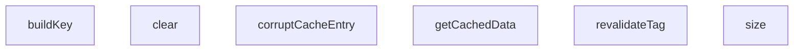

## Genel Bakış

Bu modül, çok kiracılı (multi-tenant) bir önbellek motorunun davranışlarını test eder. Sistem, kiracı kimliği ve dil bilgisine göre ayrılmış önbellek alanları yönetir; etiket tabanlı geçersiz kılma ve isteğe bağlı önbellek atlama gibi esneklikler sunar.

## Fonksiyon Grupları

### Önbellek Erişimi
Önbellekten veri okuma ve yazma işlemlerini yürütür. Veri önbellekte yoksa sağlanan fonksiyonla çekilip önbelleğe kaydedilir; `bypassCache` seçeneğiyle önbellek atlanabilir.
- getCachedData

### Anahtar Oluşturma
Önbellek anahtarını, verilen anahtar adı, dil ve kiracı kimliğinden üretir. Bu, her kiracı ve dil kombinasyonu için benzersiz bir önbellek alanı ayrılmasını sağlar.
- buildKey

### Temizlik ve Geçersiz Kılma
Önbellekteki girdileri toplu veya hedefli biçimde geçersiz kılar. `clear` tüm önbelleği sıfırlar; `revalidateTag` belirli bir etikete sahip girdileri; `corruptCacheEntry` tek bir girdiyi bozarak test senaryoları için kullanılır.
- clear, revalidateTag, corruptCacheEntry

### Durum Sorgulama
Önbellekteki toplam öğe sayısını döndürerek mevcut durumu sorgulamaya olanak tanır.
- size

---

## AXIOMS – Mimari Varsayımlar

[Aksiyom 1]: Eğer `tenantId` parametresi `null` olarak geçilirse, tenant bağımsız bir cache anahtarı üretilir. `buildKey` fonksiyonu `tenantId: string | null` kabul ettiğinden, null durumunda key üretiminde tenant ayrımı yapılmaz.

[Aksiyom 2]: Eğer `fetchFn` parametresi verilmezse, `getCachedData` fonksiyonu çağrılamaz. Fonksiyon imzasında `fetchFn` zorunlu parametre olarak tanımlıdır; cache miss durumunda bu fonksiyon çağrılır.

[Aksiyom 3]: Eğer `options.bypassCache` true ise, mevcut cache değeri atlanır ve `fetchFn` doğrudan çağrılır. Bu parametre opsiyoneldir; verilmezse varsayılan davranış bilinmiyor.

[Aksiyom 4]: Eğer `options.tags` dizisi verilirse, cache girişi bu tag'lerle ilişkilendirilir. Daha sonra `revalidateTag` ile aynı tag'e sahip tüm cache girişleri geçersiz kılınabilir.

[Aksiyom 5]: Eğer `revalidateTag` fonksiyonuna `tenantId` null olarak geçilirse, davranış bilinmiyor. Fonksiyon imzasında `tenantId` zorunlu `string` olarak tanımlıdır; `null` kabul etmez.

[Aksiyom 6]: Eğer `corruptCacheEntry` çağrılırsa, belirtilen key/lang/tenantId kombinasyonuna karşılık gelen cache girişi bozulur. Bu fonksiyon muhtemelen test amaçlıdır; normal akışta çağrılmaması beklenir.

[Aksiyom 7]: Eğer `clear()` çağrılırsa, tüm tenant'lara ait cache verileri temizlenir. Fonksiyon parametre almaz; tenant bazlı temizleme yapılmaz.

[Aksiyom 8]: Eğer aynı `key`, `lang` ve `tenantId` kombinasyonu ile birden fazla `getCachedData` çağrısı yapılırsa, ilk çağrı `fetchFn` çalıştırır ve sonucu cache'ler; sonraki çağrılar cache'den döner. Bu varsayım fonksiyon gövdesi görünmediğinden doğrulanamaz.

---

## FONKSİYON DETAYLARI

### clear
**Ne yapar**: MultiTenantCacheEngine sınıfının tüm önbellek deposunu temizler. Depodaki tüm anahtar-değer çiftlerini kaldırır.
**Nasıl yapar**: Sınıfın `store` özelliğinin yerleşik `clear()` metodunu çağırarak depodaki tüm kayıtları siler.
**Parametreler**: Bu fonksiyon parametre almaz.
**Dönüş**: Belirtilmemiş.

### size
**Ne yapar**: Geliştirildi ancak detay üretilemedi.

### buildKey
**Ne yapar**: Geliştirildi ancak detay üretilemedi.

### getCachedData
**Ne yapar**: Geliştirildi ancak detay üretilemedi.

### revalidateTag
**Ne yapar**: Geliştirildi ancak detay üretilemedi.

### corruptCacheEntry
**Ne yapar**: Geliştirildi ancak detay üretilemedi.

---

## İTHALATLAR (IMPORTS)
- import: vitest::beforeEach
- import: vitest::describe
- import: vitest::expect
- import: vitest::it

---

## INTERFACES

### CacheEntry
- `tags: string[]`
- `value: any`
- `createdAt: number`

---

## AST POINTERS

### [N1_NASIL] AST Pointer: tests/e2e/cache.test.ts::MultiTenantCacheEngine.clear
- **params**: (parametre yok)
- **ic_degiskenler**: (degisken yok)
- **Dönüş**: yok — `this.store` Map nesnesinin tüm icerigini temizler

### [N2_NASIL] AST Pointer: tests/e2e/cache.test.ts::MultiTenantCacheEngine.size
- **params**: (parametre yok — getter)
- **ic_degiskenler**: (degisken yok)
- **Dönüş**: `this.store.size` — Map icindeki toplucak girdi sayisini dondurur (number)

### [N3_NASIL] AST Pointer: tests/e2e/cache.test.ts::MultiTenantCacheEngine.buildKey
- **params**: `key: string`, `lang: string`, `tenantId: string | null`
- **ic_degiskenler**: (degisken yok)
- **Dönüş**: string — `tenantId` null ise `Error` fırlatir ("Cache lookup attempted without active tenant context"), degilse `JSON.stringify([key, lang, tenantId])` ile birlestirilmis cache anahtari dondurur

### [N4_NASIL] AST Pointer: tests/e2e/cache.test.ts::MultiTenantCacheEngine.getCachedData
- **params**: `key: string`, `lang: string`, `tenantId: string | null`, `fetchFn: () => Promise<any> | any`, `options: { tags?: string[]; bypassCache?: boolean }`
- **ic_degiskenler**:
  - `options.bypassCache` — eger true ise cache atlanir, dogrudan `fetchFn()` sonucu dondurulur
  - `cacheKey` — `this.buildKey(key, lang, tenantId)` cagrisiyla olusturulan JSON anahtari
  - `existing` — `this.store.get(cacheKey)` ile Map'ten alinan mevcut CacheEntry
  - `existing.value` — mevcut girdinin deger alani
  - `decoded` — `JSON.parse(JSON.stringify(existing.value))` ile yapilan bozulma kontrolu; basariliysa bu deger dondurulur
  - `freshValue` — `await fetchFn()` ile cekilen taze veri
  - `options.tags` — opsiyonel etiket dizisi; yoksa bos dizi kullanilir
  - `boundTags` — `options.tags` dizisinin her elemanina `:${tenantId}` eklenerek olusturulan izolasyon etiketleri
  - `t` — `boundTags` map islemindeki her bir etiket elemani
- **Dönüş**: `Promise<any>` — cache varsa ve bozulmamissa `decoded`, cache bozuksa `freshValue`, cache yoksa `freshValue` dondurulur. Yeni girdi `this.store.set(cacheKey, { tags: boundTags, value: freshValue, createdAt: Date.now() })` ile kaydedilir

### [N5_NASIL] AST Pointer: tests/e2e/cache.test.ts::MultiTenantCacheEngine.revalidateTag
- **params**: `tag: string`, `tenantId: string`
- **ic_degiskenler**:
  - `targetTag` — `${tag}:${tenantId}` ile olusturulan hedef etiket stringi
  - `keysToDelete` — silinecek anahtarlarin toplandigi bos string dizisi
  - `k` — `this.store.entries()` dongusundeki her bir Map girisinin anahtari
  - `entry` — `this.store.entries()` dongusundeki her bir CacheEntry degeri
  - `entry.tags` — girdinin etiket dizisi; `targetTag` icerip icermedigi kontrol edilir
- **Dönüş**: yok — `targetTag` iceren tum girdiler `this.store.delete(k)` ile Map'ten silinir

### [N6_NASIL] AST Pointer: tests/e2e/cache.test.ts::MultiTenantCacheEngine.corruptCacheEntry
- **params**: `key: string`, `lang: string`, `tenantId: string`
- **ic_degiskenler**:
  - `cacheKey` — `this.buildKey(key, lang, tenantId)` ile olusturulan JSON anahtari
  - `entry` — `this.store.get(cacheKey)` ile Map'ten alinan CacheEntry; yoksa islem yapilmaz
  - `circular` — `circular.self = circular` ile olusturulan dongussel referans nesnesi; `entry.value` alanina atanir
- **Dönüş**: yok — mevcut girdinin degeri seri hale getirilemez dongussel nesneyle degistirilir

---

## MERMAID CALL GRAPH

## NODE ID STANDARD

  file: cache.test.ts
  class: cache.test.ts::MultiTenantCacheEngine

---

## DISA AKTARILANLAR (EXPORTS)
  export: MultiTenantCacheEngine