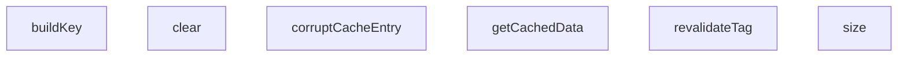

## Genel Bakış
Bu modül, MultiTenantCacheEngine sınıfının uçtan uca testlerini içerir. Testler, çoklu kiracılı önbellek sisteminin anahtar oluşturma, veri getirme, etiket bazlı doğrulama ve temel yönetim işlevlerini doğrular. Ayrıca önbellek bozulma senaryolarını simüle ederek sistemin dayanıklılığını ve hata tolere etme yeteneğini doğrulama amacını taşır.

## Fonksiyon Grupları
### Önbellek Yönetim İşlemleri
Önbelleğin temel durumunu yöneten ve sorgulayan fonksiyonlar.
- clear, size

### Anahtar Oluşturma
Çoklu kiracılı ve dil destekli ortamda benzersiz önbellek anahtarı üretimi.
- buildKey

### Veri Getirme ve Yenileme
Önbellekten veri alma, gerekirse kaynaktan çekme ve etiket bazlı toplu yenileme mantığı.
- getCachedData, revalidateTag

### Test Senaryoları Yardımcıları
Önbellek bozulma gibi特殊 durumları test etmek ve hata senaryolarını tetiklemek için yardımcı fonksiyonlar.
- corruptCacheEntry

---

## AXIOMS – Mimari Varsayımlar

Bu modül, çok kiracılı (multi-tenant) bir önbellekleme motoru olarak tasarlanmıştır. Aşağıdaki mimari varsayımlar fonksiyon imzalarından çıkarılmıştır:

[Aksiyom 1]: Eğer `tenantId` parametresi `null` olarak geçilirse, o verinin kiracıdan bağımsız (global/paylaşımlı) bir veri olduğu varsayılır ve önbellek anahtarı buna göre oluşturulur.

[Aksiyom 2]: Eğer `revalidateTag` çağrısında `tenantId` `null` olarak geçilirse, tag bazlı yeniden doğrulama başarısız olur; çünkü bu fonksiyonun imzası `tenantId: string` (nullable değil) gerektirir.

[Aksiyom 3]: Eğer `getCachedData` çağrısında `bypassCache: true` olarak ayarlanırsa, mevcut önbellek girdisi atlanarak `fetchFn` her durumda çağrılır.

[Aksiyom 4]: Eğer `getCachedData` çağrısında `fetchFn` çağrıldığında hata fırlatırsa, önbelleğe yazma işlemi gerçekleşmez ve hata yukarıya yürümelidir.

[Aksiyom 5]: Eğer `buildKey` ile oluşturulan anahtar, farklı `lang` veya `tenantId` değerleri ile aynı `key` kullanılsa bile farklı sonuçlar üretmelidir; aksi halde farklı diller veya kiracılar veri sızıntısına uğrar.

[Aksiyom 6]: Eğer `revalidateTag` başarılı olursa, ilgili `tag`'e sahip ve aynı `tenantId`'ye ait tüm önbellek girdileri geçersiz kılınır.

[Aksiyom 7]: Eğer `corruptCacheEntry` çağrılırsa, belirtilen `key`, `lang` ve `tenantId` kombinasyonuna ait önbellek genti kasıtlı olarak bozulur; bu durum测试/senaryo amaçlıdır.

[Aksiyom 8]: Eğer `getCachedData` çağrısında `options.tags` dizisi verilmişse, yazılan önbellek girdisi o tag'ler ile etiketlenir ve gelecekte `revalidateTag` ile toplu olarak geçersiz kılınabilir.

[Aksiyom 9]: Eğer `fetchFn` senkron bir değer döndürürse (Promise dışı), modül bunu otomatik olarak Promise'e sararak (wrap) tek tip async akış sağlamalıdır.

[Aksiyom 10]: Eğer `clear()` çağrılırsa, tüm kiracıların ve tüm dillerin önbellek verileri tamamen silinir.

---

## FONKSİYON DETAYLARI

### clear
**Ne yapar**: Multi-tenant cache motorundaki tüm verileri temizler. Tüm kiracılara ait önbellek girişlerini tek bir işlemle silerek belleği tamamen boşaltır.

**Nasıl yapar**: İç store nesnesinin (Map yapısı) yerleşik `clear()` metodunu çağırarak tüm anahtar-değer çiftlerini, etiket bilgilerini ve metadata'yı aynı anda kaldırır. Bu işlem geri alınamaz bir temizleme sağlar.

**Parametreler**: Bu fonksiyon herhangi bir parametre almaz.

**Dönüş**: void — Fonksiyon herhangi bir değer döndürmez, sadece cache store'u sıfırlar.

### size
**Ne yapar**: Geliştirildi ancak detay üretilemedi.

### buildKey
**Ne yapar**: Geliştirildi ancak detay üretilemedi.

### getCachedData
**Ne yapar**: Geliştirildi ancak detay üretilemedi.

### revalidateTag
**Ne yapar**: Geliştirildi ancak detay üretilemedi.

### corruptCacheEntry
**Ne yapar**: Geliştirildi ancak detay üretilemedi.

---

## INTERFACES

### CacheEntry
- `tags: string[]`
- `value: any`
- `createdAt: number`

---

## AST POINTERS

### [N1_NASIL] AST Pointer: `tests/e2e/cache.test.ts`::MultiTenantCacheEngine.clear
- **params**: yok
- **ic_degiskenler**:
  - `this.store` — Map yapısını temsil eden instance field, `clear()` çağrısıyla tüm cache girişlerini siler
- **Dönüş**: yok (yan etki: store'u tamamen boşaltır)

---

### [N2_NASIL] AST Pointer: `tests/e2e/cache.test.ts`::MultiTenantCacheEngine.get size
- **params**: yok (getter)
- **ic_degiskenler**: yok
- **Dönüş**: `this.store.size` — store'daki toplam cache giriş sayısını döndürür

---

### [N3_NASIL] AST Pointer: `tests/e2e/cache.test.ts`::MultiTenantCacheEngine.buildKey
- **params**: `key: string` — cache anahtarı, `lang: string` — dil kodu, `tenantId: string | null` — kiracı tanımlayıcısı
- **ic_degiskenler**:
  - `tenantId` — null kontrolü yapılır; null ise Error fırlatılır
- **Dönüş**: `string` — `JSON.stringify([key, lang, tenantId])` ile oluşturulan birleşik cache anahtarı

---

### [N4_NASIL] AST Pointer: `tests/e2e/cache.test.ts`::MultiTenantCacheEngine.getCachedData
- **params**: `key: string` — cache anahtarı, `lang: string` — dil kodu, `tenantId: string | null` — kiracı tanımlayıcısı, `fetchFn: () => Promise<any> | any` — veri getirme fonksiyonu, `options: { tags?: string[]; bypassCache?: boolean }` — opsiyonel ayarlar (varsayılan `{}`)
- **ic_degiskenler**:
  - `cacheKey` — `this.buildKey(key, lang, tenantId)` çağrısıyla oluşan birleşik string anahtar; store'daki Map key'i olarak kullanılır
  - `existing` — `this.store.get(cacheKey)` ile store'dan çekilen mevcut CacheEntry nesnesi; varsa cache hit, yoksa cache miss dalına girilir
  - `decoded` — `JSON.parse(JSON.stringify(existing.value))` ile elde edilen high-fidelity kopya; bozuk (circular) değerse parse hata fırlatır
  - `freshValue` — `await fetchFn()` çağrısıyla taze olarak çekilen veri; hem cache miss hem de bozuk giriş durumunda üretilir
  - `boundTags` — `(options.tags || []).map(t => \`${t}:${tenantId}\`)` ile her tag'e tenantId eklenmiş izole tag dizisi; cache entry'nin `tags` alanına yazılır
- **Dönüş**: `Promise<any>` — cached veya taze veri; bypassCache=true ise doğrudan fetchFn sonucu döner

---

### [N5_NASIL] AST Pointer: `tests/e2e/cache.test.ts`::MultiTenantCacheEngine.revalidateTag
- **params**: `tag: string` — yeniden doğrulanacak etiket, `tenantId: string` — kiracı tanımlayıcısı
- **ic_degiskenler**:
  - `targetTag` — `` `${tag}:${tenantId}` `` ile oluşturulmuş izole tag; sadece belirli kiracının tag'ini eşleştirir
  - `keysToDelete` — `string[]` tipinde dizi; store entry'leri arasında `targetTag` içerenlerin key'leri toplanır, döngü sonunda topluca silinir
- **Dönüş**: yok (yan etki: eşleşen cache entry'leri store'dan silinir)

---

### [N6_NASIL] AST Pointer: `tests/e2e/cache.test.ts`::MultiTenantCacheEngine.corruptCacheEntry
- **params**: `key: string` — cache anahtarı, `lang: string` — dil kodu, `tenantId: string` — kiracı tanımlayıcısı
- **ic_degiskenler**:
  - `cacheKey` — `this.buildKey(key, lang, tenantId)` çağrısıyla oluşan birleşik string anahtar
  - `entry` — `this.store.get(cacheKey)` ile store'dan çekilen CacheEntry nesnesi; varsa bozulma işlemi uygulanır
  - `circular` — `any` tipinde nesne; `circular.self = circular` atamasıyla kasıtlı döngüsel referans oluşturulur; entry'nin `value` alanına atanarak bozuk veri simüle edilir
- **Dönüş**: yok (yan etki: ilgili cache entry'nin value alanı bozulmuş circular referans ile değiştirilir)

---

## MERMAID CALL GRAPH

## NODE ID STANDARD

  file: tests\e2e\cache.test.ts
  class: tests\e2e\cache.test.ts::MultiTenantCacheEngine

---

## DISA AKTARILANLAR (EXPORTS)
  export: MultiTenantCacheEngine