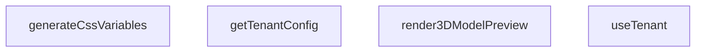

## Genel Bakış
Bu modül, VentHub uygulamasının uçtan uca testleri için temel test yardımcı fonksiyonlarını sağlar. Kiracı (tenant) yapılandırmasını yönetir, stil değişkenlerini üretir ve 3B model önizlemesinin render edilmesini koordine ederek test senaryolarının doğru çalışmasını destekler.

## Fonksiyon Grupları
### Yapılandırma Yönetimi
Kiracıya özel yapılandırma verilerini getirir ve mevcut yapılandırma bilgisine erişim sağlar. Bu grubun fonksiyonları testlerin doğru kiracı bağlamında çalışmasını garanti altına alır.
- getTenantConfig, useTenant

### Stil ve Önizleme Hazırlığı
Elde edilen yapılandırma verisini UI bileşenleri için kullanılabilir formata dönüştürür ve 3B model önizlemesinin render edilmesi için gerekli hazırlıkları yapar. Bu, test ortamının görsel çıktısını doğru şekilde oluşturmayı amaçlar.
- generateCssVariables, render3DModelPreview

---

## AXIOMS – Mimari Varsayımlar

Bu modül çoklu kiracı (multi-tenant) yapılandırma yönetimi, CSS değişken üretimi ve 3B model önizleme renderlama işlevlerini içerir.

---

**[Aksiyom 1]: TenantContext Sağlanması**
Eğer `useTenant()` çağrılacaksa, üst bileşen ağacında `TenantContext.Provider` ile sarılmış olmalıdır. Aksi halde, hook contexto erişemez ve çalışmayı durdurur (React context error).

**[Aksiyom 2]: tenantId Null Değer Yönetimi**
Eğer `getTenantConfig` fonksiyonuna `null` değerinde `tenantId` verilirse, `DEFAULT_CONFIG` sabiti döndürülür. Bu, kiracı tanımlanmamış durumlar için varsayılan yapılandırma garantisi sağlar.

**[Aksiyom 3]: tenantConfigsTable Yapısı**
Eğer `tenantConfigsTable` üzerinden sorgulama yapılacaksa, tablonun kiracı ID'sini anahtar olarak kullanacak şekilde yapılandırılmış olması gerekir. Aksi halde, geçersiz kiracı yapılandırması döner.

**[Aksiyom 4]: TenantConfig Geçerliliği (CSS Üretimi)**
Eğer `generateCssVariables(config)` fonksiyonu çağrılacaksa, `config` parametresinin geçerli bir `TenantConfig` nesnesi olması gerekir. Eksik veya geçersiz config verilirse, eksik CSS değişkenleri üretilir.

**[Aksiyom 5]: 3B Model Önizleme Gereksinimleri**
Eğer `render3DModelPreview(config, hasOrbitControlEnabled)` fonksiyonu çağrılacaksa:
- `config` geçerli bir `TenantConfig` olmalıdır
- `hasOrbitControlEnabled` boolean tipinde olmalıdır
Aksi halde, model düzgün renderlanamaz.

**[Aksiyom 6]: Varsayılan Yapılandırma Tutarlılığı**
Eğer kiracıya özel yapılandırma bulunamazsa, `DEFAULT_CONFIG` objesinin tüm zorunlu alanları (theme renkleri, logo, HVAC parametreleri vb.) tanımlı olmalıdır. Aksi halde, UI bileşenleri eksik veri hataları üretir.

---

### Notlar
- Bu aksiyomlar yalnızca fonksiyon imzaları ve sabit tanımlarından çıkarılmıştır
- `DEFAULT_CONFIG` içeriği source kodda mevcut değildir; iç yapısı bilinmemektedir
- `TenantConfig` tip tanımı modül içinde yer almamaktadır; field'ları bilinmemektedir

---

## FONKSİYON DETAYLARI

### getTenantConfig

**Ne yapar**: Belirli bir kiracının (tenant) yapılandırma bilgisini getirir. tenantId null veya geçersiz olduğunda varsayılan yapılandırmayı döndürür. Bu fonksiyon, kiracıya özel tema, özellik ve stil ayarlarının merkezi erişim noktasıdır.

**Nasıl yapar**: Fonksiyon, önce tenantId'nin varlığını kontrol eder. Eğer null ise doğrudan DEFAULT_CONFIG döner. tenantId mevcutsa, bellek içi bir Map yapısından (tenantConfigsTable) ham JSON verisini çeker. Bulunan JSON'ı güvenli şekilde ayrıştırarak, mevcut alanları DEFAULT_CONFIG ile birleştirir (spread operatörü ile). Ayrıştırma sırasında herhangi bir hata oluşursa bozuk yapılandırma uyarısı loglayıp güvenli varsayılan değere geri döner.

**Parametreler**:
- `tenantId`: `string | null` — Kiracının benzersiz tanımlayıcısı. Null geçilmesi durumunda varsayılan yapılandırma döndürülür.

**Dönüş**: `Promise<TenantConfig>` — Asenkron bir şekilde kiracının yapılandırma nesnesi döndürülür. Nesne içinde id, name, features ve styles alanları bulunur.

### useTenant
**Ne yapar**: Geliştirildi ancak detay üretilemedi.

### generateCssVariables
**Ne yapar**: Geliştirildi ancak detay üretilemedi.

### render3DModelPreview
**Ne yapar**: Geliştirildi ancak detay üretilemedi.

---

## INTERFACES

### TenantConfig
- `id: string`
- `name: string`
- `features: {
`
- `styles: {
`

---

## SABİTLER
- **DEFAULT_CONFIG** (object) — `{

  id: 'default',

  name: 'Venthub HVAC Baseline',

  features: {

    ena...`
- **tenantConfigsTable** (new_expression) — `new Map<string, string>()`
- **TenantContext** (call) — `React.createContext<TenantConfig | undefined>(undefined)`

---

## AST POINTERS

### [N1_NASIL] AST Pointer: tests/e2e/features.test.ts::getTenantConfig
- **params**: (tenantId: string | null)
- **ic_degiskenler**: 
  - `rawJson` — retrieves the raw JSON string from tenantConfigsTable for the given tenantId.
  - `parsed` — the parsed JavaScript object from rawJson using JSON.parse.
  - `err` — error caught during JSON parsing, used to log a warning and fallback to default config.
- **Dönüş**: Promise<TenantConfig> returns either DEFAULT_CONFIG or a merged configuration object.

### [N2_NASIL] AST Pointer: tests/e2e/features.test.ts::useTenant
- **params**: (yok)
- **ic_degiskenler**: 
  - `context` — the value obtained from React.useContext(TenantContext).
  - `err` — error caught during context access, used to throw descriptive errors.
- **Dönüş**: TenantConfig returns the context value.

### [N3_NASIL] AST Pointer: tests/e2e/features.test.ts::generateCssVariables
- **params**: (config: TenantConfig)
- **ic_degiskenler**: 
  - `sanitizeColor` — nested function that sanitizes a color string to block CSS injection vectors, returns sanitized color or fallback.
- **Dönüş**: Record<string, string> returns an object mapping CSS variable names to sanitized values.

### [N4_NASIL] AST Pointer: tests/e2e/features.test.ts::render3DModelPreview
- **params**: (config: TenantConfig, hasOrbitControlEnabled: boolean)
- **ic_degiskenler**: (yok)
- **Dönüş**: string returns a description string based on feature flag and orbit control.

---

## MERMAID CALL GRAPH

## NODE ID STANDARD

  file: tests\e2e\features.test.ts
  function: tests\e2e\features.test.ts::getTenantConfig
  function: tests\e2e\features.test.ts::useTenant
  function: tests\e2e\features.test.ts::generateCssVariables
  function: tests\e2e\features.test.ts::render3DModelPreview

---

## DISA AKTARILANLAR (EXPORTS)
  export: generateCssVariables
  export: getTenantConfig
  export: render3DModelPreview
  export: useTenant