## Genel Bakış
Bu modül, e2e testlerinde gerçek bir veritabanı bağlantısı olmadan veritabanı işlemlerini simüle etmek için bir mock veritabanı motoru ve sorgu oluşturucu sağlar. Modül, bellek içi tablo verileri tutarak ve sorguları uygulayarak test senaryolarında izole ve tekrarlanabilir veri erişimi sağlar.

## Fonksiyon Grupları
### Sorgu Oluşturma
Test senaryolarında veritabanı sorgularını tanımlamak için zincirleme bir arayüz sağlar.
- `constructor`, `select`, `insert`, `update`, `delete`, `eq`, `single`, `maybeSingle`

### Veri Yönetimi
Bellek içi tablo verilerinin ayarlanması, alınması ve temizlenmesini yöneterek test başlangıç ve bitiş durumlarını kontrol eder.
- `setTableData`, `getTableData`, `clearTable`

### Sorgu Çalıştırma
Oluşturulan sorgu yapısını alır, belirli tablo verileri üzerinde CRUD işlemlerini uygular ve filtreleme yaparak sonuçları döndürür.
- `createClient`, `executeQuery`, `then`

### Güvenlik Bağlamı
Testler için sahte kullanıcı ve güvenlik bağlamlarını yöneterek farklı roller ve izinler simüle eder.
- `setSecurityContext`, `getSecurityContext`

---

## AXIOMS – Mimari Varsayımlar
MockQueryBuilder ve MockDatabaseEngine sınıfları, test ortamında veritabanı işlemlerini simüle etmek için birlikte çalışmalıdır.

[Aksiyom 1]: Eğer MockQueryBuilder.instance'ı oluşturulurken geçerli bir MockDatabaseEngine instance'ı (`db` parametresi) verilmemişse, sorgu çalıştırma (then ile tetikleme) aşamasında hata oluşur veya beklenen veri dönmez.

[Aksiyom 2]: Eğer MockQueryBuilder.then() metodu çağrılmazsa (yani query bir promise gibi resolve/reject edilmezse), ilgili select/insert/update/delete işlemi hiç gerçekleşmez ve mock veritabanında değişiklik yapılmaz veya veri dönmez.

[Aksiyom 3]: Eğer MockDatabaseEngine-tabanlı bir sorguda `tableName` olarak veritabanında bulunmayan bir tablo adı kullanılıyorsa, executeQuery() metodu çalıştığında hata oluşur veya boş sonuç döner (tablonun varlığı şarttır).

[Aksiyom 4]: Eğer MockQueryBuilder.select() ile sorgu yapılırken `columns` parametresi belirtilmemişse, tüm sütunların (`*`) seçildiği varsayılır.

[Aksiyom 5]: Eğer MockQueryBuilder.insert() ile birden fazla kayıt eklenmek isteniyorsa, `payload` parametresinin bir array (nesne listesi) olması zorunludur; aksi halde tek kayıt ekleme davranışı sergiler.

[Aksiyom 6]: Eğer MockQueryBuilder.eq() ile filtre eklenmemişse, select/update/delete işlemleri tablodaki TÜM satırları etkiler (toplu işlem).

[Aksiyom 7]: Eğer MockQueryBuilder.single() veya maybeSingle() çağrılmışsa, executeQuery'de `isSingle` veya `isMaybeSingle` flagları true olmalıdır; aksi halde sonuç tek kayıt olarak işlenmez.

[Aksiyom 8]: Eğer MockDatabaseEngine.setSecurityContext() ile bir güvenlik bağlamı ayarlanmamışsa, executeQuery() içindeki sorgu filtreleme (RLS simülasyonu) güvenlik bağlamına bağlı filtreleri uygulamaz.

[Aksiyom 9]: Eğer MockDatabaseEngine.clearTable() ile bir tablo temizlenirse, o tablodaki tüm veriler silinir ve sonraki insert işlemlerine hazır hale gelir; tablo yapısı (shema) korunur.

[Aksiyom 10]: Eğer MockDatabaseEngine.executeQuery() metoduna iletilen `query` nesnesinde `queryType` alan değeri 'select', 'insert', 'update' veya 'delete' dışındaysa, metot geçersiz sorgu hatası üretir.

---

## FONKSİYON DETAYLARI

### constructor
**Ne yapar**: MockQueryBuilder sınıfının kurucu metodudur ve yeni bir sorgu oluşturucusu (builder) örneği başlatır. Bu, tüm sorgu zincirleme (chain)��作larının temelini oluşturur.
**Nasıl yapar**: Verilen tablo adını ve veritabanı motoru referansını sınıf instance'ının ilgili alanlarına atayarak nesneyi başlatır. Bu sayede oluşturulan sorgu, hangi tablo üzerinde işlem yapılacağını ve veritabanı bağlantısını bilir.
**Parametreler**:
- tableName: string — Sorgunun hedef aldığı tablonun adı.
- db: MockDatabaseEngine — Sorgunun sonunda Execute edileceği mock veritabanı motoru nesnesi.
**Dönüş**: void (Kurucu metodun dönüş tipi yoktur, sadece instance başlatır).

### select
**Ne yapar**: Sorgu türünü "select" olarak ayarlar ve bir seçim (projection) işlemi başlatır. Bu çağrı genellikle zincirlemenin ilk halkasıdır.
**Nasıl yapar**: Sınıfın `queryType` alanını 'select' değerine set eder ve instance'ı geri döndürerek diğer metodların zincirleme olarak çağrılmasına olanak tanır. Kolon parametresi opsiyoneldir ve specimende kullanılmamaktadır.
**Parametreler**:
- columns?: string — Seçilecek kolonları belirtir (şu an için kullanılmıyor, opsiyonel).
**Dönüş**: this (Mevcut MockQueryBuilder instance'ını geri döndürerek zincirlemeye imkan tanır).

### insert
**Ne yapar**: Sorgu türünü "insert" olarak ayarlar ve bir ekleme işlemi için veri yükünü (payload) depolar.
**Nasıl yapar**: `queryType` alanını 'insert' olarak değiştirir, verilen payload'ı (tekil veya dizi olabilir) `payload` alanına kaydeder ve instance'ı döndürür. Bu, daha sonra `then` metodunda bu verinin tabloya ekleneceğini belirtir.
**Parametreler**:
- payload: any | any[] — Eklenecek tek bir nesne veya nesne dizisi. MockDB tarafında dizi olarak işlenir.
**Dönüş**: this (Zincirlemeye devam etmek için mevcut instance).

### update
**Ne yapar**: Sorgu türünü "update" olarak ayarlar ve güncellenecek veri yükünü saklar.
**Nasıl yapar**: `queryType` alanını 'update' değerine atar, güncelleme verilerini (partial bir nesne) `payload` alanına kaydeder ve instance'ı döndürür. Güncelleme, daha sonraki `then` adımında filtrelerle birlikte uygulanacaktır.
**Parametreler**:
- payload: Partial<any> — Güncellenecek alanları içeren kısmi bir nesne. Tüm alanları sağlamaya gerek yoktur.
**Dönüş**: this (Zincirleme işlem için aynı instance).

### delete
**Ne yapar**: Sorgu türünü "delete" olarak ayarlayarak silme işlemi başlatır.
**Nasıl yapar**: `queryType` alanını 'delete' değerine set eder ve instance'ı döndürür. Silme işlemi, zincirleme eklenen filtreler (`eq` vb.) ile belirlenen satırlara uygulanacaktır.
**Parametreler**: Parametre almaz.
**Dönüş**: this (Zincirlemeye devam etmek için instance).

### eq
**Ne yapar**: Sorguya bir eşitlik filtresi ekler. Bu,_where_ koşulu oluşturmak için kullanılır.
**Nasıl yapar**: Verilen sütun adı ve değeriyle bir filtre fonksiyonu oluşturur ve bu fonksiyonu sınıfın `filters` dizisine push eder. Bu filtreler, sorgu çalıştırıldığında (`then` adımında) tablodaki her satır için kontrol edilir. Sadece `row[column] === value` koşulunu sağlayan satırlar dahil edilir.
**Parametreler**:
- column: string — Filtre uygulanacak sütunun adı.
- value: any — Sütunda aranan değer.
**Dönüş**: this (Ek filtre ile birlikte zincirlemeye devam).

### single
**Ne yapar**: Sorgunun sonucunun tek bir satır olmasını ve hata vermemesini sağlar. Beklenmeyen çoklu sonuç durumunda hata fırlatılmasını belirler.
**Nasıl yapar**: `isSingle` bayrağını true olarak ayarlar. Bu, `then` metodunda sonuç kümesinin yalnızca bir eleman olup olmadığını doğrular; birden fazla satır gelirse bir hata nesnesi ile sonuç döner.
**Parametreler**: Parametre almaz.
**Dönüş**: this (Tekil sonuç modunda instance).

### maybeSingle
**Ne yapar**: Sorgunun sonucunun sıfır veya bir satır olabileceğini belirtir. Sonuç bulunamazsa `data` alanının `null` olmasını, tek satır bulunursa o satırı döndürür. Birden fazla satır bulunursa hata verir.
**Nasıl yapar**: `isMaybeSingle` bayrağını true yapar. `then` metodu bu bayrağı kontrol ederek sonuç kümesinin uzunluğuna göre davranışı belirler (0 -> null data, 1 -> veri, >1 -> hata).
**Parametreler**: Parametre almaz.
**Dönüş**: this (Opsiyonel tekil sonuç modunda instance).

### then
**Ne yapar**: Asenkron sorgu ejecitonunu ve sonuç şeklini (PromiseLike) başlatır. Bu metod çağrıldığında, biriken tüm bilgiler (tablo, sorgu tipi, filtreler, payload) kullanılarak mock veritabanı üzerinde işlem gerçekleştirilir ve standart bir `{ data, error }` yapısı döndürülür.
**Nasıl yapar**: Sınıf bir PromiseLike olduğu için `then` metodu çağrıldığında sorgu çalıştırılır. İçeride, MockDatabaseEngine üzerindeki ilgili tabloya erişir, `filters` dizisindeki fonksiyonları kullanarak satırları filtreler, sorgu tipine (`select`, `insert`, `update`, `delete`) göre ilgili işlemi yapar ve sonucu `{ data: ..., error: null }` veya `{ data: null, error: {...} }` formatında bir Promise ile resolve/reject eder. Bu yapı, Supabase client'ın kullanım alışkanlıklarını taklit eder.
**Parametreler**:
- onfulfilled?: ((value: { data: any; error: any }) => TResult1 | PromiseLike<TResult1>) | undefined | null — Promise başarılı olduğunda çalışacak callback.
- onrejected?: ((reason: any) => TResult2 | PromiseLike<TResult2>) | undefined | null — Promise reddedildiğinde çalışacak callback.
**Dönüş**: Promise<any> — İşlem sonucunu içeren, `{ data, error }` yapısına sahip bir Promise.

### setTableData
**Ne yapar**: MockDatabaseEngine içinde belirli bir tablonun tüm verisini ayarlar veya tamamen değiştirir. Test senaryolarının başlangıç durumunu oluşturmak için kullanılır.
**Nasıl yapar**: Verilen tablo adı ve veri dizisi ile `tables` haritasını (Map) günceller. Veri dizisi, referans sorunlarını önlemek ve testler arasında izolasyon sağlamak amacıyla derin bir kopyası (`JSON.parse(JSON.stringify(...))`) alınarak saklanır.
**Parametreler**:
- tableName: string — Verisi ayarlanacak tablonun adı.
- data: any[] — Tabloya yerleştirilecek satırların dizisi.
**Dönüş**: void (Doğrudan internal state'i değiştirir, bir şey döndürmez).

### getTableData

**Ne yapar**: Belirtilen tablonun tüm verilerini döndürür. Mock veritabanındaki bir tablonun tüm satırlarını (kayıtlarını) getirerek test ortamında erişilebilir hale getirir.

**Nasıl yapar**: Dahili `this.tables` Map yapısında tablo adına karşılık gelen değeri arar. Tablo mevcutsa tüm satırlar dizisi döner, tablo bulunamazsa boş bir dizi döner. Bu sayede null kontrolü yapılmasına gerek kalmadan güvenli bir şekilde iterasyon yapılabilir.

**Parametreler**:
- `tableName: string` — Verisi getirilecek tablonun adı. Mock veritabanında daha önce eklenmiş olmalıdır.

**Dönüş**: `any[]` — Tablonun tüm satırlarını içeren dizi. Tablo boşsa veya mevcut değilse boş dizi döner.

### clearTable
**Ne yapar**: Geliştirildi ancak detay üretilemedi.

### setSecurityContext
**Ne yapar**: Geliştirildi ancak detay üretilemedi.

### getSecurityContext
**Ne yapar**: Geliştirildi ancak detay üretilemedi.

### createClient
**Ne yapar**: Geliştirildi ancak detay üretilemedi.

### executeQuery
**Ne yapar**: Geliştirildi ancak detay üretilemedi.

---

## INTERFACES

### SecurityContext
- `tenantId: string | null`
- `userRole: string | null`

---

## AST POINTERS

### [N1_NASIL] AST Pointer: mockDb.ts::MockQueryBuilder.constructor
- **params**: `(tableName: string, db: MockDatabaseEngine)`
- **ic_degiskenler**:
  - `this.tableName` — query'nin hedef tablo adını saklar
  - `this.db` — sorguları çalıştıracak MockDatabaseEngine referansını saklar
- **Dönüş**: yok (constructor)

### [N2_NASIL] AST Pointer: mockDb.ts::MockQueryBuilder.select
- **params**: `(columns?: string)`
- **ic_degiskenler**: yok (parametre `columns` fonksiyon gövdesinde kullanılmıyor)
- **Dönüş**: `this` (zincirleme çağrı için)

### [N3_NASIL] AST Pointer: mockDb.ts::MockQueryBuilder.insert
- **params**: `(payload: any | any[])`
- **ic_degiskenler**:
  - `this.queryType` — sorgu türünü `'insert'` olarak ayarlar
  - `this.payload` — eklenecek satır veya satırları saklar
- **Dönüş**: `this` (zincirleme çağrı için)

### [N4_NASIL] AST Pointer: mockDb.ts::MockQueryBuilder.update
- **params**: `(payload: Partial<any>)`
- **ic_degiskenler**:
  - `this.queryType` — sorgu türünü `'update'` olarak ayarlar
  - `this.payload` — güncellenecek alan değerlerini saklar
- **Dönüş**: `this` (zincirleme çağrı için)

### [N5_NASIL] AST Pointer: mockDb.ts::MockQueryBuilder.delete
- **params**: (yok)
- **ic_degiskenler**:
  - `this.queryType` — sorgu türünü `'delete'` olarak ayarlar
- **Dönüş**: `this` (zincirleme çağrı için)

### [N6_NASIL] AST Pointer: mockDb.ts::MockQueryBuilder.eq
- **params**: `(column: string, value: any)`
- **ic_degiskenler**:
  - `this.filters` — filtre fonksiyonları dizisine `row[column] === value` koşulu eklenir
- **Dönüş**: `this` (zincirleme çağrı için)

### [N7_NASIL] AST Pointer: mockDb.ts::MockQueryBuilder.single
- **params**: (yok)
- **ic_degiskenler**:
  - `this.isSingle` — tek satır beklenildiğini işaretler (`true`)
- **Dönüş**: `this` (zincirleme çağrı için)

### [N8_NASIL] AST Pointer: mockDb.ts::MockQueryBuilder.maybeSingle
- **params**: (yok)
- **ic_degiskenler**:
  - `this.isMaybeSingle` — tek satır veya boş sonuç beklenildiğini işaretler (`true`)
- **Dönüş**: `this` (zincirleme çağrı için)

### [N9_NASIL] AST Pointer: mockDb.ts::MockQueryBuilder.then
- **params**: `(onfulfilled?, onrejected?)`
- **ic_degiskenler**:
  - `result` — `this.db.executeQuery()` çağrısının döndüğü `{ data, error }` nesnesi
  - `this.tableName` — executeQuery'ye tablo adı olarak geçirilir
  - `this.queryType` — executeQuery'ye sorgu türü olarak geçirilir
  - `this.payload` — executeQuery'ye payload olarak geçirilir
  - `this.filters` — executeQuery'ye filtre dizisi olarak geçirilir
  - `this.isSingle` — executeQuery'ye tek satır modu olarak geçirilir
  - `this.isMaybeSingle` — executeQuery'ye maybeSingle modu olarak geçirilir
  - `err` — yakalanan hata nesnesi
- **Dönüş**: `Promise<any>` (onfulfilled/onrejected dönüşü veya result)

### [N10_NASIL] AST Pointer: mockDb.ts::MockDatabaseEngine.setTableData
- **params**: `(tableName: string, data: any[])`
- **ic_degiskenler**:
  - `this.tables` — tablo adlarını ve satır dizilerini tutan Map, `tableName` anahtarına deep copy olarak kaydedilir (`JSON.parse(JSON.stringify(data))`)
- **Dönüş**: yok

### [N11_NASIL] AST Pointer: mockDb.ts::MockDatabaseEngine.getTableData
- **params**: `(tableName: string)`
- **ic_degiskenler**:
  - `this.tables` — Map'ten `tableName` anahtarına karşılık gelen satır dizisi alınır; yoksa boş dizi döner
- **Dönüş**: `any[]` (tablodaki satırlar veya boş dizi)

### [N12_NASIL] AST Pointer: mockDb.ts::MockDatabaseEngine.clearTable
- **params**: `(tableName: string)`
- **ic_degiskenler**:
  - `this.tables` — `tableName` anahtarının değerini boş dizi `[]` olarak ayarlar
- **Dönüş**: yok

### [N13_NASIL] AST Pointer: mockDb.ts::MockDatabaseEngine.setSecurityContext
- **params**: `(context: Partial<SecurityContext>)`
- **ic_degiskenler**:
  - `this.securityContext` — mevcut security context ile yeni context'i spread operatörü ile birleştirir
- **Dönüş**: yok

### [N14_NASIL] AST Pointer: mockDb.ts::MockDatabaseEngine.getSecurityContext
- **params**: (yok)
- **ic_degiskenler**:
  - `this.securityContext` — mevcut güvenlik bağlamını (`tenantId`, `userRole` içeren nesne) döner
- **Dönüş**: `SecurityContext`

### [N15_NASIL] AST Pointer: mockDb.ts::MockDatabaseEngine.createClient
- **params**: (yok)
- **ic_degiskenler**: yok
- **Dönüş**: `{ from: (tableName: string) => new MockQueryBuilder(tableName, this) }` nesnesi — Supabase client arayüzünü taklit eder

### [N16_NASIL] AST Pointer: mockDb.ts::MockDatabaseEngine.executeQuery
- **params**: `(query: { tableName, queryType, payload, filters, isSingle, isMaybeSingle })`
- **ic_degiskenler**:
  - `tableName` — query nesnesinden destructured tablo adı
  - `queryType` — query nesnesinden destructured sorgu türü (`'select'` | `'insert'` | `'update'` | `'delete'`)
  - `payload` — query nesnesinden destructured eklenecek/güncellenecek veri
  - `filters` — query nesnesinden destructured filtre fonksiyonları dizisi
  - `isSingle` — query nesnesinden destructured tek satır modu bayrağı
  - `isMaybeSingle` — query nesnesinden destructured belki tek satır modu bayrağı
  - `data` — `this.getTableData(tableName)` ile alınan tablo satırları dizisi
  - `tenantId` — `this.securityContext.tenantId`, mevcut kiracının tenant ID'si
  - `userRole` — `this.securityContext.userRole`, mevcut kullanıcının rolü
  - `hasTenantIdColumn` — tablodaki satırlarda `tenant_id` sütunu olup olmadığını belirten boolean
  - `isTenantAuthorized` — anonim fonksiyon, bir satırın Row Level Security kapsamında yetkilendirilip yetkilendirilmediğini kontrol eder
  - `filtered` — (select) RLS ve programatik filtreler uygulandıktan sonra kalan satırlar
  - `filtered[0]` — (select single/maybeSingle) filtrelenmiş ilk satır
  - `rowsToInsert` — (insert) payload dizi değilse diziye çevrilmiş eklenecek satırlar
  - `inserted` — (insert) başarıyla eklenen satırların tutulduğu dizi
  - `row` — (insert döngüsü) eklenecek tek bir satır
  - `newRow` — (insert) `row`'un shallow copy'si, üzerinde `id`, `tenant_id` düzenlemeleri yapılır
  - `returnData` — (insert) payload dizi ise tüm inserted dizisi, değilse inserted[0]
  - `affectedIndices` — (update) güncellenecek satırların indekslerini tutan dizi
  - `row` — (update döngüsü) kontrol edilen mevcut satır
  - `matches` — (update) satırın tüm filtre koşullarını karşılayıp karşılamadığını belirten boolean
  - `updatedRow` — (update) payload ile birleştirilmiş güncellenmiş satır
  - `updatedRows` — (update) başarıyla güncellenen satırların tutulduğu dizi
  - `updatedRows[0]` — (update single) ilk güncellenen satır
  - `remaining` — (delete) silinmeyen, kalan satırlar
  - `deleted` — (delete) silinen satırlar
  - `isTarget` — (delete) satırın silinme hedefi olup olmadığını belirten boolean, IIFE ile hesaplanır
  - `isTarget` içindeki anonim fonksiyon — satırın yetkilendirme ve filtre koşullarını test eder
- **Dönüş**: `Promise<{ data: any; error: any }>` — sorgu sonucu veriyi ve olası hata nesnesini içerir

---

## MERMAID CALL GRAPH

```mermaid
graph TD
    mockDb_ts__clearTable["clearTable"]
    mockDb_ts__constructor["constructor"]
    mockDb_ts__createClient["createClient"]
    mockDb_ts__delete["delete"]
    mockDb_ts__eq["eq"]
    mockDb_ts__executeQuery["executeQuery"]
    mockDb_ts__getSecurityContext["getSecurityContext"]
    mockDb_ts__getTableData["getTableData"]
    mockDb_ts__insert["insert"]
    mockDb_ts__maybeSingle["maybeSingle"]
    mockDb_ts__select["select"]
    mockDb_ts__setSecurityContext["setSecurityContext"]
    mockDb_ts__setTableData["setTableData"]
    mockDb_ts__single["single"]
    mockDb_ts__then["then"]
    mockDb_ts__update["update"]
```

## NODE ID STANDARD

  file: tests\e2e\helpers\mockDb.ts
  class: tests\e2e\helpers\mockDb.ts::MockQueryBuilder
  class: tests\e2e\helpers\mockDb.ts::MockDatabaseEngine

---

## DISA AKTARILANLAR (EXPORTS)
  export: MockDatabaseEngine
  export: MockQueryBuilder
  export: SecurityContext

---

## BILEŞIM (CONTAINS)
  contains: 'select' | 'insert' | 'update' | 'delete'
  contains: Array<(row
  contains: MockDatabaseEngine
  contains: SecurityContext
  contains: any
  contains: string