## Genel Bakış

Bu modül, E2E testlerinde Supabase benzeri bir veritabanı istemcisini taklit eden bir mock altyapısı sağlar. `MockQueryBuilder` sınıfı zincirleme (fluent) bir API ile sorgu oluşturma imkânı tanırken, `MockDatabaseEngine` sınıfı bellek içi tablo verilerini yönetir ve sorguları çalıştırır. Modül, test senaryolarında gerçek veritabanı bağlantısı olmadan CRUD işlemlerinin simüle edilmesini amaçlar.

## Fonksiyon Grupları

### Sorgu Oluşturma ve Çalıştırma
Zincirleme yöntemlerle sorgu tanımlar ve `then` metodu aracılığıyla sorguyu `MockDatabaseEngine` üzerinde çalıştırır. `select`, `insert`, `update`, `delete` ile işlem türü belirlenir; `eq` ile satır filtreleri eklenir; `single` ve `maybeSingle` ile tek kayıt dönüş davranışı ayarlanır.
- constructor, select, insert, update, delete, eq, single, maybeSingle, then

### Tablo Veri Yönetimi
Bellek içi tablo verilerini ayarlamaya, okumaya ve temizlemeye yarar. Testlerin başlangıcında sahte veri yüklemek veya testler arası temizlik yapmak için kullanılır.
- setTableData, getTableData, clearTable

### Sorgu Yürütme Motoru
`MockQueryBuilder` tarafından oluşturulan sorgu tanımını alır, ilgili tablo verisini okur, filtreleri uygular ve sonucu döndürür. Modülün tüm CRUD mantığını tek bir noktada toplayan merkezi metottur.
- executeQuery

### Güvenlik Bağlamı ve İstemci Oluşturma
Test ortamında kimlik doğrulama ve yetkilendirme bağlamını simüle etmek için güvenlik bağlamını ayarlar ve okur. `createClient` ise Supabase benzeri bir istemci nesnesi üretir.
- setSecurityContext, getSecurityContext, createClient

### Bağımlılıklar ve Mimari Notlar
- `MockQueryBuilder`, `MockDatabaseEngine` örneğini constructor aracılığıyla alır ve `then` metodu içinde `executeQuery` çağırır; bu ilişki sorgu tanımlama ile yürütme arasındaki temel bağı oluşturur.
- `executeQuery`, `getTableData` ve `setTableData` gibi tablo veri yönetimi metotlarını kullanarak okuma ve yazma işlemlerini gerçekleştirir.
- Modül, `tests/e2e/helpers` yolunda yer aldığından yalnızca test ortamında yüklenir; üretim koduna dahil değildir.

---

## AXIOMS – Mimari Varsayımlar

Bu modül, test ortamında bir veritabanı motorunu ve sorgu oluşturucuyu taklit eden yardımcı bir modüldür. Doğru çalışması için aşağıdaki koşulların sağlanması gerekir.

[Aksiyom 1]: Eğer `MockQueryBuilder` örneği oluşturulurken bir `MockDatabaseEngine` referansı verilmezse, sorgular çalıştırılamaz ve `then` fonksiyonu hata döndürür.

[Aksiyom 2]: Eğer `MockQueryBuilder` örneği oluşturulurken bir `tableName` verilmezse, hangi tablo üzerinde işlem yapılacağı bilinmez ve sorgu çalıştırılamaz.

[Aksiyom 3]: Eğer `MockDatabaseEngine` üzerinde `setTableData` ile bir tablo için veri ayarlanmamışsa, o tabloya yönelik `select` sorguları boş veri (`data: []` veya `data: null`) döndürür.

[Aksiyom 4]: Eğer `MockQueryBuilder` üzerinde bir sorgu tipi (`select`, `insert`, `update`, `

---

## FONKSİYON DETAYLARI

### constructor
**Ne yapar**: `MockQueryBuilder` sınıfının yapıcı metodudur. Yeni bir sorgu oluşturucu örneği başlatırken tablo adını ve veritabanı referansını atar.
**Nasıl yapar**: Parametre olarak gelen `tableName` değerini sınıfın `tableName` özelliğine, `db` değerini ise `db` özelliğine atayarak örneği yapılandırır. Bu iki temel referans olmadan sorgu oluşturucu çalışamaz.
**Parametreler**:
- tableName: string — Sorgunun hedefleneceği veritabanı tablosunun adı
- db: MockDatabaseEngine — Sorguların yürütüleceği sahte veritabanı motoru örneği
**Dönüş**: void — Yapıcı metotlar değer döndürmez.

### select
**Ne yapar**: Geliştirildi ancak detay üretilemedi.

### insert
**Ne yapar**: Geliştirildi ancak detay üretilemedi.

### update
**Ne yapar**: Geliştirildi ancak detay üretilemedi.

### delete
**Ne yapar**: Geliştirildi ancak detay üretilemedi.

### eq
**Ne yapar**: Geliştirildi ancak detay üretilemedi.

### single
**Ne yapar**: Geliştirildi ancak detay üretilemedi.

### maybeSingle
**Ne yapar**: Geliştirildi ancak detay üretilemedi.

### then
**Ne yapar**: Geliştirildi ancak detay üretilemedi.

### setTableData
**Ne yapar**: Geliştirildi ancak detay üretilemedi.

### getTableData
**Ne yapar**: Verilen isimdeki tablonun verilerini döndürür. Eğer böyle bir tablo yoksa boş bir dizi döndürür.
**Nasıl yapar**: `this.tables` adlı Map yapısından `tableName` anahtarına karşılık gelen değeri alır. Eğer bu anahtar Map'te yoksa `||` operatörü sayesinde boş bir dizi (`[]`) döndürür.
**Parametreler**:
- tableName: string — Verileri alınacak tablonun adı.
**Dönüş**: any[] — İlgili tablodaki satırları içeren bir dizi. Tablo mevcut değilse boş dizi.

### clearTable
**Ne yapar**: Belirtilen tablonun tüm verilerini temizler, yani tabloyu sıfırlar.
**Nasıl yapar**: `this.tables` Map'inde `tableName` anahtarının değerini boş bir dizi (`[]`) olarak ayarlar. Bu işlem, tablodaki tüm mevcut satırları siler ve tabloyu boş bir duruma getirir.
**Parametreler**:
- tableName: string — Temizlenecek tablonun adı.
**Dönüş**: bilinmiyor — Fonksiyon gövdesinde bir `return` ifadesi yoktur.

### setSecurityContext
**Ne yapar**: Mevcut güvenlik bağlamını (security context) günceller veya ayarlar.
**Nasıl yapar**: Parametre olarak verilen `context` nesnesini, mevcut `this.securityContext` nesnesiyle birleştirir (spread operatörü `...` kullanılarak). Bu işlem, mevcut bağlamı korurken, parametrede sağlanan yeni veya değiştirilmiş özellikleri üzerine yazar.
**Parametreler**:
- context: Partial<SecurityContext> — Güvenlik bağlamını güncellemek için kullanılacak, `SecurityContext` tipinin tüm veya bazı özelliklerini içeren bir nesne.
**Dönüş**: bilinmiyor — Fonksiyon gövdesinde bir `return` ifadesi yoktur.

### getSecurityContext
**Ne yapar**: Mevcut güvenlik bağlamını (security context) döndürür.
**Nasıl yapar**: Doğrudan `this.securityContext` özelliğinin referansını döndürür.
**Parametreler**: Bu fonksiyon parametre almaz.
**Dönüş**: SecurityContext — Nesnenin o anki güvenlik bağlamını temsil eden `SecurityContext` tipinde nesne.

### createClient
**Ne yapar**: Veritabanı istemcisi oluşturur ve bu istemci üzerinden sorgu oluşturucuya (query builder) erişim sağlayan bir nesne döndürür.
**Nasıl yapar**: Yeni bir nesne döndürür. Bu nesnenin `from` metodu, verilen `tableName` için `MockQueryBuilder` sınıfının bir örneğini oluşturur ve bu örneğe `this` (yani `MockDatabaseEngine` örneği) referansını aktarır. Bu sayede oluşturulan sorgu oluşturucu, ana veritabanı motoruyla iletişim kurabilir.
**Parametreler**: Bu fonksiyon parametre almaz.
**Dönüş**: `{ from: (tableName: string) => MockQueryBuilder }` — `from` adında bir metot içeren bir nesne. `from` metodu bir tablo adı alır ve o tablo için bir `MockQueryBuilder` örneği döndürür.

### executeQuery
**Ne yapar**: Verilen sorgu tanımını asenkron olarak işler ve sonucu döndürür. `select`, `insert`, `update` ve `delete` gibi farklı sorgu tiplerini destekler ve Row Level Security (RLS) politikalarını uygular.
**Nasıl yapar**: Sorgu tipine göre farklı mantık dallarına ayrılır. Tüm dallarda, güvenlik bağlamındaki (`securityContext`) `tenantId` ve `userRole` bilgilerini kullanarak satır bazlı erişim kontrolü (RLS) uygular. `select` için filtreleri uygular ve `isSingle`/`isMaybeSingle` bayraklarına göre tekil veya çoğul sonuç döndürür. `insert` için yeni satırlar oluşturur, gerekirse birincil anahtar (`id`) üretir ve RLS kurallarını kontrol eder. `update` için filtrelerle eşleşen satırları bulur, günceller ve RLS ihlali olup olmadığını denetler. `delete` için filtrelerle eşleşen satırları siler. Her durumda, başarılı veya hatalı sonucu standart bir `{ data, error }` nesnesi içinde döndürür.
**Parametreler**:
- query: `{ tableName: string; queryType: 'select' | 'insert' | 'update' | 'delete'; payload: any; filters: Array<(row: any) => boolean>; isSingle: boolean; isMaybeSingle: boolean }` — İşlenecek sorgunun tüm detaylarını içeren nesne. `tableName` hedef tabloyu, `queryType` işlem türünü, `payload` insert/update için veriyi, `filters` satırları filtrelemek için fonksiyon dizisini, `isSingle` ve `isMaybeSingle` ise select sorgularında beklenen sonuç sayısını belirtir.
**Dönüş**: `Promise<{ data: any; error: any }>` — Asenkron bir işlemi temsil eden Promise. Çözüldüğünde, başarılı durumda `data` alanında sonuç verisini (tek nesne veya dizi), hata durumunda `error` alanında hata detaylarını içeren bir nesne döndürür.

---

## INTERFACES

### SecurityContext
- `tenantId: string | null`
- `userRole: string | null`

---

## AST POINTERS

### [N1_NASIL] AST Pointer: tests\e2e\helpers\mockDb.ts::MockQueryBuilder.constructor
- **params**: `tableName: string`, `db: MockDatabaseEngine`
- **ic_degiskenler**: yok — sadece `this.tableName` ve `this.db` alanlarına atama yapılır
- **Dönüş**: yok

### [N2_NASIL] AST Pointer: tests\e2e\helpers\mockDb.ts::MockQueryBuilder.select
- **params**: `columns?: string` (opsiyonel, gövdede kullanılmaz)
- **ic_degiskenler**: yok
- **Dönüş**: `this` (MockQueryBuilder örneği — zincirleme çağrıya olanak tanır)

### [N3_NASIL] AST Pointer: tests\e2e\helpers\mockDb.ts::MockQueryBuilder.insert
- **params**: `payload: any | any[]`
- **ic_degiskenler**: yok — `this.payload` alanına atama yapılır
- **Dönüş**: `this` (MockQueryBuilder örneği)

### [N4_NASIL] AST Pointer: tests\e2e\helpers\mockDb.ts::MockQueryBuilder.update
- **params**: `payload: Partial<any>`
- **ic_degiskenler**: yok — `this.payload` alanına atama yapılır
- **Dönüş**: `this` (MockQueryBuilder örneği)

### [N5_NASIL] AST Pointer: tests\e2e\helpers\mockDb.ts::MockQueryBuilder.delete
- **params**: yok
- **ic_degiskenler**: yok — `this.queryType` `'delete'` olarak ayarlanır
- **Dönüş**: `this` (MockQueryBuilder örneği)

### [N6_NASIL] AST Pointer: tests\e2e\helpers\mockDb.ts::MockQueryBuilder.eq
- **params**: `column: string`, `value: any`
- **ic_degiskenler**: yok — `this.filters` dizisine bir arrow fonksiyon eklenir; bu fonksiyon `row[column] === value` koşulunu değerlendirir
- **Dönüş**: `this` (MockQueryBuilder örneği)

### [N7_NASIL] AST Pointer: tests\e2e\helpers\mockDb.ts::MockQueryBuilder.single
- **params**: yok
- **ic_degiskenler**: yok — `this.isSingle` `true` yapılır
- **Dönüş**: `this` (MockQueryBuilder örneği)

### [N8_NASIL] AST Pointer: tests\e2e\helpers\mockDb.ts::MockQueryBuilder.maybeSingle
- **params**: yok
- **ic_degiskenler**: yok — `this.isMaybeSingle` `true` yapılır
- **Dönüş**: `this` (MockQueryBuilder örneği)

### [N9_NASIL] AST Pointer: tests\e2e\helpers\mockDb.ts::MockQueryBuilder.then
- **params**: `onfulfilled?: ((value: { data: any; error: any }) => TResult1 | PromiseLike<TResult1>) | undefined | null`, `onrejected?: ((reason: any) => TResult2 | PromiseLike<TResult2>) | undefined | null`
- **ic_degiskenler**:
  - `result` — `this.db.executeQuery(...)` çağrısından dönen `{ data: any; error: any }` sonucu; `this.tableName`, `this.queryType`, `this.payload`, `this.filters`, `this.isSingle`, `this.isMaybeSingle` alanlarından oluşan sorgu nesnesi ile tetiklenir
  - `err` — `try` bloğunda yakalanan hata; `onrejected` varsa ona iletilir, yoksa yeniden fırlatılır
- **Dönüş**: `Promise<any>` — başarılıysa `onfulfilled(result)` veya `result`, hata durumunda `onrejected(err)` veya hata fırlatılır

### [N10_NASIL] AST Pointer: tests\e2e\helpers\mockDb.ts::MockDatabaseEngine.setTableData
- **params**: `tableName: string`, `data: any[]`
- **ic_degiskenler**: yok — `this.tables` Map'ine `JSON.parse(JSON.stringify(data))` ile derin kopya eklenir
- **Dönüş**: yok

### [N11_NASIL] AST Pointer: tests\e2e\helpers\mockDb.ts::MockDatabaseEngine.getTableData
- **params**: `tableName: string`
- **ic_degiskenler**: yok
- **Dönüş**: `any[]` — `this.tables.get(tableName)` sonucu; bulunamazsa boş dizi `[]` döner

### [N12_NASIL] AST Pointer: tests\e2e\helpers\mockDb.ts::MockDatabaseEngine.clearTable
- **params**: `tableName: string`
- **ic_degiskenler**: yok — `this.tables` Map'inde ilgili anahtar boş dizi `[]` ile ayarlanır
- **Dönüş**: yok

### [N13_NASIL] AST Pointer: tests\e2e\helpers\mockDb.ts::MockDatabaseEngine.setSecurityContext
- **params**: `context: Partial<SecurityContext>`
- **ic_degiskenler**: yok — `this.securityContext` mevcut değer ile `context` spread edilerek birleştirilir
- **Dönüş**: yok

### [N14_NASIL] AST Pointer: tests\e2e\helpers\mockDb.ts::MockDatabaseEngine.getSecurityContext
- **params**: yok
- **ic_degiskenler**: yok
- **Dönüş**: `SecurityContext` — `this.securityContext` doğrudan döner

### [N15_NASIL] AST Pointer: tests\e2e\helpers\mockDb.ts::MockDatabaseEngine.createClient
- **params**: yok
- **ic_degiskenler**: yok
- **Dönüş**: `{ from: (tableName: string) => MockQueryBuilder }` — `from` metodu verilen `tableName` ve `this` (MockDatabaseEngine örneği) ile yeni bir `MockQueryBuilder` oluşturur

### [N16_NASIL] AST Pointer: tests\e2e\helpers\mockDb.ts::MockDatabaseEngine.executeQuery
- **params**: `query: { tableName: string, queryType: 'select' | 'insert' | 'update' | 'delete', payload: any, filters: Array<(row: any) => boolean>, isSingle: boolean, isMaybeSingle: boolean }`
- **ic_degiskenler**:
  - `tableName` — destructuring ile `query.tableName`'den alınan tablo adı
  - `queryType` — destructuring ile `query.queryType`'dan alınan sorgu türü
  - `payload` — destructuring ile `query.payload`'dan alınan veri yükü
  - `filters` — destructuring ile `query.filters`'dan alınan satır filtre fonksiyonları dizisi
  - `isSingle` — destructuring ile `query.isSingle`'dan alınan tek satır bayrağı
  - `isMaybeSingle` — destructuring ile `query.isMaybeSingle`'dan alınan opsiyonel tek satır bayrağı
  - `data` — `this.getTableData(tableName)` ile elde edilen tablo satırları dizisi
  - `tenantId` — `this.securityContext.tenantId`'den alınan kiracı kimliği
  - `userRole` — `this.securityContext.userRole`'den alınan kullanıcı rolü
  - `hasTenantIdColumn` — `data.length > 0 && 'tenant_id' in data[0]` koşuluyla belirlenen boolean; tablonun `tenant_id` sütunu içerip içermediğini gösterir
  - `isTenantAuthorized` — arrow fonksiyon; parametre olarak `row: any` alır. `hasTenantIdColumn` doğruysa ve satırda `tenant_id` varsa: `userRole` `'super_admin'` ise `true` döner, aksi halde `row.tenant_id === tenantId` kontrolü yapar. `tenant_id` yoksa `true` döner
  - `filtered` — (select dalı) `data.filter(isTenantAuthorized)` ile RLS sınırları uygulanmış satırlar, ardından `filters` dizisindeki her filtre fonksiyonu ile tekrar filtrelenir
  - `rowsToInsert` — (insert dalı) `Array.isArray(payload)` kontrolüyle belirlenen; `payload` dizi ise kendisi, değilse `[payload]` sarmalı
  - `inserted` — (insert dalı) eklenen satırları toplayan dizi
  - `newRow` — (insert dalı döngüsü) `{ ...row }` ile oluşturulan kopya satır; RLS kontrolü ve `id` üretimi bu nesne üzerinde yapılır
  - `affectedIndices` — (update dalı) filtre ve RLS koşullarını sağlayan satırların indekslerini tutan dizi
  - `updatedRows` — (update dalı) güncellenmiş satırları toplayan dizi
  - `row` — (update dalı döngüsü) `data[i]` ile erişilen mevcut satır
  - `idx` — (update dalı döngüsü) `affectedIndices` dizisinden alınan satır indeksi
  - `updatedRow` — (update dalı döngüsü) `{ ...row, ...payload }` ile mevcut satırın üzerine payload uygulanarak oluşturulan yeni satır
  - `remaining` — (delete dalı) silinmeyen satırları toplayan dizi
  - `deleted` — (delete dalı) silinen satırları toplayan dizi
  - `isTarget` — (delete dalı döngüsü) IIFE arrow fonksiyonu; `isTenantAuthorized(row)` ve tüm `filters` koşullarını sağlayan satırlar için `true` döner
- **Dönüş**: `Promise<{ data: any; error: any }>` — select'te filtrelenmiş satırlar (tek/çoklu), insert'te eklenen satırlar, update'te güncellenen satırlar, delete'te silinen satırlar; hata durumunda uygun hata nesnesi

---

## MERMAID CALL GRAPH

```mermaid
graph TD
    mockDb_ts__clearTable["clearTable"]
    mockDb_ts__constructor["constructor"]
    mockDb_ts__createClient["createClient"]
    mockDb_ts__delete["delete"]
    mockDb_ts__eq["eq"]
    mockDb_ts__executeQuery["executeQuery"]
    mockDb_ts__getSecurityContext["getSecurityContext"]
    mockDb_ts__getTableData["getTableData"]
    mockDb_ts__insert["insert"]
    mockDb_ts__maybeSingle["maybeSingle"]
    mockDb_ts__select["select"]
    mockDb_ts__setSecurityContext["setSecurityContext"]
    mockDb_ts__setTableData["setTableData"]
    mockDb_ts__single["single"]
    mockDb_ts__then["then"]
    mockDb_ts__update["update"]
```

## NODE ID STANDARD

  file: mockDb.ts
  class: mockDb.ts::MockQueryBuilder
  class: mockDb.ts::MockDatabaseEngine

---

## DISA AKTARILANLAR (EXPORTS)
  export: MockDatabaseEngine
  export: MockQueryBuilder
  export: SecurityContext

---

## BILEŞIM (CONTAINS)
  contains: 'select' | 'insert' | 'update' | 'delete'
  contains: Array<(row
  contains: MockDatabaseEngine
  contains: SecurityContext
  contains: any
  contains: string