## Genel Bakış
Bu modül, Next.js uygulamalarının uçtan uca testlerinde kullanılmak üzere sahte (mock) HTTP istek ve yanıt nesneleri oluşturmak için bir dizi yardımcı sınıf ve fabrika fonksiyonu sağlar. Temel amacı, gerçek bir web sunucusu çalıştırılmasına gerek kalmadan, API rotaları ve sunucu bileşenlerinin davranışını izole ve tekrarlanabilir bir şekilde test etmektir.

## Fonksiyon Grupları
### Fabrika Fonksiyonları
Modülün ana giriş noktalarıdır; test senaryolarına göre yapılandırılmış, kullanıma hazır sahte istek ve yanıt nesneleri üretirler.
- `createMockRequest`, `createMockResponse`

### URL Simülasyonu
Next.js'in URL yönetim nesnelerinin (NextURL) davranışlarını taklit eden bir yardımcı sınıftır; URL bileşenlerini (yol adı, hostname, parametreler vb.) okumaya ve değiştirmeye olanak tanır.
- `MockNextURL` sınıfı

### İstek ve Yanıt Çerez Yönetimi
İstek üzerindeki çerezlerin okunması, eklenmesi ve silinmesi ile yanıt üzerine çerez ekleme işlemlerini simüle eden sınıflardır; testlerde oturum ve çerez tabanlı senaryoları kolaylaştırır.
- `MockRequestCookies`, `MockResponseCookies` sınıfları

### Çekirdek Mock Nesneleri
Gerçek Next.js istek ve yanıt nesnelerinin temel özelliklerini (JSON/Text okuma, yönlendirme, JSON yanıtlama vb.) taklit eden ana sınıflardır ve fabrika fonksiyonları tarafından üretilir.
- `MockNextRequest`, `MockNextResponse` sınıfları

---

## AXIOMS – Mimari Varsayımlar

Bu modül, e2e testlerde HTTP istek/yanıt nesnelerini taklit etmek için mock nesneler üretir. Aşağıdaki mimari varsayımlar bu mock nesnelerin doğru çalışması için gereklidir.

---

[Aksiyom 1]: Eğer `createMockRequest` fonksiyonuna geçilen `options` nesnesi `url` alanı içermiyorsa, üretilen mock istek için varsayılan bir URL bilinmiyor olur ve istek geçersiz bir URL'ye sahip olur.

[Aksiyom 2]: Eğer `MockNextURL.constructor` fonksiyonuna geçilen `urlStr` geçerli bir URL dizesi değilse, URL nesnesinin tüm alanları (pathname, hostname, port, protocol, search, href, host) tutarsız veya boş değerler döndürür.

[Aksiyom 3]: Eğer `MockNextURL.pathname(val: string)` fonksiyonuna geçilen `val` boş dize ise, pathname alanı boş string olur ve bu durum URL yapısını bozabilir.

[Aksiyom 4]: Eğer `MockRequestCookies.constructor` fonksiyonuna geçilen `initialCookies` nesnesi boş bir nesne ise, tüm cookie okuma işlemleri (`get`, `getAll`, `has`) `undefined` veya `false` değerleri döndürür.

[Aksiyom 5]: Eğer `MockResponseCookies.set` fonksiyonuna geçilen `name` bir string ise ve `value` parametresi verilmemişse, cookie'nin değeri `undefined` olur — bu durum testlerde beklenmeyen davranışa yol açabilir.

[Aksiyom 6]: Eğer `MockNextRequest.constructor` fonksiyonuna geçilen `options` nesnesi `body` alanı içermiyorsa, `MockNextRequest.json()` ve `MockNextRequest.text()` çağrıları hata fırlatır veya `undefined` döndürür.

[Aksiyom 7]: Eğer `MockNextResponse.constructor` fonksiyonuna geçilen `init` nesnesi `redirectUrl` alanı içermiyorsa, yanıt yönlendirme (redirect) senaryoları test edilemez.

[Aksiyom 8]: Eğer `MockNextResponse.redirect(url, status)` fonksiyonuna geçilen `status` 200-399 aralığında bir HTTP durum kodu değilse, yönlendirme davranışı yanlış simüle edilir.

[Aksiyom 9]: Eğer `MockNextResponse.json(body, init?)` fonksiyonuna geçilen `body` seriştirilebilir (serializable) bir nesne değilse, yanıt gövdesi geçersiz JSON üretir.

[Aksiyom 10]: Eğer `MockNextURL.search(val

---

## FONKSİYON DETAYLARI

### createMockRequest
**Ne yapar**: Test senaryolarında kullanılmak üzere sahte bir HTTP isteği (NextRequest) oluşturur.
**Nasıl yapar**: Verilen options parametrelerini kullanarak bir MockNextRequest nesnesi oluşturur ve bunu NextRequest türüne dönüştürerek döndürür. Bu sayede gerçek bir HTTP isteği olmadan API rotalarını test etmek mümkün olur.
**Parametreler**:
- options: MockRequestOptions — Mock isteğe ilişkin tüm yapılandırma seçeneklerini içeren nesne (varsayılan değer: boş nesne {})
**Dönüş**: NextRequest — Mock edilmiş, test amaçlı HTTP istek nesnesi

### createMockResponse
**Ne yapar**: Test ortamında kullanılmak üzere sahte bir HTTP yanıtı (NextResponse) oluşturur.
**Nasıl yapar**: Verilen body ve init parametrelerini kullanarak bir MockNextResponse nesnesi oluşturur ve bunu NextResponse türüne dönüştürerek döndürür. Bu fonksiyon, API endpoint'lerinin döndürdüğü yanıtları simüle etmek için kullanılır.
**Parametreler**:
- body: any (isteğe bağlı) — Yanıt gövdesinde yer alacak veri (JSON, string, vb.)
- init: ResponseInit (isteğe bağlı) — Yanıtın HTTP durum kodu, başlıkları gibi yapılandırma seçenekleri
**Dönüş**: NextResponse — Mock edilmiş, test amaçlı HTTP yanıt nesnesi

### constructor
**Ne yapar**: Geliştirildi ancak detay üretilemedi.

### pathname
**Ne yapar**: Geliştirildi ancak detay üretilemedi.

### pathname
**Ne yapar**: Geliştirildi ancak detay üretilemedi.

### hostname
**Ne yapar**: Geliştirildi ancak detay üretilemedi.

### hostname
**Ne yapar**: Geliştirildi ancak detay üretilemedi.

### port
**Ne yapar**: Geliştirildi ancak detay üretilemedi.

### port
**Ne yapar**: Geliştirildi ancak detay üretilemedi.

### protocol
**Ne yapar**: MockNextURL nesnesinin `protocol` özelliğine erişim ve değer atama işlemlerini yönetir. URL protokolü (örneğin `http:`, `https:`) ile ilgili okuma ve yazma işlemlerini destekler.

**Nasıl yapar**: Setter kullanıldığında, verilen değeri iç `urlObj` nesnesinin `protocol` özelliğine atar. Bu, gerçek URL nesnelerindeki protokol bilgisinin test ortamında kontrol edilmesini sağlar.

**Parametreler**:
- val: string — Protokol olarak atanacak değer (örn: "https:")

**Dönüş**: Getter çağrıldığında `this.urlObj.protocol` değerini döndürür.

### protocol
**Ne yapar**: MockNextURL nesnesinin `protocol` özelliğine erişim ve değer atama işlemlerini yönetir. URL protokolü (örneğin `http:`, `https:`) ile ilgili okuma ve yazma işlemlerini destekler.

**Nasıl yapar**: Setter kullanıldığında, verilen değeri iç `urlObj` nesnesinin `protocol` özelliğine atar. Bu, gerçek URL nesnelerindeki protokol bilgisinin test ortamında kontrol edilmesini sağlar.

**Parametreler**:
- val: string — Protokol olarak atanacak değer (örn: "https:")

**Dönüş**: Getter çağrıldığında `this.urlObj.protocol` değerini döndürür.

### search
**Ne yapar**: Geliştirildi ancak detay üretilemedi.

### search
**Ne yapar**: Geliştirildi ancak detay üretilemedi.

### searchParams
**Ne yapar**: Geliştirildi ancak detay üretilemedi.

### href
**Ne yapar**: Geliştirildi ancak detay üretilemedi.

### href
**Ne yapar**: Geliştirildi ancak detay üretilemedi.

### host
**Ne yapar**: Geliştirildi ancak detay üretilemedi.

### host
**Ne yapar**: Geliştirildi ancak detay üretilemedi.

### clone
**Ne yapar**: Geliştirildi ancak detay üretilemedi.

### toString
**Ne yapar**: Geliştirildi ancak detay üretilemedi.

### constructor
**Ne yapar**: Geliştirildi ancak detay üretilemedi.

### get
**Ne yapar**: Geliştirildi ancak detay üretilemedi.

### getAll
**Ne yapar**: Geliştirildi ancak detay üretilemedi.

### has
**Ne yapar**: Geliştirildi ancak detay üretilemedi.

### set
**Ne yapar**: Geliştirildi ancak detay üretilemedi.

### delete
**Ne yapar**: Geliştirildi ancak detay üretilemedi.

### get
**Ne yapar**: Geliştirildi ancak detay üretilemedi.

### getAll
**Ne yapar**: Geliştirildi ancak detay üretilemedi.

### set
**Ne yapar**: Geliştirildi ancak detay üretilemedi.

### delete
**Ne yapar**: Geliştirildi ancak detay üretilemedi.

### constructor
**Ne yapar**: Geliştirildi ancak detay üretilemedi.

### json
**Ne yapar**: Geliştirildi ancak detay üretilemedi.

### text
**Ne yapar**: Geliştirildi ancak detay üretilemedi.

### constructor
**Ne yapar**: Geliştirildi ancak detay üretilemedi.

### next
**Ne yapar**: Geliştirildi ancak detay üretilemedi.

### redirect
**Ne yapar**: Geliştirildi ancak detay üretilemedi.

### json
**Ne yapar**: Geliştirildi ancak detay üretilemedi.

---

## INTERFACES

### MockRequestOptions
- `url?: string`
- `method?: string`
- `headers?: Record<string, string>`
- `cookies?: Record<string, string>`
- `body?: any`
- `subdomain?: string`
- `domain?: string`

---

## AST POINTERS

### [N1_NASIL] AST Pointer: tests/e2e/helpers/mockRequest.ts::MockNextURL.constructor
- **params**: `(urlStr: string)`
- **ic_degiskenler**:
  - `this.urlObj` — URL nesnesi, verilen urlStr stringinden oluşturulan URL temsili
- **Dönüş**: yok

### [N2_NASIL] AST Pointer: tests/e2e/helpers/mockRequest.ts::MockNextURL.clone
- **params**: (yok)
- **ic_degiskenler**: (yok)
- **Dönüş**: MockNextURL — mevcut URL'nin kopyası, `this.urlObj.href` kullanılarak yeni MockNextURL instance'ı döner

### [N3_NASIL] AST Pointer: tests/e2e/helpers/mockRequest.ts::MockNextURL.toString
- **params**: (yok)
- **ic_degiskenler**: (yok)
- **Dönüş**: string — `this.urlObj.toString()` ile URL'nin string temsili

### [N4_NASIL] AST Pointer: tests/e2e/helpers/mockRequest.ts::MockRequestCookies.constructor
- **params**: `(initialCookies: Record<string, string> = {})`
- **ic_degiskenler**:
  - `k` — Object.entries döngüsünde her cookie'nin anahtar (isim) değeri
  - `v` — Object.entries döngüsünde her cookie'nin değer değeri
- **Dönüş**: yok — `this.store` Map'ine initialCookies kayıtlarını ekler

### [N5_NASIL] AST Pointer: tests/e2e/helpers/mockRequest.ts::MockRequestCookies.get
- **params**: `(name: string)`
- **ic_degiskenler**:
  - `value` — `this.store.get(name)` ile store'dan çekilen cookie değeri, undefined olabilir
- **Dönüş**: `{ name: string; value: string } | undefined` — cookie mevcutsa name-value objesi, yoksa undefined

### [N6_NASIL] AST Pointer: tests/e2e/helpers/mockRequest.ts::MockRequestCookies.getAll
- **params**: (yok)
- **ic_degiskenler**:
  - `name` — map entry destructuring ile elde edilen cookie anahtarı
  - `value` — map entry destructuring ile elde edilen cookie değeri
- **Dönüş**: `{ name: string; value: string }[]` — tüm cookielerin name-value dizisi

### [N7_NASIL] AST Pointer: tests/e2e/helpers/mockRequest.ts::MockRequestCookies.has
- **params**: `(name: string)`
- **ic_degiskenler**: (yok)
- **Dönüş**: boolean — `this.store.has(name)` ile cookie varlık kontrolü

### [N8_NASIL] AST Pointer: tests/e2e/helpers/mockRequest.ts::MockRequestCookies.set
- **params**: `(name: string | { name: string; value: string }, value?: string)`
- **ic_degiskenler**: (yok — sadece parametre ve this erişimi var)
- **Dönüş**: yok — store'a cookie ekler/günceller, name obje ise `name.name` ve `name.value` kullanılır

### [N9_NASIL] AST Pointer: tests/e2e/helpers/mockRequest.ts::MockRequestCookies.delete
- **params**: `(name: string)`
- **ic_degiskenler**: (yok)
- **Dönüş**: yok — `this.store.delete(name)` ile cookie'yi siler

### [N10_NASIL] AST Pointer: tests/e2e/helpers/mockRequest.ts::MockResponseCookies.get
- **params**: `(name: string)`
- **ic_degiskenler**:
  - `entry` — `this.store.get(name)` ile store'dan çekilen `{ value: string; options?: any }` nesnesi, undefined olabilir
- **Dönüş**: `{ name: string; value: string; options?: any } | undefined` — cookie mevcutsa name-value-options objesi

### [N11_NASIL] AST Pointer: tests/e2e/helpers/mockRequest.ts::MockResponseCookies.getAll
- **params**: (yok)
- **ic_degiskenler**:
  - `name` — map entry destructuring ile elde edilen cookie anahtarı
  - `entry` — map entry destructuring ile elde edilen `{ value: string; options?: any }` nesnesi
- **Dönüş**: `{ name: string; value: string; options?: any }[]` — tüm cookielerin name-value-options dizisi

### [N12_NASIL] AST Pointer: tests/e2e/helpers/mockRequest.ts::MockResponseCookies.set
- **params**: `(name: string | { name: string; value: string; [key: string]: any }, value?: string, options?: any)`
- **ic_degiskenler**: (yok — sadece parametre ve this erişimi var)
- **Dönüş**: yok — store'a cookie ve opsiyonlarıyla ekler/günceller, name obje ise `name.name`, `name.value` ve `name` (options olarak) kullanılır

### [N13_NASIL] AST Pointer: tests/e2e/helpers/mockRequest.ts::MockResponseCookies.delete
- **params**: `(name: string)`
- **ic_degiskenler**: (yok)
- **Dönüş**: yok — `this.store.delete(name)` ile cookie'yi siler

### [N14_NASIL] AST Pointer: tests/e2e/helpers/mockRequest.ts::MockNextRequest.constructor
- **params**: `(options: MockRequestOptions = {})`
- **ic_degiskenler**:
  - `finalUrl` — `options.url` veya varsayılan `'https://localhost/'` ile belirlenen başlangıç URL'i
  - `urlObj` — `new URL(finalUrl)` ile oluşturulan URL nesnesi, domain/subdomain manipülasyonu yapılır
  - `parts` — `urlObj.hostname.split('.')` ile hostname'in noktaya göre parçalanmış hali, subdomain eklenirken kontrol edilir
  - `reqHeaders` — `new Headers()` ile oluşturulan HTTP başlık nesnesi, options.headers varsa doldurulur, host eksikse eklenir
  - `k` — options.headers Object.entries döngüsünde header anahtarı
  - `v` — options.headers Object.entries döngüsünde header değeri
- **Dönüş**: yok — `this.url`, `this.nextUrl`, `this.method`, `this.headers`, `this.cookies`, `this.bodyPayload` alanlarını doldurur

### [N15_NASIL] AST Pointer: tests/e2e/helpers/mockRequest.ts::MockNextRequest.json
- **params**: (yok)
- **ic_degiskenler**: (yok)
- **Dönüş**: any — `this.bodyPayload` string ise JSON.parse ile parsed obje, değilse doğrudan `this.bodyPayload`

### [N16_NASIL] AST Pointer: tests/e2e/helpers/mockRequest.ts::MockNextRequest.text
- **params**: (yok)
- **ic_degiskenler**: (yok)
- **Dönüş**: string — `this.bodyPayload` obje ise JSON.stringify ile stringe, değilse `String(this.bodyPayload || '')`

### [N17_NASIL] AST Pointer: tests/e2e/helpers/mockRequest.ts::MockNextResponse.constructor
- **params**: `(body: any = null, init: ResponseInit & { redirectUrl?: string; isNext?: boolean } = {})`
- **ic_degiskenler**: (yok — sadece parametre ve this atamaları)
- **Dönüş**: yok — `this.body`, `this.status`, `this.headers`, `this.cookies`, `this.redirectUrl`, `this.isNext` alanlarını doldurur

### [N18_NASIL] AST Pointer: tests/e2e/helpers/mockRequest.ts::MockNextResponse.next
- **params**: `(options?: { request?: { headers: Headers } })`
- **ic_degiskenler**:
  - `init` — `{ isNext: true }` ile başlatılan ResponseInit benzeri nesne, options?.request?.headers varsa init.headers'a atanır
- **Dönüş**: MockNextResponse — `isNext: true` flag'li ve isteğe bağlı olarak request header'larını taşıyan boş body'li response

### [N19_NASIL] AST Pointer: tests/e2e/helpers/mockRequest.ts::MockNextResponse.redirect
- **params**: `(url: string | URL, status: number = 307)`
- **ic_degiskenler**:
  - `redirectUrl` — `url` string ise doğrudan string, URL nesnesi ise `.toString()` ile string'e çevrilmiş yönlendirme adresi
  - `headers` — `new Headers()` ile oluşturulan başlık nesnesi, `Location` header'ı redirectUrl ile set edilir
- **Dönüş**: MockNextResponse — belirtilen status kodu, Location header'ı ve redirectUrl ile yönlendirme response'u

### [N20_NASIL] AST Pointer: tests/e2e/helpers/mockRequest.ts::MockNextResponse.json
- **params**: `(body: any, init?: ResponseInit)`
- **ic_degiskenler**:
  - `headers` — `new Headers(init?.headers)` ile oluşturulan başlık nesnesi, Content-Type yoksa `'application/json'` olarak set edilir
- **Dönüş**: MockNextResponse — body ve Content-Type: application/json header'lı JSON response

### [N21_NASIL] AST Pointer: tests/e2e/helpers/mockRequest.ts::createMockRequest
- **params**: `(options: MockRequestOptions = {})`
- **ic_degiskenler**: (yok)
- **Dönüş**: NextRequest — `new MockNextRequest(options)` instance'ı `as unknown as NextRequest` ile cast edilerek döner

### [N22_NASIL] AST Pointer: tests/e2e/helpers/mockRequest.ts::createMockResponse
- **params**: `(body?: any, init?: ResponseInit)`
- **ic_degiskenler**: (yok)
- **Dönüş**: NextResponse — `new MockNextResponse(body, init)` instance'ı `as unknown as NextResponse` ile cast edilerek döner

---

## MERMAID CALL GRAPH

```mermaid
graph TD
    mockRequest_ts__clone["clone"]
    mockRequest_ts__constructor["constructor"]
    mockRequest_ts__createMockRequest["createMockRequest"]
    mockRequest_ts__createMockResponse["createMockResponse"]
    mockRequest_ts__delete["delete"]
    mockRequest_ts__get["get"]
    mockRequest_ts__getAll["getAll"]
    mockRequest_ts__has["has"]
    mockRequest_ts__host["host"]
    mockRequest_ts__hostname["hostname"]
    mockRequest_ts__href["href"]
    mockRequest_ts__json["json"]
    mockRequest_ts__next["next"]
    mockRequest_ts__pathname["pathname"]
    mockRequest_ts__port["port"]
    mockRequest_ts__protocol["protocol"]
    mockRequest_ts__redirect["redirect"]
    mockRequest_ts__search["search"]
    mockRequest_ts__searchParams["searchParams"]
    mockRequest_ts__set["set"]
    mockRequest_ts__text["text"]
    mockRequest_ts__toString["toString"]
```

## NODE ID STANDARD

  file: tests\e2e\helpers\mockRequest.ts
  function: tests\e2e\helpers\mockRequest.ts::createMockRequest
  function: tests\e2e\helpers\mockRequest.ts::createMockResponse
  class: tests\e2e\helpers\mockRequest.ts::MockNextURL
  class: tests\e2e\helpers\mockRequest.ts::MockRequestCookies
  class: tests\e2e\helpers\mockRequest.ts::MockResponseCookies
  class: tests\e2e\helpers\mockRequest.ts::MockNextRequest
  class: tests\e2e\helpers\mockRequest.ts::MockNextResponse

---

## DISA AKTARILANLAR (EXPORTS)
  export: MockNextRequest
  export: MockNextResponse
  export: MockNextURL
  export: MockRequestCookies
  export: MockRequestOptions
  export: MockResponseCookies
  export: createMockRequest
  export: createMockResponse

---

## BILEŞIM (CONTAINS)
  contains: Headers
  contains: MockNextURL
  contains: MockRequestCookies
  contains: MockResponseCookies
  contains: any
  contains: number
  contains: string
  contains: string | null
  contains: string; options?