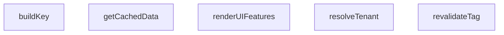

## Genel Bakış

Bu modül, çoklu kiracı (multi-tenant) mimarisinde önbellek yönetimini ve istek çözümlemeyi test eden bir uçtan uca (e2e) test dosyasıdır. Tenant çözümleme, UI özellik renderı ve kiracıya özel önbellek anahtarlama/invalidasyon gibi temel işlevlerin pairwise (ikili) senaryolarını kapsar.

## Fonksiyon Grupları

### Tenant Çözümleme ve UI Render
Gelen HTTP isteğinden kiracı kimliğini çözümlemekten ve kullanıcı profili ile yapılandırma bilgisine göre arayüz özelliklerini belirlemekten sorumludur.
- resolveTenant, renderUIFeatures

### Çoklu Kiracı Önbellek Yönetimi
Kiracı, dil ve anahtar bilgisine dayalı önbellek anahtarları oluşturmak, önbellekten veri okumak veya taze veri çekmek ve belirli etiketler için önbelleği geçersiz kılmaktan sorumludur. `getCachedData` metodunun, önbellek anahtarı üretimi için `buildKey` metodunu çağırması beklenir.
- buildKey, getCachedData, revalidateTag

### Dış Bağımlılıklar ve Mimari Notlar

- `resolveTenant` fonksiyonu, Next.js ortamına ait `NextRequest` nesnesi alır; bu da modülün Next.js sunucu tarafı ile ilişkili olduğunu gösterir.
- `MultiTenantCacheEngine` sınıfı, kiracı bazlı önbellek izolasyonu sağlar; `tenantId` parametresi tüm önbellek işlemlerinde temel ayırıcıdır.
- `getCachedData` içindeki `fetchFn` parametresi, harici veri kaynağına lazy (tembel) erişim sağlar; yalnızca önbellek boşsa çalıştırılır.
- `revalidateTag` ile tag bazlı invalidasyon, kısmi önbellek temizliği yapar; tüm önbelleği sıfırlamaz.

---

## AXIOMS – Mimari Varsayımlar
- Bu modül davranışsal mantık içermez (salt veri / konfigürasyon / tip tanımı).
- [Aksiyom 1]: Modülün dışa açtığı yapı (anahtar kümesi / şema) bir sözleşmedir; tüketiciler bu sabit yapıya bağlıdır — kırıcı değişiklik tüm tüketicileri etkiler.
- [Aksiyom 2]: Bir öğe ekleme/çıkarma yapısal-uyumlu olmalı; ilgili tipler ve seçiciler aynı commit'te güncel tutulmalıdır.

---

## FONKSİYON DETAYLARI

### resolveTenant
**Ne yapar**: Gelen HTTP isteğinin `host` başlığını analiz ederek hangi kiracıya (tenant) ait olduğunu belirler. Geliştirme ortamında localhost erişimlerinde varsayılan kiracıyı döndürürken, üretim ortamında özel alan adı ve alt alan adı eşleştirmeleri yapar. Askıya alınmış kiracıları tespit edip hata döndürür.

**Nasıl yapar**: Önce isteğin `host` başlığını okur. Geliştirme ortamı (`NODE_ENV === 'development'`) ve localhost erişimi tespit edilirse doğrudan `'default'` tenantId döndürür. Host başlığı boşsa hata mesajı ile birlikte `null` tenantId döndürür. Host adını küçük harfe çevirip temizledikten sonra port kısmını ayırır. Önce `TENANT_REGISTRY` içinde özel alan adı (`customDomain`) eşleşmesi aranır; eşleşen kiracının durumu `'suspended'` ise hata döndürür, aksi halde o kiracının `id`'sini döndürür. Özel alan adı bulunamazsa hostname nokta ile bölünür; eğer 2'den fazla parça varsa ilk parça alt alan adı olarak alınır. Alt alan adında alfanümerik ve tire dışında karakter varsa `'Malformed Subdomain'` hatası döndürür. Geçerli alt alan adı `TENANT_REGISTRY`'de eşleşirse askıya alınma kontrolü yapılır ve kiracı ID'si döndürür. Hiçbir eşleşme bulunamazsa `'default'` tenantId döndürür.

**Parametreler**:
- req: NextRequest — Kiracı bilgisinin çıkarılacağı gelen HTTP isteği nesnesi

**Dönüş**: `{ tenantId: string | null; error?: string }` — `tenantId` alanı çözümlenen kiracı kimliğini içerir; eşleşme bulunamazsa veya hata oluşursa `null` olabilir. `error` alanı opsiyoneldir ve `'Empty Host Header'`, `'Tenant Suspended'` veya `'Malformed Subdomain'` değerlerinden birini alabilir.

### renderUIFeatures
**Ne yapar**: Geliştirildi ancak detay üretilemedi.

### buildKey
**Ne yapar**: Geliştirildi ancak detay üretilemedi.

### getCachedData
**Ne yapar**: Geliştirildi ancak detay üretilemedi.

### revalidateTag
**Ne yapar**: Geliştirildi ancak detay üretilemedi.

---

## İTHALATLAR (IMPORTS)
- import: ./helpers/mockDb::MockDatabaseEngine
- import: ./helpers/mockRequest::MockNextResponse
- import: ./helpers/mockRequest::createMockRequest
- import: next/server::NextRequest
- import: vitest::afterEach
- import: vitest::beforeEach
- import: vitest::describe
- import: vitest::expect
- import: vitest::it
- import: vitest::vi

---

## INTERFACES

### TenantConfig
- `id: string`
- `subdomain: string`
- `customDomain?: string`
- `status: 'active' | 'suspended'`

### FeatureConfig
- `id: string`
- `name: string`
- `features: {
`

### UserProfile
- `id: string`
- `role: 'admin' | 'sales' | 'customer'`
- `email: string`
- `tenant_id: string`

### CacheEntry
- `tags: string[]`
- `value: any`
- `createdAt: number`

---

## SABİTLER
- **TENANT_REGISTRY** (array) — `[
  { id: 'tenant-eng-123', subdomain: 'engineering', status: 'active' },
 ...`
- **FEATURE_REGISTRY** (new_expression) — `new Map<string, FeatureConfig>([
  ['tenant-eng-123', {
    id: 'tenant-eng...`

---

## AST POINTERS

### [N1_NASIL] AST Pointer: tests/e2e/pairwise.test.ts::resolveTenant
- **params**: `req: NextRequest`
- **ic_degiskenler**:
  - `host` — `req.headers.get('host') || ''` ifadesinden elde edilen istemci hostname bilgisi
  - `isDev` — `process.env.NODE_ENV === 'development'` kontrolü, geliştirme ortamı olup olmadığını belirler
  - `isLocalhost` — `host.startsWith('localhost') || host.startsWith('127.0.0.1')` kontrolü, yerel makine erişimi olup olmadığını belirler
  - `cleanHost` — `host.toLowerCase().trim()` ile küçük harfe dönüştürülmüş ve boşlukları temizlenmiş hostname
  - `parts` — `cleanHost.split(':')` ile hostname ve port olarak ayrılmış dizi
  - `hostname` — `parts[0]` ile port kısmından ayrılmış saf hostname
  - `customMatch` — `TENANT_REGISTRY.find(t => t.customDomain && hostname === t.customDomain)` ile özel domaine sahip eşleşen tenant kaydı
  - `domainParts` — `hostname.split('.')` ile nokta ile ayrılmış domain parçaları
  - `subdomain` — `domainParts[0]` ile elde edilen alt alan adı
  - `subMatch` — `TENANT_REGISTRY.find(t => t.subdomain === subdomain)` ile alt alan adına eşleşen tenant kaydı
- **Dönüş**: `{ tenantId: string | null; error?: string }`

### [N2_NASIL] AST Pointer: tests/e2e/pairwise.test.ts::buildKey
- **params**: `key: string, lang: string, tenantId: string`
- **ic_degiskenler**: yok
- **Dönüş**: `string` — `JSON.stringify([key, lang, tenantId])` ile üretilen JSON dizesi

### [N3_NASIL] AST Pointer: tests/e2e/pairwise.test.ts::getCachedData
- **params**: `key: string, lang: string, tenantId: string, fetchFn: () => Promise<any> | any, options: { tags?: string[]; bypassCache?: boolean } = {}`
- **ic_degiskenler**:
  - `cacheKey` — `this.buildKey(key, lang, tenantId)` ile oluşturulan benzersiz cache anahtarı
  - `existing` — `this.store.get(cacheKey)` ile mevcut cache kaydı
  - `freshValue` — `await fetchFn()` ile taze veri çekimi sonucu
  - `boundTags` — `(options.tags || []).map(t => \`${t}:${tenantId}\`)` ile tenant ile ilişkilendirilmiş tag listesi
- **Dönüş**: `Promise<any>` — önbellekten veya fetchFn sonucundan dönen veri

### [N4_NASIL] AST Pointer: tests/e2e/pairwise.test.ts::revalidateTag
- **params**: `tag: string, tenantId: string`
- **ic_degiskenler**:
  - `targetTag` — `` `${tag}:${tenantId}` `` ile oluşturulmuş hedef tag dizesi
  - `keysToDelete` — `string[]` tipinde silinecek anahtarları toplayan dizi
  - `k` — `this.store.entries()` döngüsündeki mevcut anahtar
  - `entry` — `this.store.entries()` döngüsündeki mevcut cache girdisi
- **Dönüş**: yok — yan etki olarak `this.store`'dan eşleşen tag'lere sahip girdileri siler

### [N5_NASIL] AST Pointer: tests/e2e/pairwise.test.ts::renderUIFeatures
- **params**: `user: UserProfile, config: FeatureConfig`
- **ic_degiskenler**:
  - `allowedFeatures` — `string[]` tipinde izin verilen UI özelliklerini toplayan dizi
- **Dönüş**: `string[]` — kullanıcının rolüne ve konfigürasyona göre izin verilen özellik adları listesi

---

## MERMAID CALL GRAPH

## NODE ID STANDARD

  file: pairwise.test.ts
  function: pairwise.test.ts::resolveTenant
  function: pairwise.test.ts::renderUIFeatures
  class: pairwise.test.ts::MultiTenantCacheEngine

---

## DISA AKTARILANLAR (EXPORTS)
  export: MultiTenantCacheEngine
  export: renderUIFeatures
  export: resolveTenant