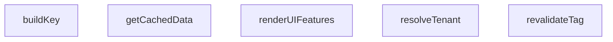

## Genel Bakış

Bu modül, çoklu kiracı (multi-tenant) mimarisinde kullanılan temel bileşenleri test eden bir uçtan uca (e2e) test dosyasıdır. Kiracı çözümleme, kullanıcı arayüzü özelliklerinin render edilmesi ve kiracı bazlı önbellekleme mekanizmalarını kapsayan senaryoları doğrulamak üzere tasarlanmıştır.

## Fonksiyon Grupları

### Kiracı Bağlamı Çözümleme
HTTP isteklerinden hangi kiracının (tenant) bağlamında çalışıldığını belirler. Bu bilgi, kiracıya özgü veri erişimi ve önbellekleme için temel giriş noktasıdır.
- resolveTenant

### Kullanıcı Arayüzü Özellik Yönetimi
Kullanıcı profili ve yapılandırma ayarlarına göre hangi arayüzü özelliklerinin etkin olduğunu belirler. Kiracıya ve kullanıcıya özel özellik görünürlüğünü kontrol eder.
- renderUIFeatures

### Kiracı Duyarlı Önbellekleme
Kiracı, dil ve etiket bazlı önbellekleme mekanizmasını yönetir. Önbellek anahtarı oluşturma, veri çekme ve belirli etiketlerin yeniden doğrulanması gibi işlemleri kapsar.
- buildKey, getCachedData, revalidateTag

---

## AXIOMS – Mimari Varsayımlar

Bu modül, multi-tenant yapıda HVAC uygulaması için kiracı çözümleme, özellik tabanlı UI render'ı ve çok kiracılı önbellek yönetimi sağlar.

**[Aksiyom 1]:** Eğer `TENANT_REGISTRY` boş veya tanımsızsa, `resolveTenant()` geçerli bir kiracı nesnesi döndüremez ve tüm kiracıya özgü işlemler başarısız olur.

**[Aksiyom 2]:** Eğer `resolveTenant()` tarafından döndürülen kiracı kimliği `MultiTenantCacheEngine` cache anahtar üretiminde kullanılmıyorsa, farklı kiracılar birbirinin verisini看到ebilir (veri sızıntısı olur).

**[Aksiyom 3]:** Eğer `MultiTenantCacheEngine.getCachedData()` için `fetchFn` parametresi verilmemişse ve cache'te veri yoksa, modül veri üretemez ve istek başarısız olur.

**[Aksiyom 4]:** Eğer `MultiTenantCacheEngine.getCachedData()` çağrısında `bypassCache: true` olarak ayarlanmıyorsa, cache geçerlilik süresi dolmuş olsa bile eski veri döndürülmeye devam edilir — `revalidateTag()` ile manuel temizlik gerekir.

**[Aksiyom 5]:** Eğer `FEATURE_REGISTRY` tanımsızsa veya ilgili kiracının özellik konfigürasyonunu içermiyorsa, `renderUIFeatures()` kullanıcının erişebileceği özellikleri doğru şekilde hesaplayamaz.

**[Aksiyom 6]:** Eğer `MultiTenantCacheEngine.buildKey()` için `lang` parametresi tutarsızsa (örn: aynı kiracı için farklı dillerde farklı key'ler üretilip aynı key ile cache'leniyorsa), yanlış dilde veri döndürülür.

**[Aksiyom 7]:** Eğer `revalidateTag()` ile bir tag yenileniyorsa ve ilgili tag birden fazla kiracının cache verisinde kullanılıyorsa, sadece belirtilen `tenantId`'ye ait cache temizlenir — diğer kiracılar etkilenmez.

**[Aksiyom 8]:** Eğer `renderUIFeatures()` çağrısında `UserProfile` içindeki kiracı bilgisi ile `FeatureConfig` içindeki kiracı eşleşmiyorsa, kullanıcının görmemesi gereken özellikler gösterilebilir veya görmesi gereken özellikler gizlenebilir.

---

## FONKSİYON DETAYLARI

### resolveTenant
**Ne yapar**: Verilen bir HTTP isteğinin (NextRequest) `host` başlığını analiz ederek, isteği yapan kiracının (tenant) benzersiz kimliğini (`tenantId`) belirler.
**Nasıl yapar**: Fonksiyon, gelişim ortamında localhost erişimlerini varsayılan kiracıya yönlendirerek başlar. Ardından, host başlığını temizler ve iki ana eşleşme stratejisi dener: öncelikle bir özel alan adı (custom domain) ile eşleşip eşleşmediğini, ardından host adının bir alt alan adı (subdomain) içermesi durumunda bu alt alan adı ile bir kiracı kaydını bulmaya çalışır. Herhangi bir eşleşme bulunamazsa varsayılan kiracıya geri döner.
**Parametreler**:
- req: NextRequest — Kiracının tanımlanması için gerekli HTTP isteği nesnesi. Başlıklar içinde `host` alanını içerir.
**Dönüş**: `{ tenantId: string | null; error?: string }` — Eşleşme başarılıysa bir `tenantId`字符串i ve hata oluştuysa opsiyonel bir hata mesajı字符串i döndürür. `tenantId` `null` ise, hata açıklaması `error` alanında bulunur.

### renderUIFeatures
**Ne yapar**: Belirli bir kullanıcının rolüne ve genel bir özellik yapılandırmasına dayanarak, o kullanıcıya arayüzde gösterilecek izin verilen özelliklerin bir listesini döndürür.
**Nasıl yapar**: Fonksiyon, yapılandırma nesnesindeki (`config`) üç özellik bayrağını (`enable3DViewer`, `enableCalculators`, `enableAdvancedAnalytics`) sırayla kontrol eder. Her bayrak aktifse, ilgili özellik için gerekli rol kısıtlamalarını (örneğin, 'admin' veya 'sales') kullanıcı profili ile karşılaştırır. Kullanıcı gerekli kriterleri karşılıyorsa, o özelliğin sabit adı (ör. '3D_VIEWER_WIDGET') izin verilen özellikler listesine eklenir.
**Parametreler**:
- user: UserProfile — Özelliklerin hangi kullanıcıya gösterileceğini belirleyen profil nesnesi. En azından bir `role` alanı (ör. 'admin', 'sales') içermelidir.
- config: FeatureConfig — Hangi özelliklerin aktif olduğunu belirten yapılandırma nesnesi. `features` içinde boolean değerler içeren alanlar beklenir.
**Dönüş**: string[] — Kullanıcıya gösterilebilecek özelliklerin sabit adlarını (ör. '3D_VIEWER_WIDGET', 'CALCULATORS_TOOL') içeren bir dizi. Özellik yoksa boş bir dizi döner.

### buildKey
**Ne yapar**: `MultiTenantCacheEngine` sınıfı içinde, kiracıya ve dile özgü önbellek anahtarlarını benzersiz bir şekilde oluşturmak için kullanılır.
**Nasıl yapar**: Fonksiyon, verilen temel anahtar (`key`), dil kodu (`lang`) ve kiracı kimliğini (`tenantId`) bir JavaScript dizisine koyar ve bu diziyi JSON.stringify metodu ile tek bir string'e dönüştürür. Bu, her kiracı-dil-anahtar kombinasyonu için tutarlı ve benzersiz bir anahtar üretmeyi sağlar.
**Parametreler**:
- key: string — Önbelleklenecek veriyi temsil eden temel anahtar (ör. bir API endpoint'i veya veri adı).
- lang: string — Verinin dilini belirten kod (ör. 'en', 'tr').
- tenantId: string — Verinin ait olduğu kiracının benzersiz kimliği.
**Dönüş**: string — Tüm parametrelerin JSON dizisi olarak stringleştirilmiş hali.

### getCachedData
**Ne yapar**: Çoklu kiracılı önbellek motorundan veri alır. Veri önbellekte yoksa, sağlanan fonksiyonu çalıştırarak taze veriyi üretir, önbelleğe kaydeder ve döndürür.
**Nasıl yapar**: Fonksiyon, öncelikle `bypassCache` seçeneği true ise doğrudan taze veriyi üretip döndürür. Aksi takdirde, `buildKey` ile oluşturulan anahtarla önbellek deposunda (`this.store`) bir arama yapar. Önbellekte bir giriş varsa,głęb bir kopyasını (JSON.parse(JSON.stringify(...))) döndürerek dışarıdan gelen değişikliklerin önbelleği etkilemesini önler. Önbellekte yoksa, `fetchFn` asenkron fonksiyonunu çağırarak taze veriyi üretir, opsiyonel etiketleri (`tags`) kiracı kimliğiyle bağlar, giriş zaman damgasını ekler ve depoya kaydeder.
**Parametreler**:
- key: string — Veriyi temsil eden temel anahtar.
- lang: string — Verinin dili.
- tenantId: string — Verinin ait olduğu kiracının kimliği.
- fetchFn: () => Promise<any> | any — Önbellek_miss durumunda çağrılacak, taze veriyi üreten asenkron veya senkron fonksiyon.
- options: { tags?: string[]; bypassCache?: boolean } = {} — Ek ayarlar. `tags` ile veriye etiket eklenebilir, `bypassCache` true ise önbellek atlanır.
**Dönüş**: Promise<any> — Önbellekten okunan veya `fetchFn` ile üretilen veriyi içeren bir promise.

### revalidateTag
**Ne yapar**: Belirli bir etikete ve kiracıya bağlı tüm önbellek girişlerini temizleyerek, o verinin bir sonraki erişimde taze olarak üretilmesini sağlar.
**Nasıl yapar**: Fonksiyon, hedef etiketi kiracı kimliği ile birleştirerek tam etiket dizesini oluşturur (ör. "user-profile:tenant123"). Ardından, tüm önbellek deposunu (`this.store`) tarar ve her girişin etiketleri içinde bu hedef etiketi içeren tüm anahtarları belirler. Toplanan anahtarların hepsini depodan silerek ilgili tüm önbellek girişlerini geçersiz kılar.
**Parametreler**:
- tag: string — Geçersiz kılınacak veri etiketi (ör. "user-profile", "product-list").
- tenantId: string — Etiketin ait olduğu kiracının kimliği.
**Dönüş**: void — Fonksiyon doğrudan bir değer dönmez, sadece önbellek deposunu yan etki olarak değiştirir.

---

## INTERFACES

### TenantConfig
- `id: string`
- `subdomain: string`
- `customDomain?: string`
- `status: 'active' | 'suspended'`

### FeatureConfig
- `id: string`
- `name: string`
- `features: {
`

### UserProfile
- `id: string`
- `role: 'admin' | 'sales' | 'customer'`
- `email: string`
- `tenant_id: string`

### CacheEntry
- `tags: string[]`
- `value: any`
- `createdAt: number`

---

## SABİTLER
- **TENANT_REGISTRY** (array) — `[

  { id: 'tenant-eng-123', subdomain: 'engineering', status: 'active' },

 ...`
- **FEATURE_REGISTRY** (new_expression) — `new Map<string, FeatureConfig>([

  ['tenant-eng-123', {

    id: 'tenant-eng...`

---

## AST POINTERS

### [N1_NASIL] AST Pointer: tests/e2e/pairwise.test.ts::resolveTenant
- **params**: `(req: NextRequest)`
- **ic_degiskenler**:
  - `host` — `req.headers.get('host') || ''` ile alınan HTTP Host header değeri; boş string fallback'li
  - `isDev` — `process.env.NODE_ENV === 'development'` karşılaştırmasından dönen boolean; geliştirme modu kontrolü
  - `isLocalhost` — host'un `localhost` veya `127.0.0.1` ile başlayıp başlamadığını kontrol eden boolean
  - `cleanHost` — `host.toLowerCase().trim()` ile normalize edilmiş küçük harfli host
  - `parts` — `cleanHost.split(':')` ile elde edilen dizi; hostname ve port ayrımı
  - `hostname` — `parts[0]` erişimi; port'tan arındırılmış hostname
  - `customMatch` — `TENANT_REGISTRY.find(t => t.customDomain && hostname === t.customDomain)` ile eşleşen tenant nesnesi veya undefined
  - `domainParts` — `hostname.split('.')` ile elde edilen dizi; noktaya göre ayrılmış domain parçaları
  - `subdomain` — `domainParts[0]` erişimi; domain'in ilk parçası (alt alan adı adayı)
  - `subMatch` — `TENANT_REGISTRY.find(t => t.subdomain === subdomain)` ile eşleşen tenant nesnesi veya undefined
- **Dönüş**: `{ tenantId: string | null; error?: string }` — tenant ID veya hata mesajı

---

### [N2_NASIL] AST Pointer: tests/e2e/pairwise.test.ts::MultiTenantCacheEngine::buildKey
- **params**: `(key: string, lang: string, tenantId: string)`
- **ic_degiskenler**: (yok)
- **Dönüş**: `string` — `JSON.stringify([key, lang, tenantId])` sonucu; üç parametrenin JSON array string'i

---

### [N3_NASIL] AST Pointer: tests/e2e/pairwise.test.ts::MultiTenantCacheEngine::getCachedData
- **params**: `(key: string, lang: string, tenantId: string, fetchFn: () => Promise<any> | any, options: { tags?: string[]; bypassCache?: boolean })`
- **ic_degiskenler**:
  - `cacheKey` — `this.buildKey(key, lang, tenantId)` çağrısı ile üretilen cache anahtarı; store'da lookup için kullanılır
  - `existing` — `this.store.get(cacheKey)` ile store'dan çekilen mevcut CacheEntry veya undefined; cache hit durumunu temsil eder
  - `freshValue` — `await fetchFn()` ile kaynaktan çekilen taze veri; cache miss veya bypassCache durumunda üretilir
  - `boundTags` — `(options.tags || []).map(t => \`${t}:${tenantId}\`)` ile tenant ID'si bağlanmış tag dizisi; cache entry'nin tag'leri
- **Dönüş**: `Promise<any>` — cached veya taze veri; bypassCache true ise doğrudan fetchFn sonucu, aksi halde store'dan parse edilmiş kopya veya taze veri

---

### [N4_NASIL] AST Pointer: tests/e2e/pairwise.test.ts::MultiTenantCacheEngine::revalidateTag
- **params**: `(tag: string, tenantId: string)`
- **ic_degiskenler**:
  - `targetTag` — `` `${tag}:${tenantId}` `` template literal'i; tag ve tenantId'nin birleşik hali, eşleşmelerde kullanılır
  - `keysToDelete` — `string[]` — hedef tag'i içeren cache entry'lerin anahtarlarını tutan dizi; silinecek key'ler toplanır
- **Dönüş**: yok — `this.store.delete(k)` çağrısıyla store'dan entry'leri silen yan etkili metot

---

### [N5_NASIL] AST Pointer: tests/e2e/pairwise.test.ts::renderUIFeatures
- **params**: `(user: UserProfile, config: FeatureConfig)`
- **ic_degiskenler**:
  - `allowedFeatures` — `string[]` — kullanıcının erişebileceği feature identifier'larını biriktiren dizi; return edilir
- **Dönüş**: `string[]` — izin verilen feature isimlerinin dizisi (örn: `3D_VIEWER_WIDGET`, `CALCULATORS_TOOL`, `ANALYTICS_DASHBOARD`)

---

### [N6_NASIL] AST Pointer: tests/e2e/pairwise.test.ts::(describe_anonymous)
- **params**: (yok)
- **ic_degiskenler**:
  - `db` — `let` ile tanımlı `MockDatabaseEngine` tipinde değişken; veritabanı mock'u, beforeEach'te atanır
  - `cache` — `let` ile tanımlı `MultiTenantCacheEngine` tipinde değişken; cache engine instance'ı, beforeEach'te atanır
- **Dönüş**: yok — test suite tanımlayan匿名 fonksiyon; beforeEach/afterEach ve 6 adet it bloğu içerir

---

### [N7_NASIL] AST Pointer: tests/e2e/pairwise.test.ts::(beforeEach_callback)
- **params**: (yok)
- **ic_degiskenler**:
  - `db` — `new MockDatabaseEngine()` ile oluşturulan MockDatabaseEngine instance'ı; test veritabanı
  - `cache` — `new MultiTenantCacheEngine()` ile oluşturulan cache engine instance'ı
- **Dönüş**: yok — `vi.stubEnv`, `db.setTableData` ve atama yan etkileri olan kurulum fonksiyonu

---

### [N8_NASIL] AST Pointer: tests/e2e/pairwise.test.ts::(afterEach_callback)
- **params**: (yok)
- **ic_degiskenler**: (yok)
- **Dönüş**: yok — `vi.unstubAllEnvs()` çağrısıyla tüm stub edilmiş ortam değişkenlerini temizleyen temizlik fonksiyonu

---

### [N9_NASIL] AST Pointer: tests/e2e/pairwise.test.ts::(it_case1_tenantResolution_databaseIsolation)
- **params**: (yok)
- **ic_degiskenler**:
  - `reqEng` — `createMockRequest({...})` ile üretilen mock NextRequest; engineering subdomain'li (host: `engineering.venthub.local`)
  - `tenantIdEng` — `resolveTenant(reqEng)` destructuring'inden `tenantId` alanı; engineering tenant ID'si (`'tenant-eng-123'`)
  - `errEng` — `resolveTenant(reqEng)` destructuring'inden `error` alanı; hata mesajı veya undefined
  - `clientEng` — `db.createClient()` ile oluşturulan DB client; engineering security context'ine bağlanmış
  - `dataEng` — `clientEng.from('products').select()` sonucu `data` alanı; engineering ürünlerinin dizisi
  - `dbErrEng` — `clientEng.from('products').select()` sonucu `error` alanı; sorgu hatası veya null
  - `reqSales` — `createMockRequest({...})` ile üretilen mock NextRequest; sales subdomain'li (host: `sales.venthub.local`)
  - `tenantIdSales` — `resolveTenant(reqSales)` destructuring'inden `tenantId` alanı; sales tenant ID'si (`'tenant-sales-456'`)
  - `errSales` — `resolveTenant(reqSales)` destructuring'inden `error` alanı; hata mesajı veya undefined
  - `clientSales` — `db.createClient()` ile oluşturulan DB client; sales security context'ine bağlanmış
  - `dataSales` — `clientSales.from('products').select()` sonucu `data` alanı; sales ürünlerinin dizisi
  - `dbErrSales` — `clientSales.from('products').select()` sonucu `error` alanı; sorgu hatası veya null
- **Dönüş**: yok — `async` test; expect assertion'larıyla doğrulama yapan yan etkili test

---

### [N10_NASIL] AST Pointer: tests/e2e/pairwise.test.ts::(it_case2_databaseIsolation_authJWT)
- **params**: (yok)
- **ic_degiskenler**:
  - `client` — `db.createClient()` ile oluşturulan DB client; test boyunca reused
  - `updatedSelf` — `client.from('user_profiles').eq('id','user-eng-admin').update(...)` sonucu `data` alanı; kendi profilini güncelleyen kullanıcının güncellenmiş satırları
  - `errSelf` — aynı sorgunun `error` alanı; hata veya null
  - `updatedOther` — `client.from('user_profiles').eq('id','user-sales-salesperson').update(...)` sonucu `data` alanı; farklı tenant profilini güncellemeye çalışan kullanıcının etkilenen satırları (RLS yüzünden boş)
  - `errOther` — aynı sorgunun `error` alanı; hata veya null
  - `profileSales` — `client.from('user_profiles').eq('id','user-sales-salesperson').single()` sonucu `data` alanı; sales kullanıcısının profil nesnesi; değişmediğini doğrular
- **Dönüş**: yok — `async` test; RLS izolasyonunu doğrulayan assertion'lar

---

### [N11_NASIL] AST Pointer: tests/e2e/pairwise.test.ts::(it_case3_tenantResolution_featureFlags)
- **params**: (yok)
- **ic_degiskenler**:
  - `reqEng` — `createMockRequest({...})` ile üretilen mock NextRequest; engineering subdomain'li dashboard isteği
  - `tenantIdEng` — `resolveTenant(reqEng)` destructuring'inden `tenantId` alanı
  - `configEng` — `FEATURE_REGISTRY.get(tenantIdEng!)` ile alınan FeatureConfig nesnesi; engineering konfigürasyonu
  - `reqSales` — `createMockRequest({...})` ile üretilen mock NextRequest; sales subdomain'li dashboard isteği
  - `tenantIdSales` — `resolveTenant(reqSales)` destructuring'inden `tenantId` alanı
  - `configSales` — `FEATURE_REGISTRY.get(tenantIdSales!)` ile alınan FeatureConfig nesnesi; sales konfigürasyonu
- **Dönüş**: yok — `async` test; feature flag değerlerini doğrulayan assertion'lar

---

### [N12_NASIL] AST Pointer: tests/e2e/pairwise.test.ts::(it_case4_cacheKeyIsolation_webhooks)
- **params**: (yok)
- **ic_degiskenler**:
  - `fetchCountA` — `let` ile tanımlı sayaç; Tenant A için fetchFn kaç kez çağrıldığını sayar
  - `fetchCountB` — `let` ile tanımlı sayaç; Tenant B için fetchFn kaç kez çağrıldığını sayar
  - `fetchA` — arrow fonksiyon; `fetchCountA++` artırıp `{ data: 'Tenant A Cached Value' }` döndüren fetchFn
  - `fetchB` — arrow fonksiyon; `fetchCountB++` artırıp `{ data: 'Tenant B Cached Value' }` döndüren fetchFn
  - `resA` — `await cache.getCachedData(...)` sonucu; revalidate sonrası Tenant A cache değeri
  - `resB` — `await cache.getCachedData(...)` sonucu; Tenant B cache değeri (revalidate edilmemiş)
- **Dönüş**: yok — `async` test; cache tag revalidation'ın tenant izolasyonunu doğrulayan assertion'lar

---

### [N13_NASIL] AST Pointer: tests/e2e/pairwise.test.ts::(it_case5_featureFlags_authProfiles)
- **params**: (yok)
- **ic_degiskenler**:
  - `configEng` — `FEATURE_REGISTRY.get('tenant-eng-123')!` ile alınan FeatureConfig; engineering konfigürasyonu
  - `configSales` — `FEATURE_REGISTRY.get('tenant-sales-456')!` ile alınan FeatureConfig; sales konfigürasyonu
  - `user1` — `UserProfile` literal'i; id:`'u1'`, role:`'admin'`, tenant_id:`'tenant-eng-123'`
  - `featuresU1` — `renderUIFeatures(user1, configEng)` sonucu; admin kullanıcının engineering features'ı
  - `user2` — `UserProfile` literal'i; id:`'u2'`, role:`'sales'`, tenant_id:`'tenant-eng-123'`
  - `featuresU2` — `renderUIFeatures(user2, configEng)` sonucu; sales kullanıcının engineering features'ı
  - `user3` — `UserProfile` literal'i; id:`'u3'`, role:`'customer'`, tenant_id:`'tenant-eng-123'`
  - `featuresU3` — `renderUIFeatures(user3, configEng)` sonucu; customer kullanıcının engineering features'ı
  - `user4` — `UserProfile` literal'i; id:`'u4'`, role:`'admin'`, tenant_id:`'tenant-sales-456'`
  - `featuresU4` — `renderUIFeatures(user4, configSales)` sonucu; admin kullanıcının sales features'ı
- **Dönüş**: yok — senkron test; farklı roller ve tenant'lar için feature izinlerini doğrulayan assertion'lar

---

### [N14_NASIL] AST Pointer: tests/e2e/pairwise.test.ts::(it_case6_cacheKeyIsolation_databaseIsolation)
- **params**: (yok)
- **ic_degiskenler**:
  - `client` — `db.createClient()` ile oluşturulan DB client; test boyunca reused
  - `fetchEng` — `async` arrow fonksiyon; engineering context'inde `client.from('products').select()` ile ürünleri çeken ve `data` döndüren fetchFn
  - `cachedEng` — `await cache.getCachedData(...)` sonucu; engineering products'ın cache'den okunan dizisi
  - `fetchSales` — `async` arrow fonksiyon; sales context'inde `client.from('products').select()` ile ürünleri çeken ve `data` döndüren fetchFn
  - `cachedSales` — `await cache.getCachedData(...)` sonucu; sales products'ın cache'den okunan dizisi
  - `bypassedEng` — `await cache.getCachedData(..., { bypassCache: true })` sonucu; cache bypass ile engineering products
  - `bypassedSales` — `await cache.getCachedData(..., { bypassCache: true })` sonucu; cache bypass ile sales products
- **Dönüş**: yok — `async` test; cache bypass ve DB RLS uyumunu doğrulayan assertion'lar

---

## MERMAID CALL GRAPH

## NODE ID STANDARD

  file: tests\e2e\pairwise.test.ts
  function: tests\e2e\pairwise.test.ts::resolveTenant
  function: tests\e2e\pairwise.test.ts::renderUIFeatures
  class: tests\e2e\pairwise.test.ts::MultiTenantCacheEngine

---

## DISA AKTARILANLAR (EXPORTS)
  export: MultiTenantCacheEngine
  export: renderUIFeatures
  export: resolveTenant