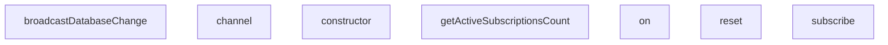

## Genel Bakış
Bu modül, gerçek zamanlı güvenlik testleri için sunucu, kanal ve istemci davranışlarını simüle eden mock sınıflarını içerir. Test senaryolarında, abonelik yönetimi, olay dinleme ve veritabanı değişikliklerinin yayınlanması gibi gerçek zamanlı işlemlerin güvenlik kontrollerini doğrulamak amacıyla kullanılır. Modül, bağımsız ve kontrollü bir test ortamı sağlar.

## Fonksiyon Grupları
### Gerçek Zamanlı Sunucu Mock'u
Gerçek zamanlı sunucunun temel işlevlerini simüle eder; abonelikleri yönetir, veritabanı değişikliklerini yayınlar ve aktif abonelik sayılarını takip eder.
- reset, subscribe, broadcastDatabaseChange, getActiveSubscriptionsCount

### Gerçek Zamanlı Kanal Mock'u
Bir gerçek zamanlı kanalın davranışını taklit eder; olayları dinlemek ve abonelikleri yönetmek için arayüz sağlar.
- constructor, on, subscribe

### Gerçek Zamanlı İstemci Mock'u
Gerçek zamanlı bir istemcinin temel davranışını simüle eder; belirli bir kanal nesnesi oluşturmak için fabrika metodu sunar.
- constructor, channel

---

## AXIOMS – Mimari Varsayımlar

Bu modül, gerçek zamanlı güvenlik testleri için mock nesneler ve sunucu simülasyonu sağlar. Aşağıdaki varsayımlar, testlerin doğru çalışabilmesi için gereklidir.

[Aksiyom 1]: Eğer `RealtimeTokenClaims` yapısına uygun bir nesne yoksa, `MockRealtimeClient` nesnesi oluşturulamaz.
[Aksiyom 2]: Eğer `isTokenTampered` parametresi yoksa, `MockRealtimeClient` nesnesi oluşturulamaz.
[Aksiyom 3]: Eğer `channelName` ve geçerli bir `MockRealtimeClient` nesnesi yoksa, `MockRealtimeChannel` nesnesi oluşturulamaz.
[Aksiyom 4]: Eğer `channelName`, `client`, `eventFilter` ve `callback` parametreleri yoksa, `RealtimeServerMock.subscribe` fonksiyonu çağrılamaz

---

## FONKSİYON DETAYLARI

### reset
**Ne yapar**: `RealtimeServerMock` sınıfının tüm aktif aboneliklerini temizler. Sunucu durumunu sıfırlayarak test ortamını başlangıç durumuna getirir.
**Nasıl yapar**: `this.subscriptions` koleksiyonundaki tüm kayıtları temizleyen `clear()` metodunu çağırır. Bu işlem, tüm kanallardaki tüm abonelikleri kaldırır.
**Parametreler**: Yok
**Dönüş**: Return tipi belirtilmemiş

### subscribe
**Ne yapar**: Geliştirildi ancak detay üretilemedi.

### broadcastDatabaseChange
**Ne yapar**: Geliştirildi ancak detay üretilemedi.

### getActiveSubscriptionsCount
**Ne yapar**: Geliştirildi ancak detay üretilemedi.

### constructor
**Ne yapar**: Geliştirildi ancak detay üretilemedi.

### on
**Ne yapar**: Geliştirildi ancak detay üretilemedi.

### subscribe
**Ne yapar**: Geliştirildi ancak detay üretilemedi.

### constructor
**Ne yapar**: Geliştirildi ancak detay üretilemedi.

### channel
**Ne yapar**: Geliştirildi ancak detay üretilemedi.

---

## İTHALATLAR (IMPORTS)
- import: vitest::beforeEach
- import: vitest::describe
- import: vitest::expect
- import: vitest::it

---

## INTERFACES

### RealtimeTokenClaims
- `tenant_id: string | null`
- `role: string`
- `sub: string`

---

## SABİTLER
- **serverMock** (new_expression) — `new RealtimeServerMock()`

---

## AST POINTERS

### [N1_NASIL] AST Pointer: tests/e2e/realtimeSecurity.test.ts::RealtimeServerMock.reset
- **params**: (parametre yok)
- **ic_degiskenler**: (iç değişken yok)
- **Dönüş**: yok — `this.subscriptions` Map'inin tüm elemanlarını temizler

### [N2_NASIL] AST Pointer: tests/e2e/realtimeSecurity.test.ts::RealtimeServerMock.subscribe
- **params**: `channelName: string`, `client: MockRealtimeClient`, `eventFilter: any`, `callback: (payload: any) => void`
- **ic_degiskenler**:
  - `adminChannelMatch` — `channelName.match(/^admin-(?:orders|stock)-realtime-(.+)$/)` sonucu; admin kanal deseniyle eşleşip eşleşmediğini tutar, eşleşmezse null
  - `targetTenantId` — `adminChannelMatch[1]` değeri; regex yakalama grubundan çıkarılan hedef tenant ID'si
- **Dönüş**: `{ status: string; error?: string }` — başarılıysa `{ status: 'SUBSCRIBED' }`, başarısızsa `{ status: 'CHANNEL_ERROR', error: '...' }` döner

### [N3_NASIL] AST Pointer: tests/e2e/realtimeSecurity.test.ts::RealtimeServerMock.broadcastDatabaseChange
- **params**: `tableName: string`, `eventType: 'INSERT' | 'UPDATE' | 'DELETE'`, `rowData: any`
- **ic_degiskenler**:
  - `rowTenantId` — `rowData.tenant_id` değeri; yayınlanan satırın ait olduğu tenant kimliği
  - `subs` — `this.subscriptions.forEach` döngüsündeki her kanalın abonelik dizisi
  - `_channelName` — `this.subscriptions.forEach` döngüsündeki kanal adı (kullanılmıyor)
  - `sub` — `subs.forEach` döngüsündeki her abonelik nesnesi; `client`, `callback`, `eventFilter` alanlarını içerir
  - `isAuthorized` — `sub.client.role === 'super_admin'` veya `rowTenantId && sub.client.tenantId === rowTenantId` koşullarının sonucu; abonenin olayı almaya yetkili olup olmadığını belirler
- **Dönüş**: yok — yan etki olarak yetkili abonelerin `callback` fonksiyonlarını `{ schema, table, commit_timestamp, eventType, new, old }` payload'uyla çağırır

### [N4_NASIL] AST Pointer: tests/e2e/realtimeSecurity.test.ts::RealtimeServerMock.getActiveSubscriptionsCount
- **params**: `channelName: string`
- **ic_degiskenler**: (iç değişken yok)
- **Dönüş**: `number` — `this.subscriptions.get(channelName)?.length || 0`; belirtilen kanalın aktif abonelik sayısını döner

### [N5_NASIL] AST Pointer: tests/e2e/realtimeSecurity.test.ts::MockRealtimeChannel.constructor
- **params**: `channelName: string`, `client: MockRealtimeClient`
- **ic_degiskenler**: (iç değişken yok)
- **Dönüş**: yok — `this.channelName` ve `this.client` alanlarına atama yapar

### [N6_NASIL] AST Pointer: tests/e2e/realtimeSecurity.test.ts::MockRealtimeChannel.on
- **params**: `type: string`, `filter: any`, `callback: (payload: any) => void`
- **ic_degiskenler**: (iç değişken yok)
- **Dönüş**: `this` (MockRealtimeChannel) — `type === 'postgres_changes'` ise `this.postgresCallback` ve `this.eventFilter` alanlarını atar, zincirleme çağrıya izin verir

### [N7_NASIL] AST Pointer: tests/e2e/realtimeSecurity.test.ts::MockRealtimeChannel.subscribe
- **params**: `statusCallback?: (status: string, err?: any) => void`
- **ic_degiskenler**:
  - `res` — `serverMock.subscribe(this.channelName, this.client, this.eventFilter, ...)` çağrısının dönüş değeri; `{ status: string; error?: string }` tipinde
- **Dönüş**: `this` (MockRealtimeChannel) — `this.client.isTokenTampered` true ise `statusCallback`'a `'CHANNEL_ERROR'` ve `Error('401: Invalid signature/token verification failed')` gönderir, `serverMock.subscribe` çağırmaz. Aksi halde `res.status`'a göre `statusCallback`'a `'SUBSCRIBED'` veya `'CHANNEL_ERROR'` gönderir

### [N8_NASIL] AST Pointer: tests/e2e/realtimeSecurity.test.ts::MockRealtimeClient.constructor
- **params**: `claims: RealtimeTokenClaims`, `isTokenTampered: boolean` (varsayılan: `false`)
- **ic_degiskenler**: (iç değişken yok)
- **Dönüş**: yok — `this.tenantId = claims.tenant_id`, `this.role = claims.role`, `this.userId = claims.sub`, `this.isTokenTampered = isTokenTampered` atamalarını yapar

### [N9_NASIL] AST Pointer: tests/e2e/realtimeSecurity.test.ts::MockRealtimeClient.channel
- **params**: `name: string`
- **ic_degiskenler**: (iç değişken yok)
- **Dönüş**: `MockRealtimeChannel` — `new MockRealtimeChannel(name, this)` örneği döner

---

## MERMAID CALL GRAPH

## NODE ID STANDARD

  file: realtimeSecurity.test.ts
  class: realtimeSecurity.test.ts::RealtimeServerMock
  class: realtimeSecurity.test.ts::MockRealtimeChannel
  class: realtimeSecurity.test.ts::MockRealtimeClient

---

## DISA AKTARILANLAR (EXPORTS)
  export: MockRealtimeChannel
  export: MockRealtimeClient
  export: RealtimeServerMock

---

## BILEŞIM (CONTAINS)
  contains: ((payload
  contains: MockRealtimeClient
  contains: any
  contains: string
  contains: string | null