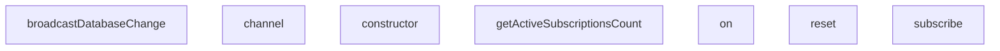

## Genel Bakış

Bu modül, gerçek zamanlı (realtime) güvenlik senaryolarını test etmek için kullanılan mock sınıflar içermektedir. WebSocket veya SSE tabanlı pub/sub sisteminin sunucu tarafını simüle ederek, yetkilendirme, abonelik kontrolü ve veritabanı değişiklik yayını gibi işlevlerin doğru çalıştığını doğrulamayı amaçlar.

## Fonksiyon Grupları

### Sunucu Simülasyonu

Gerçek zamanlı sunucu davranışını taklit ederek abonelik yönetimini ve veri değişimlerini merkezi olarak kontrol eder.

- `reset()`, `subscribe()`, `broadcastDatabaseChange()`, `getActiveSubscriptionsCount()`

### Kanal Yönetimi

İstemcilerin sunucuya bağlı olduğu sanal kanalları temsil eder ve olay dinleyicilerinin kaydedilmesini sağlar.

- `MockRealtimeChannel` sınıfı (constructor, `on()`, `subscribe()`)

### İstemci Simülasyonu

JWT claims ve token durumlarıyla yapılandırılmış sahte istemciler oluşturur; bu istemciler aracılığıyla kanallara erişim sağlanır.

- `MockRealtimeClient` sınıfı (constructor, `channel()`)

---

## AXIOMS – Mimari Varsayımlar

Bu modül için özel aksiyom tanımlanmamıştır.

---

## FONKSİYON DETAYLARI

### RealtimeServerMock.reset
**Ne yapar**: Mock sunucu üzerindeki tüm aktif realtime abonelikleri temizler. Test senaryoları arasında durum sıfırlamak için kullanılır.
**Nasıl yapar**: `subscriptions` Map'indeki tüm頻道 ve abonelik kayıtlarını `clear()` metodu ile siler.
**Parametreler**: Yok
**Dönüş**: `void` — dönüş değeri yoktur.

### subscribe
**Ne yapar**: Geliştirildi ancak detay üretilemedi.

### broadcastDatabaseChange
**Ne yapar**: Geliştirildi ancak detay üretilemedi.

### getActiveSubscriptionsCount
**Ne yapar**: Geliştirildi ancak detay üretilemedi.

### constructor
**Ne yapar**: Geliştirildi ancak detay üretilemedi.

### on
**Ne yapar**: Geliştirildi ancak detay üretilemedi.

### subscribe
**Ne yapar**: Geliştirildi ancak detay üretilemedi.

### constructor
**Ne yapar**: Geliştirildi ancak detay üretilemedi.

### channel
**Ne yapar**: Geliştirildi ancak detay üretilemedi.

---

## INTERFACES

### RealtimeTokenClaims
- `tenant_id: string | null`
- `role: string`
- `sub: string`

---

## SABİTLER
- **serverMock** (new_expression) — `new RealtimeServerMock()`

---

## AST POINTERS

### [N1_NASIL] AST Pointer: tests/e2e/realtimeSecurity.test.ts::RealtimeServerMock.reset
- **params**: (parametre yok)
- **ic_degiskenler**: 
- **Dönüş**: yok (subscription listesini temizler)

### [N2_NASIL] AST Pointer: tests/e2e/realtimeSecurity.test.ts::RealtimeServerMock.subscribe
- **params**: `(channelName: string, client: MockRealtimeClient, eventFilter: any, callback: (payload: any) => void)`
- **ic_degiskenler**: 
  - `adminChannelMatch` — channelName'in regex ile eşleşip eşleşmediğini ve secure admin kanalı pattern'ini kontrol eder
  - `targetTenantId` — regex eşleşmesinden çıkartılan tenant ID'si (eğer secure admin kanalı ise)
- **Dönüş**: `{ status: string; error?: string }` (SUBSCRIBED veya CHANNEL_ERROR döner)

### [N3_NASIL] AST Pointer: tests/e2e/realtimeSecurity.test.ts::RealtimeServerMock.broadcastDatabaseChange
- **params**: `(tableName: string, eventType: 'INSERT' | 'UPDATE' | 'DELETE', rowData: any)`
- **ic_degiskenler**: 
  - `rowTenantId` — rowData objesinden alınan tenant_id değeri (broadcast RLS filtresi için kullanılır)
- **Dönüş**: yok (subscribe olan tüm client'lara callback tetikler)

### [N4_NASIL] AST Pointer: tests/e2e/realtimeSecurity.test.ts::RealtimeServerMock.getActiveSubscriptionsCount
- **params**: `(channelName: string)`
- **ic_degiskenler**: 
- **Dönüş**: `number` (belirtilen kanaldaki aktif subscription sayısı)

### [N5_NASIL] AST Pointer: tests/e2e/realtimeSecurity.test.ts::MockRealtimeChannel.constructor
- **params**: `(channelName: string, client: MockRealtimeClient)`
- **ic_degiskenler**: 
- **Dönüş**: yok (instance properties'leri atar)

### [N6_NASIL] AST Pointer: tests/e2e/realtimeSecurity.test.ts::MockRealtimeChannel.on
- **params**: `(type: string, filter: any, callback: (payload: any) => void)`
- **ic_degiskenler**: 
- **Dönüş**: `this` (MockRealtimeChannel instance'ı, zincirleme kullanım için)

### [N7_NASIL] AST Pointer: tests/e2e/realtimeSecurity.test.ts::MockRealtimeChannel.subscribe
- **params**: `(statusCallback?: (status: string, err?: any) => void)`
- **ic_degiskenler**: 
  - `res` — serverMock.subscribe çağırmasının sonucu (status ve error bilgisi içerir)
- **Dönüş**: `this` (MockRealtimeChannel instance'ı)

### [N8_NASIL] AST Pointer: tests/e2e/realtimeSecurity.test.ts::MockRealtimeClient.constructor
- **params**: `(claims: RealtimeTokenClaims, isTokenTampered = false)`
- **ic_degiskenler**: 
- **Dönüş**: yok (instance properties'leri claims'ten atar)

### [N9_NASIL] AST Pointer: tests/e2e/realtimeSecurity.test.ts::MockRealtimeClient.channel
- **params**: `(name: string)`
- **ic_degiskenler**: 
- **Dönüş**: `new MockRealtimeChannel` (yeni bir MockRealtimeChannel instance'ı oluşturur)

---

## MERMAID CALL GRAPH

## NODE ID STANDARD

  file: tests\e2e\realtimeSecurity.test.ts
  class: tests\e2e\realtimeSecurity.test.ts::RealtimeServerMock
  class: tests\e2e\realtimeSecurity.test.ts::MockRealtimeChannel
  class: tests\e2e\realtimeSecurity.test.ts::MockRealtimeClient

---

## DISA AKTARILANLAR (EXPORTS)
  export: MockRealtimeChannel
  export: MockRealtimeClient
  export: RealtimeServerMock

---

## BILEŞIM (CONTAINS)
  contains: ((payload
  contains: MockRealtimeClient
  contains: any
  contains: string
  contains: string | null