## Genel Bakış
Bu modül, HVAC (Isıtma, Havalandırma ve Klima) sisteminin end-to-end testlerini desteklemek için tasarlanmış test yardımcı fonksiyonları ve sahte (mock) veri yapıları içermektedir. Modülün ana amacı, çoklu kiracı (multi-tenant) ortamında önbellekleme, webhook işleme ve kiracı yönetimi gibi kritik işlevlerin test edilmesi için gerekli sahte ortamı ve yardımcı araçları sağlamaktır. Fonksiyonlar ve sınıflar, test senaryolarını izole ve tekrarlanabilir bir şekilde çalıştırmak amacıyla birbirini tamamlayan yardımcılar sunmaktadır.

## Fonksiyon Grupları
### Temel Test Altyapısı ve Kimlik Doğrulama
Bu grup, testlerin çalıştırılması için gerekli olan temel verileri ve kimlik doğrulama mekanizmalarını simüle eder. HTTP isteklerinden kiracı (tenant) bilgisini çıkarmak, test kullanıcıları oluşturmak ve webhook imzalarını hesaplamak gibi genel test hazırlık adımlarını karşılar.
- resolveTenant, mockUserResolver, computeSignature

### Çoklu Kiracı Önbellek Motoru Simülasyonu
Bu grup, üretim ortamındaki önbellek motorunun test versiyonunu temsil eder. Kiracıya ve dile göre önbellek anahtarları oluşturarak verileri önbelleğe alma, verileri çekme ve kiracı izinlerine dayalı olarak önbelleği yeniden doğrulama gibi işlemleri simüle eder. Özellikle veri izolasyonunu test etmek için tasarlanmıştır.
- buildKey, getCachedData, revalidateTag, secureRevalidateTag

### Webhook Mock Veritabanı
Bu grup, test senaryoları sırasında webhook işlemlerinin etkilediği veritabanı tablolarını simüle eder. Veritabanı durumunu sıfırlama (reset) ve belirli tablolar üzerinde sorgu oluşturma için sahte bir ortam sağlayarak, webhook işleyicilerinin doğru veri manipülasyonu yapıp yapmadığını doğrulamaya olanak tanır.
- reset, from (WebhookMockDb sınıfı içinde)

---

## AXIOMS – Mimari Varsayımlar

Bu modül, e2e test senaryoları için multi-tenant webhook ve cache altyapısını mock'lamaktadır. Aşağıdaki mimari varsayımlar fonksiyon imzalarından ve modül sabitlerinden çıkarılmıştır.

---

## FONKSİYON DETAYLARI

### resolveTenant
**Ne yapar**: HTTP isteğinin `host` header'ını analiz ederek geçerli bir kiracı (tenant) tanımlayıcısı (ID) çözümler. Bu, çok kiracılı (multi-tenant) bir sistemde isteğin hangi kiracıya ait olduğunu belirlemenin temel yoludur.

**Nasıl yapar**: Fonksiyon, öncelikle geliştirme ortamı ve localhost kontrolü yaparak varsayılan bir kiracı döndürür. Ardından host header'ını temizler ve port numarasını ayırt ederek hostname'i elde eder. `TENANT_REGISTRY` array'indeki kayıtları, özel alan adı (customDomain) ve alt alan adı (subdomain) eşleştirmeleri için tarar. Eşleşme bulursa kiracının askıya alınmış (suspended) olup olmadığını kontrol eder ve uygun sonucu döndürür. Hiçbir eşleşme bulunamazsa 'default' kiracısını döndürür.

**Parametreler**:
- `req`: NextRequest — HTTP isteği nesnesi. İsteğin host header'ı bu nesnenin `headers.get('host')` metoduyla alınır.

**Dönüş**: `{ tenantId: string | null; error?: string }` — Bir nesne döndürür. Başarılı çözümlemede `tenantId` string, başarısızsa `null` olur. Hata durumunda `error` alanı hata mesajını içerir. Olası hata mesajları: 'Empty Host Header', 'Tenant Suspended', 'Malformed Subdomain'.

### mockUserResolver
**Ne yapar**: Testler için sahte (mock) kullanıcı çözücü (resolver) bir fonksiyon üretir (factory pattern). Üretilen fonksiyon çağrıldığında, sahte bir kullanıcı nesnesi veya bir hata nesnesi içeren bir sonuç döndürür.

**Nasıl yapar**: Fonksiyon, `mockUserResolver()` çağrıldığında, içinde asenkron bir arrow fonksiyon (`async () => { ... }`) tanımlar ve bunu döndürür. Döndürülen bu asenkron fonksiyon kendi içinde gerçek `mockUserResolver` fonksiyonunu çağırarak sonuçları alır ve `{ data, error }` formatına dönüştürerek dışarı verir.

**Parametreler**: Parametre almaz.

**Dönüş**: `() => { user: any; error: any }` — Parametresiz, `{ user: any; error: any }` objesi döndüren bir fonksiyon.

### computeSignature
**Ne yapar**: Verilen bir `secret` anahtarı ve `body` içeriği kullanarak HMAC-SHA256 tabanlı bir imza hesaplar. Bu genellikle webhook doğrulama gibi güvenlik mekanizmalarında kullanılır.

**Nasıl yapar**: Fonksiyon, `TextEncoder` kullanarak secret ve body string'lerini byte dizilerine dönüştürür. `globalThis.crypto.subtle.importKey` metoduyla raw secret'tan bir HMAC-SHA256 kripto anahtarı (CryptoKey) oluşturur. Sonra `globalThis.crypto.subtle.sign` metoduyla bu anahtarı kullanarak body üzerinde bir imza üretir. Üretilen imza byte dizisi `Uint8Array`'den `btoa` ile base64 encoded bir string'e dönüştürülerek döndürülür.

**Parametreler**:
- `secret`: string — İmza hesaplamada kullanılacak gizli anahtar.
- `body`: string — İmzalanacak olan veri içeriği.

**Dönüş**: `Promise<string>` — Asenkron olarak hesaplanmış, base64 formatında HMAC-SHA256 imzası.

### buildKey
**Ne yapar**: Çok kiracılı önbellek motoru için benzersiz bir önbellek anahtarı (key) oluşturur. Bu anahtar, belirli bir dil ve kiracıya ait veriyi depolamak ve almak için kullanılır.

**Nasıl yapar**: Fonksiyon, `key`, `lang` ve `tenantId` parametrelerini bir array'e koyar ve `JSON.stringify` ile bir string'e dönüştürerek döndürür. Bu, her üç değerin benzersiz kombinasyonunu temsil eden basit ama etkili bir anahtar üretim methodudur.

**Parametreler**:
- `key`: string — Önbelleklenecek verinin tanımlayıcı anahtarı.
- `lang`: string — Verinin ait olduğu dil kodu (ör. 'tr', 'en').
- `tenantId`: string — Verinin ait olduğu kiracı tanımlayıcısı.

**Dönüş**: `string` — JSON string formatında, üç parametrenin kombinasyonundan oluşan benzersiz önbellek anahtarı.

### getCachedData
**Ne yapar**: Kiracıya ve dile özgü verileri önbellekten alır. Eğer istenen veri önbellekte yoksa, sağlanan `fetchFn` asenkron fonksiyonunu çağırarak taze veriyi getirir, önbelleğe kaydeder ve döndürür.

**Nasıl yapar**: Fonksiyon, önce `buildKey` metodunu kullanarak benzersiz bir önbellek anahtarı üretir. Bu anahtarla `store` Map'inde arama yapar. Eğer veri mevcutsa, `JSON.parse(JSON.stringify(...))` ile derin bir kopyasını alarak orijinal veriyi korur ve döndürür. Veri yoksa, `fetchFn()` çağrısıyla taze veriyi alır. Eğer `options.tags` tanımlıysa, her etiketi `:${tenantId}` soneki ile bağlayarak (bound tags) önbellek girişinin etiketleri olarak ekler. Sonra veriyi store'a kaydeder ve taze veriyi döndürür.

**Parametreler**:
- `key`: string — Önbellek anahtarı için temel tanımlayıcı.
- `lang`: string — Dil kodu.
- `tenantId`: string — Kiracı tanımlayıcısı.
- `fetchFn`: `() => Promise<any> | any` — Önbellekte veri yoksa çağrılacak, taze veriyi getiren fonksiyon. Asenkron veya senkron olabilir.
- `options`: `{ tags?: string[] }` — İsteğe bağlı. Önbellek girişine bağlanacak etiket dizisi. Bu etiketler, sonradan `revalidateTag` ile temizleme için kullanılır.

**Dönüş**: `Promise<any>` — Önbellekten alınan veya taze olarak fetch edilmiş veri.

### revalidateTag
**Ne yapar**: Belirli bir etikete (tag) ve kiracıya ait tüm önbellek girişlerini temizler (invalidates). Bu, veri güncellendiğinde ilgili önbelleklerin silinmesi için kullanılır.

**Nasıl yapar**: Fonksiyon, hedef etiketi `${tag}:${tenantId}` formatında oluşturur. Ardından `store` Map'indeki tüm girişleri döngüye alır. Her girişin `tags` dizisinde bu hedef etiketi arar. Eşleşen tüm önbellek anahtarlarını `keysToDelete` dizisine toplar. Döngüden sonra bu anahtarların hepsini `store.delete` metoduyla siler.

**Parametreler**:
- `tag`: string — Temizlenecek önbellek etiketinin temel adı.
- `tenantId`: string — Hangi kiracının önbelleğinin temizleneceği.

**Dönüş**: Fonksiyon herhangi bir değer döndürmez (void).

### secureRevalidateTag
**Ne yapar**: `revalidateTag` metodunun güvenli (secure) versiyonunu sunar. Kiracılar arası önbellek temizleme işlemlerini engelleyerek çok kiracılı ortamda veri güvenliğini sağlar.

**Nasıl yapar**: Fonksiyon, önce `targetTenantId` ile `requestingTenantId`'nin aynı olup olmadığını kontrol eder. Eğer farklıysa 'Access Denied: Cannot invalidate cache for another tenant' hata mesajıyla bir Error fırlatır. Eğer aynıysa, `this.revalidateTag(tag, targetTenantId)` metodunu çağırarak temizleme işlemini gerçekleştirir.

**Parametreler**:
- `tag`: string — Temizlenecek etiket.
- `targetTenantId`: string — Önbelleği temizlenecek hedef kiracının ID'si.
- `requestingTenantId`: string — Bu işlemi isteyen (yetkili) kiracının ID'si.

**Dönüş**: Fonksiyon herhangi bir değer döndürmez (void). Yetkisiz erişim durumunda hata fırlatır.

### reset
**Ne yapar**: Webhook simülasyonu için kullanılan sahte (mock) veritabanındaki tüm sipariş ve olay verilerini temizler.

**Nasıl yapar**: Fonksiyon, `this.orders` ve `this.events` dizilerini boş array'ler ile değiştirerek (atayarak) veritabanını sıfırlar.

**Parametreler**: Parametre almaz.

**Dönüş**: Fonksiyon herhangi bir değer döndürmez (void).

### from
**Ne yapar**: Mock veritabanı üzerinde zincirleme (chaining) sorgu metotları sunan bir nesne döndürür. Bu, gerçek bir veritabanı istemcisinin (ör. Supabase client) API'sini taklit ederek testlerin yapılmasını sağlar.

**Nasıl yapar**: Fonksiyon, tablo adına göre ilgili veri setini (`orders` veya `events`) seçer. Ardından, `select`, `eq`, `limit`, `update`, `single`, `insert` ve `then` metotlarını içeren bir `chain` nesnesi oluşturur. Bu metotlar, iç durumları (filterColumn, filterValue, limitVal, patchObject) değiştirerek zincirleme sorgu kurulumunu sağlar. `single` ve `insert` metotları asenkrondur ve Promise döndürürken, `then` metodu senkron çalışır ve bir `resolve` fonksiyonu çağırarak sonucu verir.

**Parametreler**:
- `table`: string — Sorgulanacak tablonun adı. Şu an için 'venthub_orders' veya diğer olay tablosu kabul edilir.

**Dönüş**: `chain` nesnesi — Zincirleme metotlar (`select`, `eq`, `limit`, `update`, `single`, `insert`, `then`) içeren bir nesne. Bu metotlar `Promise<{ data: any; error: any }>` formatında sonuç döndürür.

---

## İTHALATLAR (IMPORTS)
- import: ./helpers/denoRuntime::DenoRuntimeSimulator
- import: ./helpers/denoRuntime::setupDenoRuntime
- import: ./helpers/mockDb::MockDatabaseEngine
- import: ./helpers/mockRequest::MockNextResponse
- import: ./helpers/mockRequest::createMockRequest
- import: @/middleware::middleware
- import: next/server::NextRequest
- import: next/server::NextResponse
- import: vitest::afterEach
- import: vitest::beforeEach
- import: vitest::describe
- import: vitest::expect
- import: vitest::it
- import: vitest::vi

---

## INTERFACES

### TenantConfig
- `id: string`
- `subdomain: string`
- `customDomain?: string`
- `status: 'active' | 'suspended'`

### FeatureConfig
- `id: string`
- `name: string`
- `features: {`

### UserProfile
- `id: string`
- `role: 'admin' | 'sales' | 'customer'`
- `email: string`
- `tenant_id: string`

### CacheEntry
- `tags: string[]`
- `value: any`

---

## SABİTLER
- **TENANT_REGISTRY** (array) — `[
  { id: 'tenant-eng-123', subdomain: 'engineering', status: 'active' },
  {...`
- **FEATURE_REGISTRY** (new_expression) — `new Map<string, FeatureConfig>([
  ['tenant-eng-123', {
    id: 'tenant-eng-1...`
- **mockDbInstance** (new_expression) — `new WebhookMockDb()`

---

## AST POINTERS

### [N1_NASIL] AST Pointer: scenarios.test.ts::resolveTenant
- **params**: `req: NextRequest` — İstek nesnesi, host header'ını okumak için kullanılır
- **ic_degiskenler**:
  - `host` — `req.headers.get('host') || ''` — İsteğin host header değerini alır, boşsa boş string döner
  - `isDev` — `process.env.NODE_ENV === 'development'` — Geliştirme modunda olup olmadığını kontrol eder
  - `isLocalhost` — host'un `'localhost'` veya `'127.0.0.1'` ile başlayıp başlamadığını kontrol eder
  - `cleanHost` — `host.toLowerCase().trim()` — Host'u küçük harfe çevirip boşlukları temizler
  - `parts` — `cleanHost.split(':')` — Host'u port ayracı ile böler
  - `hostname` — `parts[0]` — Port kısmını çıkarılmış saf hostname
  - `customMatch` — `TENANT_REGISTRY.find(t => t.customDomain && hostname === t.customDomain)` — TENANT_REGISTRY'de customDomain eşleşmesi arar
  - `domainParts` — `hostname.split('.')` — Hostname'i nokta ile böler
  - `subdomain` — `domainParts[0]` — İlk bölüm, subdomain kısmı
- **Dönüş**: `{ tenantId: string | null; error?: string }` — Çözülen tenant ID veya hata mesajı

### [N2_NASIL] AST Pointer: scenarios.test.ts::mockUserResolver
- **params**: yok
- **ic_degiskenler**: yok
- **Dönüş**: `{ user: { id, user_metadata, app_metadata }; error: null }` — Mock kullanıcı nesnesi ve null hata

### [N3_NASIL] AST Pointer: scenarios.test.ts::createMockSupabaseClient (anonim arrow)
- **params**: yok
- **ic_degiskenler**: yok — Doğrudan `createServerClient` nesnesi döndürür
- **Dönüş**: `{ createServerClient: () => { auth: { getUser, getClaims, getSession } } }` — Mock Supabase client nesnesi

### [N4_NASIL] AST Pointer: scenarios.test.ts::mockSupabaseClientFactory (anonim arrow)
- **params**: yok
- **ic_degiskenler**: yok
- **Dönüş**: `{ auth: { getUser, getClaims, getSession } }` — Mock auth nesnesi

### [N5_NASIL] AST Pointer: scenarios.test.ts::getUser (anonim async arrow)
- **params**: yok
- **ic_degiskenler**:
  - `res` — `mockUserResolver()` çağrısı — Mock user resolver sonucu
- **Dönüş**: `{ data: { user }, error }` — Kullanıcı verisi veya hata

### [N6_NASIL] AST Pointer: scenarios.test.ts::getClaims (anonim async arrow)
- **params**: yok
- **ic_degiskenler**:
  - `res` — `mockUserResolver()` çağrısı — Mock user resolver sonucu
- **Dönüş**: `{ data: { claims: { user_role, app_metadata, user_metadata } } | null, error }` — JWT claim'leri veya hata

### [N7_NASIL] AST Pointer: scenarios.test.ts::getSession (anonim async arrow)
- **params**: yok
- **ic_degiskenler**:
  - `res` — `mockUserResolver()` çağrısı — Mock user resolver sonucu
  - `payload` — `{ user_role, app_metadata, user_metadata }` — JWT payload için claim nesnesi
  - `base64` — `Buffer.from(JSON.stringify(payload)).toString('base64')...` — Base64URL encode edilmiş payload
  - `token` — `` `header.${base64}.signature` `` — Sahte JWT access token
- **Dönüş**: `{ data: { session: { access_token, user } }, error }` — Mock session nesnesi

### [N8_NASIL] AST Pointer: scenarios.test.ts::computeSignature
- **params**: `secret: string` — HMAC gizli anahtarı, `body: string` — İmzalanacak JSON gövdesi
- **ic_degiskenler**:
  - `encoder` — `new TextEncoder()` — String'leri Uint8Array'e çeviren encoder
  - `key` — `globalThis.crypto.subtle.importKey('raw', encoder.encode(secret), { name: 'HMAC', hash: 'SHA-256' }, false, ['sign'])` — HMAC-SHA-256 anahtarı
  - `signature` — `globalThis.crypto.subtle.sign('HMAC', key, encoder.encode(body))` — HMAC imzası (Uint8Array)
- **Dönüş**: `Promise<string>` — Base64 encode edilmiş HMAC imzası

### [N9_NASIL] AST Pointer: scenarios.test.ts::MultiTenantCacheEngine.buildKey
- **params**: `key: string` — Cache anahtarı adı, `lang: string` — Dil kodu, `tenantId: string` — Tenant ID
- **ic_degiskenler**: yok
- **Dönüş**: `string` — `JSON.stringify([key, lang, tenantId])` formatında birleşik cache anahtarı

### [N10_NASIL] AST Pointer: scenarios.test.ts::MultiTenantCacheEngine.getCachedData
- **params**: `key: string`, `lang: string`, `tenantId: string`, `fetchFn: () => Promise<any> | any`, `options: { tags?: string[] } = {}`
- **ic_degiskenler**:
  - `cacheKey` — `this.buildKey(key, lang, tenantId)` — Oluşturulan birleşik cache anahtarı
  - `existing` — `this.store.get(cacheKey)` — Map'ten okunan mevcut cache girişi
  - `freshValue` — `await fetchFn()` — Cache miss durumunda fetch fonksiyonu ile çekilen taze veri
  - `boundTags` — `(options.tags || []).map(t => \`${t}:${tenantId}\`)` — Tenant ID ile bağlanmış etiketler dizisi
- **Dönüş**: `Promise<any>` — Cache'den veya fetch fonksiyonundan gelen veri

### [N11_NASIL] AST Pointer: scenarios.test.ts::MultiTenantCacheEngine.revalidateTag
- **params**: `tag: string` — İptal edilecek etiket adı, `tenantId: string` — Tenant scope'u
- **ic_degiskenler**:
  - `targetTag` — `` `${tag}:${tenantId}` `` — Tenant ile bound edilmiş tam etiket
  - `keysToDelete` — `string[]` — Silinecek cache anahtarları dizisi
- **Dönüş**: yok — Bu method `this.store` Map'inden eşleşen entry'leri siler (yan etki)

### [N12_NASIL] AST Pointer: scenarios.test.ts::MultiTenantCacheEngine.secureRevalidateTag
- **params**: `tag: string`, `targetTenantId: string`, `requestingTenantId: string`
- **ic_degiskenler**: yok
- **Dönüş**: yok — Tenant ID eşleşmezse `Error('Access Denied: Cannot invalidate cache for another tenant')` fırlatır, eşleşirse `this.revalidateTag` çağırır

### [N13_NASIL] AST Pointer: scenarios.test.ts::WebhookMockDb.reset
- **params**: yok
- **ic_degiskenler**: yok
- **Dönüş**: yok — `this.orders` ve `this.events` dizilerini boş array'e sıfırlar

### [N14_NASIL] AST Pointer: scenarios.test.ts::WebhookMockDb.from
- **params**: `table: string` — Erişilecek tablo adı (`'venthub_orders'` veya diğer)
- **ic_degiskenler**:
  - `dataset` — `table === 'venthub_orders' ? this.orders : this.events` — Tabloya karşılık gelen veri dizisi
  - `filterColumn` — `string` — Dinamik eq() ile ayarlanan filtre sütun adı
  - `filterValue` — `any` — Dinamik eq() ile ayarlanan filtre değeri
  - `limitVal` — `number` — limit() ile ayarlanan satır limiti
  - `patchObject` — `any` — update() ile ayarlanan güncelleme nesnesi
  - `chain` — Nesne — Zincirleme method'lar (select, eq, limit, update, single, insert, then) içeren query builder
- **Dönüş**: `chain` — Supabase-style query builder nesnesi (select → eq → limit → single/then zinciri)

### [N15_NASIL] AST Pointer: scenarios.test.ts::runCheckout
- **params**: `dbEngine: MockDatabaseEngine` — Mock veritabanı motoru, `activeTenantId: string` — Aktif tenant ID, `productId: string` — Ürün ID, `quantity: number` — Satın alınacak miktar
- **ic_degiskenler**:
  - `client` — `dbEngine.createClient()` — RLS bağlamı ayarlanmış Supabase client
  - `product` — `client.from('products').eq('id', productId).maybeSingle()` sonucu data — Sorgulanan ürün nesnesi
  - `error` — Ürün sorgulama hatası
  - `updatedStock` — `product.stock - quantity` — Güncellenmiş stok miktarı
  - `updated` — `client.from('products').eq('id', productId).update({ stock: updatedStock })` sonucu — Güncelleme sonucu
- **Dönüş**: `{ success: boolean; error?: string }` — İşlem başarısı ve hata mesajı

### [N16_NASIL] AST Pointer: scenarios.test.ts::secureMiddleware
- **params**: `req: NextRequest` — Middleware'e verilen istek
- **ic_degiskenler**:
  - `baseRes` — `await middleware(req)` — Orijinal middleware yanıt nesnesi
  - `resolvedTenantId` — `'tenant-eng-123'` — Host'tan çözülen tenant ID (hardcoded, engineering.venthub.local'den)
  - `claims` — `mockUserResolver().user?.app_metadata` — JWT claim'lerindeki tenant bilgisi
  - `redirectUrl` — `req.nextUrl.clone()` — Redirect için klonlanmış URL nesnesi
- **Dönüş**: `NextResponse` — 200 ise claim eşleşmezse 302 redirect, değilse baseRes

### [N17_NASIL] AST Pointer: scenarios.test.ts::beforeEach_callback
- **params**: yok
- **ic_degiskenler**:
  - `vi.stubEnv('NEXT_PUBLIC_SUPABASE_URL', ...)` — Supabase URL stub'u
  - `vi.stubEnv('NEXT_PUBLIC_SUPABASE_ANON_KEY', ...)` — Anon key stub'u
  - `vi.stubEnv('NODE_ENV', 'production')` — Production modu stub'u
  - `vi.stubEnv('JWT_CLAIMS_COOKIE_SECRET', ...)` — JWT claims cookie secret stub'u
  - `db` — `new MockDatabaseEngine()` — Mock veritabanı instance'ı
  - `cache` — `new MultiTenantCacheEngine()` — Multi-tenant cache instance'ı
  - `simulator` — `setupDenoRuntime({ env: { ... } })` — Deno runtime simülatörü, env değişkenleri ile
- **Dönüş**: yok — Test ortamını hazırlar, seed data ekler

### [N18_NASIL] AST Pointer: scenarios.test.ts::afterEach_callback
- **params**: yok
- **ic_degiskenler**: yok
- **Dönüş**: yok — `vi.unstubAllEnvs()`, `vi.restoreAllMocks()`, `simulator.cleanup()` çağırarak temizlik yapar

### [N19_NASIL] AST Pointer: scenarios.test.ts::it_dynamic_onboarding
- **params**: yok
- **ic_degiskenler**:
  - `onboardedTenantId` — `'tenant-new-999'` — Yeni oluşturulan tenant ID
  - `db` — `MockDatabaseEngine` instance'ı (outer scope'tan)
  - `client` — `db.createClient()` — Veritabanı istemcisi
  - `profile` — `client.from('user_profiles').insert(...)` sonucu data — Oluşturulan kullanıcı profili
  - `errProfile` — Profil oluşturma hatası
  - `req` — `createMockRequest({ url: 'https://new-hvac.venthub.local/admin/dashboard', headers: { host: 'new-hvac.venthub.local' } })` — Mock istek
  - `tenantId` — `resolveTenant(req).tenantId` — Çözülen tenant ID
  - `errResolve` — resolveTenant hatası
  - `featureFlags` — `FEATURE_REGISTRY.get(tenantId!)` — Tenant'a ait feature flag'ler
  - `newInsertedProduct` — Yeni eklenen ürün verisi
  - `retrievedProducts` — `client.from('products').select()` ile çekilen ürünler dizisi
  - `salesProducts` — Sales tenant context'inde çekilen ürünler
- **Dönüş**: yok — Test assertion'ları çalıştırır

### [N20_NASIL] AST Pointer: scenarios.test.ts::it_checkout_stock_decrement
- **params**: yok
- **ic_degiskenler**:
  - `db` — `MockDatabaseEngine` instance'ı (outer scope'tan)
  - `resA` — `runCheckout(db, 'tenant-eng-123', 'prod-eng-1', 3)` sonucu — Engineering tenant checkout sonucu
  - `resB` — `runCheckout(db, 'tenant-sales-456', 'prod-sales-1', 2)` sonucu — Sales tenant checkout sonucu
  - `pA` — `db.createClient().from('products').eq('id', 'prod-eng-1').single()` sonucu data — Engineering ürün stok seviyesi
  - `pB` — `db.createClient().from('products').eq('id', 'prod-sales-1').single()` sonucu data — Sales ürün stok seviyesi
  - `resCross` — `runCheckout(db, 'tenant-eng-123', 'prod-sales-1', 1)` sonucu — Çapraz tenant checkout denemesi
- **Dönüş**: yok — Test assertion'ları çalıştırır

### [N21_NASIL] AST Pointer: scenarios.test.ts::it_security_cross_tenant_attack
- **params**: yok
- **ic_degiskenler**:
  - `attackerTenantId` — `'tenant-eng-123'` — Saldırgan tenant ID
  - `victimTenantId` — `'tenant-sales-456'` — Kurban tenant ID
  - `db` — `MockDatabaseEngine` instance'ı (outer scope'tan)
  - `leakedProds` — `db.createClient().from('products').eq('tenant_id', victimTenantId).select()` sonucu — Çapraz tenant ürün sızıntısı testi
  - `reqHijack` — `createMockRequest({ url: 'https://engineering.venthub.local/admin/settings', ... })` — Session hijacking isteği
  - `resHijack` — `secureMiddleware(reqHijack)` sonucu — Middleware yanıt nesnesi
  - `cachedB` — `cache.getCachedData(...)` sonucu — Victim cache verisi doğrulaması
  - `rawBody` — `JSON.stringify({ order_number: 'ORD-COL-100', status: 'shipped' })` — Fake webhook gövdesi
  - `reqFakeWebhook` — `new Request(...)` — Sahte webhook isteği (fake signature ile)
  - `resFakeWebhook` — `simulator.invokeFunction(webhookFunctionPath, reqFakeWebhook)` sonucu — Sahte webhook yanıtı
- **Dönüş**: yok — Test assertion'ları çalıştırır

### [N22_NASIL] AST Pointer: scenarios.test.ts::it_tenant_scoped_webhook_collision
- **params**: yok
- **ic_degiskenler**:
  - `payload` — `{ order_number: 'ORD-COL-100', status: 'shipped' }` — Webhook payload nesnesi
  - `rawBody` — `JSON.stringify(payload)` — JSON string'e çevrilmiş payload
  - `signature` — `await computeSignature('webhook-hmac-secret-12345', rawBody)` — HMAC-SHA256 imzası
  - `req` — `new Request('https://localhost/functions/v1/shipping-webhook', ...)` — Webhook isteği (x-timestamp header ile)
  - `originalFrom` — `mockDbInstance.from.bind(mockDbInstance)` — Orijinal from method referansı (patch öncesi)
  - `mockDbInstance.from` — Monkey-patched from method — RLS simülasyonu için single() methodunu override eder
  - `chain` — `originalFrom(table)` — Orijinal query chain
  - `originalSingle` — `chain.single.bind(chain)` — Orijinal single method referansı
  - `rows` — `mockDbInstance.orders.filter(o => o.order_number === 'ORD-COL-100' && o.tenant_id === 'tenant-eng-123')` — RLS ile filtrelenmiş siparişler
- **Dönüş**: yok — Test assertion'ları çalıştırır, `finally` bloğunda `originalFrom` geri yüklenir

### [N23_NASIL] AST Pointer: scenarios.test.ts::it_custom_domain_resilience
- **params**: yok
- **ic_degiskenler**:
  - `req1` — `createMockRequest({ url: 'https://custom-hvac.com/', ... })` — Custom domain, trailing slash
  - `tenantId1` — `resolveTenant(req1).tenantId` — İlk test için çözülen tenant
  - `req2` — `createMockRequest({ url: 'https://custom-hvac.com/tr/admin/orders', ... })` — Locale prefix ile path
  - `tenantId2` — `resolveTenant(req2).tenantId` — İkinci test için çözülen tenant
  - `req3` — `createMockRequest({ url: 'http://custom-hvac.com:3000/en/shop', ... })` — Port ile domain
  - `tenantId3` — `resolveTenant(req3).tenantId` — Üçüncü test için çözülen tenant
  - `db` — `MockDatabaseEngine` instance'ı (outer scope'tan)
  - `customProducts` — `db.createClient().from('products').select()` sonucu — Custom tenant ürünleri
- **Dönüş**: yok — Test assertion'ları çalıştırır

---

## MERMAID CALL GRAPH

```mermaid
graph TD
    scenarios_test_ts__buildKey["buildKey"]
    scenarios_test_ts__computeSignature["computeSignature"]
    scenarios_test_ts__from["from"]
    scenarios_test_ts__getCachedData["getCachedData"]
    scenarios_test_ts__mockUserResolver["mockUserResolver"]
    scenarios_test_ts__reset["reset"]
    scenarios_test_ts__resolveTenant["resolveTenant"]
    scenarios_test_ts__revalidateTag["revalidateTag"]
    scenarios_test_ts__secureRevalidateTag["secureRevalidateTag"]
```

## NODE ID STANDARD

  file: tests\e2e\scenarios.test.ts
  function: tests\e2e\scenarios.test.ts::resolveTenant
  function: tests\e2e\scenarios.test.ts::mockUserResolver
  function: tests\e2e\scenarios.test.ts::computeSignature
  class: tests\e2e\scenarios.test.ts::MultiTenantCacheEngine
  class: tests\e2e\scenarios.test.ts::WebhookMockDb

---

## DISA AKTARILANLAR (EXPORTS)
  export: MultiTenantCacheEngine
  export: WebhookMockDb
  export: computeSignature
  export: mockUserResolver
  export: resolveTenant

---

## BILEŞIM (CONTAINS)
  contains: any[]