## Genel Bakış
Bu modül, HVAC (Isıtma, Havalandırma ve Klima) sisteminin end-to-end testlerini desteklemek için tasarlanmış test yardımcı fonksiyonları ve sahte (mock) veri yapıları içermektedir. Modülün ana amacı, çoklu kiracı (multi-tenant) ortamında önbellekleme, webhook işleme ve kiracı yönetimi gibi kritik işlevlerin test edilmesi için gerekli sahte ortamı ve yardımcı araçları sağlamaktır. Fonksiyonlar ve sınıflar, test senaryolarını izole ve tekrarlanabilir bir şekilde çalıştırmak amacıyla birbirini tamamlayan yardımcılar sunmaktadır.

## Fonksiyon Grupları
### Temel Test Altyapısı ve Kimlik Doğrulama
Bu grup, testlerin çalıştırılması için gerekli olan temel verileri ve kimlik doğrulama mekanizmalarını simüle eder. HTTP isteklerinden kiracı (tenant) bilgisini çıkarmak, test kullanıcıları oluşturmak ve webhook imzalarını hesaplamak gibi genel test hazırlık adımlarını karşılar.
- resolveTenant, mockUserResolver, computeSignature

### Çoklu Kiracı Önbellek Motoru Simülasyonu
Bu grup, üretim ortamındaki önbellek motorunun test versiyonunu temsil eder. Kiracıya ve dile göre önbellek anahtarları oluşturarak verileri önbelleğe alma, verileri çekme ve kiracı izinlerine dayalı olarak önbelleği yeniden doğrulama gibi işlemleri simüle eder. Özellikle veri izolasyonunu test etmek için tasarlanmıştır.
- buildKey, getCachedData, revalidateTag, secureRevalidateTag

### Webhook Mock Veritabanı
Bu grup, test senaryoları sırasında webhook işlemlerinin etkilediği veritabanı tablolarını simüle eder. Veritabanı durumunu sıfırlama (reset) ve belirli tablolar üzerinde sorgu oluşturma için sahte bir ortam sağlayarak, webhook işleyicilerinin doğru veri manipülasyonu yapıp yapmadığını doğrulamaya olanak tanır.
- reset, from (WebhookMockDb sınıfı içinde)

---

## AXIOMS – Mimari Varsayımlar

Bu modül, e2e test senaryoları için multi-tenant webhook ve cache altyapısını mock'lamaktadır. Aşağıdaki mimari varsayımlar fonksiyon imzalarından ve modül sabitlerinden çıkarılmıştır.

---

## FONKSİYON DETAYLARI

### resolveTenant

**Ne yapar**: Bir HTTP isteğinin `host` başlığını analiz ederek ilgili tenant'ı (kiracıyı) belirler. Bu fonksiyon, çoklu kiracılı (multi-tenant) bir sistemde isteklerin hangi kiracıya ait olduğunu tespit etmek için kullanılır.

**Nasıl yapar**: Önce ortamın geliştirme modu olup olmadığını ve host'un `localhost` ile başlayıp başlamadığını kontrol eder; bu durumda doğrudan `'default'` tenant'ı döner. Sonrasında TENANT_REGISTRY üzerinde custom domain eşleşmesi arar. Eşleşme bulunamazsa hostname'i noktalara göre ayırarak subdomain tabanlı eşleme yapar. Subdomain'de geçersiz karakter varsa hata döner. Hiçbir eşleşme bulunamazsa varsayılan tenant'a yönelir.

**Parametreler**:
- `req`: NextRequest — Kiracı tespiti için host başlığı çıkarılacak olan Next.js istek nesnesi

**Dönüş**: `{ tenantId: string | null; error?: string }` — Eşleşen kiracının ID'sini veya hata durumunda hata mesajını içeren nesne döner. Tenant bulunamadığında `tenantId: null` ve ilgili hata mesajı gönderilir.

### mockUserResolver
**Ne yapar**: Geliştirildi ancak detay üretilemedi.

### computeSignature
**Ne yapar**: Geliştirildi ancak detay üretilemedi.

### buildKey
**Ne yapar**: Verilen anahtar, dil ve kiracı kimliği bilgilerini birleştirerek önbellekte kullanılan benzersiz bir string anahtar oluşturur.
**Nasıl yapar**: Parametreleri bir dizi içinde toplayıp `JSON.stringify` ile JavaScript nesnesine dönüştürerek tutarlı ve dizilebilir bir anahtar üretir.
**Parametreler**:
- `key: string` — Önbelleklenen veriye ilişkin temel anahtar.
- `lang: string` — Veri diline ilişkin kod (ör. 'tr', 'en').
- `tenantId: string` — Verinin ait olduğu kiracı (tenant) kimliği.
**Dönüş**: `string` — JSON formatında oluşturulmuş, benzersiz bir önbellek anahtarı.

### getCachedData
**Ne yapar**: Verilen parametrelerle eşleşen veriyi önbellekten getirir; önbellekte yoksa verilen fonksiyonu kullanarak taze veri alır, önbelleğe kaydeder ve döndürür.
**Nasıl yapar**: Önce `buildKey` ile anahtar oluşturup depoda arar. Eğer varsa, derin bir kopyasını (`JSON.parse(JSON.stringify(...))`) döndürerek dışarıdan yapılabilecek değişikliklerin önbellekteki değeri etkilemesini önler. Yoksa, `fetchFn` çağrısı ile yeni veri alınır, opsiyonel olarak belirtilen etiketler (`tags`) kiracı kimliği ile ilişkilendirilerek saklanır ve taze değer döndürülür.
**Parametreler**:
- `key: string` — Temel önbellek anahtarı.
- `lang: string` — Veri dili kodu.
- `tenantId: string` — Kiracı kimliği.
- `fetchFn: () => Promise<any> | any` — Önbellekte bulunmadığında çağrılacak, veriyi getiren fonksiyon.
- `options: { tags?: string[] }` — İsteğe bağlı ayarlar. `tags` dizisi, bu önbellek girişini ileride toplu olarak temizlemek için kullanılabilecek etiketleri belirtir.
**Dönüş**: `Promise<any>` — Önbellekten alınmış derin kopya veya taze olarak getirilmiş değer.

### revalidateTag
**Ne yapar**: Belirli bir etikete ve kiracıya ait tüm önbellek girişlerini depodan silerek önbelleği yeniden doğrular (temizler).
**Nasıl yapar**: Etiket ve kiracı kimliğini birleştirerek hedef etiket formatını oluşturur (`tag:tenantId`). Depodaki tüm girdileri dolaşıp, etiketleri bu hedefi içeren girişlerin anahtarlarını toplar, ardından bu anahtarların hepsini depodan siler.
**Parametreler**:
- `tag: string` — Temizlenecek önbellek etiketi.
- `tenantId: string` — Etiketin ait olduğu kiracı kimliği.
**Dönüş**: `void` — Fonksiyon doğrudan bir değer döndürmez, depo üzerinde yan etki (silme) oluşturur.

### secureRevalidateTag
**Ne yapar**: Kiracının kendi verisine ait önbelleği temizlemesine olanak tanıyan, erişim kontrollü bir `revalidateTag` sarmalayıcısıdır.
**Nasıl yapar**: Önce istekte bulunan kiracının (`requestingTenantId`), hedef kiracıyla (`targetTenantId`) aynı olup olmadığını kontrol eder. Eşleşmezse bir hata fırlatır. Eşleşirse, yetkilendirme başarılı demektir ve `revalidateTag` fonksiyonunu çağırarak temizliği gerçekleştirir.
**Parametreler**:
- `tag: string` — Temizlenecek önbellek etiketi.
- `targetTenantId: string` — Önbelleği temizlenmek istenen hedef kiracının kimliği.
- `requestingTenantId: string` — İşlemi başlatan (istekte bulunan) kiracının kimliği.
**Dönüş**: `void` — Başarılıysa sessizce çalışır, başarısızsa hata fırlatır.

### reset
**Ne yapar**: `WebhookMockDb` içindeki tüm sipariş (`orders`) ve olay (`events`) verilerini temizleyerek veritabanı simülasyonunu başlangıç durumuna getirir.
**Nasıl yapar**: Nesne içindeki `orders` ve `events` dizilerini sıfırlar, boş dizi (`[]`) atayarak tüm kayıtları siler.
**Parametreler**: Yok.
**Dönüş**: `void` — Fonksiyon doğrudan bir değer döndürmez, nesne içindeki durumu sıfırlar.

### from
**Ne yapar**: Belirtilen tablo (`venthub_orders` veya olay tablosu) üzerinde zincirleme sorgulama ve veri manipulation (ekleme, güncelleme) işlemleri yapabilen bir sorgu nesnesi (chain) döndürür.
**Nasıl yapar**: Verilen tablo adına göre dahili veri setini (`orders` veya `events`) seçer. Ardından `select`, `eq`, `limit`, `update`, `single`, `insert` ve `then` gibi metodları içeren ve her biri kendi döngüsünü (chain) döndüren bir nesne oluşturur. Bu metodlar, bir sonraki adım için durum (filtre, patch, limit) ayarlar veya son asenkron işlemi (`single`, `insert`, `then`) tetikleyerek nihai sonucu `{ data, error }` formatında döndürür.
**Parametreler**:
- `table: string` — Sorgulanacak tablonun adı. `venthub_orders` ise siparişler, diğer bir değer ise olaylar集合 kullanılır.
**Dönüş**: `object` — Zincirleme metodları (`select`, `eq`, `limit`, `update`, `single`, `insert`, `then`) içeren, sorgu oluşturma ve çalıştırma nesnesi.

---

## INTERFACES

### TenantConfig
- `id: string`
- `subdomain: string`
- `customDomain?: string`
- `status: 'active' | 'suspended'`

### FeatureConfig
- `id: string`
- `name: string`
- `features: {
`

### UserProfile
- `id: string`
- `role: 'admin' | 'sales' | 'customer'`
- `email: string`
- `tenant_id: string`

### CacheEntry
- `tags: string[]`
- `value: any`

---

## SABİTLER
- **TENANT_REGISTRY** (array) — `[

  { id: 'tenant-eng-123', subdomain: 'engineering', status: 'active' },

 ...`
- **FEATURE_REGISTRY** (new_expression) — `new Map<string, FeatureConfig>([

  ['tenant-eng-123', {

    id: 'tenant-eng...`
- **mockDbInstance** (new_expression) — `new WebhookMockDb()`

---

## AST POINTERS

### [N1_NASIL] AST Pointer: `tests/e2e/scenarios.test.ts`::resolveTenant
- **params**: `(req: NextRequest)` — HTTP isteği nesnesi, header'ları host bilgisi için kullanılır
- **ic_degiskenler**:
  - `host` — `req.headers.get('host')` ile alınan host header'ı, boşsa boş string default'u
  - `isDev` — `process.env.NODE_ENV === 'development'` kontrolü, geliştirme ortamı mı
  - `isLocalhost` — host'un `localhost` veya `127.0.0.1` ile başlayıp başlamadığı kontrolü
  - `cleanHost` — host'un küçük harfe çevrilip trim edilmiş hali
  - `parts` — cleanHost'un `:` ile split edilmesiyle elde edilen parçalar
  - `hostname` — `parts[0]`, port bilgisi çıkarılmış ana hostname
  - `customMatch` — `TENANT_REGISTRY.find(...)` ile özel domain eşleşmesi aranması
  - `domainParts` — hostname'un `.` ile split edilmesi, alt domain kontrolü için
  - `subdomain` — `domainParts[0]`, ilk alt domain parçası
  - `subMatch` — `TENANT_REGISTRY.find(...)` ile subdomain eşleşmesi aranması
- **Dönüş**: `{ tenantId: string | null; error?: string }` — tenant ID veya hata mesajı

---

### [N2_NASIL] AST Pointer: `tests/e2e/scenarios.test.ts`::mockUserResolver
- **params**: (yok)
- **ic_degiskenler**: (yok — sadece literal nesne döndürür)
- **Dönüş**: `{ user: { id: string, user_metadata: { role: string }, app_metadata: { tenant_id: string } }, error: null }` — varsayılan admin kullanıcısını simüle eder

---

### [N3_NASIL] AST Pointer: `tests/e2e/scenarios.test.ts`::computeSignature
- **params**: `(secret: string, body: string)` — HMAC secret anahtarı ve imzalanacak raw body string'i
- **ic_degiskenler**:
  - `encoder` — `new TextEncoder()`, string'leri UTF-8 byte dizisine çevirmek için
  - `key` — `crypto.subtle.importKey(...)` ile HMAC-SHA256 CryptoKey nesnesi
  - `signature` — `crypto.subtle.sign(...)` ile HMAC-SHA256 imza byte dizisi
- **Dönüş**: `Promise<string>` — base64url formatında HMAC imza string'i

---

### [N4_NASIL] AST Pointer: `tests/e2e/scenarios.test.ts`::MultiTenantCacheEngine.buildKey
- **params**: `(key: string, lang: string, tenantId: string)` — cache key, dil kodu ve tenant ID
- **ic_degiskenler**: (yok — tek satır return)
- **Dönüş**: `string` — `[key, lang, tenantId]` dizisinin JSON string temsili

---

### [N5_NASIL] AST Pointer: `tests/e2e/scenarios.test.ts`::MultiTenantCacheEngine.getCachedData
- **params**: `(key: string, lang: string, tenantId: string, fetchFn: () => Promise<any> | any, options: { tags?: string[] })` — cache key, dil, tenant ID, veri çekme fonksiyonu ve opsiyonel tag listesi
- **ic_degiskenler**:
  - `cacheKey` — `this.buildKey(key, lang, tenantId)` çağrısı ile üretilen birleşik cache anahtarı
  - `existing` — `this.store.get(cacheKey)` ile mevcut cache kaydının aranması
  - `freshValue` — `await fetchFn()` ile cache miss durumunda taze verinin çekilmesi
  - `boundTags` — `options.tags` dizisinin tenant ID ile birleştirilerek `tag:tenantId` formatına dönüştürülmesi
- **Dönüş**: `Promise<any>` — cache'den derin kopya veya fetchFn sonucu

---

### [N6_NASIL] AST Pointer: `tests/e2e/scenarios.test.ts`::MultiTenantCacheEngine.revalidateTag
- **params**: `(tag: string, tenantId: string)` — invalidate edilecek tag ve tenant ID
- **ic_degiskenler**:
  - `targetTag` — `tag:tenantId` formatında birleşik tag anahtarı
  - `keysToDelete` — silinecek cache anahtarlarını tutan dizi, `string[]`
- **Dönüş**: yok — `this.store` Map'inden eşleşen tag'li entry'leri siler (yan etki)

---

### [N7_NASIL] AST Pointer: `tests/e2e/scenarios.test.ts`::MultiTenantCacheEngine.secureRevalidateTag
- **params**: `(tag: string, targetTenantId: string, requestingTenantId: string)` — tag, hedef tenant ID, istek yapan tenant ID
- **ic_degiskenler**: (yok — koşul kontrolü ve revalidateTag çağrısı)
- **Dönüş**: yok — tenant eşleşmiyorsa `Error` fırlatır, eşleşiyorsa `revalidateTag` çağırır

---

### [N8_NASIL] AST Pointer: `tests/e2e/scenarios.test.ts`::WebhookMockDb.reset
- **params**: (yok)
- **ic_degiskenler**: (yok)
- **Dönüş**: yok — `this.orders` ve `this.events` dizilerini boş array'e sıfırlar

---

### [N9_NASIL] AST Pointer: `tests/e2e/scenarios.test.ts`::WebhookMockDb.from
- **params**: `(table: string)` — sorgulanacak tablo adı (`venthub_orders` veya diğer)
- **ic_degiskenler**:
  - `dataset` — tabloya göre `this.orders` veya `this.events` referansı
  - `filterColumn` — `eq()` ile ayarlanan filtre sütun adı
  - `filterValue` — `eq()` ile ayarlanan filtre değeri
  - `limitVal` — `limit()` ile ayarlanan sonuç sayısı limiti
  - `patchObject` — `update()` ile ayarlanan güncelleme nesnesi
  - `chain` — zincirleme API (select, eq, limit, update, single, insert, then metodları içeren nesne)
- **Dönüş**: `chain` nesnesi — Supabase query builder simülasyonu, `.then()` ile promise gibi çözümlenir

---

### [N10_NASIL] AST Pointer: `tests/e2e/scenarios.test.ts`::runCheckout
- **params**: `(dbEngine: MockDatabaseEngine, activeTenantId: string, productId: string, quantity: number)` — DB motoru, aktif tenant ID, ürün ID ve sipariş miktarı
- **ic_degiskenler**:
  - `client` — `dbEngine.createClient()` ile oluşturulan Supabase client nesnesi
  - `product` — `client.from('products').eq('id', productId).maybeSingle()` ile bulunan ürün satırı
  - `error` — ürün sorgulama hatası
  - `updatedStock` — `product.stock - quantity` hesaplanan yeni stok değeri
  - `updated` — `client.from('products').eq('id', productId).update(...)` ile güncellenmiş satırlar
- **Dönüş**: `{ success: boolean; error?: string }` — checkout başarısı veya hata mesajı

---

### [N11_NASIL] AST Pointer: `tests/e2e/scenarios.test.ts`::secureMiddleware
- **params**: `(req: NextRequest)` — HTTP isteği
- **ic_degiskenler**:
  - `baseRes` — `await middleware(req)` çağrısı ile elde edilen temel yanıt
  - `resolvedTenantId` — hardcoded `'tenant-eng-123'`, engineering subdomain'inden çözümlenen tenant
  - `claims` — `mockUserResolver().user?.app_metadata` ile JWT claim'lerinden tenant_id alınması
  - `redirectUrl` — `req.nextUrl.clone()` ile klonlanan URL, auth_error parametresi eklenir
- **Dönüş**: `NextResponse` — middleware yanıtını veya 302 redirect (auth_error) döndürür

---

### [N12_NASIL] AST Pointer: `tests/e2e/scenarios.test.ts`::beforeEach (test setup)
- **params**: (yok — vitest lifecycle callback)
- **ic_degiskenler**:
  - `db` — `new MockDatabaseEngine()` ile oluşturulan mock DB motoru
  - `cache` — `new MultiTenantCacheEngine()` ile oluşturulan multi-tenant cache motoru
  - `simulator` — `setupDenoRuntime({ env: {...} })` ile oluşturulan Deno runtime simülatörü, SUPABASE_URL, SUPABASE_SERVICE_ROLE_KEY, SHIPPING_WEBHOOK_SECRET, SHIPPING_WEBHOOK_TOKEN env'leri ile
- **Dönüş**: yok — test öncesi ortamı hazırlar (env stub, DB seed, simulator başlatma)

---

### [N13_NASIL] AST Pointer: `tests/e2e/scenarios.test.ts`::afterEach (test teardown)
- **params**: (yok — vitest lifecycle callback)
- **ic_degiskenler**: (yok)
- **Dönüş**: yok — `vi.unstubAllEnvs()`, `vi.restoreAllMocks()`, `simulator.cleanup()` çağrısı ile temizlik

---

### [N14_NASIL] AST Pointer: `tests/e2e/scenarios.test.ts`::it callback (Dynamic Onboarding)
- **params**: (yok — vitest it callback)
- **ic_degiskenler**:
  - `onboardedTenantId` — `'tenant-new-999'`, yeni kiracı ID'si
  - `client` — `db.createClient()` ile oluşturulan Supabase client
  - `profile` — `client.from('user_profiles').insert(...)` ile eklenen kullanıcı profili
  - `errProfile` — insert hatası
  - `req` — `createMockRequest(...)` ile oluşturulan `new-hvac.venthub.local` host'lu mock istek
  - `tenantId` — `resolveTenant(req)` ile çözümlenen tenant ID'si
  - `errResolve` — resolve hatası
  - `featureFlags` — `FEATURE_REGISTRY.get(tenantId!)` ile feature flag nesnesi
  - `newInsertedProduct` — yeni ürün ekleme sonucu
  - `retrievedProducts` — `client.from('products').select()` ile çekilen ürünler
  - `salesProducts` — sales tenant context'inde çekilen ürünler (izolasyon doğrulama)
- **Dönüş**: yok — `expect` assertion'ları ile test doğrulaması yapar

---

### [N15_NASIL] AST Pointer: `tests/e2e/scenarios.test.ts`::it callback (Concurrent Checkout)
- **params**: (yok — vitest it callback)
- **ic_degiskenler**:
  - `resA` — `runCheckout(db, 'tenant-eng-123', 'prod-eng-1', 3)` sonucu
  - `resB` — `runCheckout(db, 'tenant-sales-456', 'prod-sales-1', 2)` sonucu
  - `pA` — engineering tenant ürün verisi, `db.createClient().from('products').eq('id', 'prod-eng-1').single()`
  - `pB` — sales tenant ürün verisi, `db.createClient().from('products').eq('id', 'prod-sales-1').single()`
  - `resCross` — `runCheckout(db, 'tenant-eng-123', 'prod-sales-1', 1)` cross-tenant checkout sonucu
- **Dönüş**: yok — `expect` assertion'ları ile stok seviyelerini ve cross-tenant izolasyonu doğrular

---

### [N16_NASIL] AST Pointer: `tests/e2e/scenarios.test.ts`::it callback (Security/Penetration Testing)
- **params**: (yok — vitest it callback)
- **ic_degiskenler**:
  - `attackerTenantId` — `'tenant-eng-123'`, saldırgan kiracı ID'si
  - `victimTenantId` — `'tenant-sales-456'`, kurban kiracı ID'si
  - `leakedProds` — cross-tenant ürün sorgulama sonucu (RLS ile filtrelenmeli)
  - `reqHijack` — `createMockRequest(...)` ile `engineering.venthub.local` host'lu mock istek
  - `resHijack` — `secureMiddleware(reqHijack)` sonucu, 302 redirect beklenir
  - `cachedB` — `cache.getCachedData(...)` ile victim tenant cache'inin hala sağlam olup olmadığı
  - `rawBody` — `JSON.stringify(...)` ile üretilen fake webhook body'i
  - `reqFakeWebhook` — `new Request(...)` ile üretilen sahte webhook isteği, `x-signature` header'ı ile
  - `resFakeWebhook` — `simulator.invokeFunction(webhookFunctionPath, reqFakeWebhook)` sonucu
- **Dönüş**: yok — 4 farklı saldırı vektörünü test eder: veri sızıntısı, session hijacking, cache invalidation, fake webhook

---

### [N17_NASIL] AST Pointer: `tests/e2e/scenarios.test.ts`::it callback (Order Number Collision)
- **params**: (yok — vitest it callback)
- **ic_degiskenler**:
  - `payload` — `{ order_number: 'ORD-COL-100', status: 'shipped' }` webhook payload'u
  - `rawBody` — `JSON.stringify(payload)` ile üretilen ham body string'i
  - `signature` — `await computeSignature('webhook-hmac-secret-12345', rawBody)` ile hesaplanan HMAC imzası
  - `req` — `new Request(...)` ile üretilen webhook POST isteği, imzalı
  - `originalFrom` — `mockDbInstance.from.bind(mockDbInstance)` ile orijinal from metodunun referansı
- **Dönüş**: yok — `try/finally` bloğunda RLS simülasyonu ile aynı order_number'a sahip farklı tenant siparişlerinin izolasyonunu doğrular, finally'de `mockDbInstance.from = originalFrom` ile orijinal metot geri yüklenir

---

## MERMAID CALL GRAPH

```mermaid
graph TD
    scenarios_test_ts__buildKey["buildKey"]
    scenarios_test_ts__computeSignature["computeSignature"]
    scenarios_test_ts__from["from"]
    scenarios_test_ts__getCachedData["getCachedData"]
    scenarios_test_ts__mockUserResolver["mockUserResolver"]
    scenarios_test_ts__reset["reset"]
    scenarios_test_ts__resolveTenant["resolveTenant"]
    scenarios_test_ts__revalidateTag["revalidateTag"]
    scenarios_test_ts__secureRevalidateTag["secureRevalidateTag"]
```

## NODE ID STANDARD

  file: tests\e2e\scenarios.test.ts
  function: tests\e2e\scenarios.test.ts::resolveTenant
  function: tests\e2e\scenarios.test.ts::mockUserResolver
  function: tests\e2e\scenarios.test.ts::computeSignature
  class: tests\e2e\scenarios.test.ts::MultiTenantCacheEngine
  class: tests\e2e\scenarios.test.ts::WebhookMockDb

---

## DISA AKTARILANLAR (EXPORTS)
  export: MultiTenantCacheEngine
  export: WebhookMockDb
  export: computeSignature
  export: mockUserResolver
  export: resolveTenant

---

## BILEŞIM (CONTAINS)
  contains: any[]