## Genel Bakış
Bu modül, HVAC (Isıtma, Havalandırma ve Klima) sisteminin end-to-end testlerini desteklemek için tasarlanmış test yardımcı fonksiyonları ve sahte (mock) veri yapıları içermektedir. Modülün ana amacı, çoklu kiracı (multi-tenant) ortamında önbellekleme, webhook işleme ve kiracı yönetimi gibi kritik işlevlerin test edilmesi için gerekli sahte ortamı ve yardımcı araçları sağlamaktır. Fonksiyonlar ve sınıflar, test senaryolarını izole ve tekrarlanabilir bir şekilde çalıştırmak amacıyla birbirini tamamlayan yardımcılar sunmaktadır.

## Fonksiyon Grupları
### Temel Test Altyapısı ve Kimlik Doğrulama
Bu grup, testlerin çalıştırılması için gerekli olan temel verileri ve kimlik doğrulama mekanizmalarını simüle eder. HTTP isteklerinden kiracı (tenant) bilgisini çıkarmak, test kullanıcıları oluşturmak ve webhook imzalarını hesaplamak gibi genel test hazırlık adımlarını karşılar.
- resolveTenant, mockUserResolver, computeSignature

### Çoklu Kiracı Önbellek Motoru Simülasyonu
Bu grup, üretim ortamındaki önbellek motorunun test versiyonunu temsil eder. Kiracıya ve dile göre önbellek anahtarları oluşturarak verileri önbelleğe alma, verileri çekme ve kiracı izinlerine dayalı olarak önbelleği yeniden doğrulama gibi işlemleri simüle eder. Özellikle veri izolasyonunu test etmek için tasarlanmıştır.
- buildKey, getCachedData, revalidateTag, secureRevalidateTag

### Webhook Mock Veritabanı
Bu grup, test senaryoları sırasında webhook işlemlerinin etkilediği veritabanı tablolarını simüle eder. Veritabanı durumunu sıfırlama (reset) ve belirli tablolar üzerinde sorgu oluşturma için sahte bir ortam sağlayarak, webhook işleyicilerinin doğru veri manipülasyonu yapıp yapmadığını doğrulamaya olanak tanır.
- reset, from (WebhookMockDb sınıfı içinde)

---

## AXIOMS – Mimari Varsayımlar

Bu modül, e2e test senaryoları için multi-tenant webhook ve cache altyapısını mock'lamaktadır. Aşağıdaki mimari varsayımlar fonksiyon imzalarından ve modül sabitlerinden çıkarılmıştır.

---

[Aksiyom 1]: Eğer `resolveTenant` fonksiyonu çağrılmadan önce request (NextRequest) nesnesinde tenant bilgisi (header/query/path parametresi) yoksa, tenant çözümlemesi başarısız olur.

[Aksiyom 2]: Eğer `computeSignature` fonksiyonuna verilen `secret` ile `body` parametrelerinden biri boş string veya `undefined` ise, üretilen imza geçersiz olur.

[Aksiyom 3]: Eğer `TENANT_REGISTRY` dizisi boş veya tanımsız ise, `resolveTenant` fonksiyonu geçerli bir tenant döndüremez.

[Aksiyom 4]: Eğer `MultiTenantCacheEngine.buildKey` fonksiyonuna verilen `tenantId` boş string veya `undefined` ise, farklı tenant'lar aynı cache key'i paylaşarak veri sızmasına neden olur.

[Aksiyom 5]: Eğer `MultiTenantCacheEngine.getCachedData` için verilen `fetchFn` parametresi bir promise veya fonksiyon değilse, cache miss durumunda veri alınamaz.

[Aksiyom 6]: Eğer `MultiTenantCacheEngine.secureRevalidateTag` fonksiyonunda `requestingTenantId` ile `targetTenantId` aynı değilse, yetkisiz tenant revalidasyonu gerçekleştirilir.

[Aksiyom 7]: Eğer `WebhookMockDb.reset()` test senaryoları arasında çağrılmazsa, bir önceki testin verisi sonraki testi etkiler (test izolasyonu ihlal edilir).

[Aksiyom 8]: Eğer `WebhookMockDb.from(table)` ile erişilen tablo adı `FEATURE_REGISTRY` veya `TENANT_REGISTRY` gibi geçerli bir tablo değilse, boş veya beklenmeyen veri döner.

[Aksiyom 9]: Eğer `MultiTenantCacheEngine.getCachedData` için verilen `options.tags` dizisi içeriğinde `revalidateTag` ile aynı tag yoksa, tag bazlı invalidasyon çalışmaz.

[Aksiyom 10]: Eğer `mockDbInstance` doğru şekilde initialize edilmemiş (new_expression yoluyla) ise, `WebhookMockDb.from()` çağrıları runtime hatası verir.

---

## FONKSİYON DETAYLARI

### resolveTenant

**Ne yapar**: Bir HTTP isteğinin `host` başlığını analiz ederek ilgili tenant'ı (kiracıyı) belirler. Bu fonksiyon, çoklu kiracılı (multi-tenant) bir sistemde isteklerin hangi kiracıya ait olduğunu tespit etmek için kullanılır.

**Nasıl yapar**: Önce ortamın geliştirme modu olup olmadığını ve host'un `localhost` ile başlayıp başlamadığını kontrol eder; bu durumda doğrudan `'default'` tenant'ı döner. Sonrasında TENANT_REGISTRY üzerinde custom domain eşleşmesi arar. Eşleşme bulunamazsa hostname'i noktalara göre ayırarak subdomain tabanlı eşleme yapar. Subdomain'de geçersiz karakter varsa hata döner. Hiçbir eşleşme bulunamazsa varsayılan tenant'a yönelir.

**Parametreler**:
- `req`: NextRequest — Kiracı tespiti için host başlığı çıkarılacak olan Next.js istek nesnesi

**Dönüş**: `{ tenantId: string | null; error?: string }` — Eşleşen kiracının ID'sini veya hata durumunda hata mesajını içeren nesne döner. Tenant bulunamadığında `tenantId: null` ve ilgili hata mesajı gönderilir.

### mockUserResolver
**Ne yapar**: Geliştirildi ancak detay üretilemedi.

### computeSignature
**Ne yapar**: Geliştirildi ancak detay üretilemedi.

### buildKey
**Ne yapar**: Geliştirildi ancak detay üretilemedi.

### getCachedData
**Ne yapar**: Geliştirildi ancak detay üretilemedi.

### revalidateTag
**Ne yapar**: Geliştirildi ancak detay üretilemedi.

### secureRevalidateTag
**Ne yapar**: Geliştirildi ancak detay üretilemedi.

### reset
**Ne yapar**: Geliştirildi ancak detay üretilemedi.

### from
**Ne yapar**: Geliştirildi ancak detay üretilemedi.

---

## INTERFACES

### TenantConfig
- `id: string`
- `subdomain: string`
- `customDomain?: string`
- `status: 'active' | 'suspended'`

### FeatureConfig
- `id: string`
- `name: string`
- `features: {
`

### UserProfile
- `id: string`
- `role: 'admin' | 'sales' | 'customer'`
- `email: string`
- `tenant_id: string`

### CacheEntry
- `tags: string[]`
- `value: any`

---

## SABİTLER
- **TENANT_REGISTRY** (array) — `[

  { id: 'tenant-eng-123', subdomain: 'engineering', status: 'active' },

 ...`
- **FEATURE_REGISTRY** (new_expression) — `new Map<string, FeatureConfig>([

  ['tenant-eng-123', {

    id: 'tenant-eng...`
- **mockDbInstance** (new_expression) — `new WebhookMockDb()`

---

## AST POINTERS

### [N1_NASIL] AST Pointer: `e2e/scenarios.test.ts::resolveTenant`
- **params**: `req: NextRequest` — gelen HTTP isteği
- **ic_degiskenler**:
  - `host` — `req.headers.get('host')` ile alınan host header değeri, boş string fallback
  - `isDev` — `process.env.NODE_ENV === 'development'` sonucu, development modu kontrolü
  - `isLocalhost` — host'un `localhost` veya `127.0.0.1` ile başlayıp başlamadığı boolean
  - `cleanHost` — host'un küçük harf ve trim edilmiş hali
  - `parts` — cleanHost'un `:` ile bölünmüş hali, port ayrımı için
  - `hostname` — `parts[0]`, port olmadan saf hostname
  - `customMatch` — `TENANT_REGISTRY.find()` ile custom domain eşleşmesi
  - `domainParts` — hostname'in `.` ile bölünmüş hali, subdomain çıkarmak için
  - `subdomain` — `domainParts[0]`, ilk alt domain parçası
  - `subMatch` — `TENANT_REGISTRY.find()` ile subdomain eşleşmesi
- **Dönüş**: `{ tenantId: string | null; error?: string }`

---

### [N2_NASIL] AST Pointer: `e2e/scenarios.test.ts::mockUserResolver`
- **params**: (yok)
- **ic_degiskenler**: (yok — inline object literal döner)
- **Dönüş**: `() => { user: { id, user_metadata, app_metadata }, error: null }`

---

### [N3_NASIL] AST Pointer: `e2e/scenarios.test.ts::anonymous_createServerClient`
- **params**: (yok)
- **ic_degiskenler**: (yok — inline object literal döner)
- **Dönüş**: `{ createServerClient: () => { auth: { getUser } } }`

---

### [N4_NASIL] AST Pointer: `e2e/scenarios.test.ts::anonymous_authGetUser`
- **params**: (yok)
- **ic_degiskenler**:
  - `res` — `mockUserResolver()` çağrısının dönüş değeri, user ve error içerir
- **Dönüş**: `{ data: { user: any }, error: any }`

---

### [N5_NASIL] AST Pointer: `e2e/scenarios.test.ts::MultiTenantCacheEngine::buildKey`
- **params**: `key: string`, `lang: string`, `tenantId: string`
- **ic_degiskenler**: (yok — doğrudan JSON.stringify döner)
- **Dönüş**: `string` — `[key, lang, tenantId]` JSON string'i

---

### [N6_NASIL] AST Pointer: `e2e/scenarios.test.ts::MultiTenantCacheEngine::getCachedData`
- **params**: `key: string`, `lang: string`, `tenantId: string`, `fetchFn: () => Promise<any> | any`, `options: { tags?: string[] }`
- **ic_degiskenler**:
  - `cacheKey` — `this.buildKey(key, lang, tenantId)` sonucu, store'da lookup anahtarı
  - `existing` — `this.store.get(cacheKey)` ile bulunan mevcut cache girişi
  - `freshValue` — `await fetchFn()` ile çekilen taze veri
  - `boundTags` — `(options.tags || []).map(t => \`${t}:${tenantId}\`)` ile tenant-scoped tag dizisi
- **Dönüş**: `Promise<any>` — cache'den deep clone veya freshValue

---

### [N7_NASIL] AST Pointer: `e2e/scenarios.test.ts::MultiTenantCacheEngine::revalidateTag`
- **params**: `tag: string`, `tenantId: string`
- **ic_degiskenler**:
  - `targetTag` — `` `${tag}:${tenantId}` `` formatında tenant-scoped tag
  - `keysToDelete` — `string[]`, silinecek cache anahtarlarının listesi
- **Dönüş**: yok (yan etki: `this.store`'tan entry siler)

---

### [N8_NASIL] AST Pointer: `e2e/scenarios.test.ts::MultiTenantCacheEngine::secureRevalidateTag`
- **params**: `tag: string`, `targetTenantId: string`, `requestingTenantId: string`
- **ic_degiskenler**: (yok — doğrudan kontrol ve çağrı)
- **Dönüş**: yok (yan etki: tenant eşleşmezse Error fırlatır, eşleşirse `revalidateTag` çağırır)

---

### [N9_NASIL] AST Pointer: `e2e/scenarios.test.ts::WebhookMockDb::reset`
- **params**: (yok)
- **ic_degiskenler**: (yok)
- **Dönüş**: yok (yan etki: `this.orders` ve `this.events` dizilerini boşaltır)

---

### [N10_NASIL] AST Pointer: `e2e/scenarios.test.ts::WebhookMockDb::from`
- **params**: `table: string` — sorgu yapılacak tablo adı
- **ic_degiskenler**:
  - `dataset` — tablo adına göre `this.orders` veya `this.events` referansı
  - `filterColumn` — `eq()` ile ayarlanan filtre sütun adı
  - `filterValue` — `eq()` ile ayarlanan filtre değeri
  - `limitVal` — `limit()` ile ayarlanan sonuç sayısı limiti
  - `patchObject` — `update()` ile ayarlanan güncelleme nesnesi
  - `chain` — zincirleme method chain nesnesi (select, eq, limit, update, single, insert, then)
- **Dönüş**: `chain` nesnesi — Supabase-style query chain API'si

---

### [N11_NASIL] AST Pointer: `e2e/scenarios.test.ts::chain_select`
- **params**: `fields: string = '*'`
- **ic_degiskenler**: (yok)
- **Dönüş**: `chain` — zinciri devam ettirir

---

### [N12_NASIL] AST Pointer: `e2e/scenarios.test.ts::chain_eq`
- **params**: `col: string`, `val: any`
- **ic_degiskenler**: (yok — `filterColumn` ve `filterValue` closure'dan ayarlanır)
- **Dönüş**: `chain` — zinciri devam ettirir

---

### [N13_NASIL] AST Pointer: `e2e/scenarios.test.ts::chain_limit`
- **params**: `l: number`
- **ic_degiskenler**: (yok — `limitVal` closure'dan ayarlanır)
- **Dönüş**: `chain` — zinciri devam ettirir

---

### [N14_NASIL] AST Pointer: `e2e/scenarios.test.ts::chain_update`
- **params**: `patch: any`
- **ic_degiskenler**: (yok — `patchObject` closure'dan ayarlanır)
- **Dönüş**: `chain` — zinciri devam ettirir

---

### [N15_NASIL] AST Pointer: `e2e/scenarios.test.ts::chain_single`
- **params**: (yok)
- **ic_degiskenler**:
  - `filtered` — `dataset.filter(r => r[filterColumn] === filterValue)` ile filtrelenmiş satırlar
- **Dönüş**: `Promise<{ data: any, error: any }>` — tek satır veya null

---

### [N16_NASIL] AST Pointer: `e2e/scenarios.test.ts::chain_insert`
- **params**: `row: any`
- **ic_degiskenler**: (yok — doğrudan `dataset.push`)
- **Dönüş**: `Promise<{ data: any, error: null }>` — eklenen satır

---

### [N17_NASIL] AST Pointer: `e2e/scenarios.test.ts::chain_then`
- **params**: `resolve: any`
- **ic_degiskenler**:
  - `filtered` — `dataset.filter(r => r[filterColumn] === filterValue)` ile filtrelenmiş satırlar
  - `sliced` — `limitVal > 0 ? filtered.slice(0, limitVal) : filtered` ile limit uygulanmış sonuç
- **Dönüş**: yok (yan etki: `resolve` callback'ini çağırır)

---

### [N18_NASIL] AST Pointer: `e2e/scenarios.test.ts::anonymous_createClientWrapper`
- **params**: (yok)
- **ic_degiskenler**: (yok)
- **Dönüş**: `{ createClient: () => mockDbInstance }`

---

### [N19_NASIL] AST Pointer: `e2e/scenarios.test.ts::anonymous_createClientReturn`
- **params**: (yok)
- **ic_degiskenler**: (yok)
- **Dönüş**: `mockDbInstance` — doğrudan MockDatabaseEngine instance'ı

---

### [N20_NASIL] AST Pointer: `e2e/scenarios.test.ts::computeSignature`
- **params**: `secret: string` — HMAC Secret anahtarı, `body: string` — imzalanacak JSON gövde
- **ic_degiskenler**:
  - `encoder` — `new TextEncoder()` — stringleri byte dizisine çevirmek için
  - `key` — `crypto.subtle.importKey()` ile oluşturulan HMAC-SHA256 CryptoKey
  - `signature` — `crypto.subtle.sign()` ile hesaplanan HMAC imzası (ArrayBuffer)
- **Dönüş**: `Promise<string>` — base64 encoded imza

---

### [N21_NASIL] AST Pointer: `e2e/scenarios.test.ts::beforeEach_setup`
- **params**: (yok)
- **ic_degiskenler**:
  - `db` — `new MockDatabaseEngine()` ile oluşturulan mock veritabanı instance'ı
  - `cache` — `new MultiTenantCacheEngine()` ile oluşturulan cache instance'ı
  - `simulator` — `setupDenoRuntime()` ile oluşturulan Deno runtime simülatörü, ortam değişkenleri ile
- **Dönüş**: yok (yan etki: `vi.stubEnv`, `db.setTableData`, `simulator` ve state'leri başlatır)

---

### [N22_NASIL] AST Pointer: `e2e/scenarios.test.ts::afterEach_cleanup`
- **params**: (yok)
- **ic_degiskenler**: (yok)
- **Dönüş**: yok (yan etki: `vi.unstubAllEnvs`, `vi.restoreAllMocks`, `simulator.cleanup` çağırır)

---

### [N23_NASIL] AST Pointer: `e2e/scenarios.test.ts::test_dynamicOnboarding`
- **params**: (yok)
- **ic_degiskenler**:
  - `onboardedTenantId` — `'tenant-new-999'` sabiti, yeni kiracı ID'si
  - `req` — `createMockRequest()` ile oluşturulan sahte istek (new-hvac subdomain'i hedefli)
  - `tenantId` — `resolveTenant(req)` dönüşünden çıkarılan kiracı ID'si
  - `errResolve` — `resolveTenant(req)` dönüşünden çıkarılan hata
  - `featureFlags` — `FEATURE_REGISTRY.get(tenantId!)` ile alınan özellik bayrakları
  - `profile` — `client.from('user_profiles').insert()` ile eklenen kullanıcı profili
  - `errProfile` — insert hatası
  - `newInsertedProduct` — `client.from('products').insert()` ile eklenen ürün
  - `retrievedProducts` — `client.from('products').select()` ile getirilen ürünler
  - `salesProducts` — sales tenant context'inde getirilen ürünler
- **Dönüş**: yok (yan etki: `TENANT_REGISTRY.push`, `FEATURE_REGISTRY.set`, `db.setSecurityContext`, veri ekleme/sorgulama)

---

### [N24_NASIL] AST Pointer: `e2e/scenarios.test.ts::test_checkoutIsolation`
- **params**: (yok)
- **ic_degiskenler**:
  - `resA` — `runCheckout(db, 'tenant-eng-123', 'prod-eng-1', 3)` sonucu, engineering checkout sonucu
  - `resB` — `runCheckout(db, 'tenant-sales-456', 'prod-sales-1', 2)` sonucu, sales checkout sonucu
  - `pA` — engineering tenant altından `single()` ile getirilen ürün (stok doğrulama)
  - `pB` — sales tenant altından `single()` ile getirilen ürün (stok doğrulama)
  - `resCross` — `runCheckout(db, 'tenant-eng-123', 'prod-sales-1', 1)` sonucu, çapraz kiracı checkout denemesi
- **Dönüş**: yok (yan etki: stok azaltma ve izolasyon doğrulama)

---

### [N25_NASIL] AST Pointer: `e2e/scenarios.test.ts::runCheckout`
- **params**: `dbEngine: MockDatabaseEngine`, `activeTenantId: string`, `productId: string`, `quantity: number`
- **ic_degiskenler**:
  - `client` — `dbEngine.createClient()` ile oluşturulan Supabase client
  - `product` — `client.from('products').eq('id', productId).maybeSingle()` ile getirilen ürün
  - `error` — sorgu hatası
  - `updatedStock` — `product.stock - quantity` hesaplanan yeni stok miktarı
  - `updated` — `client.from('products').eq('id', productId).update()` ile güncellenen satırlar
- **Dönüş**: `{ success: boolean, error?: string }` — checkout başarısı ve hata mesajı

---

### [N26_NASIL] AST Pointer: `e2e/scenarios.test.ts::test_securityAttacks`
- **params**: (yok)
- **ic_degiskenler**:
  - `attackerTenantId` — `'tenant-eng-123'`, saldırgan kiracı ID'si
  - `victimTenantId` — `'tenant-sales-456'`, kurban kiracı ID'si
  - `leakedProds` — cross-tenant products sorgusunun sonucu, RLS filtrelemesi sonrası
  - `reqHijack` — `createMockRequest()` ile oluşturulan session hijacking isteği
  - `resHijack` — `secureMiddleware(reqHijack)` çağrısının sonucu
  - `cachedB` — victim kiracının cache verisi, invalidation sonrası hâlâ sağlam mı kontrolü
  - `rawBody` — `JSON.stringify({ order_number: 'ORD-VIC-123', status: 'shipped' })` fake webhook payload'u
  - `reqFakeWebhook` — `new Request()` ile oluşturulan sahte webhook isteği
  - `resFakeWebhook` — `simulator.invokeFunction()` sonucu, fake webhook yanıtı
- **Dönüş**: yok (yan etki: multi-variant güvenlik saldırıları ve doğrulamalar)

---

### [N27_NASIL] AST Pointer: `e2e/scenarios.test.ts::attacker_mockUserResolver`
- **params**: (yok)
- **ic_degiskenler**: (yok — inline object literal)
- **Dönüş**: `() => { user: { id: 'user-attacker', app_metadata: { tenant_id: victimTenantId } }, error: null }`

---

### [N28_NASIL] AST Pointer: `e2e/scenarios.test.ts::secureMiddleware`
- **params**: `req: NextRequest`
- **ic_degiskenler**:
  - `baseRes` — `await middleware(req)` çağrısı ile alınan temel middleware yanıtı
  - `resolvedTenantId` — hardcoded `'tenant-eng-123'`, engineering.venthub.local'den çözülen kiracı
  - `claims` — `mockUserResolver().user?.app_metadata` JWT claim'leri, tenant_id kontrolü için
  - `redirectUrl` — `req.nextUrl.clone()`, hata redirect URL'i
- **Dönüş**: `NextResponse` — middleware yanıtı veya 302 redirect (auth_error ile)

---

### [N29_NASIL] AST Pointer: `e2e/scenarios.test.ts::cache_revalidate_wrapper`
- **params**: (yok)
- **ic_degiskenler**: (yok)
- **Dönüş**: `void` — `cache.secureRevalidateTag()` çağrısı, Error fırlatması beklenir

---

### [N30_NASIL] AST Pointer: `e2e/scenarios.test.ts::test_orderNumberCollision`
- **params**: (yok)
- **ic_degiskenler**:
  - `payload` — `{ order_number: 'ORD-COL-100', status: 'shipped' }`, webhook payload'u
  - `rawBody` — `JSON.stringify(payload)`, HMAC hesaplama için string hali
  - `signature` — `await computeSignature('webhook-hmac-secret-12345', rawBody)` ile hesaplanan HMAC imzası
  - `req` — `new Request()` ile oluşturulan webhook isteği (imza header'ı ile)
  - `originalFrom` — `mockDbInstance.from.bind(mockDbInstance)` orijinal from fonksiyonu, monkey-patch koruması için
- **Dönüş**: yok (yan etki: `mockDbInstance.from` monkey-patch, webhook çağrısı, order status doğrulama)

---

### [N31_NASIL] AST Pointer: `e2e/scenarios.test.ts::from_monkeyPatch`
- **params**: `table: string`
- **ic_degiskenler**:
  - `chain` — `originalFrom(table)` ile orijinal zincir
  - `originalSingle` — `chain.single.bind(chain)` orijinal single metodu
- **Dönüş**: `chain` — single metodu override edilmiş zincir

---

### [N32_NASIL] AST Pointer: `e2e/scenarios.test.ts::single_monkeyPatch`
- **params**: (yok)
- **ic_degiskenler**:
  - `res` — `await originalSingle()` çağrısının orijinal sonucu
  - `rows` — `mockDbInstance.orders.filter()` ile tenant-scoped order filtreleme sonucu
- **Dönüş**: `{ data: any, error: null }` — RLS scoped tek satır

---

### [N33_NASIL] AST Pointer: `e2e/scenarios.test.ts::test_customDomainResolution`
- **params**: (yok)
- **ic_degiskenler**:
  - `req1` — `createMockRequest()` ile custom-hvac.com trailing slash'li istek
  - `tenantId1` — `resolveTenant(req1)` sonucu
  - `req2` — `createMockRequest()` ile custom-hvac.com/tr/admin/orders path'li istek
  - `tenantId2` - `resolveTenant(req2)` sonucu
  - `req3` — `createMockRequest()` ile custom-hvac.com:3000/en/shop port'lu istek
  - `tenantId3` — `resolveTenant(req3)` sonucu
  - `customProducts` — custom kiracı context'inde getirilen ürünler
- **Dönüş**: yok (yan etki: custom domain resolution ve DB izolasyon doğrulama)

---

## MERMAID CALL GRAPH

```mermaid
graph TD
    scenarios_test_ts__buildKey["buildKey"]
    scenarios_test_ts__computeSignature["computeSignature"]
    scenarios_test_ts__from["from"]
    scenarios_test_ts__getCachedData["getCachedData"]
    scenarios_test_ts__mockUserResolver["mockUserResolver"]
    scenarios_test_ts__reset["reset"]
    scenarios_test_ts__resolveTenant["resolveTenant"]
    scenarios_test_ts__revalidateTag["revalidateTag"]
    scenarios_test_ts__secureRevalidateTag["secureRevalidateTag"]
```

## NODE ID STANDARD

  file: tests\e2e\scenarios.test.ts
  function: tests\e2e\scenarios.test.ts::resolveTenant
  function: tests\e2e\scenarios.test.ts::mockUserResolver
  function: tests\e2e\scenarios.test.ts::computeSignature
  class: tests\e2e\scenarios.test.ts::MultiTenantCacheEngine
  class: tests\e2e\scenarios.test.ts::WebhookMockDb

---

## DISA AKTARILANLAR (EXPORTS)
  export: MultiTenantCacheEngine
  export: WebhookMockDb
  export: computeSignature
  export: mockUserResolver
  export: resolveTenant

---

## BILEŞIM (CONTAINS)
  contains: any[]